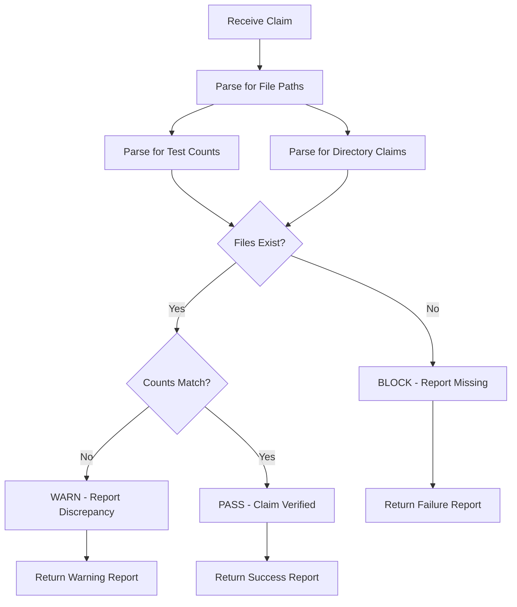

# Claim Verification Agent

> **Purpose:** Verify that all claims made in commit messages and documentation match the actual state of the codebase
> **Status:** ACTIVE
> **Created:** 2026-01-18

---

## Agent Specification

### Description

This agent ensures AI Agency Policy compliance by verifying that all file creation claims, test claims, and deliverable claims match the actual state of the codebase.

### Trigger Conditions

- Before any `report_progress` call
- Before any commit message claiming file creation
- On demand when reviewing PR claims

### Capabilities

1. **File Existence Verification**
   - Parse commit messages for file paths
   - Verify each claimed file exists
   - Report missing files

2. **Test Count Verification**
   - Parse test count claims (e.g., "150+ tests")
   - Count actual tests in claimed directories
   - Report discrepancies

3. **Directory Structure Verification**
   - Verify claimed directories exist
   - Verify directory contents match claims

### Invocation

```
@claim-verification-agent verify <commit_message_or_claim>
```

Or use the verification script:

```bash
python scripts/verify_claims.py --claim "Created tests/ml/ with 40+ tests"
```

### Verification Process



### Output Format

```json
{
  "status": "PASS|WARN|FAIL",
  "claim": "<original claim>",
  "verified": [
    {"item": "tests/ml/", "exists": true, "type": "directory"},
    {"item": "tests/ml/test_model_validation.py", "exists": true, "type": "file"}
  ],
  "missing": [
    {"item": "tests/chaos/", "type": "directory"}
  ],
  "discrepancies": [
    {"claim": "150+ tests", "actual": 42, "type": "test_count"}
  ]
}
```

### Integration Points

1. **Pre-commit Hook**: Verify claims before commit
2. **CI Workflow**: Verify claims in PR checks
3. **Agent Response**: Verify claims before responding

### Error Handling

- If claim parsing fails: Return partial verification with warning
- If filesystem access fails: Return error with details
- If count verification fails: Return warning with actual count

### AI Agency Policy Alignment

This agent directly enforces:
- "Claims must match actual deliverables"
- "Leave codebase better than found" (by preventing false claims)
- "Plan before execution" (by requiring verification)

---

## Usage Examples

### Example 1: Verify File Claims

```bash
# Claim: "Created tests/ml/test_model_validation.py"
@claim-verification-agent verify "Created tests/ml/test_model_validation.py"

# Output:
# FAIL: File 'tests/ml/test_model_validation.py' does not exist
```

### Example 2: Verify Test Count

```bash
# Claim: "Added 150+ tests to tests/agents/"
@claim-verification-agent verify "Added 150+ tests to tests/agents/"

# Output:
# PASS: Found 173 tests in tests/agents/ (claimed: 150+)
```

### Example 3: Verify Directory

```bash
# Claim: "Created tests/ml/ directory with 4 files"
@claim-verification-agent verify "Created tests/ml/ directory with 4 files"

# Output:
# FAIL: Directory 'tests/ml/' does not exist
```

---

## Maintenance

- **Owner:** @mbaetiong
- **Last Updated:** 2026-01-18
- **Review Cadence:** After each AI Agency Policy violation
