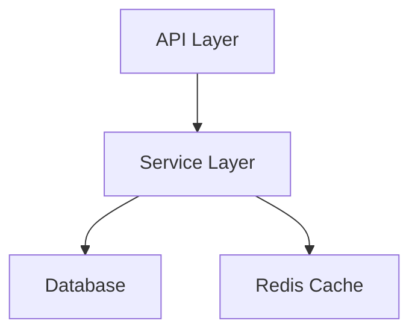

# Codebase QA Walkthrough Agent

## Overview

The **Codebase QA Walkthrough Agent** is a comprehensive quality assurance assistant that performs deep code reviews, architecture analysis, and quality checks on codebases. It provides actionable feedback, identifies issues, and ensures code meets production quality standards.

## Features

### 🔍 Comprehensive Analysis

- **Code Quality Review**: Style, organization, maintainability
- **Security Analysis**: Vulnerability detection, secret scanning, dependency checks
- **Performance Review**: Algorithmic efficiency, resource usage, optimization opportunities
- **Test Coverage**: Unit tests, integration tests, edge cases
- **Documentation**: API docs, README, inline comments, examples

### 🎯 Quality Criteria

#### Code Quality
- ✅ Proper error handling and recovery
- ✅ Type safety and null safety
- ✅ Resource management (files, connections, memory)
- ✅ Code organization and modularity
- ✅ Design patterns and best practices

#### Security
- ✅ No hardcoded secrets or credentials
- ✅ Input validation and sanitization
- ✅ SQL injection prevention
- ✅ XSS prevention
- ✅ Secure dependency versions

#### Performance
- ✅ Algorithmic efficiency (O(n) analysis)
- ✅ Memory management
- ✅ Database query optimization
- ✅ Caching strategies
- ✅ Concurrent execution patterns

#### Testing
- ✅ Unit test coverage (>80% target)
- ✅ Integration test coverage
- ✅ Edge case handling
- ✅ Error scenario testing
- ✅ Proper mock usage

#### Documentation
- ✅ Function/method docstrings
- ✅ Class documentation
- ✅ README completeness
- ✅ API documentation
- ✅ Meaningful inline comments

## Usage

### Trigger via Comment

On any Pull Request or Issue:

```
@copilot qa walkthrough
```

Additional commands:
```
@copilot qa review          # Full QA review
@copilot quality assurance  # Comprehensive check
@copilot qa check          # Quick quality check
```

### Trigger via Label

Add one of these labels to automatically trigger QA review:
- `qa-review-requested`
- `needs-qa`
- `quality-check`

### Trigger via GitHub Actions

```yaml
- name: QA Walkthrough
  uses: ./.github/agents/codebase-qa-walkthrough-agent
  with:
    review_depth: comprehensive
    fail_on_critical: true
```

## Output Format

### Executive Summary
High-level overview of code quality, critical issues, and overall assessment.

### Critical Issues (Blocking)
Issues that MUST be fixed before merging:
- Security vulnerabilities
- Data loss risks
- Breaking changes without migration
- Critical bugs

### Warnings (Should Fix)
Issues that should be addressed but aren't blocking:
- Code smells
- Performance concerns
- Missing tests
- Documentation gaps

### Recommendations (Nice to Have)
Suggestions for improvement:
- Refactoring opportunities
- Architecture improvements
- Best practice adoptions
- Optimization opportunities

### Metrics & Coverage
- Code coverage percentage
- Cyclomatic complexity
- Lines of code (LOC)
- Test count
- Documentation coverage

### Action Items
Prioritized checklist of tasks to complete.

## Examples

### Example 1: Python Module Review

**Input**: PR adding new Python module `src/codex/utils.py`

**Output**:
```markdown
## QA Walkthrough Report

### Executive Summary
✅ Code Quality: Good
⚠️  Security: Minor issues found
✅ Performance: Excellent
⚠️  Testing: Coverage below target (65%)
✅ Documentation: Complete

### Critical Issues
None found. ✅

### Warnings
1. **Security**: Potential SQL injection in `query_users()` (line 45)
   ```python
   # Current (unsafe)
   query = f"SELECT * FROM users WHERE name = '{name}'"
   
   # Recommended (safe)
   query = "SELECT * FROM users WHERE name = ?"
   cursor.execute(query, (name,))
   ```

2. **Testing**: Test coverage at 65% (target: 80%)
   - Missing tests for error scenarios
   - No tests for edge cases (empty input, large data)

### Recommendations
1. Add type hints to all public functions
2. Consider using dataclasses for data structures
3. Add logging for debugging support

### Metrics
- Lines of Code: 234
- Cyclomatic Complexity: 8 (Good)
- Test Coverage: 65%
- Documentation Coverage: 90%

### Action Items
- [ ] Fix SQL injection vulnerability (Priority: High)
- [ ] Add unit tests for error scenarios
- [ ] Add type hints to functions
- [ ] Consider adding logging
```

### Example 2: Architecture Review

**Input**: `@copilot qa walkthrough` on PR with architecture changes

**Output**:
```markdown
## Architecture QA Walkthrough

### Executive Summary
Major architectural changes detected. Overall design is solid with some concerns about scalability.

### Architecture Analysis

#### Component Diagram


#### Concerns
1. **Tight Coupling**: Service layer directly depends on specific DB implementation
2. **Scalability**: No horizontal scaling strategy for stateful services
3. **Error Propagation**: Errors not properly wrapped at layer boundaries

#### Recommendations
1. Introduce repository pattern for data access abstraction
2. Add load balancer configuration
3. Implement circuit breaker pattern for external dependencies

### Security Architecture
✅ Proper authentication layer
✅ Authorization checks at API boundary
⚠️  Missing rate limiting
⚠️  No API versioning strategy

### Performance Architecture
✅ Caching layer implemented
⚠️  No database connection pooling
⚠️  Missing query optimization

### Action Items
- [ ] Implement repository pattern
- [ ] Add rate limiting middleware
- [ ] Configure connection pooling
- [ ] Add API versioning
```

## Configuration

### Custom Quality Thresholds

Create `.qa-config.yml` in repository root:

```yaml
quality_thresholds:
  code_coverage: 80
  cyclomatic_complexity: 10
  documentation_coverage: 75
  
security:
  fail_on_vulnerabilities: true
  allowed_licenses:
    - MIT
    - Apache-2.0
    - BSD-3-Clause
  
performance:
  max_response_time_ms: 200
  max_memory_mb: 512
  
testing:
  require_unit_tests: true
  require_integration_tests: true
  require_edge_case_tests: true
```

### Language-Specific Settings

```yaml
languages:
  python:
    tools:
      - pylint
      - mypy
      - black
      - ruff
      - bandit
    min_coverage: 80
  
  rust:
    tools:
      - clippy
      - rustfmt
    min_coverage: 85
  
  javascript:
    tools:
      - eslint
      - prettier
      - jest
    min_coverage: 75
```

## Integration with CI/CD

### GitHub Actions Workflow

```yaml
name: QA Walkthrough

on:
  pull_request:
    types: [opened, synchronize]
  issue_comment:
    types: [created]

jobs:
  qa-walkthrough:
    if: contains(github.event.comment.body, '@copilot qa walkthrough') || github.event_name == 'pull_request'
    runs-on: ubuntu-latest
    
    steps:
      - uses: actions/checkout@v4
      
      - name: Run QA Walkthrough
        uses: ./.github/agents/codebase-qa-walkthrough-agent
        with:
          review_depth: comprehensive
          fail_on_critical: true
          generate_report: true
        env:
          GITHUB_TOKEN: ${{ secrets.GITHUB_TOKEN }}
      
      - name: Upload QA Report
        uses: actions/upload-artifact@v4
        with:
          name: qa-report
          path: qa-report.md
```

## Quality Gates

The agent enforces these quality gates:

### Blocking (Must Pass)
- ❌ No critical security vulnerabilities
- ❌ No syntax errors or type errors
- ❌ No failing tests
- ❌ No hardcoded secrets

### Warning (Should Pass)
- ⚠️  Code coverage >= 80%
- ⚠️  Cyclomatic complexity <= 10
- ⚠️  All public APIs documented
- ⚠️  No code smells (via linters)

### Advisory (Nice to Pass)
- 💡 Performance optimizations applied
- 💡 Best practices followed
- 💡 Architecture patterns used
- 💡 Comprehensive examples provided

## Best Practices

### 1. Run QA Early and Often
```
@copilot qa walkthrough
```
Run QA checks before requesting review to catch issues early.

### 2. Address Critical Issues First
Focus on security and correctness before style.

### 3. Use QA Reports for Learning
Review recommendations to improve coding skills.

### 4. Automate QA in CI/CD
Integrate QA checks into your pipeline.

### 5. Customize for Your Project
Adjust thresholds based on project requirements.

## Troubleshooting

### Issue: Agent Not Responding

**Solution**:
1. Check if agent is properly installed
2. Verify trigger patterns match your command
3. Ensure proper permissions in repository

### Issue: False Positives

**Solution**:
1. Review `.qa-config.yml` settings
2. Add exceptions for known false positives
3. Update tool configurations

### Issue: Performance Slow

**Solution**:
1. Reduce `review_depth` to `standard`
2. Focus on changed files only
3. Increase timeout settings

## Advanced Features

### Custom Quality Checks

Define custom checks in `.github/agents/codebase-qa-walkthrough-agent/custom_checks.py`:

```python
def check_custom_rule(file_content, file_path):
    """Custom quality check."""
    issues = []
    
    # Example: Check for TODO comments in production code
    if "TODO" in file_content and not file_path.startswith("tests/"):
        issues.append({
            "severity": "warning",
            "message": "TODO comment found in production code",
            "file": file_path,
            "suggestion": "Create an issue to track this work"
        })
    
    return issues
```

### Integration with External Tools

Connect to external quality tools:

```yaml
integrations:
  sonarqube:
    enabled: true
    url: https://sonarqube.example.com
    project_key: my-project
  
  codecov:
    enabled: true
    token: ${{ secrets.CODECOV_TOKEN }}
  
  snyk:
    enabled: true
    token: ${{ secrets.SNYK_TOKEN }}
```

## Metrics & Reporting

### Metrics Tracked
- Code coverage percentage
- Cyclomatic complexity
- Maintainability index
- Technical debt ratio
- Security vulnerability count
- Performance benchmark results

### Report Formats
- Markdown (default)
- JSON (for automation)
- HTML (for web viewing)
- PDF (for archiving)

### Trend Analysis
Track quality metrics over time:
- Coverage trends
- Complexity trends
- Issue resolution time
- Quality gate pass rate

## Support

### Documentation
- [Agent Configuration](./docs/CONFIGURATION.md)
- [Custom Checks](./docs/CUSTOM_CHECKS.md)
- [Integration Guide](./docs/INTEGRATION.md)

### Examples
- [Python Project QA](./examples/python-qa.md)
- [Rust Project QA](./examples/rust-qa.md)
- [Architecture Review](./examples/architecture-review.md)

### Resources
- [Quality Standards](./docs/QUALITY_STANDARDS.md)
- [Best Practices](./docs/BEST_PRACTICES.md)
- [Troubleshooting](./docs/TROUBLESHOOTING.md)

---

**Version**: 1.0.0  
**Last Updated**: 2026-01-14  
**Maintained By**: admin-automation-agent  
**Category**: Quality Assurance
