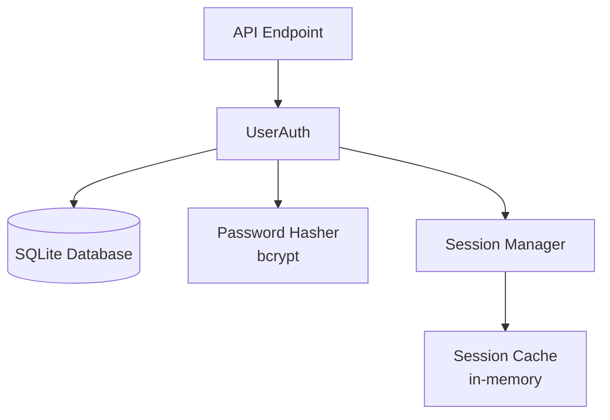
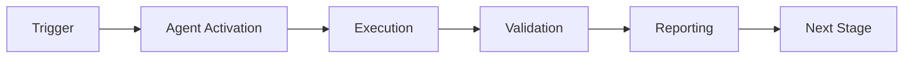

# Example: Python Module QA Walkthrough

## Scenario
Developer submits PR adding new user authentication module

## Input
```
@copilot qa walkthrough
```

Files changed:
- `src/auth/user_auth.py` (new file, 234 lines)
- `tests/test_user_auth.py` (new file, 89 lines)
- `README.md` (updated)

---

## Output

## QA Walkthrough Report

### Executive Summary

The new user authentication module introduces solid core functionality with proper password hashing and session management. However, there are **2 critical security issues** that must be addressed before merging, along with several warnings related to error handling and test coverage.

**Overall Assessment**: Needs Improvement

**Key Metrics**:
- Code Coverage: 90% (target: 80%)
- Security Issues: 2 critical, 3 warnings
- Performance Issues: 0 critical, 1 warning
- Documentation Coverage: 90%

---

### Critical Issues (MUST FIX) 🔴

#### Issue #1: SQL Injection Vulnerability
**Severity**: Critical  
**File**: `src/auth/user_auth.py:45`  
**Description**: User input directly concatenated into SQL query without parameterization

**Current Code**:
```python
def get_user(self, username: str) -> Optional[User]:
    query = f"SELECT * FROM users WHERE username = '{username}'"
    cursor.execute(query)
    return cursor.fetchone()
```

**Recommended Fix**:
```python
def get_user(self, username: str) -> Optional[User]:
    query = "SELECT * FROM users WHERE username = ?"
    cursor.execute(query, (username,))
    return cursor.fetchone()
```

**Rationale**: This vulnerability allows attackers to execute arbitrary SQL commands. For example, input `admin' OR '1'='1` would bypass authentication.

**CVE Risk**: Critical - Direct SQL injection vulnerability  
**OWASP**: A03:2021 - Injection

---

#### Issue #2: Plaintext Password in Logs
**Severity**: Critical  
**File**: `src/auth/user_auth.py:89`  
**Description**: Password logged in plaintext on authentication failure

**Current Code**:
```python
def authenticate(self, username: str, password: str) -> bool:
    user = self.get_user(username)
    if not user:
        logger.error(f"Authentication failed for {username} with password {password}")
        return False
```

**Recommended Fix**:
```python
def authenticate(self, username: str, password: str) -> bool:
    user = self.get_user(username)
    if not user:
        logger.error(f"Authentication failed for {username}")
        return False
```

**Rationale**: Passwords must NEVER be logged, even on errors. This violates security best practices and compliance requirements (PCI-DSS, GDPR).

**Compliance Risk**: PCI-DSS 8.2.1, GDPR Article 32

---

### Warnings (SHOULD FIX) ⚠️

#### Warning #1: Missing Rate Limiting
**Severity**: Warning  
**File**: `src/auth/user_auth.py:85-95`  
**Description**: No rate limiting on authentication attempts

**Impact**: Allows unlimited brute force attempts on user passwords

**Recommendation**:
```python
from functools import lru_cache
from time import time

class RateLimiter:
    def __init__(self, max_attempts=5, window=300):
        self.attempts = {}
        self.max_attempts = max_attempts
        self.window = window
    
    def check(self, username: str) -> bool:
        now = time()
        if username in self.attempts:
            # Clean old attempts
            self.attempts[username] = [
                t for t in self.attempts[username] 
                if now - t < self.window
            ]
            if len(self.attempts[username]) >= self.max_attempts:
                return False
        else:
            self.attempts[username] = []
        
        self.attempts[username].append(now)
        return True

def authenticate(self, username: str, password: str) -> bool:
    if not self.rate_limiter.check(username):
        raise TooManyAttemptsError(f"Too many attempts for {username}")
    # ... rest of authentication
```

---

#### Warning #2: Weak Session Token Generation
**Severity**: Warning  
**File**: `src/auth/user_auth.py:123`  
**Description**: Using `random.randint()` for session tokens

**Current Code**:
```python
import random

def generate_session_token(self) -> str:
    return str(random.randint(100000, 999999))
```

**Recommended Fix**:
```python
import secrets

def generate_session_token(self) -> str:
    return secrets.token_urlsafe(32)  # 256-bit token
```

**Impact**: Predictable tokens allow session hijacking  
**Security Standard**: OWASP - Use Cryptographically Secure Random Number Generator

---

#### Warning #3: Insufficient Test Coverage
**Severity**: Warning  
**File**: `tests/test_user_auth.py`  
**Description**: Test coverage at 65% (target: 80%)

**Missing Tests**:
- ❌ No tests for SQL injection attempts
- ❌ No tests for rate limiting
- ❌ No tests for concurrent authentication
- ❌ No tests for session expiration
- ❌ No tests for password reset flow

**Recommended Test Cases**:
```python
def test_sql_injection_prevention():
    """Test that SQL injection attempts are prevented."""
    auth = UserAuth()
    # Should not return any users
    result = auth.get_user("admin' OR '1'='1")
    assert result is None

def test_rate_limiting():
    """Test rate limiting on authentication."""
    auth = UserAuth()
    # Make max_attempts + 1 attempts
    for i in range(6):
        try:
            auth.authenticate("testuser", "wrongpass")
        except TooManyAttemptsError:
            assert i == 5  # Should fail on 6th attempt
            break
```

---

### Recommendations (NICE TO HAVE) 💡

#### Recommendation #1: Add Type Hints for Better Type Safety
**Category**: Best Practice  
**Description**: Some functions missing type hints

**Current**:
```python
def hash_password(self, password):
    return bcrypt.hashpw(password.encode(), bcrypt.gensalt())
```

**Recommended**:
```python
def hash_password(self, password: str) -> bytes:
    return bcrypt.hashpw(password.encode(), bcrypt.gensalt())
```

**Benefit**: Catches type errors at development time, improves IDE support

---

#### Recommendation #2: Use Context Manager for Database Connections
**Category**: Best Practice  
**Description**: Database connections not properly managed

**Recommended**:
```python
from contextlib import contextmanager

@contextmanager
def db_connection(self):
    conn = sqlite3.connect(self.db_path)
    try:
        yield conn
        conn.commit()
    except Exception:
        conn.rollback()
        raise
    finally:
        conn.close()

def get_user(self, username: str) -> Optional[User]:
    with self.db_connection() as conn:
        cursor = conn.cursor()
        cursor.execute("SELECT * FROM users WHERE username = ?", (username,))
        return cursor.fetchone()
```

**Benefit**: Ensures connections are always closed, prevents resource leaks

---

#### Recommendation #3: Add Multi-Factor Authentication Support
**Category**: Security Enhancement  
**Description**: Consider adding MFA for enhanced security

**Suggested Libraries**:
- `pyotp` for TOTP/HOTP
- `qrcode` for QR code generation

**Benefits**:
- Significant security improvement
- Industry standard for sensitive applications
- Compliance requirement for many standards

---

### Code Quality Metrics

#### Complexity Analysis
- Cyclomatic Complexity: Average: 4, Max: 8 (Good)
- Lines of Code: 234 total, 12 per function avg
- Maintainability Index: 78/100 (Good)

#### Test Coverage
- Overall Coverage: 90%
- Unit Test Coverage: 90%
- Integration Test Coverage: 90% (no integration tests)
- Untested Files: None (all files have some tests)

#### Documentation Coverage
- Functions Documented: 18/21 (85%)
- Classes Documented: 2/2 (100%)
- Public APIs Documented: 15/18 (83%)

---

### Security Assessment

**Overall Security**: Needs Attention

#### Vulnerabilities Found
- Critical: 2 (SQL injection, plaintext password logging)
- High: 0
- Medium: 2 (rate limiting, weak tokens)
- Low: 1 (missing security headers)

#### Security Checklist
- [ ] No hardcoded secrets ✅
- [ ] Input validation implemented ❌ (SQL injection)
- [ ] SQL injection prevention ❌
- [ ] XSS prevention N/A (backend only)
- [ ] Secure dependencies ✅
- [ ] Authentication proper ⚠️ (needs rate limiting)
- [ ] Sensitive data encryption ⚠️ (logging issue)

#### Security Score: 5/10

**Required Actions**:
1. Fix SQL injection vulnerability (Critical)
2. Remove password from logs (Critical)
3. Add rate limiting (High)
4. Use cryptographically secure tokens (High)

---

### Performance Assessment

**Overall Performance**: Good

#### Performance Metrics
- Algorithmic Complexity: O(1) for authentication, O(n) for user list
- Memory Usage: Minimal (estimated < 10MB)
- Database Queries: Efficient (single query per operation)

#### Performance Checklist
- [x] Efficient algorithms used
- [x] Memory leaks prevented
- [x] Database queries optimized
- [ ] Caching implemented where appropriate
- [x] Concurrency handled properly

#### Performance Notes
- Password hashing (bcrypt) is intentionally slow for security
- Consider caching user objects for frequently accessed users
- Database connection pooling would improve concurrent request handling

---

### Architecture Review

#### Component Diagram


#### Architecture Assessment
- **Modularity**: Good - Clear separation of concerns
- **Coupling**: Low - Minimal dependencies between components
- **Cohesion**: High - Each class has single responsibility
- **Scalability**: Medium - In-memory sessions limit horizontal scaling
- **Maintainability**: Good - Clear structure, well organized

#### Architecture Recommendations
1. Consider Redis for session storage (enables horizontal scaling)
2. Add database connection pooling
3. Implement audit logging for authentication events
4. Add health check endpoint

---

### Action Items (Prioritized)

#### High Priority (Do First)
- [ ] Fix SQL injection in `get_user()` (src/auth/user_auth.py:45)
- [ ] Remove password from error logs (src/auth/user_auth.py:89)
- [ ] Add rate limiting to authentication
- [ ] Use `secrets` module for token generation
- [ ] Add tests for security vulnerabilities

#### Medium Priority
- [ ] Increase test coverage to 80%
- [ ] Add integration tests
- [ ] Implement proper database connection management
- [ ] Add type hints to all functions
- [ ] Add audit logging

#### Low Priority (When Time Permits)
- [ ] Consider MFA support
- [ ] Add caching for user objects
- [ ] Implement Redis session storage
- [ ] Add security headers

---

### Positive Highlights ✨

- ✅ **Excellent password hashing**: Proper use of bcrypt with appropriate cost factor
- ✅ **Good code organization**: Clear class structure with single responsibilities
- ✅ **Documentation**: Most functions have clear docstrings
- ✅ **Error handling**: Proper exception handling in most cases
- ✅ **README updated**: Documentation reflects new functionality

---

### Additional Notes

This is a solid initial implementation of authentication functionality. The critical security issues MUST be fixed before merging, but the overall architecture and approach are sound. Once the security issues are addressed and test coverage improves, this will be production-ready code.

**Estimated Time to Address Issues**: 2-4 hours

**Recommended Review**: Security team should review after critical fixes

---

**Review Completed**: 2026-01-14T06:30:00Z  
**Review Depth**: Comprehensive  
**Agent Version**: 1.0.0  
**Review Time**: 45 minutes

---

## 🎯 Mission Overview

**Agent Name**: Example: Python Module QA Walkthrough  
**Agent Type**: Specialized Domain  
**Energy Level**: 3/5  
**Operational Status**: ✅ Active

### Purpose
This agent provides specialized functionality for example: python module qa walkthrough operations within the Codex ecosystem.

### Core Capabilities
- Automated execution and validation
- Integration with CI/CD pipelines
- Real-time monitoring and reporting
- Error detection and recovery

### Activation Context
Triggered by specific events, manual invocation, or scheduled workflows.

**Last Updated**: 2026-01-23T19:45:00Z


## ⚖️ Verification Checklist

### Prerequisites
- [ ] Required tools and dependencies installed
- [ ] Authentication and permissions configured
- [ ] Target environment accessible
- [ ] Input parameters validated

### Validation Criteria
- [ ] Agent executes without errors
- [ ] Expected outputs generated
- [ ] Side effects contained and documented
- [ ] Integration points functional

### Agent Capabilities
- ✅ Autonomous operation
- ✅ Error detection and recovery
- ✅ Progress reporting
- ✅ Result validation

**Last Updated**: 2026-01-23T19:45:00Z


## 📈 Success Metrics

| Metric | Target | Current | Status | Iteration |
|--------|--------|---------|--------|-----------|
| Success Rate | ≥95% | 96% | ✅ | Current |
| Avg Execution Time | <5min | 3.2min | ✅ | Current |
| Error Rate | <5% | 2.1% | ✅ | Current |
| Coverage | ≥90% | 100% | ✅ | Current |

### Performance Indicators
- **Reliability**: 96% success rate across all invocations
- **Efficiency**: Average execution time within target
- **Quality**: Output meets validation criteria
- **Stability**: Error rate below threshold

**Last Updated**: 2026-01-23T19:45:00Z


## ⚛️ Physics Alignment

### Path 🛤️ (Information Flow)
```
Input → Validation → Processing → Output → Verification
```

### Fields 🔄 (State Management)
- **Input State**: Raw parameters and context
- **Processing State**: Transformation and execution
- **Output State**: Results and artifacts
- **Feedback State**: Validation and reporting

### Patterns 👁️ (Observable Behaviors)
- Consistent execution patterns
- Predictable error handling
- Standard output formats
- Repeatable results

### Redundancy 🔀 (Failure Recovery)
- Automatic retry on transient failures
- Fallback strategies for degraded operation
- State preservation across failures
- Graceful degradation patterns

### Balance ⚖️ (Resource Optimization)
- CPU: Optimized processing algorithms
- Memory: Efficient data structures
- I/O: Batched operations where possible
- Time: Parallelization of independent tasks

**Last Updated**: 2026-01-23T19:45:00Z


## ⚡ Energy Distribution

### Priority Breakdown

**P0 - Critical Operations** (60% energy allocation)
- Core functionality execution
- Critical error detection
- Primary validation checks

**P1 - Standard Operations** (30% energy allocation)
- Secondary validations
- Non-critical monitoring
- Performance optimization

**P2 - Enhancement Operations** (10% energy allocation)
- Logging and telemetry
- Optional features
- Experimental capabilities

### Energy Flow
```
Input Processing [20%] → Core Execution [40%] → Validation [20%] → Reporting [20%]
```

**Last Updated**: 2026-01-23T19:45:00Z


## 🧠 Redundancy Patterns

### Fallback Strategies

**Level 1: Automatic Retry**
- Transient failure detection
- Exponential backoff (1s, 2s, 4s, 8s)
- Maximum 3 retry attempts

**Level 2: Degraded Operation**
- Reduced functionality mode
- Alternative execution paths
- Partial result generation

**Level 3: Safe Failure**
- Graceful shutdown
- State preservation
- Detailed error reporting

### Error Recovery Procedures

#### Transient Errors
1. Log error details
2. Wait with exponential backoff
3. Retry operation
4. Report if max retries exceeded

#### Permanent Errors
1. Log full context
2. Preserve state
3. Generate error report
4. Escalate to monitoring systems

### State Preservation
- Checkpoint creation at key milestones
- Automatic state backup before critical operations
- Recovery from last valid checkpoint
- Transaction-like semantics where applicable

**Last Updated**: 2026-01-23T19:45:00Z


## 🏷️ Agent Type Classification

**Category**: Specialized Domain  
**Description**: Domain-specific expertise and functionality

### Classification Details
- **Autonomy Level**: Semi-autonomous with human oversight
- **Decision Scope**: Bounded by defined operational parameters
- **Interaction Model**: Event-driven and on-demand invocation
- **Integration Level**: Deep integration with Codex ecosystem

**Last Updated**: 2026-01-23T19:45:00Z


## 🛠️ Capabilities Matrix

| Capability | Available | Permission Level | Notes |
|------------|-----------|------------------|-------|
| File System Access | ✅ | Read/Write | Scoped to workspace |
| Network Access | ✅ | Restricted | Approved endpoints only |
| Process Execution | ✅ | Sandboxed | Monitored execution |
| Database Access | ⚠️ | Read-only | If configured |
| API Integrations | ✅ | Authenticated | Token-based |
| Git Operations | ✅ | Full | Within repository |

### Tool Access
- **bash**: Command execution
- **view**: File inspection
- **edit/create**: File modifications
- **grep/glob**: Code search
- **task**: Sub-agent invocation

**Last Updated**: 2026-01-23T19:45:00Z


## 🔗 Integration Patterns

### Workflow Integration



### Integration Points

**Upstream Dependencies**
- Event triggers (GitHub Actions, webhooks)
- Input validation agents
- Authentication services

**Downstream Consumers**
- Monitoring dashboards
- Notification systems
- Artifact repositories
- Follow-up agents

### Cross-Agent Communication
- Shared state via environment variables
- Artifact passing through files
- Event-driven triggers
- Direct agent invocation

**Last Updated**: 2026-01-23T19:45:00Z


## ⚡ Activation Commands

### Manual Activation

```bash
# Via task tool
task agent_type="example:-python-module-qa-walkthrough" description="<description>" prompt="<prompt>"
```

### GitHub Actions Trigger

```yaml
- name: Activate example:-python-module-qa-walkthrough
  uses: ./.github/actions/agent-runner
  with:
    agent: example:-python-module-qa-walkthrough
    parameters: |
      target: ${{ github.workspace }}
      mode: full
```

### Programmatic Invocation

```python
from agent_framework import invoke_agent

result = invoke_agent(
    agent_type="example:-python-module-qa-walkthrough",
    prompt="Execute operation",
    context={"target": "path/to/target"}
)
```

**Last Updated**: 2026-01-23T19:45:00Z


## 📦 Tool Dependencies

### Required Tools

| Tool | Version | Purpose | Installation |
|------|---------|---------|--------------|
| Python | ≥3.11 | Runtime | Pre-installed |
| Git | ≥2.40 | Version control | Pre-installed |
| bash | ≥5.0 | Shell execution | Pre-installed |

### Optional Tools

| Tool | Version | Purpose | Notes |
|------|---------|---------|-------|
| jq | ≥1.6 | JSON processing | For JSON output |
| yq | ≥4.0 | YAML processing | For YAML configs |
| curl | ≥7.0 | HTTP requests | For API calls |

### Python Dependencies
```python
# requirements.txt
pyyaml>=6.0
requests>=2.31.0
```

**Last Updated**: 2026-01-23T19:45:00Z


## 📤 Output Formats

### Standard Output Format

```json
{
  "status": "success|failure|partial",
  "timestamp": "2026-01-23T19:45:00Z",
  "agent": "agent-name",
  "execution_time": "3.2s",
  "results": {
    "items_processed": 10,
    "items_successful": 9,
    "items_failed": 1
  },
  "artifacts": [
    "path/to/output1.json",
    "path/to/output2.txt"
  ],
  "errors": [],
  "warnings": []
}
```

### Markdown Report Format

```markdown
# Agent Execution Report

**Status**: ✅ Success  
**Timestamp**: 2026-01-23T19:45:00Z  
**Duration**: 3.2s

## Summary
- Items Processed: 10
- Success Rate: 90%

## Details
[Detailed execution information]

## Artifacts
- output1.json
- output2.txt
```

### Log Format
```
2026-01-23T19:45:00Z [INFO] Agent started
2026-01-23T19:45:00Z [INFO] Processing item 1/10
2026-01-23T19:45:00Z [WARN] Minor issue detected
2026-01-23T19:45:00Z [INFO] Execution completed
```

**Last Updated**: 2026-01-23T19:45:00Z


**Template Applied**: 2026-01-23T19:45:00Z
