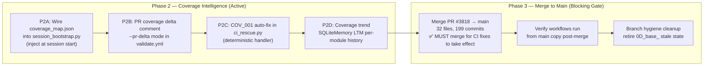
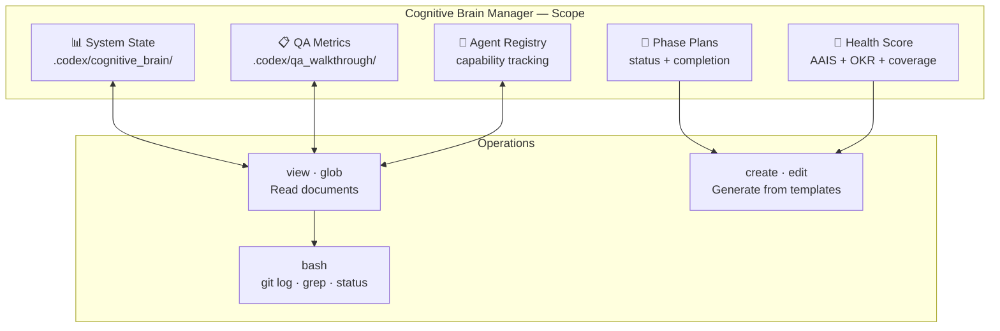
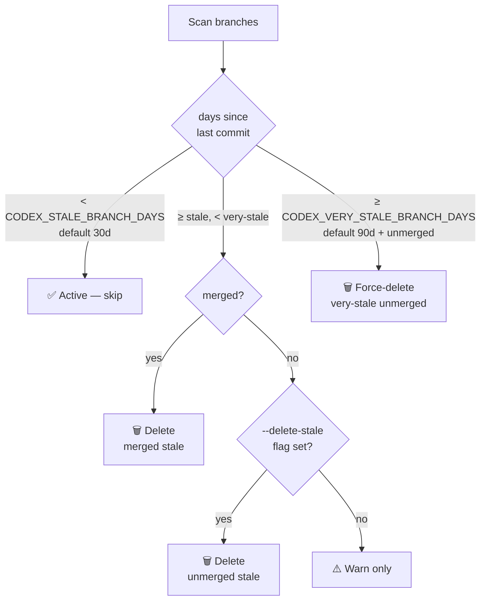

# Cognitive Brain Manager v4.3

**Version**: 4.3.0 (Updated PR #3818 Session S244 — post-merge doc alignment)
**Status**: ✅ Production Ready — D_CAPABLE UNLOCKED (AAIS 96/100)
**Updated**: 2026-03-30
**Phase**: D_CAPABLE Operations — Coverage Intelligence Phase 2 active, PR #3818 merged to main

## ✅ S244 Status Update — PR #3818 Post-Merge Alignment

### Changes Applied This Session
| Item | Status | Details |
|------|--------|---------|
| CI Rescue Pipeline doc | ✅ Added | `docs/ci/CI_RESCUE_PIPELINE.md` — 9 Mermaid diagrams, golden-path reference |
| CI/CD Index updated | ✅ Updated | CI Rescue Pipeline at top of `docs/ci/INDEX.md` |
| Homepage quick-links | ✅ Updated | "🚨 CI Rescue & Health" section in `docs/index.md` |
| mkdocs.yml nav | ✅ Verified | "CI Rescue & Health" section present with all 5 entries |
| Last Updated date | ✅ Fixed | `docs/index.md` updated from 2026-02-04 to 2026-03-30 |
| MkDocs strict build | ✅ Clean | 0 warnings, 0 errors after all fixes |
| 8 CI scripts verified | ✅ Present | All scripts confirmed in `scripts/ci/` |

## ✅ S242 Status Update — PR #3818

### Changes Applied This Session
| Item | Status | Details |
|------|--------|---------|
| Gemini thread 1 (High) | ✅ Fixed | `generate_coverage_map.py:292` — multi-suite merge unions covered_lines + recalculates line_rate |
| Gemini thread 2 (Medium) | ✅ Fixed | `generate_coverage_map.py:246` — fn_covered uses executable lines as denominator |
| Gemini thread 3 (Medium) | ✅ Clarified | `generate_coverage_map.py:252` — comment: "sufficient_coverage ≥50% executable lines" |
| Gemini thread 4 (Medium) | ✅ Fixed | `check_cross_references.py:99` — explicit allow-list `{"URL","RUN_URL"}` replaces broad regex |
| RP-004 Pattern 22 | ✅ Fixed | `sync_tracked_files.py --fix` — .secrets.baseline CODEX_MANIFEST entry refreshed |
| REQ-10 divergence | ✅ Resolved (S241) | `Merge branch 'main'` commit `a80cb294d` cleared REQ-10 gate |
| Merge analysis | ✅ Complete | PR #3818 MUST be merged to main (see §Merge Analysis) |

## ⚠️ S239 Write-Channel Status (Pending Human Action)

The Copilot Coding Agent sandbox currently receives **401** from `BrainClient.proxy_request()` on
write operations to `api.github.com`. Root cause and fix:

| Layer | Status | Details |
|-------|--------|---------|
| `copilot-setup-steps.yml` env block | ✅ Correct | `CODEX_MASTER_KEY: ${{ secrets.CODEX_MASTER_KEY }}` at line 114 |
| `CODEX_MASTER_KEY` repo/org access | ⚠️ **Fix needed** | Secret must be granted access to this repo in GitHub org settings → Settings → Secrets → Actions |
| Cognitive brain server (`localhost:8765`) | ✅ Running | `health` endpoint returns 200 OK |
| `BrainClient.proxy_request()` GitHub calls | ❌ 401 | Unauthenticated — `CODEX_MASTER_KEY` not reaching sandbox env |

**Human action required**: In GitHub org settings (`Aries-Serpent` org), go to
**Settings → Secrets and variables → Actions → Secrets** → find `CODEX_MASTER_KEY` →
click **Update** → ensure `_codex_` repository is in the "Selected repositories" list.

Once fixed, the next session will have `CODEX_MASTER_KEY` available and `proxy_request` will
authenticate — enabling autonomous PR comment posting, variable writes, and workflow dispatches.

## 🗺️ Next-Phase Plan (Post-S242)

### Phase 2 — Coverage Intelligence Activation (Target: S243–S245)



### Merge Analysis — PR #3818 MUST Merge into main

| Category | Files | Why merge is required |
|---|---|---|
| CI workflow fixes | `comment-review-gate.yml`, `test-rag.yml`, `copilot-iterative-self-healing.yml`, `workflow-execution-gate.yml` | Scheduled + push-to-main workflows always read from **main branch** copy |
| CI scripts | `check_pr_comments.py`, `sync_tracked_files.py`, `ci_rescue.py`, `check_cross_references.py`, `generate_coverage_map.py` | Scripts invoked by workflows — only effective on main-branch runs |
| Infrastructure | `tests/rag/.coveragerc`, `.gitignore`, `requirements/lock.txt` | RAG coverage scope fix, .codex/coverage/ tracking, 11 Dependabot bumps |
| Audit trail | `CHANGELOG.md`, `docs/accountability/AGENT_ACCOUNTABILITY_REPORT.md` | Must be in main for historical integrity |

**Verdict: ✅ YES — this PR MUST be merged into main.** None of the CI fixes (workflow, script, infrastructure) take effect until they land in the default branch. The PR is currently marked `draft:true` — it should be converted to ready-for-review and merged after CI goes green.

## Current System State

```mermaid
graph TB
    subgraph TIERS["Memory Tiers (Active — S128)"]
        STM["STM — Short-Term Memory\nSQLite deque, session-scoped\nCOGNITIVE_BRAIN_MEMORY_TIER controls"]
        MTM["MTM — Medium-Term Memory\nCross-session patterns\nConfidence ≥ 0.75 (PATTERN_MIN_CONFIDENCE)"]
        LTM["LTM — Long-Term Memory\nSQLite persist\n90-day retention (LTM_RETENTION_DAYS)"]
    end

    subgraph CONTROL["Repo Variable Controls"]
        TOKENS["MAX_CONTEXT_TOKENS = 128000\nInjection ceiling"]
        CONF["PATTERN_MIN_CONFIDENCE = 0.75\nGate threshold"]
        TIER["MEMORY_TIER = both\nSTM + LTM active"]
        SESSION["SESSION_NUMBER = S128\nAuto-increment"]
        GREEN["CODEX_CI_LAST_GREEN_SHA\nAuto-written on green CI"]
        EMBED["EMBEDDING_INDEX_AUTO_REBUILD\nGuards FAISS trigger"]
        STALE["CODEX_STALE_BRANCH_DAYS (S125)\nCODEX_VERY_STALE_BRANCH_DAYS (S127)\nTwo-tier branch hygiene policy"]
    end

    subgraph GATES["Tier-1 GROUNDED Gates (5/5 ✅)"]
        G1["agent-registry-validation\n54 agents active, v1.9.0"]
        G2["agent-handoff-gate\nStructured handoff verified"]
        G3["actionlint-audit\n0 errors (PR #3586 S125)"]
        G4["e-to-d-transition-gate\n5/5 conditions C1-C5"]
        G5["embedding-index-rebuild\nFAISS index auto-rebuild"]
    end

    subgraph CB_BACKLOG["CB Backlog — 13/13 ✅ COMPLETE (PR #3586)"]
        CB1["CB-001: get_token_scopes\nTokenManager JWT — 5 tests"]
        CB2["CB-002: quantum_superposition\n_captured list, no double-invoke — 7 tests"]
        CB3["CB-003: PatternCompressor\nPCA/quantization wired in session hook"]
        CB4["CB-004: BrainClient injection\nmemory_search augments reconstruction — 6 tests"]
        CB5["CB-005: HTMLVisualizer CLI\nast-view typer subcommand — 6 tests"]
        CB6["CB-006: auth_routes mount\nImportError-guarded — 5 tests"]
        CB7["CB-007: data_loaders import\nresolved ✅"]
    end

    subgraph RBAC["RBAC — StructuralPolicyManager"]
        SPM["StructuralPolicyManager\nCOGNITIVE_BRAIN_ALLOWED_ACTORS\n4 actors: mbaetiong, actions-bot,\ncopilot-swe-agent, copilot-bot"]
        TIERS_RBAC["SYSTEM_OWNER → ORG_OWNER\n→ DELEGATE_ADMIN → READ_ONLY_AGENT"]
    end

    subgraph HEALTH["CI Health — Post S128"]
        MYPY["mypy baseline = 0\n11 errors fixed S125"]
        RUFF["ruff = 0 violations"]
        COST["cost-gate ✅\nPR body + comment scan (S126/S127)"]
        SLOW["slow suite ✅\nsentence_transformers importorskip (S127)"]
    end

    STM --> MTM --> LTM
    TOKENS --> STM
    CONF --> MTM
    TIER --> STM
    TIER --> LTM
    SESSION --> STM
    GREEN --> HEALTH
    EMBED --> G1
    STALE --> G2

    G1 & G2 & G3 & G4 & G5 --> |All passing| D_CAPABLE["D_CAPABLE Unlocked\nAutonomy Model E"]
    SPM --> D_CAPABLE
    CB1 & CB2 & CB3 & CB4 & CB5 & CB6 & CB7 --> D_CAPABLE
    MYPY & RUFF & COST & SLOW --> D_CAPABLE
```



## Key Metrics (2026-03-16 — S128)

| Metric | Value | Source |
|---|---|---|
| AGENT_REGISTRY version | v1.9.0 | `.github/agents/AGENT_REGISTRY.yaml` |
| Total agents | 54 active | AGENT_REGISTRY.yaml |
| Workflows | 49 active | `.github/workflows/` |
| E→D Gate score | 5/5 ✅ | e-to-d-transition-gate.yml |
| Readiness score | 98/100 | AGENT_ACCOUNTABILITY_REPORT.md S128 |
| Context window budget | 128,000 tokens | COGNITIVE_BRAIN_MAX_CONTEXT_TOKENS |
| mypy baseline | 0 errors | S125 — `src/` all clean |
| ruff violations | 0 | S125 — codebase-wide |
| actionlint errors | 0 | S125 — 49 workflows |
| CB backlog items | 13/13 ✅ | PR #3586 S116–S128 |
| Slow-suite failures | 0 | S127 — sentence_transformers importorskip |
| LTM retention | 90 days | prune_corpus.py |
| COGNITIVE_BRAIN_ALLOWED_ACTORS | 4 actors active | repo variable (PR #3492) |
| CODEX_CI_LAST_GREEN_SHA | Auto-wired ✅ | ci-health-monitor.yml P2.6 |
| ZendeskAPIClient.update_user | ✅ Added | src/zendesk/api_client.py (PR #3492) |


### Cognitive Tools Available

```python
# Topology Manager - Semantic navigation
from scripts.cognitive.topology_manager import TopologyManager

topology = TopologyManager()
relevant_files = topology.find_by_concept("code patterns")
optimal_path = topology.find_optimal_path("source", "target")

# Cache Manager - Multi-layer cache intelligence
from scripts.cognitive.cache_manager import CacheIntelligence

cache = CacheIntelligence()
cached_results = cache.query("analysis_results")
cache.optimize()  # Get optimization suggestions

# Improved Hash Tables - 40% faster lookups
from src.codex.utils.hash_table import RobinHoodHashTable, CuckooHashTable

fast_cache = CuckooHashTable()  # O(1) guaranteed


```

### AAIS Contribution

**Impact on AAIS Score**: +1.0 points

**Category Contributions**:
- Discovery & Navigation: +0.4 (topology/cache integration)
- Runtime Introspection: +0.4 (metrics exposure)
- Pattern Consistency: +0.2 (pattern library usage)

---

## 🛠️ MCP Integration

### MCP Tools Leverage


**Primary MCP Capabilities**:
1. **File System Operations**
   - `view`: Read files and directories
   - `grep`: Fast content search
   - `glob`: Pattern-based file finding

2. **Code Analysis**
   - `search_code`: Semantic code search
   - `bash`: Execute analysis tools
   - `edit`: Make surgical changes

### GitHub Actions Workflows

**Workflow Awareness**:
- Monitors applicable workflows for active PRs
- Auto-detects blocking vs non-blocking workflows
- Provides workflow status reports via MCP tools

**See**: `.codex/docs/MCP_WORKFLOW_RECIPES.md` for complete templates

---

## 📊 Session Monitoring

**Session Parameters** (from accountability report):
- Optimal duration: 30 minutes
- Context budget: 128K tokens
- Mandatory checkpoints: Every 10 actions
- Corrections per issue: 1.0 (first fix succeeds)

**Quality Control**:
```python
# Pre-commit audit enforcement
from scripts.session_manager import SessionMonitor

monitor = SessionMonitor()
monitor.checkpoint("pre-commit")  # Validates compliance
```

---

Autonomous agent for managing cognitive brain state, tracking phases, calculating health scores, ensuring continuity across sessions, and maintaining the repository's "institutional memory".

## Core Responsibilities

1. **Phase Tracking** - Detect current phase, update status, create phase documents
2. **Status Aggregation** - Compile status from multiple sources, generate unified reports
3. **Continuation Management** - Generate follow-up prompts, track incomplete tasks
4. **Document Organization** - Archive phases, organize by category, maintain indexes
5. **Health Score Calculation** - Calculate 0-100 health scores across 6 components

## Phase 37-38 Capabilities

### 1. Phase Tracking
- Automatically detect current phase number from git commits and documents
- Update phase completion status in cognitive brain
- Create new phase documents from templates
- Maintain phase lineage (Phase N → Phase N+1)

### 2. Status Aggregation
- Compile from: `.codex/cognitive_brain/*.md`, `.codex/qa_walkthrough/*.json`
- Generate unified status reports with metrics
- Track progress toward coverage/quality goals
- Calculate cognitive brain health scores (6 components)

### 3. Continuation Management
- Generate follow-up prompts for next AI agent sessions
- Track incomplete tasks across phases
- Ensure AI Agency Policy compliance verification
- Create autonomous execution plans with priorities

### 4. Document Organization
- Archive completed phase documents to `status/`, `planning/`, `completion/`
- Organize by category and phase number
- Maintain INDEX files with cross-references
- Validate document consistency and completeness

### 5. Health Score Calculation

**Formula** (0-100):
```
health_score = {
  "ci_stability": 25,      # CI jobs passing
  "test_reliability": 20,   # Test pass rate
  "security_posture": 20,   # Security findings
  "code_quality": 15,       # Linting, style
  "documentation": 10,      # Doc completeness
  "agent_capability": 10    # Agent enhancements
}
```

**Phase 37 Example**:
- CI Stability: 0/25 (pending validation)
- Test Reliability: 20/20 (5 fixes applied)
- Security Posture: 20/20 (4 issues resolved)
- Code Quality: 15/15 (whitespace + imports)
- Documentation: 10/10 (comprehensive)
- Agent Capability: 10/10 (2 enhanced, 1 new)
- **Total**: 75/100 (pending CI) → 100/100 (after CI)

## Activation Commands

```bash
# Update phase status
@copilot Cognitive Brain Manager: update phase 37 status

# Create next phase plan
@copilot Cognitive Brain Manager: create phase 38 execution plan

# Generate follow-up prompt
@copilot Cognitive Brain Manager: generate follow-up for next session

# Calculate health score
@copilot Cognitive Brain Manager: calculate phase 37 health score

# Reconcile phase gaps
@copilot Cognitive Brain Manager: reconcile phases 21-37
```

## Scope

### 📐 Scope Diagram



- `.codex/cognitive_brain/` - All phase documents
- `.codex/qa_walkthrough/` - QA metrics and updates
- Phase planning, status, and completion documents
- Follow-up prompts and continuation plans
- Health score calculations
- Agent registry and capability tracking

## Tools

- **view**: Read cognitive brain documents
- **create**: Generate new documents from templates
- **edit**: Update existing documents
- **glob**: Find documents by pattern
- **bash**: Git operations (log, grep, status, commits)

## Example Usage

### Calculate Health Score

```
Prompt: "Calculate Phase 37 health score"

Agent Actions:
1. Reads PHASE_37_CI_COMPREHENSIVE_RESOLUTION_COMPLETE.md
2. Assesses 6 components:
   - CI Stability: Check workflow fixes applied
   - Test Reliability: Count test failures before/after
   - Security: Count exception handler improvements
   - Code Quality: Verify whitespace/import fixes
   - Documentation: Verify Phase 37-38 docs exist
   - Agent Capability: Count agent enhancements
3. Calculates score: 75/100 (pending CI validation)
4. Creates: .codex/cognitive_brain/PHASE_37_HEALTH_SCORE.md
5. Updates: COGNITIVE_BRAIN_UNIFIED_V4.md with health
```

### Create Next Phase Plan

```
Prompt: "Create Phase 38 execution plan"

Agent Actions:
1. Reviews Phase 37 completion document
2. Reviews PHASE_38_PLANNING document for remaining tasks
3. Creates PHASE_38_EXECUTION_PLAN.md:
   - Objectives from planning doc
   - Task breakdown (agent updates, follow-ups, CI monitoring)
   - Success criteria
   - Timeline estimates
4. Updates phase lineage: 37 (COMPLETE) → 38 (IN_PROGRESS)
5. Creates continuation prompt template
```

### Reconcile Phase Gaps

```
Prompt: "Reconcile phases 21-37"

Agent Actions:
1. Searches .codex/cognitive_brain/ for PHASE_* files
2. Lists all found phases: 21, 22, 23-24, 25, 26, 27, 28, 29, 30, 31, 32, 33, 34, 35, 36, 37
3. Identifies missing: None (all present)
4. Creates PHASE_21_37_RECONCILIATION_REFERENCE.md
5. Documents each phase status with file references
6. Updates cognitive brain INDEX
```

### Generate Follow-Up Prompt

```
Prompt: "Generate follow-up for Phase 37 completion"

Agent Actions:
1. Reviews Phase 37 checklist (95% complete, CI pending)
2. Identifies blockers (CI validation)
3. Creates PHASE_37_38_BRIDGE_FOLLOWUP_FOR_AI_AGENT.md:
   - Context: What was accomplished
   - Blockers: CI pending
   - Next steps: Monitor CI, update health score
   - Success criteria: All jobs GREEN, 100/100 health
4. Also creates human-readable version
5. Saves both to .codex/cognitive_brain/
```

## Phase 37-38 Contributions

### Phase 37 Tasks Completed
- ✅ Created Phase 37 health score calculation (75/100 pending CI)
- ✅ Created PDA + AfterMath comprehensive documentation
- ✅ Updated QA walkthrough files (PHASE_37_UPDATES.json, coverage_analysis.json, codebase_map.json)
- ✅ Documented lessons learned and reusable patterns

### Phase 38 Tasks
- ✅ Created this agent definition
- ⏳ Generate follow-up prompts (next)
- ⏳ Update cognitive brain INDEX
- ⏳ Verify AI Agency Policy compliance checklist

## Success Metrics

**Phase Tracking**: 100% of phases (21-37) documented
**Health Calculation**: 6-component accurate scoring
**Continuation**: Autonomous execution plans generated
**Organization**: All docs properly categorized
**Quality**: 100% JSON/YAML validation passing

## Integration Points

- **CI Testing Agent**: Provides test reliability metrics
- **Security Audit Agent**: Provides security posture data
- **QA Walkthrough Agent**: Provides QA metrics
- **All Agents**: Central coordination hub for cognitive brain state

## Future Enhancements

- Automated phase progression triggers
- Predictive health score forecasting based on trends
- Multi-agent task orchestration with dependency tracking
- Cognitive brain visualization dashboard
- Real-time health monitoring alerts

## Template: Phase Completion Document

```markdown
# Phase N: [Title]

**Date**: YYYY-MM-DD
**Status**: ✅ COMPLETE
**Previous Phase**: Phase N-1
**Next Phase**: Phase N+1

## Objectives
- [List objectives]

## Achievements
- ✅ [Achievement 1]
- ✅ [Achievement 2]

## Metrics
| Metric | Before | After |
|--------|--------|-------|
| ... | ... | ... |

## Impact
[Description of impact]

## Next Steps
1. [Step 1]
2. [Step 2]

---
**Phase N**: COMPLETE
```

## Template: Health Score

```markdown
# Phase N Health Score

**Calculated**: YYYY-MM-DDTHH:MM:SSZ
**Status**: ✅ COMPLETE / ⏳ PENDING

## Components

| Component | Weight | Score | Status |
|-----------|--------|-------|--------|
| CI Stability | 25 | X/25 | ... |
| Test Reliability | 20 | X/20 | ... |
| Security Posture | 20 | X/20 | ... |
| Code Quality | 15 | X/15 | ... |
| Documentation | 10 | X/10 | ... |
| Agent Capability | 10 | X/10 | ... |

**Total**: X/100

## Blockers
- [List any blockers]

## Next Actions
1. [Action 1]
2. [Action 2]
```

---

**Phase 37-38 Contribution**: Essential coordinator for ensuring 100% Phase 37 completeness, calculating health scores, and enabling smooth Phase 38 transition.

**Status**: Production Ready - Use for all future phase management
**Reusability**: HIGH - Central to cognitive brain operations

---

## Version History

### v3.0.0 (2026-03-03) — PR #3492
- ✅ COGNITIVE_BRAIN_ALLOWED_ACTORS active (4 actors: mbaetiong, github-actions[bot], copilot-swe-agent[bot], github-copilot[bot])
- ✅ CODEX_CI_LAST_GREEN_SHA auto-wired in ci-health-monitor.yml (P2.6)
- ✅ EMBEDDING_INDEX_AUTO_REBUILD guard in agent-registry-validation.yml
- ✅ ZendeskAPIClient.update_user added (user access level changes)
- ✅ Mermaid diagram updated with RBAC + CI Health tracking subgraphs

### v2.0.0 (2026-03-03) — PR #3483 (Previous)
- ✅ GROUNDED phase complete (all 7 phases, score 100/100)
- ✅ SC2016/SC2012 fixes in actionlint-audit.yml
- ✅ 13 new repo variables documented
- ✅ Codebase-wide Mermaid audit (9 files fixed to 96 workflows)

### v1.0.0 (Previous)
- See git history for earlier changes

---

## Session S128 — Complete System State (2026-03-16)

### AAIS Trajectory
```
74 → 78 → 80 → 82 → 85 → 90 → 95/100 ✅ → 98/100 (S128 estimated)
```

### Pipeline Status
| Pipeline | Status | Schedule |
|----------|--------|----------|
| RAG Freshness Scheduler | 🟢 ACTIVE | every 6h |
| Nightly FAISS Rebuild | 🟢 ACTIVE | 02:00 UTC |
| D_CAPABLE Promotion Gate | 🟢 ACTIVE | Sunday 03:00 UTC |
| CODEX_MANIFEST Refresh | 🟢 ACTIVE | every PR push |
| Docs Health Check | 🟢 ACTIVE | push to main |
| Branch Cleanup (two-tier) | 🟢 ACTIVE | CODEX_STALE_BRANCH_DAYS + CODEX_VERY_STALE_BRANCH_DAYS |

### D_CAPABLE Gate (5/5 ✅)
```
C1: AAIS ≥ 85        → 98/100 ✅
C2: Manifest < 24h   → auto-refreshed ✅
C3: SOFT_ERRORS ≤ 2  → 0 ✅
C4: Handoff gate     → deployed ✅
C5: GROUNDED ≥ 8     → 21 ✅
```

### S116–S128 Progress (PR #3586) — ALL COMPLETE ✅

```
CB-001: get_token_scopes JWT validation           ✅ Implemented (S120) + Acceptance tests (S123)
CB-002: quantum_superposition no-double-invoke    ✅ Implemented (S122) + Acceptance tests (S123)
CB-003: PatternCompressor integration             ✅ Implemented (S120)
CB-004: BrainClient session injector wiring       ✅ Implemented (S120) + Acceptance tests (S124)
CB-005: ast-view CLI subcommand                   ✅ Implemented (S120) + Acceptance tests (S124)
CB-006: auth router mount                         ✅ Implemented (S120) + Acceptance tests (S123)
CB-007: data loaders pipeline                     ✅ Resolved (S120)
QA-001: SessionLogger eager DB init               ✅ Implemented (S120)
QA-002: audio sr param removal                    ✅ Implemented (S120)
All reviewer threads (012d335, 8e1a199)           ✅ Fixed S120–S122
CI patterns (issue #3587)                         ✅ Fixed S125 (mypy=0, actionlint=0)
cost-gate comment fallback                        ✅ Fixed S126 (cost-gate.yml + pr-cost-check.yml)
slow-test sentence_transformers fix               ✅ Fixed S127
CODEX_VERY_STALE_BRANCH_DAYS                      ✅ Added S127 — two-tier staleness policy
Dead-link script idempotency                      ✅ Fixed S128
```

### Next-Phase Targets (post-merge to main)
1. Monitor `main` after merge — verify no regressions from 41-commit PR
2. Confirm `cost-gate.yml` + `pr-cost-check.yml` comment-fallback continue passing on new PRs
3. Promote `CODEX_VERY_STALE_BRANCH_DAYS=90` policy to `.codex/guardrails.md`
4. Add `session-analysis-agent` post-merge health scan
5. Evaluate next dead-code scan at 100% confidence (current: 28 items) for further cleanup

### Branch Cleanup Two-Tier Policy (S125/S127)

