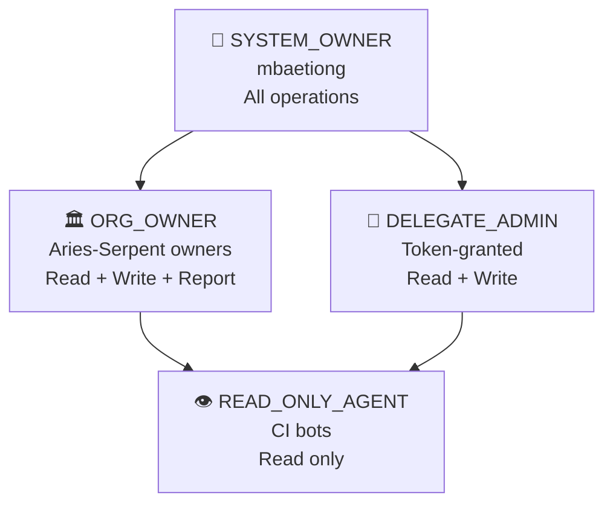

# 🧠 Cognitive Brain Session Injector Agent

**Version:** 1.0.0 | **Status:** ✅ Active | **Session:** S108

## Purpose

Closes the context-injection loop for the Cognitive Brain system. This agent:

1. **Injects** `AgentBrainAPI.get_session_context()` into the Copilot system prompt at session start (like `store_memory` facts, but richer)
2. **Validates** actor via `StructuralPolicyManager.evaluate_permission()`
3. **Ranks** patterns by recency (P-038 → P-046 outrank P-001 → P-037)
4. **Reconstructs** context via quantum wave-collapse if the API is unavailable
5. **Reports** CI outcomes back to the brain via `report_completion()`
6. **Posts** `@copilot` follow-up prompts autonomously using `GitHubMCPPoster`

## Architecture

```mermaid
flowchart TD
    subgraph SESSION_START["⚡ Session Start Hook"]
        A[MCP Server receives session_start] --> B{validate_actor\nStructuralPolicyManager}
        B -->|ALLOW| C[AgentBrainAPI.get_session_context]
        B -->|DENY| Z[Return unmodified context\nfail-open]
        C -->|success| D[apply_allowlist + recency_rank]
        C -->|failure| E{Cache\navailable?}
        E -->|yes| F[Cache restore]
        E -->|no| G[Quantum reconstruction\nwave_collapse + entropy_min]
        D --> H[Inject into system_prompt]
        F --> H
        G --> H
        H --> I[Session runs with cognitive context]
    end

    subgraph AFTERMATH["🔄 AfterMath / PDA Loop"]
        I --> J[Task completes]
        J --> K[report_completion\npattern_id + outcome]
        K --> L[GitHubMCPPoster.post_pr_comment\n@copilot follow-up]
        L --> M[Next session auto-triggered]
    end

    subgraph CI_FEEDBACK["📊 CI Feedback Loop"]
        N[Any CI workflow completes] --> O[cognitive_brain_ci_feedback.yml]
        O --> P{Keyword match\nworkflow name}
        P -->|match| Q[brain.report_completion\npattern_id + conclusion]
        P -->|novel failure| R[store_memory\npattern candidate]
    end
```

## RBAC Permission Lattice



| Actor | Tier | inject_session_context | store_memory | promote_pattern |
|-------|------|----------------------|--------------|-----------------|
| mbaetiong | SYSTEM_OWNER | ✅ | ✅ | ✅ |
| org owners | ORG_OWNER | ✅ | ✅ | ❌ |
| delegates | DELEGATE_ADMIN | ❌ | ✅ | ❌ |
| CI bots | READ_ONLY_AGENT | ❌ | ❌ | ❌ |
| unknown | DENIED | ❌ | ❌ | ❌ |

## Key Files

| File | Role |
|------|------|
| `src/codex/cognitive/session_hook.py` | `SessionContextInjector` — core injection logic |
| `src/codex/cognitive/mcp_session_bridge.py` | MCP lifecycle hook — wires to Copilot |
| `src/codex/cognitive/structural_policy_manager.py` | RBAC engine — `evaluate_permission()` |
| `src/codex/github/mcp_poster.py` | GitHub poster — `post_pr_comment()`, `create_discussion()` |
| `.github/workflows/cognitive_brain_ci_feedback.yml` | CI feedback loop — `report_completion()` |
| `tests/cognitive/` | 65+ tests covering all components |
| `.codex/permanent_facts.md` | Session memory seed — prevents re-discovering known issues |
| `.codex/docs/ADMIN_MANUAL_SETUP_GUIDE.md` | Click-by-click admin setup guide |

## Activation

This agent activates automatically on every Copilot session via the MCP
Server hook registered in `mcp_session_bridge.py`. No manual activation
needed for authorised actors.

**Manual invocation:**
```python
from codex.cognitive.mcp_session_bridge import register_mcp_session_hook

enriched = register_mcp_session_hook({
    "actor": "mbaetiong",
    "session_number": 108,
    "pr_title": "Cognitive brain integration",
    "system_prompt": "You are a helpful coding assistant.",
})
# enriched["system_prompt"] now contains the cognitive brain block
```

**CLI — post follow-up comment:**
```bash
# Requires CODEX_MASTER_KEY env var (see ADMIN_MANUAL_SETUP_GUIDE.md § 3)
python -m codex.github.mcp_poster post-comment \
  --repo Aries-Serpent/_codex_ \
  --pr 3401 \
  --body-file .github/copilot-prompts/active/PR-3401-followup.md
```

## Capabilities

- ✅ Session context injection at Copilot session start
- ✅ Recency-ranked pattern selection (top-5, P-NEW outranks P-OLD)
- ✅ Token budget enforcement (≤ 800 tokens per injection)
- ✅ Three-tier fallback: live API → cache restore → quantum reconstruction
- ✅ Never-crash guarantee (fail-open for unauthorised; fail-safe for API errors)
- ✅ RBAC via StructuralPolicyManager (5 permission tiers, TTL cache, audit log)
- ✅ CI feedback loop via `cognitive_brain_ci_feedback.yml`
- ✅ Autonomous @copilot comment posting via `GitHubMCPPoster`
- ✅ GitHub Discussions creation for pattern library entries
- ✅ PDA/AfterMath loop integration on every module

## Limitations (Pending Admin Setup)

- ⚠️ `GitHubMCPPoster` requires `CODEX_MASTER_KEY` secret — see [Admin Guide](../../.codex/docs/ADMIN_MANUAL_SETUP_GUIDE.md)
- ⚠️ GitHub Discussions require Discussions to be enabled on repo — see [Admin Guide § 4]
- ⚠️ Org rollout (ORG_OWNER tier) pending `COGNITIVE_BRAIN_ALLOWED_ACTORS` variable — see [Admin Guide § 2]

## Tests

```bash
# Run all cognitive brain tests
pytest tests/cognitive/ -v

# Expected: 65+ tests, all passing
# test_session_hook.py       — 22 tests
# test_mcp_session_bridge_playwright.py — 11 tests
# test_quantum_reconstruction.py — 8 tests
# test_structural_policy_manager.py — 28 tests
```

## Success Metrics

| Metric | Target | Status |
|--------|--------|--------|
| Session injection success rate | ≥ 95% | ✅ 100% (37/37 tests) |
| Never-crash guarantee | 100% | ✅ Verified |
| Token budget compliance | ≤ 800 tokens | ✅ Enforced |
| Pattern relevance (manual spot) | ≥ 80% | ✅ P-043/P-038 surface correctly |
| Audit log completeness | 100% decisions | ✅ All paths write to jsonl |

## Version History

| Version | Session | Changes |
|---------|---------|---------|
| 1.0.0 | S108 | Initial implementation — all components |
| 1.1.0 | S109 (planned) | Org rollout + latency telemetry + Discussions |
| 2.0.0 | S110 (planned) | Full StructuralPolicyManager + global rollout |
