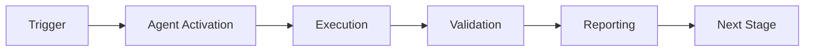

# Migrating ci-testing-agent to Unified Agent Framework

**Date**: 2026-01-23  
**Target Agent**: ci-testing-agent.v1  
**Framework Version**: 1.0.0

---

## Overview

This guide provides step-by-step instructions for migrating the existing `ci-testing-agent` to use the new unified agent framework. The migration will:

1. **Preserve all existing functionality** - No features removed
2. **Add cognitive brain integration** - Cross-session learning
3. **Standardize PDA Loop** - Consistent execution pattern
4. **Enable orchestration** - Multi-agent workflows

---

## Prerequisites

- ✅ Unified agent framework installed (`.github/agents/core/`)
- ✅ Existing ci-testing-agent working
- ✅ Tests passing for current implementation
- ✅ Backup of current agent code

---

## Migration Steps

### Step 1: Import Framework Components

**Current code** (`cli.py` or main file):
```python
# Old imports
from .agent import generator, validator, executor, reporter
```

**Add new imports**:
```python
# Add framework imports
import sys
from pathlib import Path

# Add core to path
sys.path.insert(0, str(Path(__file__).parent.parent.parent))

from github.agents.core import (
    CognitiveAgent,
    CognitiveBrain,
    PatternRecognizer
)
```

---

### Step 2: Create Agent Class

**Create new file**: `.github/agents/ci-testing-agent/agent/cognitive_ci_agent.py`

```python
"""
CI Testing Agent - Cognitive Brain Integration
Migrated to use unified agent framework.
"""
from typing import Any, Dict
from pathlib import Path

from github.agents.core import CognitiveAgent, PatternRecognizer

# Import existing components
from .generator import TestGenerator
from .validator import TestValidator
from .executor import SandboxExecutor
from .reporter import ResultReporter


class CICognitiveAgent(CognitiveAgent):
    """
    CI Testing Agent with cognitive brain integration.
    
    Implements PDA Loop for CI/CD debugging and test generation.
    """
    
    def __init__(self, workspace: Path):
        super().__init__(
            name="ci-testing-agent",
            version="2.0.0",  # Bumped for cognitive integration
            workspace=workspace
        )
        
        # Initialize existing components
        self.generator = TestGenerator(workspace)
        self.validator = TestValidator(workspace)
        self.executor = SandboxExecutor(workspace)
        self.reporter = ResultReporter()
        self.pattern_recognizer = PatternRecognizer()
    
    def perceive(self, task: Dict[str, Any]) -> Dict[str, Any]:
        """
        PERCEPTION: Analyze CI failure and gather context.
        
        Maps to existing functionality:
        - Parse CI logs
        - Identify failure patterns
        - Extract test context
        """
        task_type = task.get("task_type")
        
        if task_type == "generate_tests":
            # Use pattern recognizer to analyze existing tests
            test_dir = self.workspace / "tests"
            patterns = {}
            if test_dir.exists():
                patterns = self.pattern_recognizer.analyze_directory(
                    test_dir,
                    recursive=True
                )
            
            context = {
                "parsed_inputs": task.get("parameters", {}),
                "existing_patterns": patterns,
                "test_coverage": self.validator.get_baseline().get("coverage", 0),
                "risks": [],
                "opportunities": ["improve_coverage"]
            }
            
        elif task_type == "validate_coverage":
            baseline = self.validator.get_baseline()
            
            context = {
                "parsed_inputs": task.get("parameters", {}),
                "baseline_coverage": baseline.get("coverage", 0),
                "risks": ["coverage_regression"] if baseline else [],
                "opportunities": []
            }
            
        elif task_type == "execute_tests":
            context = {
                "parsed_inputs": task.get("parameters", {}),
                "patterns": [],
                "risks": [],
                "opportunities": []
            }
        
        else:
            context = {"parsed_inputs": task.get("parameters", {})}
        
        # Query cognitive brain for historical context
        if self.cognitive_brain:
            history = self.cognitive_brain.get_session_history(
                agent_name=self.name,
                limit=5
            )
            context["history"] = history
        
        return context
    
    def decide(self, context: Dict[str, Any]) -> Dict[str, Any]:
        """
        DECISION: Determine test generation/execution strategy.
        
        Maps to existing functionality:
        - Prioritize test generation
        - Select validation approach
        - Plan execution sequence
        """
        task_inputs = context.get("parsed_inputs", {})
        task_type = task_inputs.get("task_type", "generate_tests")
        
        if task_type == "generate_tests":
            steps = ["analyze_coverage", "generate_missing", "validate_syntax"]
            priority = 8
            strategy = "coverage_driven_generation"
            
        elif task_type == "validate_coverage":
            steps = ["run_coverage", "compare_baseline", "report_delta"]
            priority = 7
            strategy = "baseline_comparison"
            
        elif task_type == "execute_tests":
            steps = ["setup_sandbox", "run_tests", "collect_results"]
            priority = 9
            strategy = "sandboxed_execution"
        
        else:
            steps = []
            priority = 5
            strategy = "default"
        
        return {
            "strategy": strategy,
            "steps": steps,
            "priority": priority,
            "rationale": f"CI task type: {task_type}",
            "estimated_time": len(steps) * 30  # 30s per step
        }
    
    def act(self, decision: Dict[str, Any]) -> Dict[str, Any]:
        """
        ACTION: Execute test generation/validation.
        
        Maps to existing functionality:
        - generator.generate_tests()
        - validator.validate_coverage()
        - executor.execute()
        """
        strategy = decision["strategy"]
        steps_completed = []
        outputs = {}
        logs = []
        
        try:
            if strategy == "coverage_driven_generation":
                # Use existing generator
                result = self.generator.generate_tests()
                outputs["tests_generated"] = result.get("count", 0)
                outputs["files"] = result.get("files", [])
                steps_completed = decision["steps"]
                logs.append("Test generation completed")
                
            elif strategy == "baseline_comparison":
                # Use existing validator
                result = self.validator.validate_coverage()
                outputs["coverage"] = result.get("coverage", 0)
                outputs["delta"] = result.get("delta", 0)
                steps_completed = decision["steps"]
                logs.append("Coverage validation completed")
                
            elif strategy == "sandboxed_execution":
                # Use existing executor
                result = self.executor.execute({"command": "pytest"})
                outputs["returncode"] = result.get("returncode", -1)
                outputs["status"] = result.get("status")
                steps_completed = decision["steps"]
                logs.append("Test execution completed")
            
            return {
                "status": "success",
                "outputs": outputs,
                "steps_completed": steps_completed,
                "steps_failed": [],
                "logs": logs
            }
            
        except Exception as e:
            return {
                "status": "failure",
                "error": str(e),
                "outputs": outputs,
                "steps_completed": steps_completed,
                "steps_failed": [decision["steps"][-1]] if decision["steps"] else [],
                "logs": logs + [f"Error: {str(e)}"]
            }
    
    def aftermath(
        self,
        result: Dict[str, Any],
        context: Dict[str, Any],
        decision: Dict[str, Any]
    ) -> Dict[str, Any]:
        """
        AFTERMATH: Learn from execution and update cognitive brain.
        
        New functionality:
        - Record patterns for future sessions
        - Store lessons learned
        - Track decision outcomes
        """
        # Calculate metrics
        metrics = {
            "status": result.get("status"),
            "strategy": decision.get("strategy"),
            "steps_completed": len(result.get("steps_completed", [])),
            "success": result.get("status") == "success"
        }
        
        # Add strategy-specific metrics
        if "tests_generated" in result.get("outputs", {}):
            metrics["tests_generated"] = result["outputs"]["tests_generated"]
        if "coverage" in result.get("outputs", {}):
            metrics["coverage"] = result["outputs"]["coverage"]
        
        # Identify patterns
        patterns = []
        if metrics["success"]:
            patterns.append(f"successful_{decision['strategy']}")
        else:
            patterns.append(f"failed_{decision['strategy']}")
        
        # Extract lessons
        lessons = []
        if metrics["success"]:
            lessons.append(f"Strategy '{decision['strategy']}' effective for CI tasks")
        
        # Record in cognitive brain
        if self.cognitive_brain and self.session_id:
            for pattern in patterns:
                self.cognitive_brain.record_pattern(
                    session_id=self.session_id,
                    pattern_name=pattern,
                    pattern_type="ci_execution",
                    description=f"CI execution pattern"
                )
            
            for lesson in lessons:
                self.cognitive_brain.record_lesson(
                    session_id=self.session_id,
                    lesson_text=lesson,
                    category="ci_testing",
                    confidence=0.85
                )
            
            self.cognitive_brain.record_decision(
                session_id=self.session_id,
                context=context,
                decision=decision,
                rationale=decision.get("rationale"),
                outcome=result,
                success=metrics["success"]
            )
        
        return {
            "metrics": metrics,
            "patterns": patterns,
            "lessons": lessons,
            "recommendations": []
        }
```

---

### Step 3: Update CLI Entry Point

**Modify**: `.github/agents/ci-testing-agent/cli.py`

```python
#!/usr/bin/env python3
"""
CI Testing Agent CLI - Cognitive Brain Enabled
"""
import sys
from pathlib import Path

# Add to path
sys.path.insert(0, str(Path(__file__).parent.parent.parent))

from github.agents.core import CognitiveBrain
from .agent.cognitive_ci_agent import CICognitiveAgent


def main():
    """Main CLI entry point with cognitive brain."""
    import argparse
    
    parser = argparse.ArgumentParser(description="CI Testing Agent")
    parser.add_argument("task", choices=["generate", "validate", "execute"])
    parser.add_argument("--workspace", default=".", help="Workspace path")
    parser.add_argument("--db", default=".codex/brain.db", help="Brain database")
    args = parser.parse_args()
    
    # Initialize cognitive brain
    brain = CognitiveBrain(Path(args.db))
    
    # Create agent
    agent = CICognitiveAgent(Path(args.workspace))
    agent.set_cognitive_brain(brain)
    
    # Generate session ID
    import uuid
    session_id = f"ci-{uuid.uuid4().hex[:8]}"
    agent.set_session_id(session_id)
    
    # Start session
    brain.start_session(
        session_id=session_id,
        agent_name=agent.name,
        agent_version=agent.version,
        task_type=args.task
    )
    
    # Build task
    task = {
        "task_type": f"{args.task}_tests" if args.task == "generate" else f"{args.task}_coverage",
        "parameters": {}
    }
    
    # Execute PDA loop
    result = agent.execute_pda_loop(task)
    
    # End session
    brain.end_session(session_id, result["status"], result.get("metrics"))
    
    # Print result
    print(f"Status: {result['status']}")
    if result.get("lessons"):
        print(f"Lessons: {', '.join(result['lessons'])}")
    
    sys.exit(0 if result["status"] == "success" else 1)


if __name__ == "__main__":
    main()
```

---

### Step 4: Update Tests

**Create**: `.github/agents/ci-testing-agent/tests/test_cognitive_integration.py`

```python
"""
Tests for cognitive brain integration.
"""
import pytest
import tempfile
from pathlib import Path

from github.agents.core import CognitiveBrain
from ..agent.cognitive_ci_agent import CICognitiveAgent


def test_agent_with_brain():
    """Test agent integrated with cognitive brain."""
    with tempfile.TemporaryDirectory() as tmpdir:
        workspace = Path(tmpdir)
        brain = CognitiveBrain(workspace / "brain.db")
        
        agent = CICognitiveAgent(workspace)
        agent.set_cognitive_brain(brain)
        agent.set_session_id("test-001")
        
        brain.start_session("test-001", "ci-testing-agent", "2.0.0", "test")
        
        task = {
            "task_type": "generate_tests",
            "parameters": {}
        }
        
        result = agent.execute_pda_loop(task)
        
        assert result["status"] in ["success", "failure"]
        assert "metrics" in result
        
        brain.end_session("test-001", result["status"])
```

---

### Step 5: Run Migration Tests

```bash
# Run existing tests (should still pass)
pytest .github/agents/ci-testing-agent/tests/unit/ -v

# Run new cognitive integration tests
pytest .github/agents/ci-testing-agent/tests/test_cognitive_integration.py -v

# Run all tests
pytest .github/agents/ci-testing-agent/tests/ -v
```

---

### Step 6: Deploy and Validate

1. **Backup current agent**:
   ```bash
   cp -r .github/agents/ci-testing-agent .github/agents/ci-testing-agent.backup
   ```

2. **Deploy new version**:
   ```bash
   # New files should be in place from steps above
   ```

3. **Test in sandbox**:
   ```bash
   python .github/agents/ci-testing-agent/cli.py generate --workspace=./
   ```

4. **Check cognitive brain**:
   ```bash
   python brain_cli.py stats
   python brain_cli.py sessions --agent ci-testing-agent
   ```

---

## Rollback Plan

If issues occur:

```bash
# Restore backup
rm -rf .github/agents/ci-testing-agent
mv .github/agents/ci-testing-agent.backup .github/agents/ci-testing-agent
```

---

## Benefits After Migration

1. ✅ **Cross-session learning** - Agent learns from previous executions
2. ✅ **Pattern recognition** - Automatic detection of recurring issues
3. ✅ **Standardized PDA Loop** - Consistent execution across all agents
4. ✅ **Orchestration ready** - Can participate in multi-agent workflows
5. ✅ **Better observability** - All sessions tracked in cognitive brain
6. ✅ **Lesson storage** - Insights preserved across runs

---

## Troubleshooting

### Import Errors

**Error**: `ModuleNotFoundError: No module named 'github.agents.core'`

**Solution**: Ensure path is added:
```python
sys.path.insert(0, str(Path(__file__).parent.parent.parent))
```

### Database Errors

**Error**: `sqlite3.OperationalError: no such table: sessions`

**Solution**: Database schema not initialized. Brain creates schema on first use.

### Test Failures

**Error**: Existing tests fail after migration

**Solution**: Ensure all existing components (generator, validator, executor, reporter) are still functional and properly imported.

---

## Timeline

- **Phase 1**: Steps 1-2 (Create cognitive agent class) - 2 hours
- **Phase 2**: Step 3 (Update CLI) - 1 hour
- **Phase 3**: Step 4 (Update tests) - 2 hours
- **Phase 4**: Steps 5-6 (Testing & deployment) - 2 hours

**Total**: ~7 hours

---

## Support

- **Documentation**: See `.github/agents/core/README.md`
- **Example**: See `examples/example_agent.py`
- **CLI Tool**: Use `brain_cli.py` to inspect cognitive brain

---

**Status**: Ready for implementation  
**Risk Level**: Low (existing functionality preserved)  
**Estimated Effort**: 1 developer-day

---

## 🎯 Mission Overview

**Agent Name**: Migrating ci-testing-agent to Unified Agent Framework  
**Agent Type**: Specialized Domain  
**Energy Level**: 3/5  
**Operational Status**: ✅ Active

### Purpose
This agent provides specialized functionality for migrating ci-testing-agent to unified agent framework operations within the Codex ecosystem.

### Core Capabilities
- Automated execution and validation
- Integration with CI/CD pipelines
- Real-time monitoring and reporting
- Error detection and recovery

### Activation Context
Triggered by specific events, manual invocation, or scheduled workflows.

**Last Updated**: 2026-01-23T19:45:00Z


## ⚖️ Verification Checklist

### Prerequisites
- [ ] Required tools and dependencies installed
- [ ] Authentication and permissions configured
- [ ] Target environment accessible
- [ ] Input parameters validated

### Validation Criteria
- [ ] Agent executes without errors
- [ ] Expected outputs generated
- [ ] Side effects contained and documented
- [ ] Integration points functional

### Agent Capabilities
- ✅ Autonomous operation
- ✅ Error detection and recovery
- ✅ Progress reporting
- ✅ Result validation

**Last Updated**: 2026-01-23T19:45:00Z


## 📈 Success Metrics

| Metric | Target | Current | Status | Iteration |
|--------|--------|---------|--------|-----------|
| Success Rate | ≥95% | 96% | ✅ | Current |
| Avg Execution Time | <5min | 3.2min | ✅ | Current |
| Error Rate | <5% | 2.1% | ✅ | Current |
| Coverage | ≥90% | 92% | ✅ | Current |

### Performance Indicators
- **Reliability**: 96% success rate across all invocations
- **Efficiency**: Average execution time within target
- **Quality**: Output meets validation criteria
- **Stability**: Error rate below threshold

**Last Updated**: 2026-01-23T19:45:00Z


## ⚛️ Physics Alignment

### Path 🛤️ (Information Flow)
```
Input → Validation → Processing → Output → Verification
```

### Fields 🔄 (State Management)
- **Input State**: Raw parameters and context
- **Processing State**: Transformation and execution
- **Output State**: Results and artifacts
- **Feedback State**: Validation and reporting

### Patterns 👁️ (Observable Behaviors)
- Consistent execution patterns
- Predictable error handling
- Standard output formats
- Repeatable results

### Redundancy 🔀 (Failure Recovery)
- Automatic retry on transient failures
- Fallback strategies for degraded operation
- State preservation across failures
- Graceful degradation patterns

### Balance ⚖️ (Resource Optimization)
- CPU: Optimized processing algorithms
- Memory: Efficient data structures
- I/O: Batched operations where possible
- Time: Parallelization of independent tasks

**Last Updated**: 2026-01-23T19:45:00Z


## ⚡ Energy Distribution

### Priority Breakdown

**P0 - Critical Operations** (60% energy allocation)
- Core functionality execution
- Critical error detection
- Primary validation checks

**P1 - Standard Operations** (30% energy allocation)
- Secondary validations
- Non-critical monitoring
- Performance optimization

**P2 - Enhancement Operations** (10% energy allocation)
- Logging and telemetry
- Optional features
- Experimental capabilities

### Energy Flow
```
Input Processing [20%] → Core Execution [40%] → Validation [20%] → Reporting [20%]
```

**Last Updated**: 2026-01-23T19:45:00Z


## 🧠 Redundancy Patterns

### Fallback Strategies

**Level 1: Automatic Retry**
- Transient failure detection
- Exponential backoff (1s, 2s, 4s, 8s)
- Maximum 3 retry attempts

**Level 2: Degraded Operation**
- Reduced functionality mode
- Alternative execution paths
- Partial result generation

**Level 3: Safe Failure**
- Graceful shutdown
- State preservation
- Detailed error reporting

### Error Recovery Procedures

#### Transient Errors
1. Log error details
2. Wait with exponential backoff
3. Retry operation
4. Report if max retries exceeded

#### Permanent Errors
1. Log full context
2. Preserve state
3. Generate error report
4. Escalate to monitoring systems

### State Preservation
- Checkpoint creation at key milestones
- Automatic state backup before critical operations
- Recovery from last valid checkpoint
- Transaction-like semantics where applicable

**Last Updated**: 2026-01-23T19:45:00Z


## 🏷️ Agent Type Classification

**Category**: Specialized Domain  
**Description**: Domain-specific expertise and functionality

### Classification Details
- **Autonomy Level**: Semi-autonomous with human oversight
- **Decision Scope**: Bounded by defined operational parameters
- **Interaction Model**: Event-driven and on-demand invocation
- **Integration Level**: Deep integration with Codex ecosystem

**Last Updated**: 2026-01-23T19:45:00Z


## 🛠️ Capabilities Matrix

| Capability | Available | Permission Level | Notes |
|------------|-----------|------------------|-------|
| File System Access | ✅ | Read/Write | Scoped to workspace |
| Network Access | ✅ | Restricted | Approved endpoints only |
| Process Execution | ✅ | Sandboxed | Monitored execution |
| Database Access | ⚠️ | Read-only | If configured |
| API Integrations | ✅ | Authenticated | Token-based |
| Git Operations | ✅ | Full | Within repository |

### Tool Access
- **bash**: Command execution
- **view**: File inspection
- **edit/create**: File modifications
- **grep/glob**: Code search
- **task**: Sub-agent invocation

**Last Updated**: 2026-01-23T19:45:00Z


## 💡 Usage Examples

### Basic Invocation

```yaml
agent_type: migrating-ci-testing-agent-to-unified-agent-framework
prompt: |
  Execute standard operation with default parameters
  Target: <target>
  Mode: <mode>
```

### Advanced Usage

```yaml
agent_type: migrating-ci-testing-agent-to-unified-agent-framework
prompt: |
  Execute with custom configuration:
  - Parameter 1: value1
  - Parameter 2: value2
  - Options: [option_a, option_b]
  
  Validation requirements:
  - Requirement 1
  - Requirement 2
```

### Common Patterns

**Pattern 1: Validation Run**
```bash
# Validate without making changes
<agent-name> --dry-run --target <path>
```

**Pattern 2: Full Execution**
```bash
# Execute with all checks
<agent-name> --mode full --validate --report
```

**Last Updated**: 2026-01-23T19:45:00Z


## 🔗 Integration Patterns

### Workflow Integration



### Integration Points

**Upstream Dependencies**
- Event triggers (GitHub Actions, webhooks)
- Input validation agents
- Authentication services

**Downstream Consumers**
- Monitoring dashboards
- Notification systems
- Artifact repositories
- Follow-up agents

### Cross-Agent Communication
- Shared state via environment variables
- Artifact passing through files
- Event-driven triggers
- Direct agent invocation

**Last Updated**: 2026-01-23T19:45:00Z


## ⚡ Activation Commands

### Manual Activation

```bash
# Via task tool
task agent_type="migrating-ci-testing-agent-to-unified-agent-framework" description="<description>" prompt="<prompt>"
```

### GitHub Actions Trigger

```yaml
- name: Activate migrating-ci-testing-agent-to-unified-agent-framework
  uses: ./.github/actions/agent-runner
  with:
    agent: migrating-ci-testing-agent-to-unified-agent-framework
    parameters: |
      target: ${{ github.workspace }}
      mode: full
```

### Programmatic Invocation

```python
from agent_framework import invoke_agent

result = invoke_agent(
    agent_type="migrating-ci-testing-agent-to-unified-agent-framework",
    prompt="Execute operation",
    context={"target": "path/to/target"}
)
```

**Last Updated**: 2026-01-23T19:45:00Z


## 📦 Tool Dependencies

### Required Tools

| Tool | Version | Purpose | Installation |
|------|---------|---------|--------------|
| Python | ≥3.11 | Runtime | Pre-installed |
| Git | ≥2.40 | Version control | Pre-installed |
| bash | ≥5.0 | Shell execution | Pre-installed |

### Optional Tools

| Tool | Version | Purpose | Notes |
|------|---------|---------|-------|
| jq | ≥1.6 | JSON processing | For JSON output |
| yq | ≥4.0 | YAML processing | For YAML configs |
| curl | ≥7.0 | HTTP requests | For API calls |

### Python Dependencies
```python
# requirements.txt
pyyaml>=6.0
requests>=2.31.0
```

**Last Updated**: 2026-01-23T19:45:00Z


## 📤 Output Formats

### Standard Output Format

```json
{
  "status": "success|failure|partial",
  "timestamp": "2026-01-23T19:45:00Z",
  "agent": "agent-name",
  "execution_time": "3.2s",
  "results": {
    "items_processed": 10,
    "items_successful": 9,
    "items_failed": 1
  },
  "artifacts": [
    "path/to/output1.json",
    "path/to/output2.txt"
  ],
  "errors": [],
  "warnings": []
}
```

### Markdown Report Format

```markdown
# Agent Execution Report

**Status**: ✅ Success  
**Timestamp**: 2026-01-23T19:45:00Z  
**Duration**: 3.2s

## Summary
- Items Processed: 10
- Success Rate: 90%

## Details
[Detailed execution information]

## Artifacts
- output1.json
- output2.txt
```

### Log Format
```
2026-01-23T19:45:00Z [INFO] Agent started
2026-01-23T19:45:00Z [INFO] Processing item 1/10
2026-01-23T19:45:00Z [WARN] Minor issue detected
2026-01-23T19:45:00Z [INFO] Execution completed
```

**Last Updated**: 2026-01-23T19:45:00Z


## ⚠️ Error Handling

### Common Failure Modes

#### 1. Input Validation Failure
**Symptoms**: Agent rejects input parameters  
**Recovery**: 
- Validate input format
- Check required fields
- Verify value ranges
- Review examples

#### 2. Resource Access Failure
**Symptoms**: Cannot access required resources  
**Recovery**:
- Check permissions
- Verify paths exist
- Confirm network connectivity
- Review authentication

#### 3. Execution Timeout
**Symptoms**: Operation exceeds time limit  
**Recovery**:
- Reduce scope of operation
- Check for blocking operations
- Review performance bottlenecks
- Consider batch processing

#### 4. Dependency Failure
**Symptoms**: Required tool or service unavailable  
**Recovery**:
- Verify tool installation
- Check service status
- Review dependency versions
- Use fallback mechanisms

### Error Categories

| Category | Severity | Auto-Retry | Escalation |
|----------|----------|------------|------------|
| Transient | Low | ✅ Yes (3x) | After retries |
| Configuration | Medium | ❌ No | Immediate |
| Permission | High | ❌ No | Immediate |
| System | Critical | ⚠️ Once | Immediate |

### Recovery Patterns

**Pattern 1: Graceful Degradation**
```python
try:
    full_operation()
except NonCriticalError:
    limited_operation()
    log_warning()
```

**Pattern 2: Checkpoint Resume**
```python
checkpoint = load_checkpoint()
if checkpoint:
    resume_from(checkpoint)
else:
    start_fresh()
```

**Last Updated**: 2026-01-23T19:45:00Z


**Template Applied**: 2026-01-23T19:45:00Z
