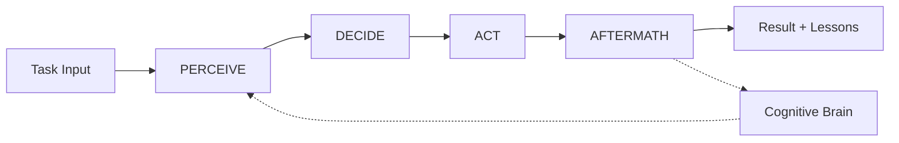
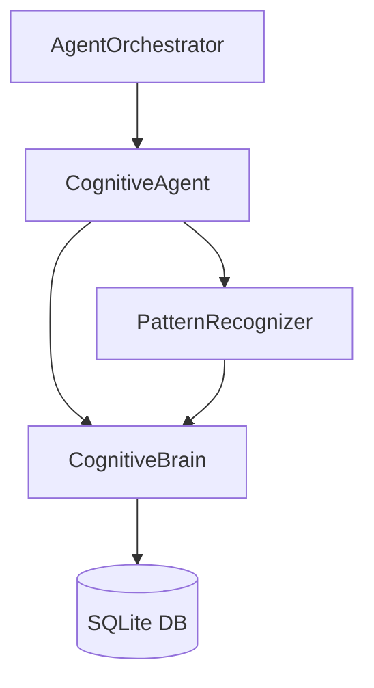

# Cognitive Agent Core Framework

**Version**: 1.0.0  
**Status**: ✅ Production Ready  
**Created**: 2026-01-01

---

## Overview

The Cognitive Agent Core Framework provides unified base classes and utilities for all cognitive agents in the `_codex_` ecosystem. It implements the **PDA Loop** (Perception-Decision-Action-AfterMath) pattern with centralized learning and pattern recognition.

### Key Components

1. **`CognitiveAgent`** - Abstract base class with PDA Loop
2. **`CognitiveBrain`** - Centralized learning (SQLite storage)
3. **`PatternRecognizer`** - Automated pattern detection
4. **`AgentOrchestrator`** - Multi-agent workflow coordination

---

## Quick Start

### 1. Create a Custom Agent

```python
from pathlib import Path
from typing import Any, Dict
from .base_agent import CognitiveAgent

class MyAgent(CognitiveAgent):
    """Custom agent implementing PDA Loop."""
    
    def __init__(self, workspace: Path):
        super().__init__(
            name="my-agent",
            version="1.0.0",
            workspace=workspace
        )
    
    def perceive(self, task: Dict[str, Any]) -> Dict[str, Any]:
        """Gather and analyze context."""
        # Extract patterns, parse inputs, query history
        return {
            "parsed_inputs": task.get("parameters", {}),
            "patterns": ["pattern_a", "pattern_b"],
            "risks": [],
            "opportunities": []
        }
    
    def decide(self, context: Dict[str, Any]) -> Dict[str, Any]:
        """Determine optimal action."""
        # Prioritize, select strategy, plan steps
        return {
            "strategy": "fix_issue",
            "steps": ["step1", "step2"],
            "priority": 8,
            "rationale": "High impact fix",
            "estimated_time": 60
        }
    
    def act(self, decision: Dict[str, Any]) -> Dict[str, Any]:
        """Execute the decision."""
        # Execute in sandbox, validate outputs
        return {
            "status": "success",
            "outputs": {"fixed": True},
            "steps_completed": decision["steps"],
            "logs": ["Executed step1", "Executed step2"]
        }
    
    def aftermath(
        self, 
        result: Dict[str, Any],
        context: Dict[str, Any],
        decision: Dict[str, Any]
    ) -> Dict[str, Any]:
        """Learn from execution."""
        # Tag metrics, identify patterns, extract lessons
        metrics = {
            "execution_success": result["status"] == "success",
            "steps_count": len(decision["steps"])
        }
        
        # Record in cognitive brain if available
        if self.cognitive_brain and self.session_id:
            self.cognitive_brain.record_pattern(
                self.session_id,
                "successful_fix",
                "outcome",
                "Successfully fixed issue"
            )
        
        return {
            "metrics": metrics,
            "patterns": ["successful_execution"],
            "lessons": ["Strategy 'fix_issue' works well"],
            "recommendations": ["Continue with similar approach"]
        }
```

### 2. Use the Agent

```python
from pathlib import Path
from .cognitive_brain import CognitiveBrain

# Create cognitive brain
brain = CognitiveBrain(Path(".codex/brain.db"))

# Create and configure agent
agent = MyAgent(Path.cwd())
agent.set_cognitive_brain(brain)
agent.set_session_id("session-001")

# Execute task
task = {
    "task_type": "fix_bug",
    "parameters": {"bug_id": "BUG-123"}
}

result = agent.execute_pda_loop(task)
print(f"Status: {result['status']}")
print(f"Metrics: {result['metrics']}")
print(f"Lessons: {result['lessons']}")
```

---

## Architecture

### PDA Loop Flow



### Component Interactions



---

## Cognitive Brain

The `CognitiveBrain` provides centralized learning and memory using SQLite.

### Features

- **Session Tracking**: Record agent sessions with metrics
- **Pattern Storage**: Track pattern occurrences and confidence
- **Lesson Learning**: Store lessons learned across sessions
- **Decision History**: Track decisions and outcomes

### Usage

```python
from .cognitive_brain import CognitiveBrain

# Initialize
brain = CognitiveBrain(Path(".codex/brain.db"))

# Start session
brain.start_session(
    session_id="session-001",
    agent_name="my-agent",
    agent_version="1.0.0",
    task_type="debug"
)

# Record pattern
brain.record_pattern(
    session_id="session-001",
    pattern_name="import_error",
    pattern_type="exception",
    description="Missing import statement"
)

# Record lesson
brain.record_lesson(
    session_id="session-001",
    lesson_text="Always check imports first",
    category="debugging",
    confidence=0.9
)

# End session
brain.end_session(
    session_id="session-001",
    status="success",
    metrics={"fixes": 3, "time": 120}
)

# Query history
recent_lessons = brain.get_recent_lessons(limit=5)
session_history = brain.get_session_history(agent_name="my-agent", limit=10)
stats = brain.get_stats()
```

### Database Schema

```sql
CREATE TABLE sessions (
    session_id TEXT PRIMARY KEY,
    agent_name TEXT,
    agent_version TEXT,
    start_time TEXT,
    end_time TEXT,
    status TEXT,
    task_type TEXT,
    metrics TEXT
);

CREATE TABLE patterns (
    pattern_id INTEGER PRIMARY KEY,
    pattern_name TEXT UNIQUE,
    pattern_type TEXT,
    description TEXT,
    occurrences INTEGER,
    confidence_score REAL
);

CREATE TABLE lessons (
    lesson_id INTEGER PRIMARY KEY,
    session_id TEXT,
    lesson_text TEXT,
    category TEXT,
    confidence REAL
);

CREATE TABLE decisions (
    decision_id INTEGER PRIMARY KEY,
    session_id TEXT,
    context TEXT,
    decision TEXT,
    rationale TEXT,
    outcome TEXT,
    success BOOLEAN
);
```

---

## Pattern Recognizer

Automated detection of code patterns and anti-patterns.

### Pattern Matchers

1. **ExceptionPatternMatcher**: Exception handling patterns
2. **ImportPatternMatcher**: Import issues (unused, wildcard, etc.)
3. **TestPatternMatcher**: Test patterns and anti-patterns
4. **DocstringPatternMatcher**: Documentation issues

### Usage

```python
from pathlib import Path
from .pattern_recognizer import PatternRecognizer

# Initialize
recognizer = PatternRecognizer()

# Analyze single file
patterns = recognizer.analyze_file(Path("src/module.py"))
for pattern in patterns:
    print(f"{pattern.name} at {pattern.locations[0]}")

# Analyze directory
results = recognizer.analyze_directory(
    Path("src"),
    recursive=True,
    exclude_patterns=["*/tests/*", "*/__pycache__/*"]
)

# Get summary
summary = recognizer.get_pattern_summary(results)
print(f"Total patterns: {summary['total_patterns']}")
print(f"Top patterns: {summary['top_patterns']}")
```

### Custom Pattern Matcher

```python
from .pattern_recognizer import PatternMatcher, Pattern

class CustomMatcher(PatternMatcher):
    """Custom pattern matcher."""
    
    def match(self, content: str, file_path: Path) -> List[Pattern]:
        # Implement pattern detection logic
        return [...]
    
    def get_pattern_type(self) -> str:
        return "custom"

# Add to recognizer
recognizer.add_matcher(CustomMatcher())
```

---

## Agent Orchestrator

Coordinate multiple agents with dependency management.

### Features

- **Dependency Resolution**: DAG-based task dependencies
- **Parallel Execution**: Run independent tasks in parallel
- **Priority Scheduling**: Execute high-priority tasks first
- **Error Handling**: Graceful failure handling

### Usage

```python
import asyncio
from .orchestrator import AgentOrchestrator

# Create orchestrator
orch = AgentOrchestrator(max_parallel=3)

# Register agents
orch.register_agent("agent1", agent1_instance)
orch.register_agent("agent2", agent2_instance)

# Add tasks
orch.add_task(
    task_id="task1",
    agent_name="agent1",
    task_type="analyze",
    parameters={"file": "src/module.py"},
    priority=9
)

orch.add_task(
    task_id="task2",
    agent_name="agent2",
    task_type="fix",
    parameters={"issues": ["issue1"]},
    dependencies=["task1"],  # Depends on task1
    priority=8
)

# Execute workflow
result = asyncio.run(orch.execute_workflow())
print(f"Status: {result['status']}")
print(f"Metrics: {result['metrics']}")
```

---

## AfterMath Tags

All agents should use AfterMath tags for consistent learning:

- `#AFTERMATH_METRIC` - Performance metrics
- `#AFTERMATH_PATTERN_IDENTIFIED` - Detected patterns
- `#AFTERMATH_LESSON_LEARNED` - Lessons for future
- `#AFTERMATH_DECISION_RATIONALE` - Why decisions were made
- `#AFTERMATH_QUALITY_CHECK` - Validation results

### Example

```python
def aftermath(self, result, context, decision):
    # #AFTERMATH_METRIC: tests_generated, coverage_delta
    metrics = {
        "tests_generated": 5,
        "coverage_delta": 3.2
    }
    
    # #AFTERMATH_PATTERN_IDENTIFIED: common_test_pattern
    patterns = ["empty_test_file", "missing_fixtures"]
    
    # #AFTERMATH_LESSON_LEARNED: test_generation_best_practices
    lessons = [
        "Generate fixtures before test functions",
        "Use parametrize for similar test cases"
    ]
    
    return {
        "metrics": metrics,
        "patterns": patterns,
        "lessons": lessons
    }
```

---

## Testing

Run the test suite:

```bash
# Run all tests
pytest .github/agents/core/tests/ -v

# Run with coverage
pytest .github/agents/core/tests/ --cov=.github/agents/core --cov-report=html

# Run specific test
pytest .github/agents/core/tests/test_base_agent.py -v
```

---

## Migration Guide

### Migrating Existing Agents

1. **Import the base class**:
   ```python
   from .github.agents.core import CognitiveAgent
   ```

2. **Inherit from CognitiveAgent**:
   ```python
   class MyAgent(CognitiveAgent):
       pass
   ```

3. **Implement required methods**:
   - `perceive()`
   - `decide()`
   - `act()`
   - `aftermath()`

4. **Connect to cognitive brain**:
   ```python
   agent.set_cognitive_brain(brain)
   agent.set_session_id(session_id)
   ```

5. **Use `execute_pda_loop()` instead of custom main loop**

---

## Best Practices

1. **Always implement all four PDA methods** - Don't skip aftermath!
2. **Use cognitive brain for learning** - Record patterns, lessons, decisions
3. **Tag metrics with AfterMath tags** - Enables analysis and dashboards
4. **Handle errors gracefully** - Return error info, don't crash
5. **Provide detailed rationales** - Helps with debugging and learning
6. **Test in isolation first** - Unit test each method before integration

---

## Roadmap

### Phase 1 (Complete) ✅
- [x] Base agent class with PDA Loop
- [x] Cognitive brain with SQLite storage
- [x] Pattern recognizer with 4 matchers
- [x] Agent orchestrator for workflows

### Phase 2 (Phase 1 (2026))
- [ ] Advanced pattern recognition (ML-based)
- [ ] Cross-agent collaboration protocols
- [ ] Real-time cognitive brain dashboard
- [ ] Performance optimization

### Phase 3 (Phase 2 (2026))
- [ ] Distributed agent execution
- [ ] Advanced scheduling algorithms
- [ ] Cognitive brain analytics
- [ ] Agent marketplace/registry

---

## Support

- **Documentation**: This README and inline code comments
- **Examples**: See `ci-testing-agent` for reference implementation
- **Issues**: Open GitHub issue with `[core-framework]` prefix
- **Roadmap**: See `COGNITIVE-BRAIN-STATUS-2026-01-01.md`

---

**Maintained by**: Cognitive Brain Team  
**Last Updated**: 2026-01-01  
**License**: Same as repository
