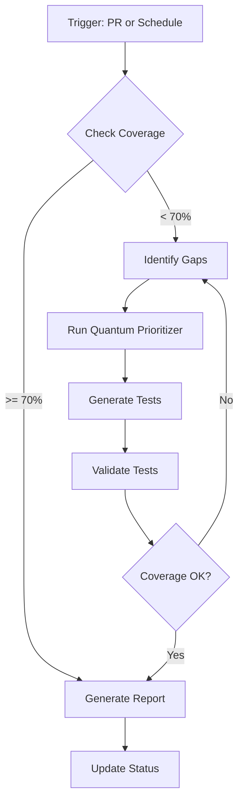

# Coverage Maintenance Agent

**Version**: 1.0.0  
**Author**: Copilot  
**Created**: 2026-02-04  
**Status**: 🟢 Production Ready

---

## 🎯 Purpose

Automated test coverage monitoring, gap detection, and enhancement for the _codex_ repository. This agent maintains the 70%+ coverage target and improves test quality through mutation testing.

---

## 🔧 Capabilities

### 1. Coverage Monitoring
- Track overall and per-module coverage
- Detect coverage regressions
- Generate coverage reports

### 2. Test Gap Detection
- Identify untested code paths
- Find low-coverage modules
- Prioritize using quantum methodology

### 3. Test Generation
- Create skeleton tests for new modules
- Enhance existing tests with edge cases
- Apply test patterns from documentation

### 4. Mutation Testing
- Execute mutation testing on security paths
- Analyze surviving mutants
- Generate mutant-killing tests

### 5. Self-Healing
- Automatically fix coverage regressions
- Address test failures iteratively
- Update cognitive brain status

---

## 📋 Activation Commands

```markdown
@copilot /coverage-check
@copilot /coverage-gaps
@copilot /mutation-test
@copilot /coverage-report
```

---

## 🔄 Workflow



---

## 📊 Metrics Tracked

| Metric | Target | Alert Threshold |
|--------|--------|-----------------|
| Overall Coverage | ≥ 70% | < 65% |
| New Code Coverage | ≥ 70% | < 60% |
| Mutation Score | ≥ 80% | < 70% |
| Test Count | Growing | Declining |

---

## 🛠️ Tools Used

1. **Quantum Prioritizer**: `scripts/quantum_test_prioritizer.py`
2. **Coverage Analysis**: pytest-cov, diff-cover
3. **Mutation Testing**: mutmut
4. **Pattern Library**: `.codex/docs/TEST_DEVELOPMENT_PATTERNS.md`

---

## 📁 Key Files

| File | Purpose |
|------|---------|
| `configs/mutmut/rag_security.ini` | Mutation testing config |
| `.codex/qa_walkthrough/coverage_analysis.json` | Coverage data |
| `.codex/docs/QUANTUM_TEST_METHODOLOGY.md` | Prioritization methodology |
| `.codex/docs/TEST_DEVELOPMENT_PATTERNS.md` | Test patterns |

---

## 🔐 Security Considerations

- Never execute tests with elevated privileges
- Validate all generated test code
- Use ast.literal_eval instead of eval
- Mock external dependencies

---

## 📋 Example Session

### Input
```markdown
@copilot /coverage-check

Check current coverage status and identify any modules 
below 70% threshold.
```

### Agent Actions
1. Run coverage analysis
2. Parse results
3. Identify low-coverage modules
4. Run quantum prioritizer
5. Generate improvement plan
6. Create test skeletons if needed
7. Update cognitive brain status

### Output
```markdown
## Coverage Status

**Overall**: 70.2% ✅

**Modules Below Target**:
- src/new_module/ (45%) - 15 tests needed
- src/experimental/ (52%) - 8 tests needed

**Recommended Actions**:
1. Generate tests for src/new_module/
2. Enhance existing tests in src/experimental/

**Quantum Priority Score**: 0.72 (HIGH)
```

---

## 🔗 Related Agents

- `ci-testing-agent` - CI/CD debugging
- `qa-walkthrough-agent` - Repository-wide QA
- `security-alert-verification-agent` - Security scanning

---

## ⚡ Energy Distribution

| Task | Energy | Frequency |
|------|--------|-----------|
| Coverage Check | ⚡⚡ | Every PR |
| Gap Analysis | ⚡⚡⚡ | Weekly |
| Mutation Testing | ⚡⚡⚡⚡ | Monthly |
| Full Audit | ⚡⚡⚡⚡⚡ | Quarterly |

---

## 📝 Maintenance Notes

- Update patterns in `.codex/docs/TEST_DEVELOPMENT_PATTERNS.md` as new patterns emerge
- Review quantum prioritizer coefficients quarterly
- Archive completed phase documentation
- Keep cognitive brain status current
