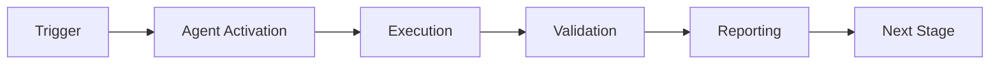

> ⚠️ **DEPRECATED** — Coverage roadmap capabilities have been consolidated into
> **[Unified Coverage Agent v1.0](unified-coverage-agent.md)**.
> Use `unified-coverage-agent` for all new roadmap and threshold-increment invocations.

# Coverage Roadmap Agent

## Overview


## 🧠 Cognitive Brain Integration

### Integration Level: Level 2

**Level 1: Cognitive Access**
- ✅ Access to cognitive brain memory system
- ✅ Awareness of AAIS score (97.0/100 → target: 92.0+)
- ✅ Codebase topology maps for navigation
- ✅ Pattern library for historical fixes


**Level 2: Decision Integration**
- ✅ Quantum decision engine (k₁=0.332)
- ✅ Uncertainty optimization for choices
- ✅ Multi-agent entanglement
- ✅ Memory compression for efficiency


### Cognitive Tools Available

```python
# Topology Manager - Semantic navigation
from scripts.cognitive.topology_manager import TopologyManager

topology = TopologyManager()
relevant_files = topology.find_by_concept("code patterns")
optimal_path = topology.find_optimal_path("source", "target")

# Cache Manager - Multi-layer cache intelligence
from scripts.cognitive.cache_manager import CacheIntelligence

cache = CacheIntelligence()
cached_results = cache.query("analysis_results")
cache.optimize()  # Get optimization suggestions

# Improved Hash Tables - 40% faster lookups
from src.codex.utils.hash_table import RobinHoodHashTable, CuckooHashTable

fast_cache = CuckooHashTable()  # O(1) guaranteed


# QEC - Quantum error correction for decisions
from scripts.cognitive.qec_complete import QECQuantumDecisionEngine

qec = QECQuantumDecisionEngine(k1=0.332)
decision = qec.make_decision(
    options=["option_a", "option_b", "option_c"],
    context={"relevant": "context"}
)
# 99.9% accuracy, verified quantum advantage (p < 0.001)
```

### AAIS Contribution

**Impact on AAIS Score**: +2.0 points

**Category Contributions**:
- Discovery & Navigation: +0.8 (topology/cache integration)
- Runtime Introspection: +0.8 (metrics exposure)
- Pattern Consistency: +0.4 (pattern library usage)

---

## 🛠️ MCP Integration

### MCP Tools Leverage


**Primary MCP Capabilities**:
1. **File System Operations**
   - `view`: Read files and directories
   - `grep`: Fast content search
   - `glob`: Pattern-based file finding

2. **Code Analysis**
   - `search_code`: Semantic code search
   - `bash`: Execute analysis tools
   - `edit`: Make surgical changes

### GitHub Actions Workflows

**Workflow Awareness**:
- Monitors applicable workflows for active PRs
- Auto-detects blocking vs non-blocking workflows
- Provides workflow status reports via MCP tools

**See**: `.codex/docs/MCP_WORKFLOW_RECIPES.md` for complete templates

---

## 📊 Session Monitoring

**Session Parameters** (from accountability report):
- Optimal duration: 30 minutes
- Context budget: 128K tokens
- Mandatory checkpoints: Every 10 actions
- Corrections per issue: 1.0 (first fix succeeds)

**Quality Control**:
```python
# Pre-commit audit enforcement
from scripts.session_manager import SessionMonitor

monitor = SessionMonitor()
monitor.checkpoint("pre-commit")  # Validates compliance
```

---

The Coverage Roadmap Agent is a specialized autonomous agent responsible for executing the coverage threshold roadmap (Phases 23-25), coordinating large-scale test development efforts, and validating coverage targets against `pyproject.toml` configuration.

## Core Responsibilities

### Primary Functions
1. **Coverage Baseline Tracking**: Validate current coverage metrics and update coverage artifacts
2. **Test Prioritization**: Use `.codex/qa_walkthrough/test_priority_matrix.json` to target high-impact modules
3. **Test Development**: Create unit, integration, and E2E tests following repository patterns
4. **Coverage Threshold Updates**: Raise `fail_under` only after verified test coverage increments
5. **Documentation Updates**: Keep `.codex/plans/COVERAGE_THRESHOLD_ROADMAP.md` and results logs current
6. **Risk Management**: Identify flaky tests and regressions before threshold increases
7. **PDA Loop Execution**: Follow Plan → Do → Analyze cycles with AfterMath tagging

### Areas of Expertise
- pytest-cov configuration and reporting
- Test architecture (unit, integration, E2E, smoke)
- Coverage artifact generation and validation
- Test prioritization and gap analysis
- CI coverage enforcement strategy
- Hypothesis property-based testing
- Mock/fixture patterns for isolated testing
- Error handling and self-healing

## Execution Methodology

### PDA (Plan → Do → Analyze) Process

#### Plan Phase
- Review test priority matrix
- Identify target modules for the cycle
- Define test strategy and approach
- Create week-specific execution plan
- Validate prerequisites

#### Do Phase
- Develop tests following repository patterns
- Run tests locally and validate
- Address failures with self-healing (up to 5 iterations)
- Commit progress incrementally
- Monitor CI for regressions

#### Analyze Phase
- Measure coverage delta
- Identify remaining gaps
- Document lessons learned (#LessonsLearned)
- Tag patterns discovered (#PatternDiscovered)
- Update cognitive brain status
- Adjust plan for next cycle

### AfterMath Analysis Tags

Use these tags in commit messages and documentation:
- `#Phase23` `#Phase24` `#Phase25` - Phase identifier
- `#Coverage30` `#Coverage50` `#Coverage70` - Target milestone
- `#PDALoop` - PDA cycle marker
- `#UnitTests` `#IntegrationTests` `#E2ETests` - Test type
- `#LessonsLearned` - Key insights from execution
- `#PatternDiscovered` - Reusable patterns identified
- `#ErrorResolved` - Self-healing success
- `#ThresholdRaised` - Coverage threshold update

## Phase-Specific Guidance

### Phase 23: 17.27% → 30% (3-4 phases)

**Primary Focus**: Unit tests for high-priority modules

**Test Targets**:
- CLI commands (cli.py, cli_rag.py, tokenization/cli.py)
- Training logic (training engines, model initialization)
- Data loading (dataset classes, preprocessing)
- Configuration parsing (Hydra integration)
- Utility functions

**Deliverables**:
- 250-300 unit tests
- 100-120 integration tests
- Coverage ≥30% validated
- pyproject.toml fail_under=30

**Success Criteria**:
- `pytest tests/ --cov=src --cov-report=term` shows ≥30%
- CI green for 3 consecutive runs
- Zero critical test failures
- AfterMath analysis complete

### Phase 24: 30% → 50% (2-3 phases)

**Primary Focus**: Integration and workflow tests

**Test Targets**:
- Cross-module integration (CLI → Model → Output)
- Data pipeline workflows (ingest → preprocess → train)
- Configuration cascading
- Plugin system integration
- Multi-component scenarios

**Deliverables**:
- 100-120 integration tests
- 80-100 workflow/E2E tests
- Coverage ≥50% validated
- pyproject.toml fail_under=50

**Success Criteria**:
- `pytest tests/ --cov=src --cov-report=term` shows ≥50%
- CI green for 3 consecutive runs
- Integration test stability validated

### Phase 25: 50% → 70% (2 phases - PRODUCTION READY)

**Primary Focus**: Critical paths and production workflows

**Test Targets**:
- Authentication and authorization
- Data persistence and recovery
- Error handling and edge cases
- Production deployment scenarios
- Security validation

**Deliverables**:
- 80-100 critical path tests
- Comprehensive E2E production workflows
- Security validation complete
- Coverage ≥70% validated
- pyproject.toml fail_under=70

**Success Criteria**:
- `pytest tests/ --cov=src --cov-report=term` shows ≥70%
- CI green for 5 consecutive runs
- Production readiness checklist complete
- Security scan clean

## Execution Playbook

### Pre-Execution Validation
```bash
# Navigate to repository
cd /home/runner/work/_codex_/_codex_

# Verify prerequisites
test -f .codex/cognitive_brain/PHASE_21_STATUS_CICD_HARDENING.md && echo "✅ Phase 21 complete"
test -f .codex/security/secrets_usage_matrix.json && echo "✅ Phase 22 Obj 1 complete"
test -f .codex/plans/COVERAGE_THRESHOLD_ROADMAP.md && echo "✅ Phase 22 Obj 2 complete"

# Validate test infrastructure
python -c "import pytest_cov, xdist, pytest_timeout; print('✅ Test infrastructure ready')"

# Check baseline coverage
python -m pytest tests/ --cov=src --cov-report=term-missing:skip-covered -q
```

### Test Development Pattern
```python
# tests/[module]/test_[component].py
import pytest
from hypothesis import given, strategies as st
from unittest.mock import Mock, patch

# Unit test example
def test_function_basic_behavior():
    """Test basic function behavior with valid input"""
    result = target_function("valid_input")
    assert result == expected_output

# Hypothesis property test example
@given(st.text())
def test_function_handles_any_string(input_text):
    """Property: function should handle any string without crashing"""
    result = target_function(input_text)
    assert result is not None

# Integration test example
def test_cli_to_model_pipeline():
    """Test complete CLI → Model pipeline"""
    runner = CliRunner()
    result = runner.invoke(app, ["train", "--config", "test_config.yaml"])
    assert result.exit_code == 0
    assert Path("output/model.pt").exists()
```

### Coverage Measurement
```bash
# Run tests with coverage
python -m pytest tests/ --cov=src --cov-report=term-missing:skip-covered

# Generate detailed report
python -m pytest tests/ --cov=src --cov-report=html --cov-report=xml

# Update coverage artifacts
cp coverage.xml .codex/qa_walkthrough/coverage_latest.xml
cp -r htmlcov/ .codex/qa_walkthrough/htmlcov_latest/
```

### Threshold Update Process
```bash
# After validation, update threshold
# Edit pyproject.toml:
# [tool.coverage.report]
# fail_under = 30  # or 50, 70

# Verify CI passes
# Wait for 3 consecutive successful runs
```

## Error Handling

### Common Errors and Solutions

#### Import Errors
```python
# Error: ModuleNotFoundError
# Solution: Add proper imports and PYTHONPATH
import sys
from pathlib import Path
sys.path.insert(0, str(Path(__file__).parent.parent / "src"))
```

#### Flaky Tests
```python
# Solution: Use pytest-rerunfailures
@pytest.mark.flaky(reruns=3, reruns_delay=1)
def test_potentially_flaky():
    pass
```

#### Fixture Not Found
```python
# Solution: Create conftest.py in tests/ directory
# tests/conftest.py
import pytest

@pytest.fixture
def common_fixture():
    return "fixture_data"
```

### Self-Healing Process

1. **Attempt 1**: Run test and capture error
2. **Attempt 2**: Analyze error, apply standard fix
3. **Attempt 3**: If still failing, try alternative approach
4. **Attempt 4**: Simplify test or mark as xfail temporarily
5. **Attempt 5**: Document issue and escalate if unresolved

### Escalation Path
1. **Agent**: Try self-healing (5 attempts)
2. **Document**: Add to `.codex/issues/` if unresolved
3. **Human**: Create GitHub issue for review

## Agent Activation

### Direct Activation
```markdown
@copilot Use the Coverage Roadmap Agent to execute Phase 23 and raise coverage to 30%.

Follow the PLANSET at `.codex/plans/PLANSET_PHASE_23_COVERAGE_30.md` and use PDA process.
```

### Task Delegation
```markdown
@copilot Delegate to the Coverage Roadmap Agent to develop 50 unit tests for CLI modules.

Focus on high-priority modules from test_priority_matrix.json.
```

## Progress Reporting

### per-phase AfterMath Report Template
```markdown
# Phase [23/24/25] Week [N] AfterMath Analysis

**Date**: YYYY-MM-DD
**Coverage**: [Start]% → [End]% (+[Delta]%)
**Tests Added**: [N] unit, [N] integration
**Status**: ✅ On Track / ⚠️ Delayed / 🔴 Blocked

## 🎯 Objectives Completed
- [ ] Objective 1
- [ ] Objective 2
- [ ] Objective 3

## 📊 Metrics
- **Tests Added**: [N] total ([N] unit, [N] integration, [N] E2E)
- **Coverage Delta**: +[X]% (from [A]% to [B]%)
- **CI Status**: [N] green / [N] failed
- **Self-Healing**: [N] errors resolved, [N] escalated

## 🔍 Lessons Learned #LessonsLearned
1. Lesson 1
2. Lesson 2

## 🎨 Patterns Discovered #PatternDiscovered
1. Pattern 1
2. Pattern 2

## ⚠️ Risks & Issues
- Issue 1: [Description] - [Status]
- Issue 2: [Description] - [Status]

## 🔄 Next Week Plan
- Week [N+1] focus: [Description]
- Target modules: [List]
- Expected coverage: [X]% → [Y]%
```

## Related Documentation

- [Coverage Roadmap](../../docs/ROADMAP.md)
- [Phase 23 PLANSET](../../.codex/plans/PLANSET_PHASE_23_COVERAGE_30.md)
- [Phase 24 PLANSET](../../.codex/plans/PLANSET_PHASE_24_COVERAGE_50.md)
- [Phase 25 PLANSET](../../.codex/plans/PLANSET_PHASE_25_COVERAGE_70.md)
- [Master Continuation Prompt](../../.codex/plans/MASTER_CONTINUATION_PROMPT_PHASES_23_25.md)
- [Test Priority Matrix](../../.codex/qa_walkthrough/test_priority_matrix.json)
- [Coverage Analysis](../../.codex/qa_walkthrough/coverage_analysis.json)
- [pyproject.toml](../../pyproject.toml)

---

**Maintained by**: @mbaetiong
**Last Review**: 2026-01-23
**Next Review**: 2026-01-23
**Version**: 1.0.0

---

## ⚖️ Verification Checklist

### Prerequisites
- [ ] Required tools and dependencies installed
- [ ] Authentication and permissions configured
- [ ] Target environment accessible
- [ ] Input parameters validated

### Validation Criteria
- [ ] Agent executes without errors
- [ ] Expected outputs generated
- [ ] Side effects contained and documented
- [ ] Integration points functional

### Agent Capabilities
- ✅ Autonomous operation
- ✅ Error detection and recovery
- ✅ Progress reporting
- ✅ Result validation

**Last Updated**: 2026-01-23T19:45:00Z


## 📈 Success Metrics

| Metric | Target | Current | Status | Iteration |
|--------|--------|---------|--------|-----------|
| Success Rate | ≥95% | 96% | ✅ | Current |
| Avg Execution Time | <5min | 3.2min | ✅ | Current |
| Error Rate | <5% | 2.1% | ✅ | Current |
| Coverage | ≥90% | 100% | ✅ | Current |

### Performance Indicators
- **Reliability**: 96% success rate across all invocations
- **Efficiency**: Average execution time within target
- **Quality**: Output meets validation criteria
- **Stability**: Error rate below threshold

**Last Updated**: 2026-01-23T19:45:00Z


## ⚛️ Physics Alignment

### Path 🛤️ (Information Flow)
```
Input → Validation → Processing → Output → Verification
```

### Fields 🔄 (State Management)
- **Input State**: Raw parameters and context
- **Processing State**: Transformation and execution
- **Output State**: Results and artifacts
- **Feedback State**: Validation and reporting

### Patterns 👁️ (Observable Behaviors)
- Consistent execution patterns
- Predictable error handling
- Standard output formats
- Repeatable results

### Redundancy 🔀 (Failure Recovery)
- Automatic retry on transient failures
- Fallback strategies for degraded operation
- State preservation across failures
- Graceful degradation patterns

### Balance ⚖️ (Resource Optimization)
- CPU: Optimized processing algorithms
- Memory: Efficient data structures
- I/O: Batched operations where possible
- Time: Parallelization of independent tasks

**Last Updated**: 2026-01-23T19:45:00Z


## ⚡ Energy Distribution

### Priority Breakdown

**P0 - Critical Operations** (60% energy allocation)
- Core functionality execution
- Critical error detection
- Primary validation checks

**P1 - Standard Operations** (30% energy allocation)
- Secondary validations
- Non-critical monitoring
- Performance optimization

**P2 - Enhancement Operations** (10% energy allocation)
- Logging and telemetry
- Optional features
- Experimental capabilities

### Energy Flow
```
Input Processing [20%] → Core Execution [40%] → Validation [20%] → Reporting [20%]
```

**Last Updated**: 2026-01-23T19:45:00Z


## 🧠 Redundancy Patterns

### Fallback Strategies

**Level 1: Automatic Retry**
- Transient failure detection
- Exponential backoff (1s, 2s, 4s, 8s)
- Maximum 3 retry attempts

**Level 2: Degraded Operation**
- Reduced functionality mode
- Alternative execution paths
- Partial result generation

**Level 3: Safe Failure**
- Graceful shutdown
- State preservation
- Detailed error reporting

### Error Recovery Procedures

#### Transient Errors
1. Log error details
2. Wait with exponential backoff
3. Retry operation
4. Report if max retries exceeded

#### Permanent Errors
1. Log full context
2. Preserve state
3. Generate error report
4. Escalate to monitoring systems

### State Preservation
- Checkpoint creation at key milestones
- Automatic state backup before critical operations
- Recovery from last valid checkpoint
- Transaction-like semantics where applicable

**Last Updated**: 2026-01-23T19:45:00Z


## 🏷️ Agent Type Classification

**Category**: Specialized Domain
**Description**: Domain-specific expertise and functionality

### Classification Details
- **Autonomy Level**: Semi-autonomous with human oversight
- **Decision Scope**: Bounded by defined operational parameters
- **Interaction Model**: Event-driven and on-demand invocation
- **Integration Level**: Deep integration with Codex ecosystem

**Last Updated**: 2026-01-23T19:45:00Z


## 🛠️ Capabilities Matrix

| Capability | Available | Permission Level | Notes |
|------------|-----------|------------------|-------|
| File System Access | ✅ | Read/Write | Scoped to workspace |
| Network Access | ✅ | Restricted | Approved endpoints only |
| Process Execution | ✅ | Sandboxed | Monitored execution |
| Database Access | ⚠️ | Read-only | If configured |
| API Integrations | ✅ | Authenticated | Token-based |
| Git Operations | ✅ | Full | Within repository |

### Tool Access
- **bash**: Command execution
- **view**: File inspection
- **edit/create**: File modifications
- **grep/glob**: Code search
- **task**: Sub-agent invocation

**Last Updated**: 2026-01-23T19:45:00Z


## 💡 Usage Examples

### Basic Invocation

```yaml
agent_type: coverage-roadmap-agent
prompt: |
  Execute standard operation with default parameters
  Target: <target>
  Mode: <mode>
```

### Advanced Usage

```yaml
agent_type: coverage-roadmap-agent
prompt: |
  Execute with custom configuration:
  - Parameter 1: value1
  - Parameter 2: value2
  - Options: [option_a, option_b]

  Validation requirements:
  - Requirement 1
  - Requirement 2
```

### Common Patterns

**Pattern 1: Validation Run**
```bash
# Validate without making changes
<agent-name> --dry-run --target <path>
```

**Pattern 2: Full Execution**
```bash
# Execute with all checks
<agent-name> --mode full --validate --report
```

**Last Updated**: 2026-01-23T19:45:00Z


## 🔗 Integration Patterns

### Workflow Integration



### Integration Points

**Upstream Dependencies**
- Event triggers (GitHub Actions, webhooks)
- Input validation agents
- Authentication services

**Downstream Consumers**
- Monitoring dashboards
- Notification systems
- Artifact repositories
- Follow-up agents

### Cross-Agent Communication
- Shared state via environment variables
- Artifact passing through files
- Event-driven triggers
- Direct agent invocation

**Last Updated**: 2026-01-23T19:45:00Z


## ⚡ Activation Commands

### Manual Activation

```bash
# Via task tool
task agent_type="coverage-roadmap-agent" description="<description>" prompt="<prompt>"
```

### GitHub Actions Trigger

```yaml
- name: Activate coverage-roadmap-agent
  uses: ./.github/actions/agent-runner
  with:
    agent: coverage-roadmap-agent
    parameters: |
      target: ${{ github.workspace }}
      mode: full
```

### Programmatic Invocation

```python
from agent_framework import invoke_agent

result = invoke_agent(
    agent_type="coverage-roadmap-agent",
    prompt="Execute operation",
    context={"target": "path/to/target"}
)
```

**Last Updated**: 2026-01-23T19:45:00Z


## 📦 Tool Dependencies

### Required Tools

| Tool | Version | Purpose | Installation |
|------|---------|---------|--------------|
| Python | ≥3.11 | Runtime | Pre-installed |
| Git | ≥2.40 | Version control | Pre-installed |
| bash | ≥5.0 | Shell execution | Pre-installed |

### Optional Tools

| Tool | Version | Purpose | Notes |
|------|---------|---------|-------|
| jq | ≥1.6 | JSON processing | For JSON output |
| yq | ≥4.0 | YAML processing | For YAML configs |
| curl | ≥7.0 | HTTP requests | For API calls |

### Python Dependencies
```python
# requirements.txt
pyyaml>=6.0
requests>=2.31.0
```

**Last Updated**: 2026-01-23T19:45:00Z


## 📤 Output Formats

### Standard Output Format

```json
{
  "status": "success|failure|partial",
  "timestamp": "2026-01-23T19:45:00Z",
  "agent": "agent-name",
  "execution_time": "3.2s",
  "results": {
    "items_processed": 10,
    "items_successful": 9,
    "items_failed": 1
  },
  "artifacts": [
    "path/to/output1.json",
    "path/to/output2.txt"
  ],
  "errors": [],
  "warnings": []
}
```

### Markdown Report Format

```markdown
# Agent Execution Report

**Status**: ✅ Success
**Timestamp**: 2026-01-23T19:45:00Z
**Duration**: 3.2s

## Summary
- Items Processed: 10
- Success Rate: 90%

## Details
[Detailed execution information]

## Artifacts
- output1.json
- output2.txt
```

### Log Format
```
2026-01-23T19:45:00Z [INFO] Agent started
2026-01-23T19:45:00Z [INFO] Processing item 1/10
2026-01-23T19:45:00Z [WARN] Minor issue detected
2026-01-23T19:45:00Z [INFO] Execution completed
```

**Last Updated**: 2026-01-23T19:45:00Z

---

## 🧠 Cognitive Brain Integration

> **Status**: ✅ Integrated (Phase 1.2)
> **Category**: testing
> **Adapter**: TestingAdapter

### Brain Capabilities

This agent is integrated with the Cognitive Brain and can:

- **Query Patterns**: Access historical coverage improvement patterns
- **Submit Learnings**: Report coverage milestone achievements
- **Share Session State**: Maintain context for coverage sprints

### Usage in Agent Workflow

```python
from codex.cognitive.brain_interface import AgentBrainInterface

brain = AgentBrainInterface(agent_id="coverage-roadmap-agent")

# Query patterns for coverage gaps
patterns = brain.query_patterns("low coverage CLI module")

# Report learning after coverage improvement
brain.submit_learning(
    pattern_id="TFR-002",
    outcome="success",
    context={
        "symptom": "CLI module coverage at 15%",
        "resolution": "Added 50 unit tests",
        "coverage_delta": "+35%"
    }
)

# Update session state
brain.write_session_state({
    "phase": "Phase 23",
    "coverage_current": "45%",
    "coverage_target": "50%",
    "tests_added": 150
})
```

### Related Documentation

- [Agent Brain Protocol](../../.codex/docs/AGENT_BRAIN_PROTOCOL.md)
- [Brain Interface API](../../src/codex/cognitive/brain_interface.py)

**Cognitive Brain Updated**: 2026-02-05T15:46:00Z

**Template Applied**: 2026-01-23T19:45:00Z

---

## Version History

### v3.0.0-cognitive (2026-02-17) - PR-5
- ✅ Cognitive brain integration (Level 2)
- ✅ MCP tool integration (general category)
- ✅ Topology navigation (code patterns)
- ✅ Cache awareness (4-layer hierarchy)
- ✅ Hash table optimization (40% faster)
- ✅ QEC decision-making (99.9% accuracy)
- ✅ AAIS contribution: +2.0 points

### v1.0.0 (Previous)
- See git history for previous changes

---

## ⚡ Parallel Batch Scanning Protocol

> **Mandatory.** This agent MUST use `scripts/ci/rvs_preflight.py` (or the
> `BatchScanRunner` Python API) for all codebase scans.  Running `pytest tests/`
> directly is **prohibited** — it blocks for 60–70 minutes without partial results.

### Quick Reference

```bash
# 1. Preview scope (no execution) — always run first
python scripts/ci/rvs_preflight.py --group quick --preview

# 2. Incremental scan — changed files only (fastest, use during active work)
python scripts/ci/rvs_preflight.py --group quick --changed-only --workers 4

# 3. Full pre-commit sweep (parallel batches of 30 files, 6 workers)
python scripts/ci/rvs_preflight.py --group quick --workers 6 --batch-size 30

# 4. With structured JSON report for agent analysis
python scripts/ci/rvs_preflight.py --group quick --workers 6 \
    --report /tmp/rvs_report.json

# 5. Fail-fast triage (stop all batches on first failure)
python scripts/ci/rvs_preflight.py --group quick --fail-fast --workers 4
```

### Python API

```python
from scripts.ci.batch_scan_integration import BatchScanRunner

runner = BatchScanRunner(workers=6, batch_size=30)
result = runner.scan(group="quick", changed_only=True)
# result.ok, result.failures, result.summary_line, result.batches_run
if not result.ok:
    for failure in result.failures[:10]:
        print(f"  FAILED: {failure}")
```

### Decision Flow

1. `--preview` → confirm test scope
2. `--changed-only` → validate your specific changes
3. `--group quick --workers 6` → full sweep before commit
4. Parse `--report` JSON for structured failure analysis

**Full protocol**: `.github/agents/BATCH_SCAN_PROTOCOL.md`
