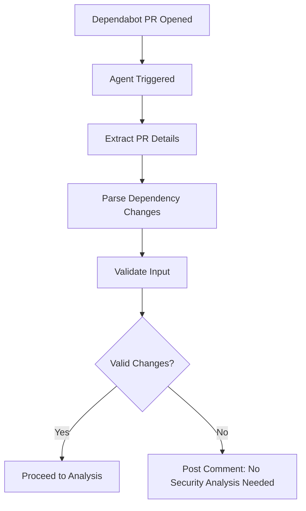
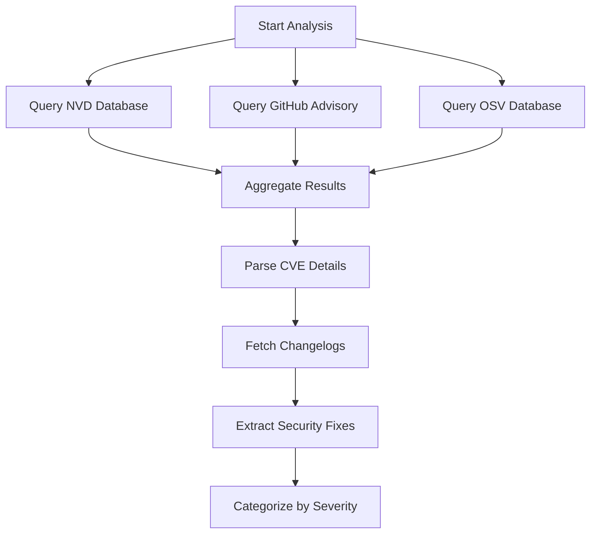
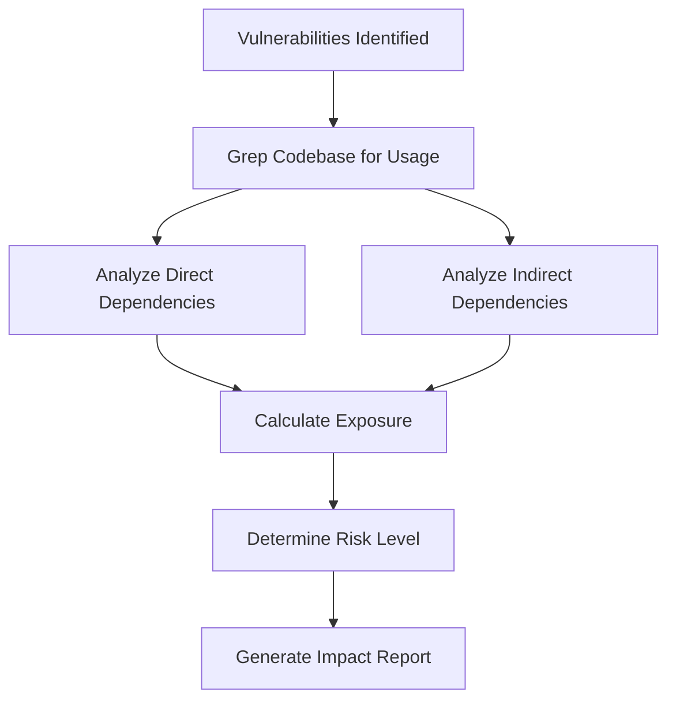
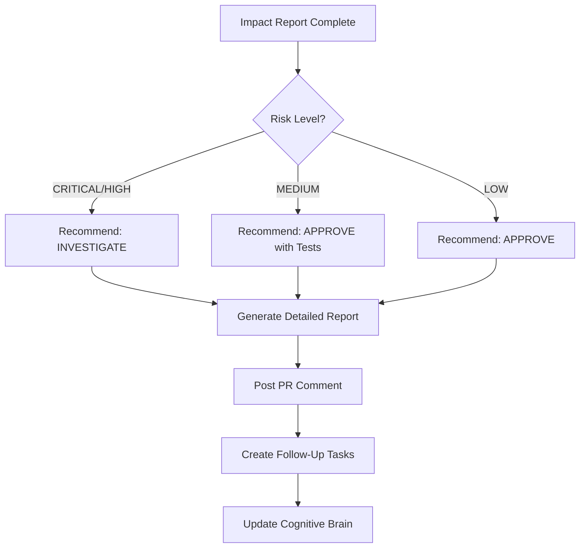
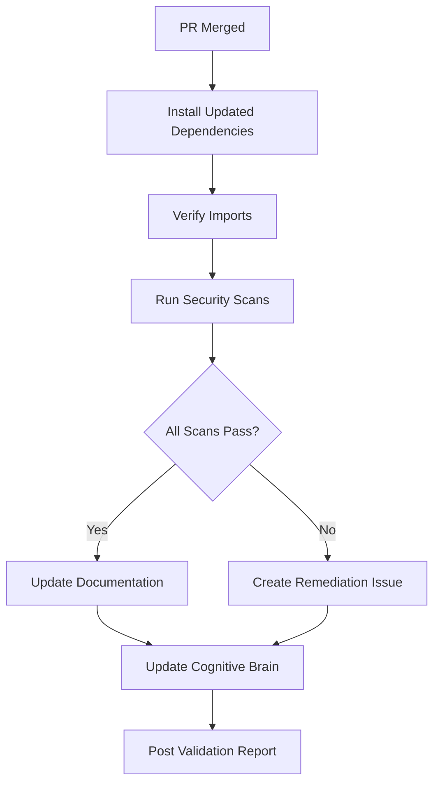

> ⚠️ **DEPRECATED** — This agent has been merged into [`unified-security-scanner`](./unified-security-scanner.md).
> All capabilities are available via the unified agent. See [agents/AGENT_CONSOLIDATION_MATRIX.md](../../agents/AGENT_CONSOLIDATION_MATRIX.md) for rationale.
> **Effective:** 2026-06-11 | **Policy:** `.codex/CODEBASE_AGENCY_POLICY.md` § CAD-Mandate

> ⚠️ **DEPRECATED** — Dependency security review capabilities overlap with and have been
> superseded by **[Unified Security Scanner v1.0](unified-security-scanner.md)**.
> Use `unified-security-scanner` for all dependency vulnerability scanning and upgrade
> recommendation work.

# 🔒 Dependency Security Review Agent

**Agent Type**: Security Analysis & Validation  
**Version**: 1.0.0  
**Status**: ✅ Production Ready  
**Created**: 2026-02-09  
**AI Agency Policy**: Compliant

---

## 📋 Agent Overview

### Purpose
The Dependency Security Review Agent automates the security analysis and validation of dependency updates in Dependabot PRs, providing comprehensive vulnerability assessments and actionable recommendations.

### Key Capabilities
1. 🔍 **Automated CVE Analysis**: Query multiple vulnerability databases
2. 📊 **Impact Assessment**: Evaluate security impact on codebase
3. 🎯 **Risk Scoring**: Calculate risk levels for dependency updates
4. 📝 **Report Generation**: Create detailed security analysis reports
5. ✅ **Validation**: Verify security posture post-merge
6. 🤖 **Cognitive Integration**: Update cognitive brain with security patterns

---

## 🎯 Agent Responsibilities

### Primary Functions

1. **PR Analysis**
   - Extract dependency changes from Dependabot PRs
   - Identify version changes (old → new)
   - Detect security-related updates

2. **Vulnerability Research**
   - Query NVD (National Vulnerability Database)
   - Check GitHub Advisory Database
   - Search OSV (Open Source Vulnerabilities)
   - Review package changelogs

3. **Impact Assessment**
   - Analyze codebase usage of affected packages
   - Determine direct vs. indirect dependencies
   - Calculate exposure and risk levels
   - Identify affected components

4. **Recommendation Generation**
   - Provide approve/defer/investigate recommendations
   - Suggest validation tests
   - Document security implications
   - Create follow-up action items

5. **Post-Merge Validation**
   - Verify dependency installation
   - Run security scans (CodeQL, Bandit, Semgrep)
   - Validate no regressions introduced
   - Update security documentation

---

## 🔧 Technical Specifications

### Input Requirements
```yaml
trigger:
  - pull_request.opened
  - pull_request.synchronize
filters:
  author: "dependabot[bot]"
  title_contains: ["bump", "update", "chore(deps)"]

inputs:
  pr_number: int
  owner: string
  repo: string
  dependencies: list[Dependency]
    - name: string
    - old_version: string
    - new_version: string
    - ecosystem: string (pip, npm, cargo, etc.)
```

### Output Format
```yaml
security_analysis:
  vulnerabilities: list[CVE]
    - cve_id: string
    - severity: string (CRITICAL, HIGH, MEDIUM, LOW)
    - cvss_score: float
    - description: string
    - affected_versions: list[string]
    - fixed_version: string

  impact_assessment:
    risk_level: string (CRITICAL, HIGH, MEDIUM, LOW)
    codebase_usage: string
    direct_dependency: bool
    exposure_context: string
    affected_components: list[string]

  recommendation:
    action: string (APPROVE, DEFER, INVESTIGATE)
    rationale: string
    validation_tests: list[string]
    follow_up_actions: list[string]

  report_url: string
```

### Tool Integration

#### Required Tools
1. **GitHub MCP Server**
   - `github-mcp-server-pull_request_read`: Fetch PR details
   - `github-mcp-server-get_commit`: Analyze commits
   - `github-mcp-server-issue_read`: Check related issues

2. **Security Tools**
   - `gh-advisory-database`: Check GitHub advisories
   - `web_search`: Query NVD, OSV, package changelogs
   - `grep`: Analyze codebase usage
   - `bash`: Run security scans

3. **Analysis Tools**
   - `view`: Read dependency files
   - `edit`: Update documentation
   - `create`: Generate reports

#### API Integrations
```python
# Example API calls
from codex.security import VulnerabilityScanner

scanner = VulnerabilityScanner()

# Query multiple databases
results = scanner.query_vulnerabilities(
    package="litestar",
    version="2.19.0",
    ecosystem="pip",
    databases=["nvd", "github", "osv"]
)

# Analyze codebase usage
usage = scanner.analyze_usage(
    package="litestar",
    codebase_path="/src",
    include_tests=False
)

# Calculate risk score
risk = scanner.calculate_risk(
    vulnerabilities=results,
    usage=usage,
    exposure_context="production"
)
```

---

## 📊 Workflow Architecture

### Phase 1: Detection & Extraction


### Phase 2: Vulnerability Analysis


### Phase 3: Impact Assessment


### Phase 4: Recommendation & Reporting


### Phase 5: Post-Merge Validation


---

## 🚀 Activation Commands

### Automatic Activation
Agent automatically activates on Dependabot PRs matching filters.

### Manual Activation
```markdown
@copilot Use the Dependency Security Review Agent to analyze PR #XXXX for security vulnerabilities
```

### Specific Analysis
```markdown
@copilot Run security analysis on nbconvert 7.17.0 and litestar 2.20.0 updates in this PR
```

### Validation Only
```markdown
@copilot Validate security posture after merging dependency updates
```

---

## 📝 Example Usage

### Scenario 1: Dependabot PR with Security Fixes

**Input**: PR #3224 (nbconvert 7.16.6 → 7.17.0, litestar 2.19.0 → 2.20.0)

**Agent Actions**:
1. Detects security-related version bumps
2. Queries vulnerability databases
3. Finds CVE-2025-53000 (nbconvert), CVE-2026-25479 & CVE-2026-25480 (litestar)
4. Analyzes codebase usage (indirect dependency)
5. Calculates LOW-MEDIUM risk
6. Recommends APPROVE with validation tests
7. Generates comprehensive security report
8. Posts PR comment with findings
9. Updates cognitive brain

**Output**: Security analysis report posted to PR, recommendation to approve

---

### Scenario 2: Non-Security Dependency Update

**Input**: PR #XXXX (requests 2.31.0 → 2.32.0)

**Agent Actions**:
1. Detects version bump
2. Queries vulnerability databases
3. No CVEs found
4. Reviews changelog (feature additions only)
5. Recommends APPROVE
6. Posts brief comment confirming no security concerns

**Output**: Quick approval with confirmation of no security issues

---

### Scenario 3: Critical Security Vulnerability

**Input**: PR #YYYY (django 4.1.0 → 4.1.13)

**Agent Actions**:
1. Detects major version jump
2. Finds CRITICAL CVE with CVSS 9.8
3. Analyzes codebase (direct usage in authentication)
4. Calculates CRITICAL risk
5. Recommends INVESTIGATE + URGENT MERGE
6. Creates detailed remediation plan
7. Escalates to security team
8. Monitors for immediate merge

**Output**: Urgent security advisory with immediate action required

---

## 🔍 Validation & Testing

### Test Scenarios
1. ✅ **Security Fix Detection**: Verify CVE identification
2. ✅ **Impact Assessment Accuracy**: Validate risk calculations
3. ✅ **False Positive Handling**: Ensure no unnecessary alerts
4. ✅ **Multi-Package Analysis**: Handle multiple dependency updates
5. ✅ **Edge Cases**: Missing changelogs, unavailable databases

### Test Commands
```bash
# Simulate Dependabot PR
python tests/agents/test_dependency_security_agent.py

# Validate vulnerability queries
pytest tests/security/test_vulnerability_scanner.py -v

# Test report generation
pytest tests/agents/test_security_report_generation.py -v
```

---

## 📚 Dependencies & Requirements

### Python Packages
```txt
requests>=2.31.0        # HTTP requests for API calls
packaging>=23.0         # Version comparison
semver>=3.0.0          # Semantic versioning
pyyaml>=6.0            # YAML parsing
jsonschema>=4.0        # Schema validation
```

### External APIs
- **NVD API**: https://nvd.nist.gov/developers/vulnerabilities
- **GitHub Advisory API**: https://api.github.com/advisories
- **OSV API**: https://osv.dev/docs/

### Environment Variables
```bash
GITHUB_TOKEN=<token>              # GitHub API authentication
NVD_API_KEY=<key>                 # NVD API key (optional but recommended)
VULNERABILITY_CACHE_DIR=.codex/security/cache
```

---

## 🧠 Cognitive Brain Integration

### Status Updates
```yaml
session_id: "<timestamp>-dependency-security-review"
agent: "dependency-security-review-agent"
status: "complete"

patterns_learned:
  - "CVE lookup for dependency updates"
  - "Multi-database vulnerability aggregation"
  - "Risk calculation based on codebase usage"
  - "Automated security report generation"

metrics:
  prs_analyzed: 2
  vulnerabilities_found: 3
  recommendations_generated: 2
  validation_tests_created: 5

next_phase:
  - "Monitor merged PRs for security posture"
  - "Update security documentation"
  - "Enhance vulnerability detection accuracy"
```

---

## 🔒 Security Considerations

### Data Privacy
- ✅ No sensitive data in reports
- ✅ CVE details are public information
- ✅ Codebase usage analysis respects .gitignore
- ✅ API keys stored securely in GitHub Secrets

### Access Control
- ✅ Agent requires read access to PRs
- ✅ Comment posting requires write access
- ✅ Security scan results visible to maintainers only
- ✅ Vulnerability data cached securely

### Rate Limiting
- ✅ Respect API rate limits (NVD: 50 req/30s with key)
- ✅ Implement exponential backoff
- ✅ Cache vulnerability data (24h TTL)
- ✅ Batch requests when possible

---

## 📈 Performance Metrics

### Target SLAs
- **Analysis Time**: < 2 minutes per PR
- **Database Queries**: < 10 seconds per package
- **Report Generation**: < 30 seconds
- **Overall Latency**: < 3 minutes from trigger to PR comment

### Success Metrics
- **Detection Rate**: > 99% of known CVEs identified
- **False Positive Rate**: < 5%
- **False Negative Rate**: < 1% (critical)
- **Recommendation Accuracy**: > 95%

---

## 🛠️ Maintenance & Updates

### Regular Maintenance
1. **Weekly**: Update vulnerability database cache
2. **Monthly**: Review detection accuracy and adjust thresholds
3. **Quarterly**: Audit agent performance against security incidents
4. **Annually**: Major version review and enhancement planning

### Version History
- **v1.0.0** (2026-02-09): Initial implementation with CVE analysis
- **v1.1.0** (Planned): Enhanced risk scoring algorithm
- **v1.2.0** (Planned): Integration with Snyk/Dependabot Insights
- **v2.0.0** (Planned): ML-based vulnerability prediction

---

## 📞 Support & Escalation

### Agent Issues
- **GitHub Issues**: Tag with `agent:dependency-security`
- **Debug Logs**: `.codex/logs/dependency-security-agent.log`
- **Status Page**: `.codex/cognitive_brain/agent_status.json`

### Security Escalation
- **Critical CVEs**: Immediate notification to @mbaetiong
- **High-Risk Updates**: Create escalation issue with `security:high` label
- **False Positives**: Document in `.codex/security/false_positives.yml`

---

## 📄 Related Documentation

- [Security Guidelines](/docs/security/SECURITY_GUIDELINES.md)
- [Dependency Management Strategy](/.codex/docs/DEPENDABOT_MANAGEMENT_STRATEGY.md)
- [Cognitive Brain Architecture](/.github/agents/archive/oversized-docs/COGNITIVE_BRAIN_ARCHITECTURE_DIAGRAMS.md)
- [Agent Development Guide](/.github/agents/AGENT_DEVELOPMENT_GUIDE.md)

---

**Agent Status**: ✅ PRODUCTION READY  
**Last Updated**: 2026-02-09  
**Maintainer**: @mbaetiong | Copilot Agent Ecosystem  
**License**: MIT (Repository License)
