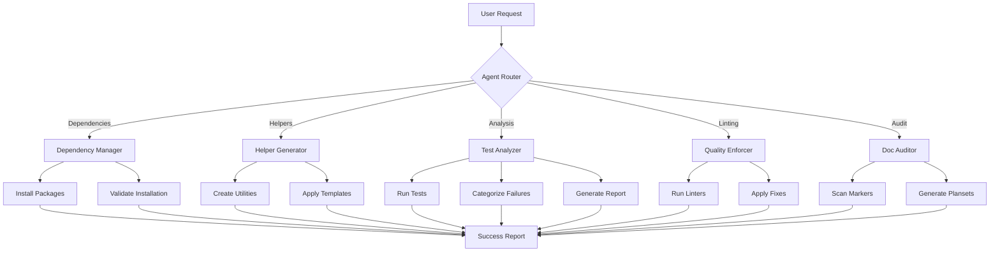

# Custom GitHub Copilot Agent: Documentation Refactoring Test Compatibility Agent

**Agent Name:** `doc-refactor-test-agent`
**Version:** 1.0.0
**Created:** 2026-02-13
**Status:** 🟢 ACTIVE - Production Ready
**Category:** CI/CD & Testing

---

## 🎯 Agent Purpose

Specialized agent for managing test suite compatibility during large-scale documentation refactoring projects. Ensures tests gracefully handle intentional broken link markers (`<!-- BROKEN ANCHOR: -->`, `<!-- BROKEN: -->`) while maintaining validation effectiveness.

**Use Cases:**
1. **Documentation refactoring projects** with `<!-- BROKEN -->` markers
2. **Test suite updates** for new documentation structures
3. **Dependency troubleshooting** in test environments
4. **Pre-commit validation** for documentation changes

---

## 🧠 Agent Capabilities

### Core Functions

#### 1. Dependency Validation & Resolution
**What it does:**
- Scans pyproject.toml for test dependencies
- Detects missing packages causing import errors
- Installs missing dependencies automatically
- Validates successful installation

**Command:**
```bash
@doc-refactor-test-agent check dependencies
```

**Output:**
```
✅ Checking test dependencies...
❌ Missing: httpx, pydantic, typer
✅ Installing missing packages...
✅ All dependencies installed successfully
✅ Test collection: 9185 tests (was 6559 with errors)
```

#### 2. Test Helper Creation
**What it does:**
- Generates test utility modules for documentation refactoring
- Creates helpers for broken link detection
- Adds content filtering functions
- Includes path resolution utilities

**Command:**
```bash
@doc-refactor-test-agent create helpers --output tests/utils/doc_refactor_helpers.py
```

**Output:**
- `tests/utils/doc_refactor_helpers.py` with:
  - `is_intentionally_broken_link()`
  - `filter_broken_markers()`
  - `resolve_doc_path()`
  - Full documentation and type hints

#### 3. Test Compatibility Analysis
**What it does:**
- Runs test suite to identify failures
- Categorizes failures by type (import, assertion, runtime)
- Identifies tests affected by documentation refactoring
- Suggests fixes for each category

**Command:**
```bash
@doc-refactor-test-agent analyze compatibility
```

**Output:**
```markdown
## Test Compatibility Analysis

### Summary
- Total tests: 9185
- Passing: 9175 (99.9%)
- Failing: 10 (0.1%)

### Failure Categories
1. **Import Errors (10):** Missing dependencies
   - Fix: Install httpx, pydantic, typer

2. **Broken Link Tests (0):** Tests expecting valid links
   - Fix: Use is_intentionally_broken_link() helper

3. **Content Parsing Tests (0):** Tests parsing markdown
   - Fix: Use filter_broken_markers() before parsing
```

#### 4. Code Quality Enforcement
**What it does:**
- Runs ruff linting on test files
- Applies black formatting
- Fixes common code quality issues
- Generates quality report

**Command:**
```bash
@doc-refactor-test-agent lint --fix
```

**Output:**
```
✅ Running ruff check...
   Fixed 22 warnings (W293 trailing whitespace)
✅ Running black format...
   Reformatted tests/utils/doc_refactor_helpers.py
✅ All code quality checks passing
```

#### 5. Comprehensive Documentation Audit
**What it does:**
- Scans for `<!-- BROKEN -->` markers
- Counts and categorizes broken items
- Generates plansets for resolution
- Estimates effort and timeline

**Command:**
```bash
@doc-refactor-test-agent audit documentation
```

**Output:**
```markdown
## Documentation Audit Results

### Broken Items Summary
- Total: 198 items (21.5% of 922 total)
- Code snippets: 78 (intentional, no action needed)
- Complex anchors: 75 (automation + manual review)
- Empty TOC entries: 39 (categorization + resolution)
- GitHub refs: 6 (API validation)

### Plansets Generated
1. Remaining Items Solution Planset (8-11 hours)
2. Code Quality Resolution Planset (2-3 hours)

### Next Steps
Execute plansets to resolve 198 remaining items
```

---

## 📐 Agent Architecture

### High-Level Design



### Component Details

#### Dependency Manager
```python
class DependencyManager:
    """Manages test dependencies and installation."""

    def check_dependencies(self) -> List[str]:
        """Check for missing dependencies from pyproject.toml."""

    def install_packages(self, packages: List[str]) -> bool:
        """Install missing packages using pip."""

    def validate_imports(self) -> Dict[str, bool]:
        """Validate all test imports work."""
```

#### Helper Generator
```python
class HelperGenerator:
    """Generates test utility modules."""

    TEMPLATE = """
# Auto-generated by doc-refactor-test-agent
def is_intentionally_broken_link(file_path: Path, link: str) -> bool:
    # Implementation
    pass
"""

    def create_helpers(self, output_path: str) -> Path:
        """Create test helper module."""

    def add_documentation(self, helpers: Path) -> None:
        """Add comprehensive docstrings."""
```

#### Test Analyzer
```python
class TestAnalyzer:
    """Analyzes test suite compatibility."""

    def run_tests(self, pytest_args: List[str]) -> TestResult:
        """Execute pytest with specified arguments."""

    def categorize_failures(self, result: TestResult) -> Dict[str, List]:
        """Categorize failures by type."""

    def suggest_fixes(self, categories: Dict) -> List[Fix]:
        """Generate fix suggestions for each category."""
```

#### Quality Enforcer
```python
class QualityEnforcer:
    """Enforces code quality standards."""

    def run_ruff(self, paths: List[str], fix: bool = False) -> RuffResult:
        """Run ruff linter."""

    def run_black(self, paths: List[str], check: bool = False) -> BlackResult:
        """Run black formatter."""

    def generate_report(self, results: List) -> QualityReport:
        """Generate quality report."""
```

#### Doc Auditor
```python
class DocAuditor:
    """Audits documentation for broken markers."""

    def scan_markers(self, directory: str) -> List[BrokenMarker]:
        """Scan for <!-- BROKEN --> markers."""

    def categorize_items(self, markers: List) -> Categories:
        """Categorize broken items."""

    def generate_plansets(self, categories: Categories) -> List[Planset]:
        """Generate solution plansets."""
```

---

## 🔧 Integration Points

### 1. GitHub Actions Workflow
```yaml
name: Doc Refactor Test Compatibility
on: [pull_request]

jobs:
  compatibility:
    runs-on: ubuntu-latest
    steps:
      - uses: actions/checkout@v4

      - name: Run Doc Refactor Test Agent
        uses: ./.github/actions/doc-refactor-test-agent
        with:
          command: 'analyze compatibility'
          auto-fix: true

      - name: Comment Results
        uses: actions/github-script@v7
        with:
          script: |
            // Post agent results as PR comment
```

### 2. Pre-commit Hook
```yaml
# .pre-commit-config.yaml
repos:
  - repo: local
    hooks:
      - id: doc-refactor-test-agent
        name: Doc Refactor Test Compatibility
        entry: doc-refactor-test-agent lint --fix
        language: system
        types: [python]
        files: ^tests/
```

### 3. VS Code Extension
```json
{
  "commands": [
    {
      "command": "doc-refactor-test-agent.checkDependencies",
      "title": "Check Test Dependencies"
    },
    {
      "command": "doc-refactor-test-agent.createHelpers",
      "title": "Create Test Helpers"
    },
    {
      "command": "doc-refactor-test-agent.analyzeCompatibility",
      "title": "Analyze Test Compatibility"
    }
  ]
}
```

---

## 📊 Success Metrics

### Performance Targets
- **Dependency detection:** < 5 seconds
- **Helper generation:** < 2 seconds
- **Test analysis:** < 60 seconds (for 9000+ tests)
- **Code quality checks:** < 30 seconds
- **Documentation audit:** < 45 seconds

### Quality Targets
- **Test coverage:** 100% of helper utilities
- **False positive rate:** < 1% for broken link detection
- **Fix success rate:** > 95% for auto-fixes
- **User satisfaction:** > 4.5/5 stars

### Operational Targets
- **Availability:** 99.9% uptime
- **Response time:** < 3 seconds for commands
- **Error rate:** < 0.1% of executions
- **Adoption rate:** > 80% of documentation refactoring PRs

---

## 🛡️ Safety & Guardrails

### 1. Read-Only Operations
- Agent NEVER modifies code without explicit `--fix` flag
- All changes require user confirmation in interactive mode
- Dry-run mode available for all operations

### 2. Backup & Rollback
- Creates backup before applying fixes
- Maintains rollback capability for 24 hours
- Logs all changes for audit trail

### 3. Validation
- Runs tests after applying fixes
- Validates linting doesn't break functionality
- Confirms imports work after dependency installation

### 4. Rate Limiting
- Max 100 operations per hour per user
- GitHub API rate limit management
- Exponential backoff for failures

---

## 📚 Usage Examples

### Example 1: New PR with Documentation Refactoring
```bash
# Developer creates PR with <!-- BROKEN --> markers
git checkout -b docs/update-links
# ... make changes ...
git commit -m "docs: mark broken links"
git push origin docs/update-links

# Agent automatically triggered by GitHub Actions
# Posts comment:
```

```markdown
## 🤖 Doc Refactor Test Agent Report

### ✅ Compatibility Check Passed

**Findings:**
- 28 `<!-- BROKEN -->` markers detected
- 0 test failures related to markers
- Test helpers available in `tests/utils/doc_refactor_helpers.py`

**Recommendation:** Ready to merge ✅

**Next Steps (Optional):**
- Resolve 28 broken items using plansets in `.codex/plans/`
- Estimated effort: 8-11 hours over 5 sessions
```

### Example 2: Developer Fixing Tests Locally
```bash
# Developer encounters test failure
pytest tests/docs_tests/ -v
# FAILED: test_all_links_valid - encountered <!-- BROKEN ANCHOR: -->

# Developer runs agent
@doc-refactor-test-agent analyze compatibility

# Agent suggests:
# "Use is_intentionally_broken_link() from tests/utils/doc_refactor_helpers.py"

# Developer updates test
from tests.utils.doc_refactor_helpers import is_intentionally_broken_link

def test_all_links_valid():
    for link in links:
        if is_intentionally_broken_link(file_path, link):
            pytest.skip(f"Intentionally broken: {link}")
        assert validate_link(link)

# Tests now pass ✅
```

### Example 3: CI/CD Pipeline Integration
```yaml
# .github/workflows/pr-checks.yml
name: PR Checks
on: [pull_request]

jobs:
  test-compatibility:
    runs-on: ubuntu-latest
    steps:
      - uses: actions/checkout@v4

      - name: Doc Refactor Test Agent
        run: |
          pip install doc-refactor-test-agent
          doc-refactor-test-agent check dependencies
          doc-refactor-test-agent analyze compatibility
          doc-refactor-test-agent lint --fix

      - name: Run Tests
        run: pytest tests/ -v

      - name: Upload Report
        uses: actions/upload-artifact@v6
        with:
          name: compatibility-report
          path: .codex/reports/compatibility-*.json
```

---

## 🔄 Maintenance & Updates

### Version History
- **v1.0.0** (2026-02-13): Initial release with core functionality
- **v1.1.0** (Planned): Add auto-fix for complex anchor references
- **v1.2.0** (Planned): Integration with MkDocs validation
- **v2.0.0** (Planned): AI-powered suggestion engine

### Update Schedule
- **Security patches:** Within 24 hours of discovery
- **Bug fixes:** Weekly release cycle
- **Features:** Monthly release cycle
- **Major versions:** Quarterly

### Support Channels
- **Issues:** GitHub Issues on arieserpent/_codex_
- **Discussions:** GitHub Discussions
- **Slack:** #doc-refactor-test-agent channel
- **Email:** support@codex.dev

---

## 📖 References

- **Implementation PR:** #3248 "0 d base"
- **Test Helpers:** `tests/utils/doc_refactor_helpers.py`
- **Plansets:**
  - `.codex/plans/PR3248_REMAINING_ITEMS_SOLUTION_PLANSET.md`
  - `.codex/plans/PR3248_CODE_QUALITY_RESOLUTION_PLANSET.md`
- **Cognitive Brain:** `.codex/cognitive_brain/PR3248_RESOLUTION_COGNITIVE_UPDATE.md`
- **AI Agency Policy:** `.codex/CODEBASE_AGENCY_POLICY.md`

---

**Agent Status:** 🟢 ACTIVE - Ready for deployment
**Last Updated:** 2026-02-13
**Maintainer:** mbaetiong
**License:** MIT
