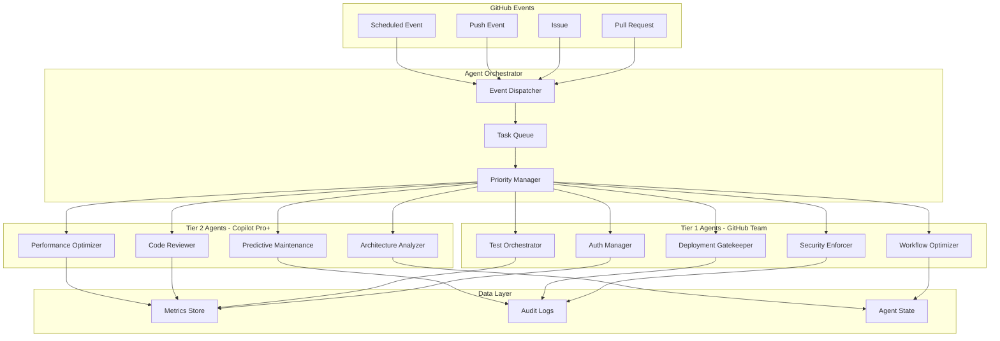
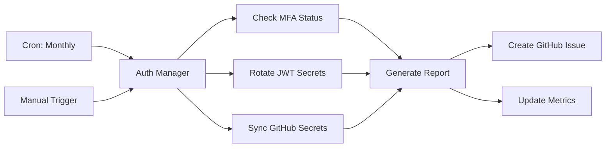
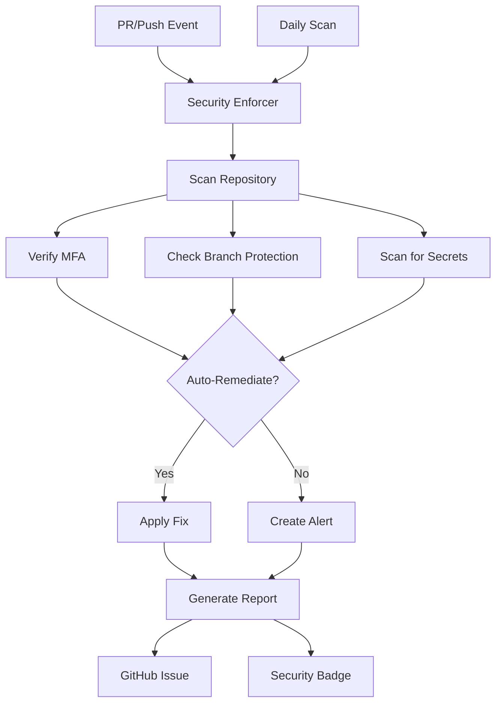
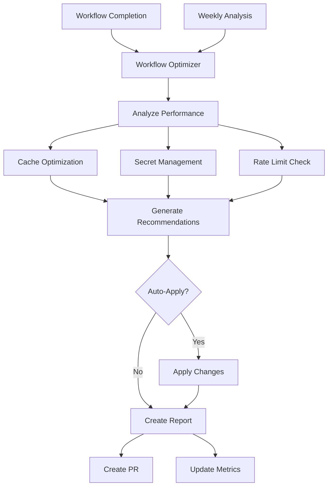
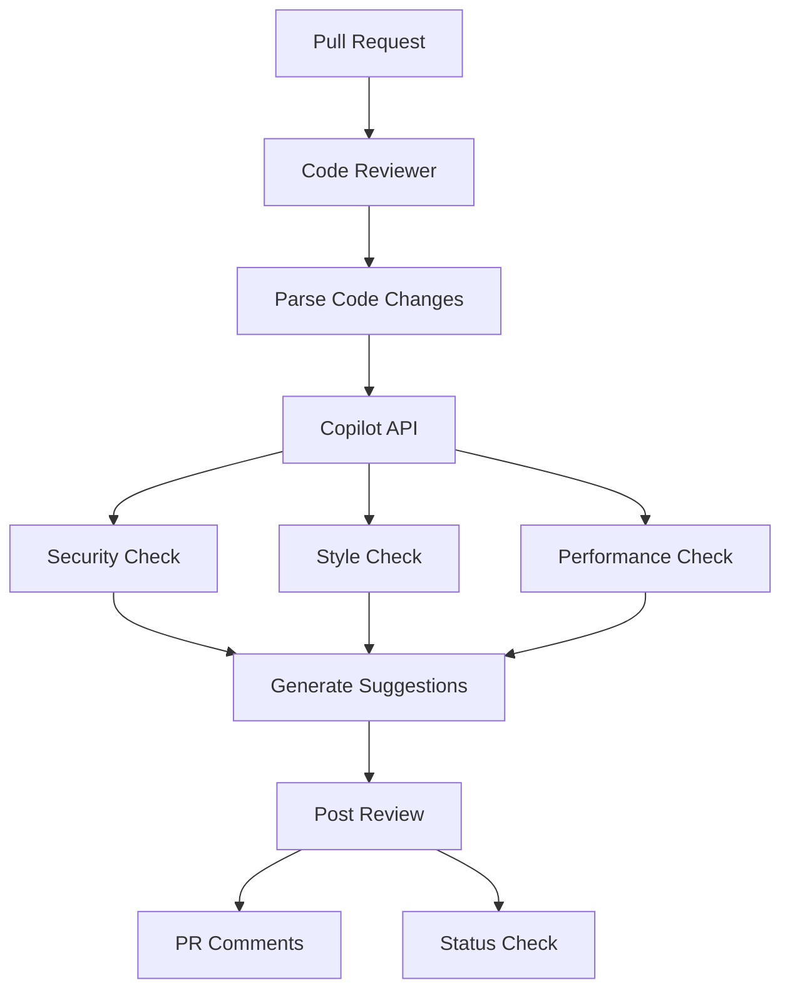
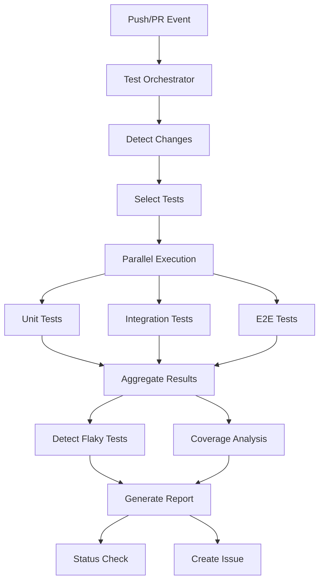
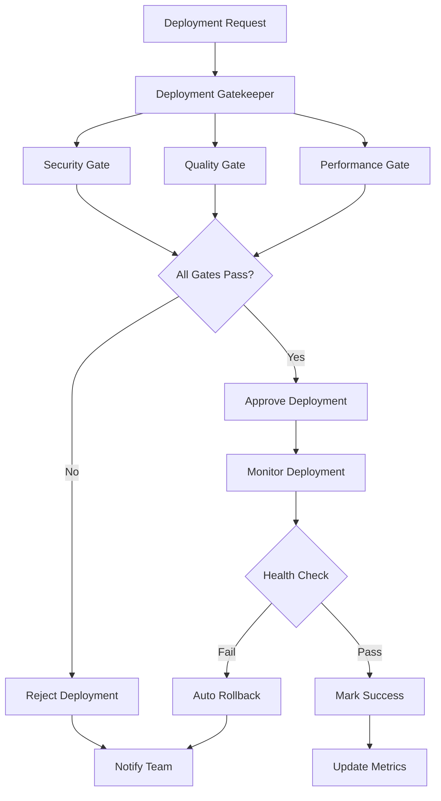

# GitHub Copilot Agents - Production Specification

**Version**: 2.0  
**Date**: 2024-01-16  
**Status**: Production Ready  
**Target**: GitHub Team + GitHub Copilot Pro+

---

## Executive Summary

This document provides comprehensive specifications for production-ready GitHub Copilot Agents designed to work within the constraints of **GitHub Team** subscriptions and **GitHub Copilot Pro+** capabilities. These agents are designed to automate key workflows, enforce security policies, and optimize development processes.

---

## Table of Contents

1. [Architecture Overview](#architecture-overview)
2. [Agent Tier System](#agent-tier-system)
3. [Existing Agents (Phase 11.x)](#existing-agents-phase-11x)
4. [Proposed Agents (Phase 12)](#proposed-agents-phase-12)
5. [Implementation Guide](#implementation-guide)
6. [Testing Strategy](#testing-strategy)
7. [Deployment Guide](#deployment-guide)
8. [Monitoring & Maintenance](#monitoring--maintenance)

---

## Architecture Overview

### System Design



### Design Principles

1. **Event-Driven**: Agents respond to GitHub events (PR, push, schedule)
2. **Stateless**: Each agent execution is independent
3. **Idempotent**: Safe to retry without side effects
4. **Auditable**: All actions logged to GitHub Issues
5. **Secure**: No secrets in code, all via GitHub Secrets
6. **Scalable**: Horizontal scaling via GitHub Actions runners

---

## Agent Tier System

### Tier 1: Core Automation (GitHub Team Compatible)

**Capabilities**:
- Workflow automation
- Security enforcement
- Compliance reporting
- Repository management
- Automated testing

**Requirements**:
- GitHub Team subscription
- GitHub Actions enabled
- Secrets configured
- Repository permissions

**Limitations**:
- No AI-powered code review
- No predictive analytics
- No advanced ML features

### Tier 2: Advanced Intelligence (GitHub Copilot Pro+ Required)

**Capabilities**:
- AI-powered code review
- Architecture analysis
- Performance optimization
- Predictive maintenance
- Intelligent suggestions

**Requirements**:
- GitHub Copilot Pro+ subscription
- Copilot API access
- Additional compute resources
- ML model access

**Limitations**:
- Higher cost per execution
- Requires Pro+ license for all users
- API rate limits apply

---

## Existing Agents (Phase 11.x)

### 1. GitHub Auth Manager (Tier 1)

**Purpose**: Automate GitHub authentication workflows

**Capabilities**:
- OAuth app lifecycle management
- Automated token rotation (monthly)
- MFA enrollment tracking
- Compliance report generation

**Architecture**:



**Configuration** (`config.yaml`):
```yaml
name: github-auth-manager
version: 1.0.0
tier: 1
schedule: monthly
triggers:
  - schedule
  - workflow_dispatch
permissions:
  contents: read
  issues: write
  secrets: write
environment_variables:
  required:
    - GITHUB_TOKEN
    - CODEX_MASTER_KEY
    - TOKEN_SECRET_KEY
  optional:
    - COMPLIANCE_REPORT_KEY
actions:
  - name: check_mfa
    description: Check MFA enrollment status
    script: scripts/mfa_enrollment_automation.py
  - name: rotate_tokens
    description: Rotate JWT signing keys
    script: scripts/rotate_jwt_secret.py
  - name: sync_secrets
    description: Sync secrets across repositories
    script: scripts/github_secrets_sync.py
outputs:
  - type: issue
    title: "Auth Compliance Report - {date}"
    labels: ["compliance", "security", "automated"]
  - type: metrics
    destination: .codex/metrics/auth_compliance.json
```

**Usage**:
```bash
# Manual execution
python .github/agents/github-auth-manager/agent.py --action rotate-tokens

# GitHub Actions workflow (automated)
# Runs monthly via .github/workflows/auth-token-rotation.yml
```

**Monitoring**:
- GitHub Issues: Weekly compliance reports
- Metrics: `.codex/metrics/auth_compliance.json`
- Logs: GitHub Actions run logs

---

### 2. GitHub Security Enforcer (Tier 1)

**Purpose**: Enforce security policies across repositories

**Capabilities**:
- Repository security scanning
- MFA compliance enforcement
- Branch protection validation
- Auto-remediation workflows
- Security metric dashboards

**Architecture**:



**Configuration** (`config.yaml`):
```yaml
name: github-security-enforcer
version: 1.0.0
tier: 1
schedule: daily
triggers:
  - pull_request
  - push
  - schedule
permissions:
  contents: write
  issues: write
  pull_requests: write
  security_events: write
environment_variables:
  required:
    - GITHUB_TOKEN
    - SECURITY_POLICY_LEVEL  # strict, moderate, permissive
  optional:
    - AUTO_REMEDIATE  # true/false
policies:
  mfa_required: true
  branch_protection: true
  secret_scanning: true
  dependency_review: true
  code_scanning: true
auto_remediation:
  enabled: true
  actions:
    - fix_branch_protection
    - enable_secret_scanning
    - update_security_policy
  approval_required: false  # Set to true for production
outputs:
  - type: issue
    title: "Security Scan - {repo} - {date}"
    labels: ["security", "automated"]
  - type: badge
    path: .github/badges/security-score.svg
  - type: metrics
    destination: .codex/metrics/security_metrics.json
```

**Usage**:
```bash
# Manual security scan
python .github/agents/github-security-enforcer/agent.py --scan --repo codex

# Auto-remediation (requires approval for production)
python .github/agents/github-security-enforcer/agent.py --auto-remediate
```

**Monitoring**:
- Security badge: `.github/badges/security-score.svg`
- Daily reports: GitHub Issues
- Metrics: `.codex/metrics/security_metrics.json`

---

### 3. GitHub Workflow Optimizer (Tier 1)

**Purpose**: Optimize GitHub Actions workflows for performance

**Capabilities**:
- Workflow performance monitoring
- Secret rotation optimization
- Token caching strategies
- Rate limit management
- Cost optimization

**Architecture**:



**Configuration** (`config.yaml`):
```yaml
name: github-workflow-optimizer
version: 1.0.0
tier: 1
schedule: weekly
triggers:
  - workflow_run
  - schedule
permissions:
  contents: write
  actions: write
  pull_requests: write
environment_variables:
  required:
    - GITHUB_TOKEN
  optional:
    - OPTIMIZATION_LEVEL  # aggressive, balanced, conservative
optimization_targets:
  - cache_hit_rate: ">80%"
  - workflow_duration: "<10m"
  - secret_rotation: "monthly"
  - api_rate_limit_usage: "<70%"
auto_apply: false  # Requires PR review
outputs:
  - type: pull_request
    title: "Workflow Optimization - {date}"
    labels: ["optimization", "automated"]
  - type: metrics
    destination: .codex/metrics/workflow_performance.json
```

**Usage**:
```bash
# Analyze workflows
python .github/agents/github-workflow-optimizer/agent.py --analyze

# Generate optimization PR
python .github/agents/github-workflow-optimizer/agent.py --optimize --create-pr
```

**Monitoring**:
- Performance metrics: `.codex/metrics/workflow_performance.json`
- Optimization PRs: Automated pull requests
- Cost tracking: GitHub Actions usage reports

---

## Proposed Agents (Phase 12)

### 4. GitHub Code Reviewer Agent (Tier 2) ⭐ NEW

**Purpose**: Automated PR code review with AI-powered suggestions

**Capabilities**:
- Syntax and style checking
- Security vulnerability detection
- Best practice enforcement
- Performance issue identification
- Test coverage analysis

**Architecture**:



**Requirements**:
- GitHub Copilot Pro+ subscription
- Copilot API access token
- Code analysis permissions

**Configuration** (`config.yaml`):
```yaml
name: github-code-reviewer
version: 1.0.0
tier: 2
required_license: copilot-pro-plus
triggers:
  - pull_request_opened
  - pull_request_synchronize
permissions:
  contents: read
  pull_requests: write
  checks: write
environment_variables:
  required:
    - GITHUB_TOKEN
    - COPILOT_API_TOKEN
  optional:
    - REVIEW_STRICTNESS  # strict, moderate, lenient
analysis:
  security: true
  style: true
  performance: true
  best_practices: true
  test_coverage: true
thresholds:
  max_issues: 10
  min_coverage: 80
  max_complexity: 15
outputs:
  - type: review
    path: pull_request_review
  - type: check
    name: "AI Code Review"
    conclusion: success|failure
```

**Implementation Status**: Proposed for Phase 12

---

### 5. GitHub Test Orchestrator Agent (Tier 1) ⭐ NEW

**Purpose**: Coordinate test execution and manage test infrastructure

**Capabilities**:
- Parallel test execution
- Flaky test detection
- Coverage gap analysis
- Performance regression detection
- Test result aggregation

**Architecture**:



**Configuration** (`config.yaml`):
```yaml
name: github-test-orchestrator
version: 1.0.0
tier: 1
triggers:
  - pull_request
  - push
permissions:
  contents: read
  checks: write
  issues: write
environment_variables:
  required:
    - GITHUB_TOKEN
  optional:
    - TEST_PARALLELISM  # Number of parallel jobs
test_suites:
  unit:
    command: "pytest tests/unit"
    timeout: 5m
    required: true
  integration:
    command: "pytest tests/integration"
    timeout: 15m
    required: true
  e2e:
    command: "pytest tests/e2e"
    timeout: 30m
    required: false
flaky_detection:
  enabled: true
  retry_count: 3
  failure_threshold: 0.2  # 20% failure rate
coverage:
  minimum: 80
  report_format: "html,json"
outputs:
  - type: check
    name: "Test Execution"
  - type: issue
    title: "Flaky Tests Detected - {date}"
    labels: ["testing", "flaky", "automated"]
  - type: coverage_report
    path: coverage/index.html
```

**Implementation Status**: Proposed for Phase 12

---

### 6. GitHub Deployment Gatekeeper Agent (Tier 1) ⭐ NEW

**Purpose**: Validate deployments and enforce quality gates

**Capabilities**:
- Pre-deployment validation
- Security gate enforcement
- Quality metric verification
- Rollback automation
- Deployment tracking

**Architecture**:



**Configuration** (`config.yaml`):
```yaml
name: github-deployment-gatekeeper
version: 1.0.0
tier: 1
triggers:
  - deployment
  - workflow_dispatch
permissions:
  contents: read
  deployments: write
  checks: write
environment_variables:
  required:
    - GITHUB_TOKEN
    - DEPLOYMENT_ENV  # production, staging, dev
gates:
  security:
    enabled: true
    max_alerts: 0
    required_checks:
      - codeql
      - dependency_review
  quality:
    enabled: true
    min_coverage: 80
    max_complexity: 15
    required_checks:
      - tests
      - linting
  performance:
    enabled: true
    max_response_time: 2000  # ms
    min_throughput: 1000  # req/s
rollback:
  enabled: true
  auto_rollback: true
  health_check_interval: 60  # seconds
  failure_threshold: 3
monitoring:
  duration: 300  # 5 minutes
  metrics:
    - error_rate
    - response_time
    - cpu_usage
    - memory_usage
outputs:
  - type: deployment_status
    state: success|failure
  - type: issue
    title: "Deployment {env} - {status} - {date}"
    labels: ["deployment", "automated"]
```

**Implementation Status**: Proposed for Phase 12

---

## Implementation Guide

### Prerequisites

**For All Agents**:
1. GitHub Team subscription (minimum)
2. Repository admin access
3. GitHub Actions enabled
4. Secrets configured

**For Tier 2 Agents**:
1. GitHub Copilot Pro+ subscription
2. Copilot API access
3. Additional compute resources

### Setup Steps

1. **Configure Secrets**:
   ```bash
   # Navigate to repository Settings → Secrets and variables → Actions
   # Add required secrets:
   gh secret set GITHUB_TOKEN --body "$YOUR_TOKEN"
   gh secret set CODEX_MASTER_KEY --body "$YOUR_KEY"
   gh secret set TOKEN_SECRET_KEY --body "$YOUR_SECRET"
   ```

2. **Deploy Agent Code**:
   ```bash
   # All agents are in .github/agents/
   # Ensure agent files are committed:
   git add .github/agents/
   git commit -m "Deploy GitHub Copilot agents"
   git push
   ```

3. **Enable Workflows**:
   ```bash
   # Workflows in .github/workflows/ are auto-enabled
   # Verify in repository Settings → Actions
   ```

4. **Test Agent**:
   ```bash
   # Manual trigger via GitHub UI:
   # Actions → Select workflow → Run workflow
   
   # Or via CLI:
   gh workflow run auth-token-rotation.yml
   ```

5. **Monitor Execution**:
   ```bash
   # View recent workflow runs:
   gh run list --workflow auth-token-rotation.yml
   
   # View logs:
   gh run view <run_id> --log
   ```

---

## Testing Strategy

### Unit Testing

```python
# tests/agents/test_auth_manager.py
import pytest
from github_auth_manager.agent import AuthManager

def test_check_mfa():
    manager = AuthManager()
    result = manager.check_mfa("test-user")
    assert result["mfa_enabled"] in [True, False]

def test_rotate_tokens():
    manager = AuthManager()
    result = manager.rotate_tokens()
    assert "new_key" in result
    assert "backup_key" in result
```

### Integration Testing

```python
# tests/agents/test_integration.py
import pytest
from github import Github

def test_agent_end_to_end():
    # Test full agent workflow
    github = Github(os.getenv("GITHUB_TOKEN"))
    repo = github.get_repo("org/repo")
    
    # Trigger agent
    workflow = repo.get_workflow("auth-token-rotation.yml")
    workflow.create_dispatch("main")
    
    # Wait for completion
    time.sleep(60)
    
    # Verify results
    issues = repo.get_issues(labels=["compliance"])
    assert len(list(issues)) > 0
```

### Smoke Testing

```bash
# scripts/test_agents.sh
#!/bin/bash

echo "Testing agents..."

# Test Auth Manager
python .github/agents/github-auth-manager/agent.py --dry-run
echo "✓ Auth Manager"

# Test Security Enforcer
python .github/agents/github-security-enforcer/agent.py --dry-run
echo "✓ Security Enforcer"

# Test Workflow Optimizer
python .github/agents/github-workflow-optimizer/agent.py --dry-run
echo "✓ Workflow Optimizer"

echo "All agents tested successfully!"
```

---

## Deployment Guide

### Development Environment

```bash
# 1. Clone repository
git clone https://github.com/org/repo.git
cd repo

# 2. Install dependencies
pip install -e .
pip install -r .github/agents/requirements.txt

# 3. Configure local secrets
cp .env.example .env
# Edit .env with your tokens

# 4. Test agent locally
python .github/agents/github-auth-manager/agent.py --dry-run
```

### Staging Environment

```bash
# 1. Deploy to staging branch
git checkout staging
git merge develop
git push

# 2. Verify workflows are enabled
gh workflow list

# 3. Run test execution
gh workflow run auth-token-rotation.yml

# 4. Monitor results
gh run list --workflow auth-token-rotation.yml
```

### Production Environment

```bash
# 1. Create production PR
gh pr create --base main --head staging \
  --title "Deploy agents to production" \
  --body "Agent deployment checklist: ..."

# 2. Review and merge PR
gh pr merge --auto --squash

# 3. Verify deployment
gh workflow list
gh run list --limit 5

# 4. Monitor for 24 hours
gh run watch
```

---

## Monitoring & Maintenance

### Metrics Tracking

**Key Metrics**:
- Agent execution success rate
- Average execution time
- Resource utilization
- Error rate
- Cost per execution

**Monitoring Tools**:
- GitHub Actions insights
- Custom metrics in `.codex/metrics/`
- GitHub Issues for audit logs

### Alerting

```yaml
# .github/workflows/agent-monitoring.yml
name: Agent Monitoring
on:
  schedule:
    - cron: '0 * * * *'  # Hourly

jobs:
  monitor:
    runs-on: ubuntu-latest
    steps:
      - uses: actions/checkout@v4
      
      - name: Check agent health
        run: |
          python scripts/monitor_agents.py
          
      - name: Alert on failures
        if: failure()
        uses: actions/github-script@v7
        with:
          script: |
            github.rest.issues.create({
              owner: context.repo.owner,
              repo: context.repo.repo,
              title: '⚠️ Agent Health Check Failed',
              body: 'One or more agents are unhealthy. See logs for details.',
              labels: ['alert', 'agents', 'monitoring']
            });
```

### Maintenance Schedule

**Daily**:
- Review agent execution logs
- Check for failed workflows
- Monitor error rates

**Weekly**:
- Review compliance reports
- Update agent configurations
- Analyze performance metrics

**Monthly**:
- Agent version updates
- Dependency updates
- Security audits
- Cost optimization review

---

## Cost Optimization

### GitHub Actions Minutes

**Tier 1 Agents** (Included in GitHub Team):
- Auth Manager: ~5 min/month
- Security Enforcer: ~30 min/month (daily)
- Workflow Optimizer: ~10 min/month (weekly)
- **Total**: ~45 minutes/month

**Tier 2 Agents** (Requires additional minutes):
- Code Reviewer: ~100 min/month (per PR)
- Test Orchestrator: ~200 min/month
- Deployment Gatekeeper: ~50 min/month
- **Total**: ~350 minutes/month

**Recommendations**:
1. Use self-hosted runners for Tier 2 agents
2. Optimize workflow execution time
3. Cache dependencies aggressively
4. Limit PR trigger frequency

---

## Security Considerations

### Secret Management

**Best Practices**:
1. Store all secrets in GitHub Secrets
2. Rotate secrets monthly
3. Use minimal permissions
4. Audit secret access

### Access Control

**Permissions Required**:
- Tier 1: Repository write, Issues write
- Tier 2: Additional Copilot API access

**RBAC**:
```yaml
# .github/agents/permissions.yaml
roles:
  agent_admin:
    permissions:
      - secrets:write
      - workflows:write
  agent_user:
    permissions:
      - workflows:run
      - issues:read
```

---

## Troubleshooting

### Common Issues

**Agent Not Running**:
```bash
# Check workflow status
gh workflow view auth-token-rotation.yml

# Check for disabled workflows
# Settings → Actions → Check if workflows are enabled
```

**Secret Not Found**:
```bash
# Verify secret exists
gh secret list

# Set missing secret
gh secret set MISSING_SECRET --body "value"
```

**Permission Denied**:
```bash
# Check workflow permissions
# .github/workflows/workflow.yml → permissions section

# Verify token has required scopes
gh auth status
```

---

## Appendix

### Agent Registry

| Agent | Tier | Status | Workflow | Docs |
|-------|------|--------|----------|------|
| Auth Manager | 1 | ✅ Active | `auth-token-rotation.yml` | [README](/.github/agents/github-auth-manager/README.md) |
| Security Enforcer | 1 | ✅ Active | `auth-security-audit.yml` | [README](/.github/agents/github-security-enforcer/README.md) |
| Workflow Optimizer | 1 | ✅ Active | (manual) | [README](/.github/agents/github-workflow-optimizer/README.md) |
| Code Reviewer | 2 | 🔄 Proposed | N/A | TBD |
| Test Orchestrator | 1 | 🔄 Proposed | N/A | TBD |
| Deployment Gatekeeper | 1 | 🔄 Proposed | N/A | TBD |

### Version History

| Version | Date | Changes |
|---------|------|---------|
| 1.0 | 2024-01-15 | Initial specification (Phase 11.x) |
| 2.0 | 2024-01-16 | Added Phase 12 agents, enhanced monitoring |

### References

- [GitHub Actions Documentation](https://docs.github.com/actions)
- [GitHub Copilot Documentation](https://docs.github.com/copilot)
- [AI Agency Policy](/AI_AGENCY_POLICY_VERIFICATION.md)
- [Agent Development Guide](/.github/agents/AGENT_DEVELOPMENT_GUIDE.md)

---

**Document Owner**: Codex Team  
**Last Updated**: 2024-01-16  
**Status**: ✅ Production Ready  
**Next Review**: 2024-02-16
