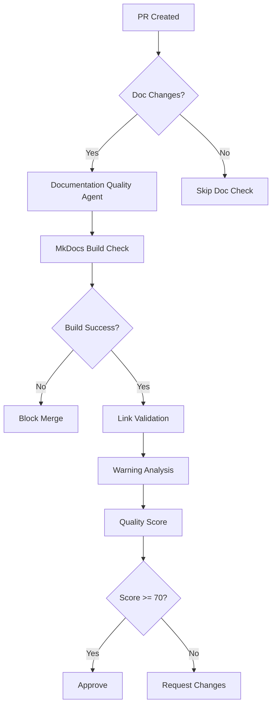

# Documentation Quality Agent

This agent provides automated documentation quality assessment, including MkDocs build validation, link checking, warning categorization, and quality score calculation.

## Capabilities

- **MkDocs Build Validation**: Validates MkDocs builds without errors
- **Link Validation**: Checks internal and external links for broken references
- **Warning Categorization**: Categorizes warnings by type (nav, links, anchors)
- **Warning Tracking**: Monitors warning count trends over time
- **Automated Fix Suggestions**: Suggests fixes based on warning patterns
- **Quality Score Calculation**: Calculates overall documentation quality score

## Quality Score Calculation

```
Quality Score = 100 - (Warning Count * 0.3) - (Broken Links * 2) - (Stale Docs * 1)

Score Thresholds:
- 90-100: ✅ Excellent
- 70-89:  🟢 Good
- 50-69:  🟡 Moderate
- 30-49:  ⚠️ Needs Improvement
- 0-29:   🔴 Poor
```

## When to Use

- On every PR with documentation changes
- Weekly scheduled quality audits
- Before releases
- After major documentation updates
- During documentation refactoring

## Warning Thresholds

| Count | Status | Action |
|-------|--------|--------|
| < 10 | ✅ Excellent | Enable strict mode |
| 10-50 | 🟢 Good | Monitor and fix |
| 50-150 | 🟡 Moderate | Prioritize fixes |
| > 150 | 🔴 High | Immediate attention required |

## Architecture



## Commands

```bash
# Run full documentation quality check
mkdocs build 2>&1 | tee /tmp/mkdocs_build.log

# Count warnings
WARNING_COUNT=$(grep "WARNING" /tmp/mkdocs_build.log | wc -l)

# Get top files with warnings
grep "WARNING" /tmp/mkdocs_build.log | grep -oP "Doc file '\K[^']+" | sort | uniq -c | sort -rn | head -10

# Test strict mode
mkdocs build --strict 2>&1 | head -50
```

## Integration Points

- **CI/CD Pipeline**: Runs on PRs with doc changes
- **Pre-commit Hook**: Optional local validation
- **Scheduled Workflows**: Weekly quality audits
- **GitHub Status Checks**: Reports quality score

## Related Agents

- [doc-freshness-checker](./doc-freshness-checker.agent.md) - Freshness monitoring
- [link-validator-agent](./link-validator-agent.md) - Dedicated link validation
- [test-coverage-monitor](./test-coverage-monitor.agent.md) - Coverage with doc gates

## Related Documentation

- [MkDocs Fix Plan](../../docs/mkdocs_fix_plan.md)
- [MkDocs Warnings Analysis](../../docs/mkdocs_warnings_analysis.md)
- [Phase 12 Planset](../../.codex/plans/PHASE_12_DOCUMENTATION_QUALITY_PLANSET.md)

---

**Created**: 2026-01-17  
**Phase**: 12.2 - Production-Ready Agent Scope  
**Status**: ✅ Specification Complete
