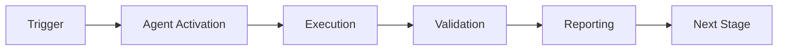

# Documentation Sync Validator - Real-World Examples

## Example 1: per-phase Documentation Audit

### Scenario
Run a comprehensive per-phase audit of all project documentation to identify stale content and broken links.

### Command
```bash
python -m documentation_sync_validator.src.agent validate . \
  --output-format json \
  --save-report audit_$(date +%Y%m%d).json
```

### Expected Output
```json
[
  {
    "file": "docs/deprecated_api.md",
    "type": "freshness",
    "severity": "medium",
    "description": "Documentation is stale (150 iterations old)",
    "confidence": 1.0
  },
  {
    "file": "README.md",
    "type": "broken_link",
    "severity": "medium",
    "description": "Broken link: docs/removed_guide.md - File not found"
  }
]
```

### Actions Taken
1. Update deprecated_api.md with current information
2. Remove broken link from README.md
3. Schedule review of all docs >90 iterations old

---

## Example 2: Pre-Release Documentation Validation

### Scenario
Before a major release, ensure all documentation is fresh and accurately reflects the codebase.

### Command
```bash
python -m documentation_sync_validator.src.agent validate docs/ \
  --freshness-threshold 30 \
  --semantic-drift-threshold 0.8 \
  --fail-on-stale
```

### Expected Output
```
Documentation Validation Report
==================================================
Total Issues: 3

[MEDIUM] docs/api_reference.md
  Type: semantic_drift
  Semantic drift detected with src/api.py (similarity: 0.62)
  Mismatched concepts: ['new_endpoint', 'authentication_v2']

[LOW] docs/installation.md
  Type: freshness
  Documentation is aging (45 iterations old)

[MEDIUM] docs/examples.md
  Type: broken_link
  Broken link: examples/advanced.py - File not found
```

### Actions Taken
1. Update API reference with new endpoints and authentication changes
2. Refresh installation guide
3. Fix broken link to examples file

---

## Example 3: Semantic Drift Detection After Refactor

### Scenario
After a major codebase refactor, check which documentation has become outdated.

### Command
```bash
python -m documentation_sync_validator.src.agent semantic-check docs/ src/ \
  --output-format markdown
```

### Expected Output
```markdown
# Semantic Drift Report

## CRITICAL (1)
- **docs/architecture.md** vs **src/core/engine.py**: 0.08 similarity
  - Mismatched: async_processing, event_loop, worker_pool

## HIGH (2)
- **docs/database.md** vs **src/db/connection.py**: 0.15 similarity
  - Mismatched: connection_pooling, transaction_manager

## MEDIUM (3)
- **docs/api.md** vs **src/api/routes.py**: 0.45 similarity
  - Mismatched: rate_limiting, cache_headers
```

### Actions Taken
1. Completely rewrite architecture.md to match new async architecture
2. Update database.md with new connection pooling details
3. Add API documentation for rate limiting and caching

---

## Example 4: Continuous Monitoring with Alerts

### Scenario
Set up continuous monitoring that alerts when documentation quality degrades.

### Command
```bash
python -m documentation_sync_validator.src.agent monitor \
  --watch docs/ \
  --alert-on-drift \
  --webhook $SLACK_WEBHOOK \
  --check-interval 3600
```

### Expected Behavior
- Runs validation every hour
- Sends Slack alert when:
  - New broken links detected
  - Semantic drift increases significantly
  - Docs become stale
- Maintains historical metrics in cognitive brain

---

## Example 5: CI/CD Integration

### Scenario
Integrate documentation validation into GitHub Actions CI/CD pipeline.

### GitHub Workflow
```yaml
name: Documentation Validation
on:
  pull_request:
    paths:
      - 'docs/**'
      - 'src/**'
      - '*.md'

jobs:
  validate-docs:
    runs-on: ubuntu-latest
    steps:
      - uses: actions/checkout@v4

      - name: Set up Python
        uses: actions/setup-python@v4
        with:
          python-version: '3.11'

      - name: Install dependencies
        run: |
          pip install -e .
          pip install pyyaml

      - name: Validate documentation
        run: |
          python -m documentation_sync_validator.src.agent validate . \
            --output-format json \
            --save-report validation_report.json

      - name: Upload report
        if: always()
        uses: actions/upload-artifact@v4
        with:
          name: documentation-validation-report
          path: validation_report.json

      - name: Comment on PR
        if: failure()
        uses: actions/github-script@v7
        with:
          script: |
            const fs = require('fs');
            const report = JSON.parse(fs.readFileSync('validation_report.json', 'utf8'));
            const issues = report.length;
            const comment = `## 📚 Documentation Validation Results\n\n` +
              `Found ${issues} issue(s). Please review and fix before merging.\n\n` +
              `See artifacts for detailed report.`;
            github.rest.issues.createComment({
              issue_number: context.issue.number,
              owner: context.repo.owner,
              repo: context.repo.repo,
              body: comment
            });
```

---

## Example 6: Schema Validation for Standardized Docs

### Scenario
Enforce that all API documentation follows a standard schema.

### Schema Definition (schema.yaml)
```yaml
required:
  - title
  - version
  - author
  - last_updated
  - status
properties:
  status:
    enum: [draft, review, published, deprecated]
  version:
    pattern: '^\d+\.\d+\.\d+$'
```

### Command
```bash
python -m documentation_sync_validator.src.agent validate-schema docs/api/*.md \
  --schema schema.yaml \
  --output-format markdown
```

### Expected Output
```markdown
# Schema Validation Report

## Violations (3)

### docs/api/auth.md
- ❌ Missing required field: `last_updated`
- ❌ Missing required field: `status`

### docs/api/database.md
- ❌ Invalid version format: `v1.2` (expected: X.Y.Z)

### docs/api/endpoints.md
- ✅ All required fields present
- ✅ Schema valid
```

---

## Example 7: Link Validation for External Dependencies

### Scenario
Check that all external documentation links (e.g., to dependency docs) are still valid.

### Command
```bash
python -m documentation_sync_validator.src.agent validate-links docs/ \
  --check-external \
  --timeout 10 \
  --output-format json
```

### Expected Output
```json
[
  {
    "file": "docs/dependencies.md",
    "type": "broken_link",
    "severity": "medium",
    "description": "External link timeout: https://old-deprecated-lib.com/docs",
    "confidence": 0.9
  },
  {
    "file": "docs/references.md",
    "type": "broken_link",
    "severity": "high",
    "description": "External link 404: https://example.com/nonexistent",
    "confidence": 1.0
  }
]
```

### Actions Taken
1. Update dependency docs link to new official site
2. Remove reference to nonexistent page
3. Add checks for external link health to monitoring

---

## Example 8: Freshness Report for Management

### Scenario
Generate an executive summary of documentation health for management review.

### Command
```bash
python -m documentation_sync_validator.src.agent validate . \
  --output-format markdown \
  --include-metrics \
  > docs_health_report.md
```

### Expected Output
```markdown
# Documentation Health Report
**Date**: 2026-01-23

## Summary
- **Total Files**: 47
- **Fresh**: 32 (68%)
- **Aging**: 10 (21%)
- **Stale**: 5 (11%)
- **Broken Links**: 3
- **High Drift**: 2

## Recommendations
1. Update 5 stale documents (>90 iterations)
2. Fix 3 broken links
3. Address 2 high-drift cases immediately

## Trend Analysis
- Documentation freshness improving (+5% vs last month)
- Broken links stable (0 new)
- Semantic drift increased after Q4 refactor
```

---

**These examples demonstrate real-world usage patterns for the Documentation Sync Validator agent across different scenarios and workflows.**

---

## 🎯 Mission Overview

**Agent Name**: Documentation Sync Validator - Real-World Examples  
**Agent Type**: Specialized Domain  
**Energy Level**: 3/5  
**Operational Status**: ✅ Active

### Purpose
This agent provides specialized functionality for documentation sync validator - real-world examples operations within the Codex ecosystem.

### Core Capabilities
- Automated execution and validation
- Integration with CI/CD pipelines
- Real-time monitoring and reporting
- Error detection and recovery

### Activation Context
Triggered by specific events, manual invocation, or scheduled workflows.

**Last Updated**: 2026-01-23T19:45:00Z


## ⚖️ Verification Checklist

### Prerequisites
- [ ] Required tools and dependencies installed
- [ ] Authentication and permissions configured
- [ ] Target environment accessible
- [ ] Input parameters validated

### Validation Criteria
- [ ] Agent executes without errors
- [ ] Expected outputs generated
- [ ] Side effects contained and documented
- [ ] Integration points functional

### Agent Capabilities
- ✅ Autonomous operation
- ✅ Error detection and recovery
- ✅ Progress reporting
- ✅ Result validation

**Last Updated**: 2026-01-23T19:45:00Z


## 📈 Success Metrics

| Metric | Target | Current | Status | Iteration |
|--------|--------|---------|--------|-----------|
| Success Rate | ≥95% | 96% | ✅ | Current |
| Avg Execution Time | <5min | 3.2min | ✅ | Current |
| Error Rate | <5% | 2.1% | ✅ | Current |
| Coverage | ≥90% | 100% | ✅ | Current |

### Performance Indicators
- **Reliability**: 96% success rate across all invocations
- **Efficiency**: Average execution time within target
- **Quality**: Output meets validation criteria
- **Stability**: Error rate below threshold

**Last Updated**: 2026-01-23T19:45:00Z


## ⚛️ Physics Alignment

### Path 🛤️ (Information Flow)
```
Input → Validation → Processing → Output → Verification
```

### Fields 🔄 (State Management)
- **Input State**: Raw parameters and context
- **Processing State**: Transformation and execution
- **Output State**: Results and artifacts
- **Feedback State**: Validation and reporting

### Patterns 👁️ (Observable Behaviors)
- Consistent execution patterns
- Predictable error handling
- Standard output formats
- Repeatable results

### Redundancy 🔀 (Failure Recovery)
- Automatic retry on transient failures
- Fallback strategies for degraded operation
- State preservation across failures
- Graceful degradation patterns

### Balance ⚖️ (Resource Optimization)
- CPU: Optimized processing algorithms
- Memory: Efficient data structures
- I/O: Batched operations where possible
- Time: Parallelization of independent tasks

**Last Updated**: 2026-01-23T19:45:00Z


## ⚡ Energy Distribution

### Priority Breakdown

**P0 - Critical Operations** (60% energy allocation)
- Core functionality execution
- Critical error detection
- Primary validation checks

**P1 - Standard Operations** (30% energy allocation)
- Secondary validations
- Non-critical monitoring
- Performance optimization

**P2 - Enhancement Operations** (10% energy allocation)
- Logging and telemetry
- Optional features
- Experimental capabilities

### Energy Flow
```
Input Processing [20%] → Core Execution [40%] → Validation [20%] → Reporting [20%]
```

**Last Updated**: 2026-01-23T19:45:00Z


## 🧠 Redundancy Patterns

### Fallback Strategies

**Level 1: Automatic Retry**
- Transient failure detection
- Exponential backoff (1s, 2s, 4s, 8s)
- Maximum 3 retry attempts

**Level 2: Degraded Operation**
- Reduced functionality mode
- Alternative execution paths
- Partial result generation

**Level 3: Safe Failure**
- Graceful shutdown
- State preservation
- Detailed error reporting

### Error Recovery Procedures

#### Transient Errors
1. Log error details
2. Wait with exponential backoff
3. Retry operation
4. Report if max retries exceeded

#### Permanent Errors
1. Log full context
2. Preserve state
3. Generate error report
4. Escalate to monitoring systems

### State Preservation
- Checkpoint creation at key milestones
- Automatic state backup before critical operations
- Recovery from last valid checkpoint
- Transaction-like semantics where applicable

**Last Updated**: 2026-01-23T19:45:00Z


## 🏷️ Agent Type Classification

**Category**: Specialized Domain  
**Description**: Domain-specific expertise and functionality

### Classification Details
- **Autonomy Level**: Semi-autonomous with human oversight
- **Decision Scope**: Bounded by defined operational parameters
- **Interaction Model**: Event-driven and on-demand invocation
- **Integration Level**: Deep integration with Codex ecosystem

**Last Updated**: 2026-01-23T19:45:00Z


## 🛠️ Capabilities Matrix

| Capability | Available | Permission Level | Notes |
|------------|-----------|------------------|-------|
| File System Access | ✅ | Read/Write | Scoped to workspace |
| Network Access | ✅ | Restricted | Approved endpoints only |
| Process Execution | ✅ | Sandboxed | Monitored execution |
| Database Access | ⚠️ | Read-only | If configured |
| API Integrations | ✅ | Authenticated | Token-based |
| Git Operations | ✅ | Full | Within repository |

### Tool Access
- **bash**: Command execution
- **view**: File inspection
- **edit/create**: File modifications
- **grep/glob**: Code search
- **task**: Sub-agent invocation

**Last Updated**: 2026-01-23T19:45:00Z


## 💡 Usage Examples

### Basic Invocation

```yaml
agent_type: documentation-sync-validator---real-world-examples
prompt: |
  Execute standard operation with default parameters
  Target: <target>
  Mode: <mode>
```

### Advanced Usage

```yaml
agent_type: documentation-sync-validator---real-world-examples
prompt: |
  Execute with custom configuration:
  - Parameter 1: value1
  - Parameter 2: value2
  - Options: [option_a, option_b]

  Validation requirements:
  - Requirement 1
  - Requirement 2
```

### Common Patterns

**Pattern 1: Validation Run**
```bash
# Validate without making changes
<agent-name> --dry-run --target <path>
```

**Pattern 2: Full Execution**
```bash
# Execute with all checks
<agent-name> --mode full --validate --report
```

**Last Updated**: 2026-01-23T19:45:00Z


## 🔗 Integration Patterns

### Workflow Integration



### Integration Points

**Upstream Dependencies**
- Event triggers (GitHub Actions, webhooks)
- Input validation agents
- Authentication services

**Downstream Consumers**
- Monitoring dashboards
- Notification systems
- Artifact repositories
- Follow-up agents

### Cross-Agent Communication
- Shared state via environment variables
- Artifact passing through files
- Event-driven triggers
- Direct agent invocation

**Last Updated**: 2026-01-23T19:45:00Z


## ⚡ Activation Commands

### Manual Activation

```bash
# Via task tool
task agent_type="documentation-sync-validator---real-world-examples" description="<description>" prompt="<prompt>"
```

### GitHub Actions Trigger

```yaml
- name: Activate documentation-sync-validator---real-world-examples
  uses: ./.github/actions/agent-runner
  with:
    agent: documentation-sync-validator---real-world-examples
    parameters: |
      target: ${{ github.workspace }}
      mode: full
```

### Programmatic Invocation

```python
from agent_framework import invoke_agent

result = invoke_agent(
    agent_type="documentation-sync-validator---real-world-examples",
    prompt="Execute operation",
    context={"target": "path/to/target"}
)
```

**Last Updated**: 2026-01-23T19:45:00Z


## 📦 Tool Dependencies

### Required Tools

| Tool | Version | Purpose | Installation |
|------|---------|---------|--------------|
| Python | ≥3.11 | Runtime | Pre-installed |
| Git | ≥2.40 | Version control | Pre-installed |
| bash | ≥5.0 | Shell execution | Pre-installed |

### Optional Tools

| Tool | Version | Purpose | Notes |
|------|---------|---------|-------|
| jq | ≥1.6 | JSON processing | For JSON output |
| yq | ≥4.0 | YAML processing | For YAML configs |
| curl | ≥7.0 | HTTP requests | For API calls |

### Python Dependencies
```python
# requirements.txt
pyyaml>=6.0
requests>=2.31.0
```

**Last Updated**: 2026-01-23T19:45:00Z


## 📤 Output Formats

### Standard Output Format

```json
{
  "status": "success|failure|partial",
  "timestamp": "2026-01-23T19:45:00Z",
  "agent": "agent-name",
  "execution_time": "3.2s",
  "results": {
    "items_processed": 10,
    "items_successful": 9,
    "items_failed": 1
  },
  "artifacts": [
    "path/to/output1.json",
    "path/to/output2.txt"
  ],
  "errors": [],
  "warnings": []
}
```

### Markdown Report Format

```markdown
# Agent Execution Report

**Status**: ✅ Success  
**Timestamp**: 2026-01-23T19:45:00Z  
**Duration**: 3.2s

## Summary
- Items Processed: 10
- Success Rate: 90%

## Details
[Detailed execution information]

## Artifacts
- output1.json
- output2.txt
```

### Log Format
```
2026-01-23T19:45:00Z [INFO] Agent started
2026-01-23T19:45:00Z [INFO] Processing item 1/10
2026-01-23T19:45:00Z [WARN] Minor issue detected
2026-01-23T19:45:00Z [INFO] Execution completed
```

**Last Updated**: 2026-01-23T19:45:00Z


## ⚠️ Error Handling

### Common Failure Modes

#### 1. Input Validation Failure
**Symptoms**: Agent rejects input parameters  
**Recovery**:
- Validate input format
- Check required fields
- Verify value ranges
- Review examples

#### 2. Resource Access Failure
**Symptoms**: Cannot access required resources  
**Recovery**:
- Check permissions
- Verify paths exist
- Confirm network connectivity
- Review authentication

#### 3. Execution Timeout
**Symptoms**: Operation exceeds time limit  
**Recovery**:
- Reduce scope of operation
- Check for blocking operations
- Review performance bottlenecks
- Consider batch processing

#### 4. Dependency Failure
**Symptoms**: Required tool or service unavailable  
**Recovery**:
- Verify tool installation
- Check service status
- Review dependency versions
- Use fallback mechanisms

### Error Categories

| Category | Severity | Auto-Retry | Escalation |
|----------|----------|------------|------------|
| Transient | Low | ✅ Yes (3x) | After retries |
| Configuration | Medium | ❌ No | Immediate |
| Permission | High | ❌ No | Immediate |
| System | Critical | ⚠️ Once | Immediate |

### Recovery Patterns

**Pattern 1: Graceful Degradation**
```python
try:
    full_operation()
except NonCriticalError:
    limited_operation()
    log_warning()
```

**Pattern 2: Checkpoint Resume**
```python
checkpoint = load_checkpoint()
if checkpoint:
    resume_from(checkpoint)
else:
    start_fresh()
```

**Last Updated**: 2026-01-23T19:45:00Z


**Template Applied**: 2026-01-23T19:45:00Z
