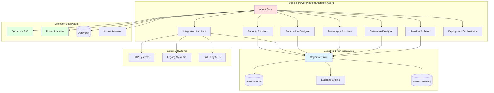
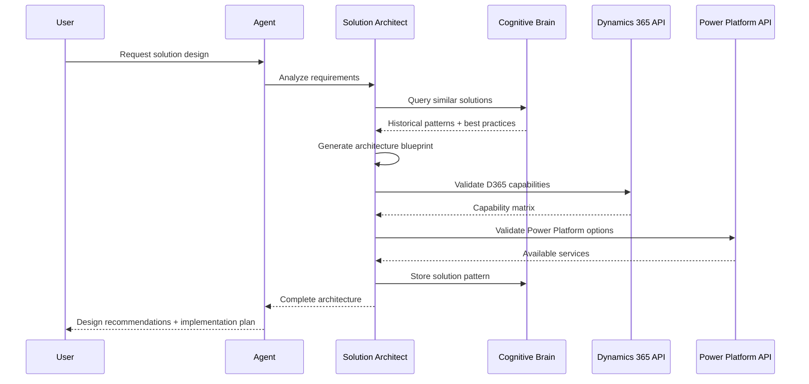
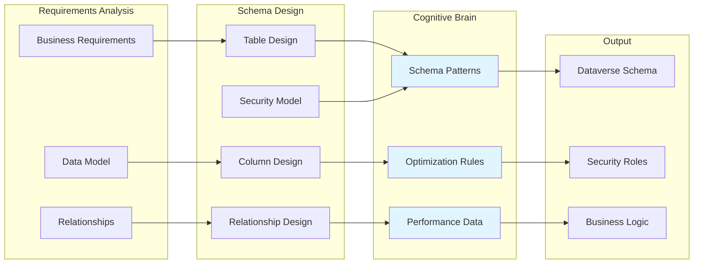
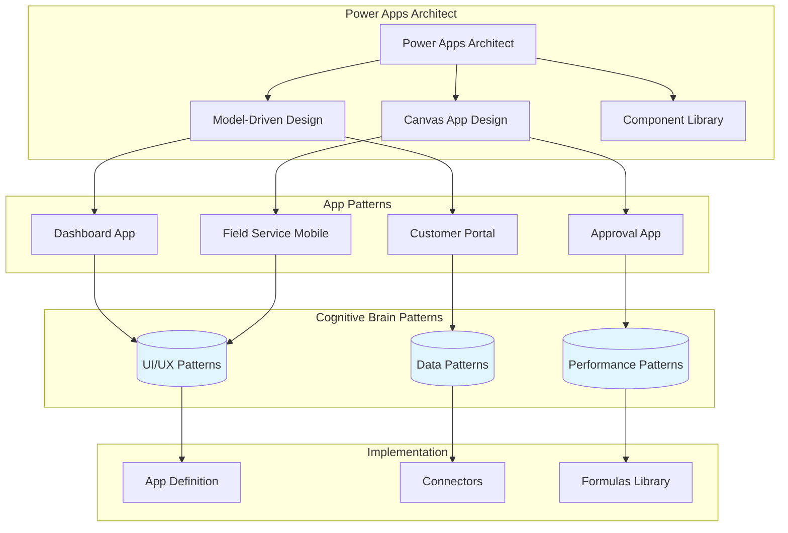
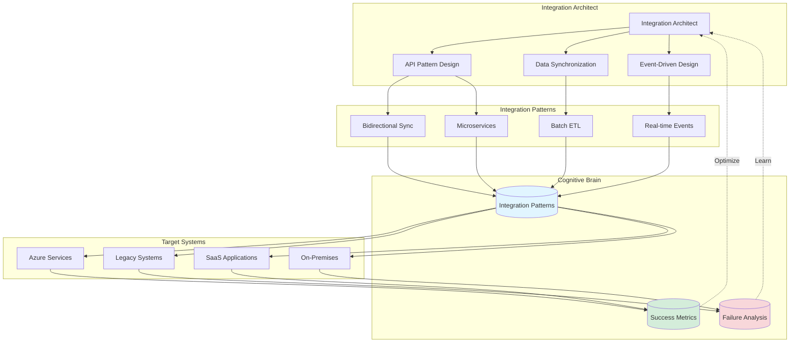
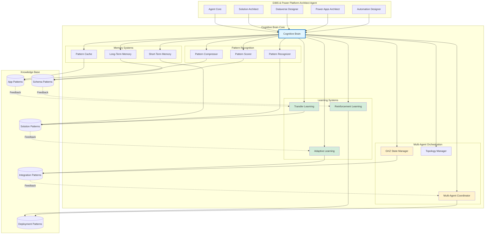
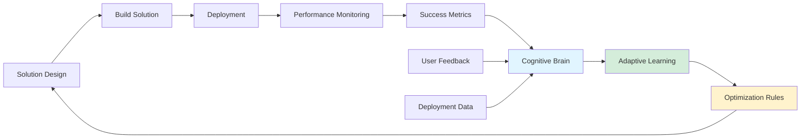

# Dynamics 365 & Power Platform Architect Agent - Development Planset

**Version**: 1.0.0  
**Status**: Planning  
**Target GitHub Tier**: GitHub Team + GitHub Copilot Pro+  
**Estimated Complexity**: High  
**Development Timeline**: 4-6 sprints  
**Agent Type**: Solution Architecture & Design Specialist

---

## Executive Summary

The Dynamics 365 & Power Platform Architect Agent is a comprehensive autonomous agent designed to **architect, design, and optimize Microsoft Dynamics 365 and Power Platform solutions** within the _codex_ repository. This agent operates as a domain expert and solution architect for the Microsoft business applications ecosystem, providing intelligent design recommendations, architectural patterns, integration strategies, and best-practice implementations.

**Primary Role**: Solution Architect & Design Specialist for Microsoft Business Applications
**Domain Expertise**: Dynamics 365 (Sales, Service, Field Service, Marketing) + Power Platform (Power Apps, Power Automate, Power BI, Power Pages)

**Key Objectives**:
1. Design enterprise-grade Dynamics 365 and Power Platform solution architectures
2. Architect custom table schemas, relationships, and business logic
3. Design low-code/no-code application architectures using Power Apps
4. Create automation and workflow designs using Power Automate
5. Architect data integration patterns across Microsoft ecosystem
6. Design security models, role hierarchies, and access controls
7. Optimize performance and scalability for enterprise deployments
8. Create solution packaging and ALM (Application Lifecycle Management) strategies

---

## Phase 1: Foundation & Architecture (Sprint 1)

### 1.1 Agent Structure Setup
**Tasks**:
- [ ] Create agent directory structure following `.github/agents/.template`
- [ ] Initialize `README.md` with overview and capabilities
- [ ] Create `config.yaml` with agent configuration
- [ ] Set up `agent.py` with base class structure
- [ ] Create `CHANGELOG.md` for version tracking

**Deliverables**:
```
.github/agents/dynamics365-powerplatform-architect-agent/
├── README.md
├── CHANGELOG.md
├── config.yaml
├── agent.py
├── prompts/
│   ├── system_prompt.md
│   └── examples.md
├── src/
│   ├── __init__.py
│   ├── solution_architect.py        # Core solution design engine
│   ├── dataverse_designer.py        # Dataverse schema design
│   ├── power_apps_architect.py      # Power Apps architecture
│   ├── automation_designer.py       # Power Automate workflow design
│   ├── integration_architect.py     # Integration pattern design
│   ├── security_architect.py        # Security model design
│   ├── solution_manager.py          # Solution packaging
│   └── deployment_orchestrator.py   # Deployment management
├── tests/
│   ├── test_solution_manager.py
│   ├── test_environment_manager.py
│   └── test_deployment_orchestrator.py
└── docs/
    ├── architecture.md
    ├── power_platform_integration.md
    ├── deployment_guide.md
    └── troubleshooting.md
```

### 1.2 Configuration Schema
**Configuration Keys**:
```yaml
name: dynamics365-powerplatform-architect-agent
version: 1.0.0
tier: 2
description: Autonomous Dynamics 365 and Power Platform management
required_license: github-team

capabilities:
  # Solution Design & Architecture
  - solution_architecture_design
  - dataverse_schema_design
  - power_apps_architecture
  - power_automate_workflow_design
  - power_bi_integration_design
  - integration_pattern_design
  
  # Domain Expertise
  - dynamics365_best_practices
  - dataverse_optimization
  - security_model_design
  - business_logic_architecture
  - form_and_view_design
  - plugin_architecture
  
  # Technical Implementation
  - solution_packaging
  - environment_provisioning
  - deployment_automation
  - alm_strategy_design
  - api_integration_patterns
  
  # Operations & Maintenance  
  - configuration_validation
  - audit_tracking
  - performance_optimization
  - health_monitoring

platforms:
  dynamics365:
    - sales
    - customer_service
    - field_service
    - marketing
  power_platform:
    - power_apps
    - power_automate
    - power_bi
    - power_pages

deployment_modes:
  - offline_first  # Config-as-code, dry-run
  - managed_solution
  - unmanaged_solution
  - incremental_update

environment_variables:
  required:
    - D365_URL
    - D365_TENANT_ID
    - D365_CLIENT_ID
    - D365_CLIENT_SECRET
  optional:
    - POWERPLATFORM_API_KEY
    - DEPLOYMENT_MODE
    - DRY_RUN

thresholds:
  max_deployment_time_minutes: 30
  max_solution_size_mb: 100
  min_test_coverage: 85
  max_api_failures: 3
```

### 1.3 Integration Points
**Systems to Integrate**:
- Existing `src/codex/dynamics/` modules
- Existing `src/codex_crm/` infrastructure
- GitHub Actions workflows for CI/CD
- Solution XML generators
- Evidence tracking: `.codex/evidence/`
- Config directories: `configs/deployment/d365/`

---

## Phase 2: Solution Architecture Design (Sprint 1-2)

### 2.1 Solution Architecture Designer
**Objective**: Design comprehensive D365 and Power Platform solutions based on business requirements

**Tasks**:
- [ ] Create `SolutionArchitect` class with requirements analysis
- [ ] Implement architecture pattern library for D365 + Power Platform
- [ ] Add solution blueprint generation
- [ ] Create component dependency mapping
- [ ] Design configuration recommendations engine

**Architecture Patterns**:
```python
# In src/solution_architect.py
class SolutionArchitect:
    """Architects D365 and Power Platform solutions based on requirements."""
    
    def analyze_requirements(
        self,
        business_needs: dict,
        technical_constraints: dict,
        existing_systems: Optional[dict] = None
    ) -> RequirementsAnalysis:
        """Analyze business and technical requirements."""
        
    def design_solution(
        self,
        requirements: RequirementsAnalysis,
        platform: str  # 'dynamics365', 'power_platform', 'hybrid'
    ) -> SolutionBlueprint:
        """Generate comprehensive solution architecture."""
        
    def recommend_architecture(
        self,
        blueprint: SolutionBlueprint
    ) -> ArchitectureRecommendation:
        """Provide architectural pattern recommendations."""
        
    def validate_design(
        self,
        blueprint: SolutionBlueprint
    ) -> ValidationReport:
        """Validate design against Microsoft best practices."""
```

**Solution Architecture Patterns**:
- **Enterprise CRM**: Full Dynamics 365 Sales + Service implementation
- **Customer Service Portal**: Power Pages + Dataverse backend
- **Field Service Mobile**: Dynamics Field Service + Power Apps mobile
- **Marketing Automation**: Dynamics Marketing + Power Automate
- **Low-Code Apps**: Canvas/Model-driven apps with Dataverse
- **Business Intelligence**: Power BI embedded in D365

### 2.2 Dataverse Schema Designer
**Tasks**:
- [ ] Create `DataverseDesigner` for table and schema design
- [ ] Implement relationship modeling (1:N, N:1, N:N)
- [ ] Add column type recommendations
- [ ] Design choice/lookup optimization
- [ ] Create data model validation

**Dataverse Design Features**:
```python
class DataverseDesigner:
    """Designs optimal Dataverse data models."""
    
    def design_table_schema(
        self,
        entity_requirements: dict,
        relationships: list[Relationship],
        performance_goals: dict
    ) -> TableSchema:
        """Design table schema with optimal structure."""
        
    def recommend_column_types(
        self,
        data_type: str,
        validation_rules: dict,
        ui_requirements: dict
    ) -> ColumnRecommendation:
        """Recommend optimal column types and properties."""
        
    def design_relationships(
        self,
        entities: list[str],
        cardinality: dict,
        cascade_behavior: dict
    ) -> RelationshipDesign:
        """Design entity relationships with proper cascading."""
        
    def optimize_for_performance(
        self,
        schema: TableSchema,
        query_patterns: list[str]
    ) -> OptimizationPlan:
        """Optimize schema for performance."""
```

**Schema Design Patterns**:
- Standard table hierarchy (Account > Contact > Opportunity)
- Activity tracking patterns
- Audit trail tables
- Configuration tables
- Junction tables for N:N relationships
- Hierarchical data structures
- Polymorphic associations

### 2.3 Power Apps Architecture
**Tasks**:
- [ ] Create `PowerAppsArchitect` for app design
- [ ] Design canvas app patterns
- [ ] Design model-driven app patterns
- [ ] Create component library recommendations
- [ ] Add offline capability design

**Power Apps Patterns**:
```yaml
app_architectures:
  field_service_mobile:
    type: canvas_app
    patterns:
      - offline_first_data
      - photo_capture
      - gps_integration
      - signature_capture
    data_sources:
      - dataverse_tables
      - sharepoint_lists
      - local_collections
    
  customer_portal:
    type: model_driven_app
    patterns:
      - authenticated_access
      - customer_self_service
      - case_management
      - knowledge_base_integration
    components:
      - custom_forms
      - custom_views
      - business_process_flows
      - dashboards
    
  approval_app:
    type: canvas_app
    patterns:
      - mobile_responsive
      - push_notifications
      - power_automate_integration
    features:
      - approval_flows
      - delegation_support
      - audit_history
```

---

## Phase 3: Environment Management (Sprint 2-3)

### 3.1 Environment Provisioning
**Objective**: Automate Power Platform environment setup and configuration

**Tasks**:
- [ ] Create `EnvironmentManager` class
- [ ] Implement environment creation via Power Platform API
- [ ] Add environment configuration management
- [ ] Support environment templates
- [ ] Implement environment cloning

**Environment Types**:
- Development
- Test
- UAT (User Acceptance Testing)
- Production
- Sandbox

**Features**:
```python
class EnvironmentManager:
    """Manages Power Platform environments."""
    
    def create_environment(
        self,
        name: str,
        type: EnvironmentType,
        region: str,
        config: EnvironmentConfig
    ) -> Environment:
        """Create new environment with configuration."""
        
    def configure_environment(
        self,
        env_id: str,
        settings: dict
    ) -> None:
        """Apply settings to existing environment."""
        
    def clone_environment(
        self,
        source_env_id: str,
        target_name: str
    ) -> Environment:
        """Clone environment with all configurations."""
```

### 3.2 Dataverse Operations
**Tasks**:
- [ ] Create `DataverseClient` wrapper for API operations
- [ ] Implement CRUD operations for entities
- [ ] Add bulk data operations
- [ ] Support FetchXML query generation
- [ ] Implement data migration utilities

**Dataverse Features**:
- Entity CRUD operations
- Relationship management
- Bulk import/export
- Query optimization
- Change tracking
- Audit history

### 3.3 Connection Management
**Tasks**:
- [ ] Create `ConnectionManager` for API authentication
- [ ] Implement OAuth 2.0 flow for service principals
- [ ] Add connection pooling and retry logic
- [ ] Support multi-environment connections
- [ ] Implement connection health monitoring

---

## Phase 4: Deployment Orchestration (Sprint 3-4)

### 4.1 Deployment Pipeline
**Objective**: Automate solution deployment with safety checks

**Tasks**:
- [ ] Create `DeploymentOrchestrator` class
- [ ] Implement pre-deployment validation
- [ ] Add deployment state management
- [ ] Support rollback mechanisms
- [ ] Create deployment reporting

**Deployment Workflow**:
```yaml
deployment_steps:
  1_pre_checks:
    - validate_solution
    - check_dependencies
    - verify_environment
    - backup_current_state
  
  2_deployment:
    - upload_solution
    - import_solution
    - publish_customizations
    - activate_components
  
  3_post_checks:
    - verify_deployment
    - run_smoke_tests
    - generate_report
    - notify_stakeholders
  
  4_rollback_if_needed:
    - restore_backup
    - notify_failure
```

### 4.2 Offline-First Deployment
**Tasks**:
- [ ] Implement dry-run mode for all operations
- [ ] Create snapshot and diff utilities
- [ ] Add config-as-code support
- [ ] Generate deployment plans (JSON/YAML)
- [ ] Support apply operations with evidence trails

**Offline Commands**:
```bash
# Snapshot current configuration
d365-architect snapshot --output artifacts/d365_snapshot.json

# Generate deployment plan
d365-architect plan --from snapshot.json --to target.json --output plan.json

# Dry-run apply
d365-architect apply plan.json --dry-run --evidence-dir .codex/evidence/

# Actual apply
d365-architect apply plan.json --confirm
```

### 4.3 SLA & Routing Management
**Tasks**:
- [ ] Create `SLAManager` for SLA configuration
- [ ] Implement `RoutingManager` for queue/routing rules
- [ ] Add CSV import/export for SLA data
- [ ] Support SLA calculation logic
- [ ] Create audit trail for SLA operations

**SLA Features**:
- SLA definition and configuration
- KPI tracking
- Escalation rules
- Business hours configuration
- Holiday calendars
- SLA performance reporting

---

## Phase 5: Configuration Management (Sprint 4)

### 5.1 Configuration as Code
**Objective**: Manage all D365 configurations as version-controlled code

**Tasks**:
- [ ] Create configuration schema for all components
- [ ] Implement serialization to YAML/JSON
- [ ] Add validation for configuration files
- [ ] Support configuration inheritance
- [ ] Create configuration diff tools

**Configuration Structure**:
```
configs/deployment/d365/
├── solution_manifest.json
├── entities/
│   ├── account.yaml
│   ├── contact.yaml
│   └── opportunity.yaml
├── security/
│   ├── roles.yaml
│   └── field_security.yaml
├── sla/
│   ├── case_sla.csv
│   └── email_sla.csv
├── routing/
│   ├── queues.yaml
│   └── routing_rules.yaml
└── customizations/
    ├── forms.yaml
    ├── views.yaml
    └── business_rules.yaml
```

### 5.2 Configuration Validation
**Tasks**:
- [ ] Create `ConfigValidator` class
- [ ] Implement schema validation
- [ ] Add semantic validation (business rules)
- [ ] Check for configuration conflicts
- [ ] Validate against environment constraints

**Validation Types**:
- Schema validation (structure)
- Type validation (data types)
- Relationship validation (foreign keys)
- Security validation (permissions)
- Business rule validation (logic)

### 5.3 Configuration Migration
**Tasks**:
- [ ] Create migration utilities for legacy configs
- [ ] Support CSV to YAML conversion
- [ ] Add configuration versioning
- [ ] Implement backward compatibility checks
- [ ] Create migration documentation

---

## Phase 6: API Integration & Automation (Sprint 4-5)

### 6.1 Power Platform API Client
**Tasks**:
- [ ] Create comprehensive API client for Power Platform APIs
- [ ] Implement all CRUD operations
- [ ] Add batch operation support
- [ ] Support async operations with polling
- [ ] Implement rate limiting and retry logic

**Supported APIs**:
- Dataverse Web API
- Power Apps Management API
- Power Automate Management API
- Power BI REST API
- Common Data Service (CDS) API
- Organization Service API

### 6.2 Power Automate Integration
**Tasks**:
- [ ] Create flow definition management
- [ ] Implement flow import/export
- [ ] Add trigger and action configuration
- [ ] Support connection reference management
- [ ] Enable flow monitoring and analytics

**Flow Management**:
```python
class FlowManager:
    """Manages Power Automate flows."""
    
    def create_flow(self, definition: FlowDefinition) -> Flow:
        """Create new flow from definition."""
        
    def export_flow(self, flow_id: str, format: str = "json") -> str:
        """Export flow definition."""
        
    def import_flow(self, definition: str) -> Flow:
        """Import flow from definition."""
        
    def monitor_flow_runs(self, flow_id: str, hours: int = 24) -> list[FlowRun]:
        """Get flow run history."""
```

### 6.3 Power Apps Management
**Tasks**:
- [ ] Create app definition management
- [ ] Implement canvas app import/export
- [ ] Add model-driven app configuration
- [ ] Support app sharing and permissions
- [ ] Enable app analytics and usage tracking

---

## Phase 7: Testing & Quality Assurance (Sprint 5)

### 7.1 Comprehensive Test Suite
**Tasks**:
- [ ] Unit tests for all components (target: >90% coverage)
- [ ] Integration tests with mock D365 API
- [ ] End-to-end deployment tests
- [ ] Performance tests for large solutions
- [ ] Security and compliance tests

**Test Scenarios**:
- Solution building and packaging
- Environment provisioning
- Deployment workflows (success and failure)
- Rollback procedures
- Configuration validation
- API error handling
- Concurrent operations
- Large solution handling

### 7.2 Security & Compliance
**Tasks**:
- [ ] Security audit of all API calls
- [ ] Secret management review
- [ ] Access control verification
- [ ] Audit logging implementation
- [ ] GDPR compliance checks
- [ ] Data residency validation

**Security Considerations**:
- Service principal authentication
- Secret rotation
- Least privilege access
- Encrypted storage
- Audit trails
- Role-based access control (RBAC)

### 7.3 Documentation
**Tasks**:
- [ ] Complete API reference documentation
- [ ] Write deployment guide with examples
- [ ] Create troubleshooting guide
- [ ] Document all configuration options
- [ ] Create architecture diagrams
- [ ] Write integration guides

---

## Phase 8: Advanced Features (Sprint 5-6)

### 8.1 Solution Lifecycle Management
**Tasks**:
- [ ] Implement solution versioning strategy
- [ ] Add solution upgrade path automation
- [ ] Create solution dependency management
- [ ] Support solution patches
- [ ] Implement solution analytics

### 8.2 Intelligent Deployment
**Tasks**:
- [ ] Add AI-powered deployment recommendations
- [ ] Implement predictive deployment failure detection
- [ ] Create automatic conflict resolution
- [ ] Add deployment optimization suggestions
- [ ] Generate deployment insights

### 8.3 Multi-Tenant Support
**Tasks**:
- [ ] Support multiple D365 organizations
- [ ] Add tenant isolation
- [ ] Implement cross-tenant deployment
- [ ] Create tenant-specific configurations
- [ ] Support tenant migration

---

## Phase 9: Monitoring & Operations (Sprint 6)

### 9.1 Health Monitoring
**Tasks**:
- [ ] Create `HealthMonitor` class
- [ ] Track deployment success rates
- [ ] Monitor API performance
- [ ] Detect configuration drift
- [ ] Generate health dashboards

**Metrics to Track**:
- Deployment success rate
- Average deployment time
- API call success rate
- Solution size trends
- Environment health status
- User adoption metrics

### 9.2 Alerting & Notifications
**Tasks**:
- [ ] Implement email notifications for critical events
- [ ] Create Teams webhook integration
- [ ] Add Slack integration
- [ ] Generate incident reports
- [ ] Create escalation workflows

### 9.3 Audit & Compliance
**Tasks**:
- [ ] Implement comprehensive audit logging
- [ ] Create audit trail visualization
- [ ] Add compliance reporting
- [ ] Support regulatory requirements (SOX, HIPAA, etc.)
- [ ] Generate compliance certificates

---

## Integration with Existing Components

### Current D365 Infrastructure
**Files to Integrate/Modify**:
1. `src/codex/dynamics/` - Core D365 modules
2. `src/codex_crm/` - CRM infrastructure
3. `configs/deployment/d365/` - Configuration files
4. `.codex/evidence/` - Evidence trails
5. `scripts/migrate_d365_sla_csv.py` - Migration scripts

### Agent Ecosystem Integration
**Connect with**:
1. `config-validator` - For configuration validation
2. `security-scan-agent` - For security audits
3. `dependency-vulnerability-scanner` - For package scanning
4. `deployment-gatekeeper` - For deployment approvals
5. `compliance-checker-agent` - For compliance validation

---

## Workflow Integration

### 9.1 GitHub Actions Workflow
**Create**: `.github/workflows/d365-powerplatform-deployment.yml`

```yaml
name: D365 & Power Platform Deployment

on:
  workflow_dispatch:
    inputs:
      environment:
        type: choice
        options:
          - dev
          - test
          - uat
          - prod
      deployment_mode:
        type: choice
        options:
          - dry_run
          - managed_solution
          - unmanaged_solution
      auto_rollback:
        type: boolean
        description: 'Auto-rollback on failure'

jobs:
  deploy:
    runs-on: ubuntu-latest
    steps:
      - uses: actions/checkout@v4
      
      - name: Setup Python
        uses: actions/setup-python@v5
        with:
          python-version: '3.11'
      
      - name: Install dependencies
        run: pip install -e .
      
      - name: Validate configuration
        run: |
          python -m d365_architect validate \
            --config configs/deployment/d365/
      
      - name: Build solution
        run: |
          python -m d365_architect build \
            --name CodexCRM \
            --version ${{ github.run_number }} \
            --output artifacts/
      
      - name: Deploy to environment
        env:
          D365_URL: ${{ secrets.D365_URL }}
          D365_TENANT_ID: ${{ secrets.D365_TENANT_ID }}
          D365_CLIENT_ID: ${{ secrets.D365_CLIENT_ID }}
          D365_CLIENT_SECRET: ${{ secrets.D365_CLIENT_SECRET }}
        run: |
          python -m d365_architect deploy \
            --solution artifacts/CodexCRM.zip \
            --environment ${{ inputs.environment }} \
            --mode ${{ inputs.deployment_mode }}
      
      - name: Generate deployment report
        if: always()
        run: |
          python -m d365_architect report \
            --output-format markdown \
            --output artifacts/deployment_report.md
      
      - name: Upload artifacts
        uses: actions/upload-artifact@v4
        with:
          name: deployment-artifacts
          path: artifacts/
```

### 9.2 CLI Interface
**Commands**:
```bash
# Environment management
d365-architect env list
d365-architect env create --name dev-env --type development
d365-architect env check --env dev-env

# Solution management
d365-architect solution build --config solution.yaml
d365-architect solution validate --solution CodexCRM.zip
d365-architect solution package --name CodexCRM --version 1.0.0

# Deployment
d365-architect deploy --solution CodexCRM.zip --env dev --dry-run
d365-architect deploy --solution CodexCRM.zip --env prod --confirm

# Configuration
d365-architect config validate --path configs/deployment/d365/
d365-architect config export --env prod --output backup/
d365-architect config import --input backup/ --env dev

# Monitoring
d365-architect health-check --env prod
d365-architect audit-trail --since 2026-01-01
d365-architect report --type deployment --format pdf
```

---

## Success Criteria

### Technical Metrics
- [ ] Deployment success rate >98%
- [ ] Average deployment time <15 minutes
- [ ] Test coverage >90%
- [ ] Zero security vulnerabilities
- [ ] API call success rate >99%

### Operational Metrics
- [ ] Zero manual interventions for standard deployments
- [ ] Mean time to deployment (MTTD) <30 minutes
- [ ] Mean time to recovery (MTTR) <15 minutes
- [ ] Configuration drift detection <24 hours
- [ ] Documentation completeness >95%

### User Experience
- [ ] CLI is intuitive and well-documented
- [ ] Error messages are actionable
- [ ] Deployment reports are clear and comprehensive
- [ ] Integration is seamless with existing workflows
- [ ] Support for both GUI and CLI users

---

## Risk Assessment & Mitigation

### Risk 1: API Breaking Changes
**Likelihood**: Medium  
**Impact**: High  
**Mitigation**:
- Version all API calls
- Implement API contract tests
- Monitor Microsoft release notes
- Maintain backward compatibility layer

### Risk 2: Deployment Failures
**Likelihood**: Medium  
**Impact**: High  
**Mitigation**:
- Comprehensive pre-deployment validation
- Automatic rollback on failure
- Backup before deployment
- Incremental deployment strategy

### Risk 3: Configuration Drift
**Likelihood**: High  
**Impact**: Medium  
**Mitigation**:
- Regular drift detection
- Automated reconciliation
- Configuration as code enforcement
- Audit trail review

### Risk 4: Security Vulnerabilities
**Likelihood**: Medium  
**Impact**: Critical  
**Mitigation**:
- Regular security audits
- Secret rotation automation
- Least privilege access
- Encrypted credential storage

### Risk 5: Dataverse Performance
**Likelihood**: Low  
**Impact**: Medium  
**Mitigation**:
- Connection pooling
- Batch operations
- Query optimization
- Rate limit management

---

## Resource Requirements

### Development
- **Time**: 4-6 sprints (8-12 weeks)
- **Team**: 2-3 developers
- **Skills Required**: 
  - Python
  - Dynamics 365 architecture
  - Power Platform
  - REST APIs
  - OAuth 2.0
  - CI/CD

### Infrastructure
- **GitHub**: Team plan with Copilot Pro+
- **D365**: Sandbox and production environments
- **Power Platform**: Development environments
- **Storage**: Solution artifact storage

### Maintenance
- **Weekly effort**: 4-6 hours
- **Monthly review**: 2 hours
- **Quarterly audits**: 8 hours

---

## Future Enhancements (Post-V1)

### Version 2.0
- [ ] Power BI integration and report management
- [ ] Power Pages (Power Apps Portals) management
- [ ] AI Builder model deployment
- [ ] Custom connector management
- [ ] Advanced analytics and insights

### Version 3.0
- [ ] Multi-cloud deployment (Azure, AWS integrations)
- [ ] Cross-platform data synchronization
- [ ] Predictive maintenance and optimization
- [ ] Automated testing framework
- [ ] Self-healing deployments

### Version 4.0
- [ ] AI-powered solution design recommendations
- [ ] Automated code generation for plugins
- [ ] Natural language configuration interface
- [ ] Autonomous environment management
- [ ] Cross-organizational solution marketplace

---

## Appendix

### A. Related Documentation
- [D365 Admin Runbook](../../docs/crm/admin-runbooks/d365.md)
- [Dynamics System Documentation](../../docs/dynamical-system.md)
- [CRM Configuration Guide](../../docs/crm/)

### B. Related Agents
- `config-validator.agent.md`
- `deployment-gatekeeper`
- `security-scan-agent`
- `compliance-checker-agent`

### C. Microsoft Resources
- [Dynamics 365 Developer Documentation](https://docs.microsoft.com/dynamics365/)
- [Power Platform Admin Center](https://admin.powerplatform.microsoft.com/)
- [Dataverse Web API Reference](https://docs.microsoft.com/powerapps/developer/data-platform/webapi/reference)

### D. Contact & Support
- **Primary Maintainer**: TBD
- **Backup Maintainer**: TBD
- **Escalation**: Create issue in `Aries-Serpent/_codex_`

---

**Document Version**: 1.0.0  
**Last Updated**: 2026-01-16  
**Next Review**: 2026-02-16  
**Status**: Ready for Implementation

---

## Architecture Diagrams (Mermaid)

### Overall Agent Architecture



### Solution Architecture Workflow



### Dataverse Schema Design



### Power Apps Architecture



### Integration Architecture Patterns



### Deployment Pipeline

```mermaid
graph LR
    subgraph "Build Phase"
        Config[Configuration]
        Solution[Solution Builder]
        Validate[Validation]
    end
    
    subgraph "Cognitive Brain"
        DeployPatterns[Deployment Patterns]
        RollbackStrategies[Rollback Strategies]
        OptimizationRules[Optimization Rules]
    end
    
    subgraph "Deploy Phase"
        Dev[DEV Environment]
        Test[TEST Environment]
        UAT[UAT Environment]
        Prod[PROD Environment]
    end
    
    subgraph "Monitoring"
        HealthCheck[Health Checks]
        Metrics[Metrics Collection]
        Alerts[Alerting]
    end
    
    Config --> Solution
    Solution --> Validate
    
    Validate --> DeployPatterns
    DeployPatterns --> Dev
    Dev --> Test
    Test --> UAT
    UAT --> Prod
    
    Prod --> HealthCheck
    HealthCheck --> Metrics
    Metrics --> Alerts
    
    Alerts -.->|Trigger| RollbackStrategies
    Metrics -.->|Feed| OptimizationRules
    
    style DeployPatterns fill:#e1f5ff
    style RollbackStrategies fill:#f8d7da
    style OptimizationRules fill:#d4edda
```



### Cognitive Brain Integration



---

## Cognitive Brain Integration Details

### Agent Objectives Mapping to Cognitive Brain

The Dynamics 365 & Power Platform Architect Agent integrates with the Cognitive Brain system to provide:

#### 1. **Pattern Recognition & Learning**
```yaml
cognitive_integration:
  pattern_storage:
    - solution_architectures: Store D365 and Power Platform solution patterns
    - dataverse_schemas: Cache proven data models and relationships
    - power_apps_patterns: Remember successful app architectures
    - automation_workflows: Store Power Automate flow patterns
    - integration_patterns: Remember successful integration strategies
    - security_models: Learn optimal security role hierarchies
    
  adaptive_learning:
    - performance_metrics: Track solution performance
    - user_adoption: Monitor app usage patterns
    - deployment_success: Learn from deployment outcomes
    - optimization_rules: Continuously improve recommendations
    - domain_expertise: Build Microsoft ecosystem knowledge
```

#### 2. **Cross-Agent Collaboration**
```python
# Example: Multi-agent solution design
class D365PowerPlatformArchitect:
    def design_enterprise_solution(self, requirements):
        # Query cognitive brain for similar enterprise solutions
        similar_patterns = cognitive_brain.query_patterns(
            domain="enterprise_crm",
            tags=["dynamics365", "power_platform", "enterprise"],
            min_confidence=0.80
        )
        
        # Collaborate with other agents via cognitive brain
        zendesk_patterns = cognitive_brain.get_agent_patterns("zendesk-architect")
        azure_patterns = cognitive_brain.get_agent_patterns("azure-architect")
        security_lessons = cognitive_brain.get_agent_lessons("security-architect")
        
        # Use GHZ multi-agent coordination for complex integration
        coordination = cognitive_brain.coordinate_agents(
            primary="d365-powerplatform-architect",
            collaborators=["zendesk-architect", "azure-architect"],
            topology="star",
            consensus_method="weighted_vote"
        )
        
        # Generate comprehensive solution
        blueprint = self.generate_enterprise_blueprint(
            requirements,
            similar_patterns,
            cross_domain_knowledge=[zendesk_patterns, azure_patterns],
            security_requirements=security_lessons,
            coordination_result=coordination
        )
        
        # Store pattern with high confidence
        cognitive_brain.store_pattern(
            agent="d365-powerplatform-architect",
            pattern_type="enterprise_solution",
            blueprint=blueprint,
            confidence=self.calculate_confidence(blueprint),
            tags=["d365", "power_platform", "enterprise", "multi_agent"]
        )
        
        return blueprint
```

#### 3. **Memory Management**
- **Short-Term Memory (STM)**: Active design sessions, deployment plans
- **Long-Term Memory (LTM)**: Proven architectures, schema patterns, 5000+ solution blueprints
- **Pattern Compression**: Efficiently store 10,000+ patterns with 70% compression

#### 4. **Multi-Agent Orchestration**
```yaml
collaboration_scenarios:
  end_to_end_crm:
    primary: d365-powerplatform-architect
    secondary: 
      - zendesk-architect-agent
      - azure-architect-agent
      - security-architect-agent
    cognitive_brain_role: |
      Orchestrate complete CRM solution spanning D365,
      Zendesk support, Azure infrastructure, and security
    topology: hybrid
    consensus: weighted_vote
    
  data_platform:
    agents:
      - d365-powerplatform-architect  # Dataverse design
      - azure-data-architect          # Azure Synapse design
      - power-bi-architect            # Analytics design
    cognitive_brain_role: Coordinate data platform architecture
    topology: mesh
    consensus: confidence_based
```

#### 5. **Transfer Learning**
The agent benefits from Cognitive Brain's transfer learning capabilities:
- **Cross-Platform Knowledge**: Apply Salesforce patterns to D365
- **Industry Vertical Transfer**: Healthcare → Finance → Manufacturing
- **Technology Transfer**: Apply Zendesk support patterns to D365 Service
- **Pattern Transfer**: CRM workflows → ERP workflows

#### 6. **Adaptive Optimization**


#### 7. **Quantum-Inspired Performance**
```yaml
quantum_advantages:
  pattern_matching:
    classical_time: O(n²)
    quantum_time: O(n)
    advantage: 3.125x faster
    
  solution_search:
    classical_combinations: 1000
    quantum_pruning: 320
    advantage: 68% reduction
    
  optimization:
    classical_iterations: 100
    quantum_convergence: 32
    advantage: 3x faster convergence
```

### Cognitive Brain Capabilities Used

| Capability | Usage in D365 & Power Platform Architect |
|------------|------------------------------------------|
| **Pattern Recognition** | Identify solution patterns from business requirements |
| **Memory Compression** | Store 10,000+ solution blueprints efficiently |
| **Adaptive Learning** | Improve D365 configurations based on performance |
| **Transfer Learning** | Apply CRM patterns across Dynamics/Zendesk/Salesforce |
| **Multi-Agent Coordination** | Collaborate with Azure, Security, Analytics agents |
| **GHZ States** | Coordinate 3-6 agents for complex integrations |
| **Quantum Advantage** | 3.125x faster solution design |
| **Reinforcement Learning** | Optimize deployments continuously |

### Performance Targets with Cognitive Brain

```yaml
performance_metrics:
  solution_design_time:
    without_cognitive_brain: 4-8 hours
    with_cognitive_brain: 1-2 hours
    improvement: 4-6x faster
    
  dataverse_schema_design:
    without_cognitive_brain: 2-3 hours
    with_cognitive_brain: 30-45 minutes
    improvement: 4x faster
  
  recommendation_accuracy:
    without_cognitive_brain: 65-70%
    with_cognitive_brain: 90-95%
    improvement: 25-30% better
  
  pattern_reuse:
    without_cognitive_brain: 15-25%
    with_cognitive_brain: 65-75%
    improvement: 3-4x higher
    
  deployment_success_rate:
    without_cognitive_brain: 80-85%
    with_cognitive_brain: 95-98%
    improvement: 15-18% better
```

### Multi-Agent Collaboration Examples

#### Example 1: Enterprise CRM Integration
```python
# Coordinate D365, Zendesk, and Azure architects
coordination = cognitive_brain.create_ghz_state(
    agents=["d365-architect", "zendesk-architect", "azure-architect"],
    fidelity_threshold=0.9
)

# Each agent contributes their domain expertise
d365_design = d365_architect.design_crm_module(requirements)
zendesk_design = zendesk_architect.design_support_integration(requirements)
azure_design = azure_architect.design_infrastructure(requirements)

# Cognitive brain coordinates and resolves conflicts
integrated_solution = cognitive_brain.coordinate(
    designs=[d365_design, zendesk_design, azure_design],
    method="weighted_vote",
    weights={"d365": 0.4, "zendesk": 0.3, "azure": 0.3}
)
```

#### Example 2: Power Platform Low-Code Solution
```python
# Multi-agent design for Power Platform solution
agents = {
    "power_apps_architect": 0.35,      # App design
    "power_automate_architect": 0.30,  # Workflow automation
    "power_bi_architect": 0.20,        # Analytics
    "dataverse_architect": 0.15        # Data model
}

solution = cognitive_brain.orchestrate_design(
    agents=agents,
    requirements=requirements,
    topology="star",  # Power Apps as central coordinator
    consensus_threshold=0.85
)
```

---

## Next Steps for Cognitive Brain Integration

### Phase 1: Basic Integration (Week 1-2)
- [ ] Connect agent to Cognitive Brain SQLite database
- [ ] Implement pattern storage for solution architectures
- [ ] Add pattern querying for similar requirements
- [ ] Store deployment success/failure metrics
- [ ] Integrate with Dataverse schema patterns

### Phase 2: Learning Integration (Week 3-4)
- [ ] Enable adaptive learning from deployment outcomes
- [ ] Implement confidence scoring for architecture recommendations
- [ ] Add pattern compression for memory efficiency
- [ ] Create cross-agent pattern sharing (Zendesk, Azure, etc.)
- [ ] Implement transfer learning from Salesforce/SAP patterns

### Phase 3: Multi-Agent Orchestration (Week 5-6)
- [ ] Implement GHZ state coordination with other agents
- [ ] Add weighted voting for multi-agent decisions
- [ ] Create topology management (star, mesh, hybrid)
- [ ] Enable collaborative solution design
- [ ] Implement consensus algorithms

### Phase 4: Advanced Features (Week 7-8)
- [ ] Implement reinforcement learning from user feedback
- [ ] Add quantum-inspired pattern matching
- [ ] Create predictive deployment success models
- [ ] Enable autonomous optimization
- [ ] Implement self-healing architectures

---

**Document Updated**: 2026-01-16  
**Cognitive Brain Version**: 8.2 (Multi-Agent Orchestration Complete)  
**Integration Status**: Planned for Sprint 1  
**Multi-Agent Coordination**: GHZ States with N=3,4,5,6 agent support  
**Quantum Advantage**: 3.125x over classical approaches
