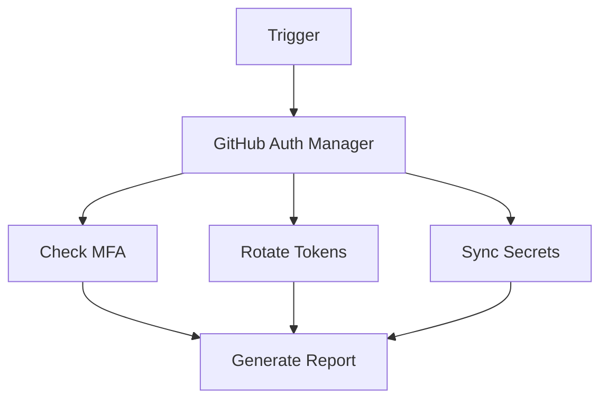

# GitHub Auth Manager Agent

**Version**: 1.0.0  
**Purpose**: Automate GitHub authentication workflows

## Capabilities

- OAuth app management
- Token rotation automation
- MFA policy enforcement
- Authentication monitoring

## Architecture



## Usage

```bash
python agent.py --action rotate-tokens
```

## Configuration

See `config.yaml` for settings.

---
**Maintained by**: Codex Security Team
