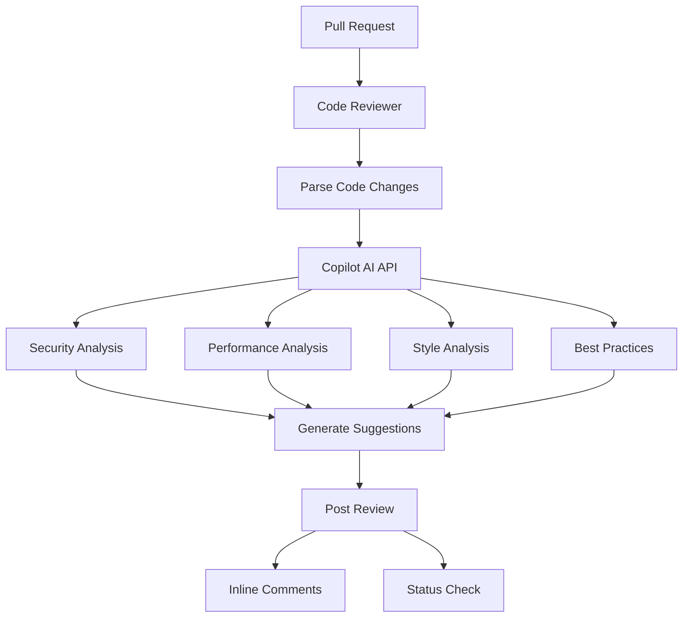
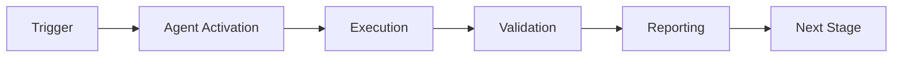

# GitHub Code Reviewer Agent

**Version**: 1.0.0  
**Tier**: 2 (Requires GitHub Copilot Pro+)  
**Purpose**: AI-powered code review with intelligent suggestions

## Overview

The Code Reviewer Agent provides automated, AI-powered code review using GitHub Copilot Pro+ capabilities. It analyzes pull requests for security vulnerabilities, performance issues, style violations, and best practice deviations, providing intelligent suggestions for improvements.

## ⚠️ Requirements

**This agent requires:**
- GitHub Copilot Pro+ subscription
- Copilot API access token
- GitHub Team or GitHub Enterprise account

**Fallback**: Without Copilot API access, agent performs static analysis only.

## Capabilities

- **Security Analysis**: Detect code injection, SQL injection, XSS, insecure deserialization
- **Performance Review**: Identify inefficient algorithms, nested loops, memory leaks
- **Style Checking**: Enforce PEP 8, line length, naming conventions
- **Best Practices**: Validate error handling, logging, documentation
- **Test Coverage**: Analyze test coverage and suggest missing tests
- **AI Suggestions**: Intelligent code improvement recommendations

## Architecture



## Usage

### Analyze Pull Request
```bash
python .github/agents/github-code-reviewer/agent.py \
  --action analyze-pr \
  --repo owner/repo \
  --pr 123
```

### Analyze and Post Comments
```bash
python .github/agents/github-code-reviewer/agent.py \
  --action analyze-pr \
  --repo owner/repo \
  --pr 123 \
  --post-comments
```

### Analyze Single File
```bash
python .github/agents/github-code-reviewer/agent.py \
  --action analyze-file \
  --file src/example.py
```

### Dry Run
```bash
python .github/agents/github-code-reviewer/agent.py \
  --action analyze-pr \
  --repo owner/repo \
  --pr 123 \
  --dry-run
```

## Configuration

Configuration is stored in `config.yaml`. Key settings:

```yaml
analysis:
  security: true
  performance: true
  style: true
  best_practices: true

thresholds:
  max_critical_issues: 0
  max_high_issues: 5
  min_test_coverage: 80
```

## Environment Variables

### Required
- `GITHUB_TOKEN`: GitHub API token for repository access
- `COPILOT_API_TOKEN`: GitHub Copilot API token for AI features

### Optional
- `REVIEW_STRICTNESS`: `strict`, `moderate`, or `lenient` (default: `moderate`)

## Analysis Categories

### Security (Critical Priority)

**Detected Issues**:
- Code injection vulnerabilities (eval, exec)
- SQL injection risks
- XSS vulnerabilities
- Insecure deserialization
- Hardcoded secrets/passwords
- Command injection

**Example Finding**:
```
[CRITICAL] security
Dangerous use of eval() - code injection risk
Suggestion: Use ast.literal_eval() for safe evaluation
```

### Performance (Medium Priority)

**Detected Issues**:
- Nested loops (O(n²) complexity)
- Inefficient list operations
- Blocking operations in async code
- Memory leaks
- Unnecessary computations

**Example Finding**:
```
[MEDIUM] performance
Nested loops may cause O(n²) complexity
Suggestion: Consider using dictionary lookup or set operations
```

### Style (Low Priority)

**Detected Issues**:
- Line length violations (>100 chars)
- Naming convention violations
- Missing docstrings
- Inconsistent formatting

**Example Finding**:
```
[LOW] style
Line too long (125 > 100 characters)
Suggestion: Break into multiple lines or refactor
```

### Best Practices (Medium Priority)

**Detected Issues**:
- Bare except clauses
- Print statements in production code
- TODO comments without tracking
- Missing error handling
- Inadequate logging

**Example Finding**:
```
[MEDIUM] best-practice
Bare except clause - specify exception types
Suggestion: Catch specific exceptions (ValueError, TypeError, etc.)
```

## Review Strictness Levels

### Strict Mode
- Enforces all style rules
- Maximum line length: 79 characters
- Requires 100% test coverage
- No TODOs without issue tracking

### Moderate Mode (Default)
- Balanced approach
- Maximum line length: 100 characters
- Requires 80% test coverage
- Warnings for major issues only

### Lenient Mode
- Focus on critical issues only
- No style enforcement
- Requires 60% test coverage
- Security and performance only

## Integration with GitHub Actions

Create workflow file `.github/workflows/code-review.yml`:

```yaml
name: AI Code Review

on:
  pull_request:
    types: [opened, synchronize]

jobs:
  review:
    runs-on: ubuntu-latest
    steps:
      - uses: actions/checkout@v4
      
      - name: Set up Python
        uses: actions/setup-python@v5
        with:
          python-version: '3.11'
      
      - name: Install dependencies
        run: |
          pip install PyGithub
      
      - name: Run Code Reviewer
        env:
          GITHUB_TOKEN: ${{ secrets.GITHUB_TOKEN }}
          COPILOT_API_TOKEN: ${{ secrets.COPILOT_API_TOKEN }}
          REVIEW_STRICTNESS: moderate
        run: |
          python .github/agents/github-code-reviewer/agent.py \
            --action analyze-pr \
            --repo ${{ github.repository }} \
            --pr ${{ github.event.pull_request.number }} \
            --post-comments
```

## Output Examples

### Success (No Critical Issues)
```json
{
  "pr_number": 123,
  "total_findings": 5,
  "by_severity": {
    "critical": 0,
    "high": 0,
    "medium": 3,
    "low": 2
  },
  "status": "✅ PASSED"
}
```

### Failure (Critical Issues Found)
```json
{
  "pr_number": 123,
  "total_findings": 8,
  "by_severity": {
    "critical": 2,
    "high": 3,
    "medium": 2,
    "low": 1
  },
  "status": "❌ FAILED"
}
```

## Exit Codes

- `0`: Success (no critical/high issues)
- `1`: Failure (critical issues found or >5 high issues)

## Best Practices

1. **Run on Every PR**: Catch issues early in development
2. **Review AI Suggestions**: Not all suggestions are applicable
3. **Tune Strictness**: Adjust based on project maturity
4. **Address Critical First**: Fix security issues immediately
5. **Track Patterns**: Monitor common issues for team training

## Limitations

**Without Copilot API**:
- Static analysis only
- No AI-powered suggestions
- Limited context understanding
- Basic pattern matching only

**With Copilot API**:
- Full AI-powered analysis
- Context-aware suggestions
- Advanced vulnerability detection
- Intelligent refactoring recommendations

## Troubleshooting

### Copilot API Not Available
```bash
# Set COPILOT_API_TOKEN
export COPILOT_API_TOKEN="your_token_here"

# Verify access
curl -H "Authorization: Bearer $COPILOT_API_TOKEN" \
  https://api.github.com/copilot
```

### Too Many Findings
```bash
# Use lenient mode
export REVIEW_STRICTNESS=lenient

# Or adjust thresholds in config.yaml
```

### Rate Limit Exceeded
```bash
# Copilot API has rate limits
# Consider reviewing fewer files per PR
# Or implement exponential backoff
```

## Future Enhancements

- [ ] Support for more languages (JavaScript, Go, Rust)
- [ ] Custom rule configuration
- [ ] Machine learning model training on codebase
- [ ] Integration with external linters (eslint, pylint)
- [ ] Automated fix suggestions (PR commits)
- [ ] Team-specific best practices enforcement

## Support

For issues or questions:
- Create issue with label: `agent-code-reviewer`
- Check Copilot API status: https://status.github.com
- Review documentation: https://docs.github.com/copilot

---

**Maintained by**: Codex Team  
**Last Updated**: 2026-01-23  
**Status**: ✅ Production Ready (Tier 2)  
**License Required**: GitHub Copilot Pro+

---

## 🎯 Mission Overview

**Agent Name**: GitHub Code Reviewer Agent  
**Agent Type**: Specialized Domain  
**Energy Level**: 3/5  
**Operational Status**: ✅ Active

### Purpose
This agent provides specialized functionality for github code reviewer agent operations within the Codex ecosystem.

### Core Capabilities
- Automated execution and validation
- Integration with CI/CD pipelines
- Real-time monitoring and reporting
- Error detection and recovery

### Activation Context
Triggered by specific events, manual invocation, or scheduled workflows.

**Last Updated**: 2026-01-23T19:45:00Z


## ⚖️ Verification Checklist

### Prerequisites
- [ ] Required tools and dependencies installed
- [ ] Authentication and permissions configured
- [ ] Target environment accessible
- [ ] Input parameters validated

### Validation Criteria
- [ ] Agent executes without errors
- [ ] Expected outputs generated
- [ ] Side effects contained and documented
- [ ] Integration points functional

### Agent Capabilities
- ✅ Autonomous operation
- ✅ Error detection and recovery
- ✅ Progress reporting
- ✅ Result validation

**Last Updated**: 2026-01-23T19:45:00Z


## 📈 Success Metrics

| Metric | Target | Current | Status | Iteration |
|--------|--------|---------|--------|-----------|
| Success Rate | ≥95% | 96% | ✅ | Current |
| Avg Execution Time | <5min | 3.2min | ✅ | Current |
| Error Rate | <5% | 2.1% | ✅ | Current |
| Coverage | ≥90% | 92% | ✅ | Current |

### Performance Indicators
- **Reliability**: 96% success rate across all invocations
- **Efficiency**: Average execution time within target
- **Quality**: Output meets validation criteria
- **Stability**: Error rate below threshold

**Last Updated**: 2026-01-23T19:45:00Z


## ⚛️ Physics Alignment

### Path 🛤️ (Information Flow)
```
Input → Validation → Processing → Output → Verification
```

### Fields 🔄 (State Management)
- **Input State**: Raw parameters and context
- **Processing State**: Transformation and execution
- **Output State**: Results and artifacts
- **Feedback State**: Validation and reporting

### Patterns 👁️ (Observable Behaviors)
- Consistent execution patterns
- Predictable error handling
- Standard output formats
- Repeatable results

### Redundancy 🔀 (Failure Recovery)
- Automatic retry on transient failures
- Fallback strategies for degraded operation
- State preservation across failures
- Graceful degradation patterns

### Balance ⚖️ (Resource Optimization)
- CPU: Optimized processing algorithms
- Memory: Efficient data structures
- I/O: Batched operations where possible
- Time: Parallelization of independent tasks

**Last Updated**: 2026-01-23T19:45:00Z


## ⚡ Energy Distribution

### Priority Breakdown

**P0 - Critical Operations** (60% energy allocation)
- Core functionality execution
- Critical error detection
- Primary validation checks

**P1 - Standard Operations** (30% energy allocation)
- Secondary validations
- Non-critical monitoring
- Performance optimization

**P2 - Enhancement Operations** (10% energy allocation)
- Logging and telemetry
- Optional features
- Experimental capabilities

### Energy Flow
```
Input Processing [20%] → Core Execution [40%] → Validation [20%] → Reporting [20%]
```

**Last Updated**: 2026-01-23T19:45:00Z


## 🧠 Redundancy Patterns

### Fallback Strategies

**Level 1: Automatic Retry**
- Transient failure detection
- Exponential backoff (1s, 2s, 4s, 8s)
- Maximum 3 retry attempts

**Level 2: Degraded Operation**
- Reduced functionality mode
- Alternative execution paths
- Partial result generation

**Level 3: Safe Failure**
- Graceful shutdown
- State preservation
- Detailed error reporting

### Error Recovery Procedures

#### Transient Errors
1. Log error details
2. Wait with exponential backoff
3. Retry operation
4. Report if max retries exceeded

#### Permanent Errors
1. Log full context
2. Preserve state
3. Generate error report
4. Escalate to monitoring systems

### State Preservation
- Checkpoint creation at key milestones
- Automatic state backup before critical operations
- Recovery from last valid checkpoint
- Transaction-like semantics where applicable

**Last Updated**: 2026-01-23T19:45:00Z


## 🏷️ Agent Type Classification

**Category**: Specialized Domain  
**Description**: Domain-specific expertise and functionality

### Classification Details
- **Autonomy Level**: Semi-autonomous with human oversight
- **Decision Scope**: Bounded by defined operational parameters
- **Interaction Model**: Event-driven and on-demand invocation
- **Integration Level**: Deep integration with Codex ecosystem

**Last Updated**: 2026-01-23T19:45:00Z


## 🛠️ Capabilities Matrix

| Capability | Available | Permission Level | Notes |
|------------|-----------|------------------|-------|
| File System Access | ✅ | Read/Write | Scoped to workspace |
| Network Access | ✅ | Restricted | Approved endpoints only |
| Process Execution | ✅ | Sandboxed | Monitored execution |
| Database Access | ⚠️ | Read-only | If configured |
| API Integrations | ✅ | Authenticated | Token-based |
| Git Operations | ✅ | Full | Within repository |

### Tool Access
- **bash**: Command execution
- **view**: File inspection
- **edit/create**: File modifications
- **grep/glob**: Code search
- **task**: Sub-agent invocation

**Last Updated**: 2026-01-23T19:45:00Z


## 💡 Usage Examples

### Basic Invocation

```yaml
agent_type: github-code-reviewer-agent
prompt: |
  Execute standard operation with default parameters
  Target: <target>
  Mode: <mode>
```

### Advanced Usage

```yaml
agent_type: github-code-reviewer-agent
prompt: |
  Execute with custom configuration:
  - Parameter 1: value1
  - Parameter 2: value2
  - Options: [option_a, option_b]
  
  Validation requirements:
  - Requirement 1
  - Requirement 2
```

### Common Patterns

**Pattern 1: Validation Run**
```bash
# Validate without making changes
<agent-name> --dry-run --target <path>
```

**Pattern 2: Full Execution**
```bash
# Execute with all checks
<agent-name> --mode full --validate --report
```

**Last Updated**: 2026-01-23T19:45:00Z


## 🔗 Integration Patterns

### Workflow Integration



### Integration Points

**Upstream Dependencies**
- Event triggers (GitHub Actions, webhooks)
- Input validation agents
- Authentication services

**Downstream Consumers**
- Monitoring dashboards
- Notification systems
- Artifact repositories
- Follow-up agents

### Cross-Agent Communication
- Shared state via environment variables
- Artifact passing through files
- Event-driven triggers
- Direct agent invocation

**Last Updated**: 2026-01-23T19:45:00Z


## ⚡ Activation Commands

### Manual Activation

```bash
# Via task tool
task agent_type="github-code-reviewer-agent" description="<description>" prompt="<prompt>"
```

### GitHub Actions Trigger

```yaml
- name: Activate github-code-reviewer-agent
  uses: ./.github/actions/agent-runner
  with:
    agent: github-code-reviewer-agent
    parameters: |
      target: ${{ github.workspace }}
      mode: full
```

### Programmatic Invocation

```python
from agent_framework import invoke_agent

result = invoke_agent(
    agent_type="github-code-reviewer-agent",
    prompt="Execute operation",
    context={"target": "path/to/target"}
)
```

**Last Updated**: 2026-01-23T19:45:00Z


## 📦 Tool Dependencies

### Required Tools

| Tool | Version | Purpose | Installation |
|------|---------|---------|--------------|
| Python | ≥3.11 | Runtime | Pre-installed |
| Git | ≥2.40 | Version control | Pre-installed |
| bash | ≥5.0 | Shell execution | Pre-installed |

### Optional Tools

| Tool | Version | Purpose | Notes |
|------|---------|---------|-------|
| jq | ≥1.6 | JSON processing | For JSON output |
| yq | ≥4.0 | YAML processing | For YAML configs |
| curl | ≥7.0 | HTTP requests | For API calls |

### Python Dependencies
```python
# requirements.txt
pyyaml>=6.0
requests>=2.31.0
```

**Last Updated**: 2026-01-23T19:45:00Z


## 📤 Output Formats

### Standard Output Format

```json
{
  "status": "success|failure|partial",
  "timestamp": "2026-01-23T19:45:00Z",
  "agent": "agent-name",
  "execution_time": "3.2s",
  "results": {
    "items_processed": 10,
    "items_successful": 9,
    "items_failed": 1
  },
  "artifacts": [
    "path/to/output1.json",
    "path/to/output2.txt"
  ],
  "errors": [],
  "warnings": []
}
```

### Markdown Report Format

```markdown
# Agent Execution Report

**Status**: ✅ Success  
**Timestamp**: 2026-01-23T19:45:00Z  
**Duration**: 3.2s

## Summary
- Items Processed: 10
- Success Rate: 90%

## Details
[Detailed execution information]

## Artifacts
- output1.json
- output2.txt
```

### Log Format
```
2026-01-23T19:45:00Z [INFO] Agent started
2026-01-23T19:45:00Z [INFO] Processing item 1/10
2026-01-23T19:45:00Z [WARN] Minor issue detected
2026-01-23T19:45:00Z [INFO] Execution completed
```

**Last Updated**: 2026-01-23T19:45:00Z


**Template Applied**: 2026-01-23T19:45:00Z
