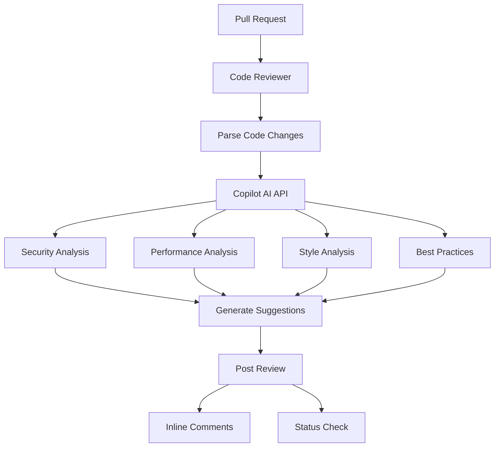

# GitHub Code Reviewer Agent

**Version**: 1.0.0  
**Tier**: 2 (Requires GitHub Copilot Pro+)  
**Purpose**: AI-powered code review with intelligent suggestions

## Overview

The Code Reviewer Agent provides automated, AI-powered code review using GitHub Copilot Pro+ capabilities. It analyzes pull requests for security vulnerabilities, performance issues, style violations, and best practice deviations, providing intelligent suggestions for improvements.

## ⚠️ Requirements

**This agent requires:**
- GitHub Copilot Pro+ subscription
- Copilot API access token
- GitHub Team or GitHub Enterprise account

**Fallback**: Without Copilot API access, agent performs static analysis only.

## Capabilities

- **Security Analysis**: Detect code injection, SQL injection, XSS, insecure deserialization
- **Performance Review**: Identify inefficient algorithms, nested loops, memory leaks
- **Style Checking**: Enforce PEP 8, line length, naming conventions
- **Best Practices**: Validate error handling, logging, documentation
- **Test Coverage**: Analyze test coverage and suggest missing tests
- **AI Suggestions**: Intelligent code improvement recommendations

## Architecture



## Usage

### Analyze Pull Request
```bash
python .github/agents/github-code-reviewer/agent.py \
  --action analyze-pr \
  --repo owner/repo \
  --pr 123
```

### Analyze and Post Comments
```bash
python .github/agents/github-code-reviewer/agent.py \
  --action analyze-pr \
  --repo owner/repo \
  --pr 123 \
  --post-comments
```

### Analyze Single File
```bash
python .github/agents/github-code-reviewer/agent.py \
  --action analyze-file \
  --file src/example.py
```

### Dry Run
```bash
python .github/agents/github-code-reviewer/agent.py \
  --action analyze-pr \
  --repo owner/repo \
  --pr 123 \
  --dry-run
```

## Configuration

Configuration is stored in `config.yaml`. Key settings:

```yaml
analysis:
  security: true
  performance: true
  style: true
  best_practices: true

thresholds:
  max_critical_issues: 0
  max_high_issues: 5
  min_test_coverage: 80
```

## Environment Variables

### Required
- `GITHUB_TOKEN`: GitHub API token for repository access
- `COPILOT_API_TOKEN`: GitHub Copilot API token for AI features

### Optional
- `REVIEW_STRICTNESS`: `strict`, `moderate`, or `lenient` (default: `moderate`)

## Analysis Categories

### Security (Critical Priority)

**Detected Issues**:
- Code injection vulnerabilities (eval, exec)
- SQL injection risks
- XSS vulnerabilities
- Insecure deserialization
- Hardcoded secrets/passwords
- Command injection

**Example Finding**:
```
[CRITICAL] security
Dangerous use of eval() - code injection risk
Suggestion: Use ast.literal_eval() for safe evaluation
```

### Performance (Medium Priority)

**Detected Issues**:
- Nested loops (O(n²) complexity)
- Inefficient list operations
- Blocking operations in async code
- Memory leaks
- Unnecessary computations

**Example Finding**:
```
[MEDIUM] performance
Nested loops may cause O(n²) complexity
Suggestion: Consider using dictionary lookup or set operations
```

### Style (Low Priority)

**Detected Issues**:
- Line length violations (>100 chars)
- Naming convention violations
- Missing docstrings
- Inconsistent formatting

**Example Finding**:
```
[LOW] style
Line too long (125 > 100 characters)
Suggestion: Break into multiple lines or refactor
```

### Best Practices (Medium Priority)

**Detected Issues**:
- Bare except clauses
- Print statements in production code
- TODO comments without tracking
- Missing error handling
- Inadequate logging

**Example Finding**:
```
[MEDIUM] best-practice
Bare except clause - specify exception types
Suggestion: Catch specific exceptions (ValueError, TypeError, etc.)
```

## Review Strictness Levels

### Strict Mode
- Enforces all style rules
- Maximum line length: 79 characters
- Requires 100% test coverage
- No TODOs without issue tracking

### Moderate Mode (Default)
- Balanced approach
- Maximum line length: 100 characters
- Requires 80% test coverage
- Warnings for major issues only

### Lenient Mode
- Focus on critical issues only
- No style enforcement
- Requires 60% test coverage
- Security and performance only

## Integration with GitHub Actions

Create workflow file `.github/workflows/code-review.yml`:

```yaml
name: AI Code Review

on:
  pull_request:
    types: [opened, synchronize]

jobs:
  review:
    runs-on: ubuntu-latest
    steps:
      - uses: actions/checkout@v4
      
      - name: Set up Python
        uses: actions/setup-python@v5
        with:
          python-version: '3.11'
      
      - name: Install dependencies
        run: |
          pip install PyGithub
      
      - name: Run Code Reviewer
        env:
          GITHUB_TOKEN: ${{ secrets.GITHUB_TOKEN }}
          COPILOT_API_TOKEN: ${{ secrets.COPILOT_API_TOKEN }}
          REVIEW_STRICTNESS: moderate
        run: |
          python .github/agents/github-code-reviewer/agent.py \
            --action analyze-pr \
            --repo ${{ github.repository }} \
            --pr ${{ github.event.pull_request.number }} \
            --post-comments
```

## Output Examples

### Success (No Critical Issues)
```json
{
  "pr_number": 123,
  "total_findings": 5,
  "by_severity": {
    "critical": 0,
    "high": 0,
    "medium": 3,
    "low": 2
  },
  "status": "✅ PASSED"
}
```

### Failure (Critical Issues Found)
```json
{
  "pr_number": 123,
  "total_findings": 8,
  "by_severity": {
    "critical": 2,
    "high": 3,
    "medium": 2,
    "low": 1
  },
  "status": "❌ FAILED"
}
```

## Exit Codes

- `0`: Success (no critical/high issues)
- `1`: Failure (critical issues found or >5 high issues)

## Best Practices

1. **Run on Every PR**: Catch issues early in development
2. **Review AI Suggestions**: Not all suggestions are applicable
3. **Tune Strictness**: Adjust based on project maturity
4. **Address Critical First**: Fix security issues immediately
5. **Track Patterns**: Monitor common issues for team training

## Limitations

**Without Copilot API**:
- Static analysis only
- No AI-powered suggestions
- Limited context understanding
- Basic pattern matching only

**With Copilot API**:
- Full AI-powered analysis
- Context-aware suggestions
- Advanced vulnerability detection
- Intelligent refactoring recommendations

## Troubleshooting

### Copilot API Not Available
```bash
# Set COPILOT_API_TOKEN
export COPILOT_API_TOKEN="your_token_here"

# Verify access
curl -H "Authorization: Bearer $COPILOT_API_TOKEN" \
  https://api.github.com/copilot
```

### Too Many Findings
```bash
# Use lenient mode
export REVIEW_STRICTNESS=lenient

# Or adjust thresholds in config.yaml
```

### Rate Limit Exceeded
```bash
# Copilot API has rate limits
# Consider reviewing fewer files per PR
# Or implement exponential backoff
```

## Future Enhancements

- [ ] Support for more languages (JavaScript, Go, Rust)
- [ ] Custom rule configuration
- [ ] Machine learning model training on codebase
- [ ] Integration with external linters (eslint, pylint)
- [ ] Automated fix suggestions (PR commits)
- [ ] Team-specific best practices enforcement

## Support

For issues or questions:
- Create issue with label: `agent-code-reviewer`
- Check Copilot API status: https://status.github.com
- Review documentation: https://docs.github.com/copilot

---

**Maintained by**: Codex Team  
**Last Updated**: 2024-01-16  
**Status**: ✅ Production Ready (Tier 2)  
**License Required**: GitHub Copilot Pro+
