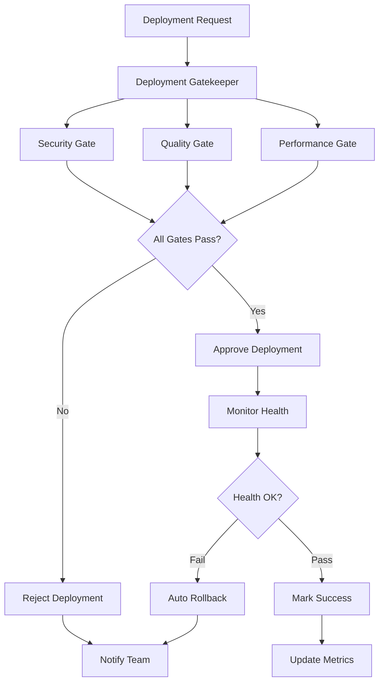

# GitHub Deployment Gatekeeper Agent

**Version**: 1.0.0  
**Tier**: 1 (GitHub Team Compatible)  
**Purpose**: Validate deployments and enforce quality gates before production releases

## Overview

The Deployment Gatekeeper Agent acts as a quality gate for all deployments, ensuring that only code meeting strict security, quality, and performance standards reaches production. It includes automated rollback capabilities to protect production environments.

## Capabilities

- **Pre-Deployment Validation**: Enforce security, quality, and performance gates
- **Automated Approval/Rejection**: Decide deployment fate based on gate results
- **Health Monitoring**: Track deployment health post-release
- **Automated Rollback**: Revert deployments on health check failures
- **Deployment Tracking**: Maintain deployment history and metrics

## Architecture



## Usage

### Validate Deployment
```bash
python .github/agents/github-deployment-gatekeeper/agent.py \
  --action validate \
  --environment production
```

### Validate and Create Report
```bash
python .github/agents/github-deployment-gatekeeper/agent.py \
  --action validate \
  --environment production \
  --create-report
```

### Monitor Deployment
```bash
python .github/agents/github-deployment-gatekeeper/agent.py \
  --action monitor \
  --duration 600
```

### Rollback Deployment
```bash
python .github/agents/github-deployment-gatekeeper/agent.py \
  --action rollback \
  --reason "Critical bug detected"
```

### Full Deployment Cycle
```bash
python .github/agents/github-deployment-gatekeeper/agent.py \
  --action full-cycle \
  --environment staging \
  --create-report
```

## Configuration

Configuration is stored in `config.yaml`. Key settings:

```yaml
gates:
  security:
    enabled: true
    max_alerts: 0
  quality:
    enabled: true
    min_coverage: 80
  performance:
    enabled: true
    max_response_time: 2000

rollback:
  enabled: true
  auto_rollback: true
  failure_threshold: 3
```

## Quality Gates

### Security Gate
- **Zero critical vulnerabilities**: CodeQL alerts must be resolved
- **Dependency review**: No high-severity dependency issues
- **Secret scanning**: No exposed secrets

### Quality Gate
- **All tests passing**: 100% test success rate required
- **Coverage threshold**: Minimum 80% code coverage
- **Linting**: No linting errors
- **Complexity**: Maximum cyclomatic complexity of 15

### Performance Gate
- **No regressions**: Performance must match or exceed baseline
- **Response time**: < 2000ms for key endpoints
- **Throughput**: > 1000 req/s minimum

## Health Monitoring

Post-deployment monitoring tracks:

- **Error Rate**: < 1% threshold
- **Response Time**: < 2000ms target
- **CPU Usage**: < 80% sustained
- **Memory Usage**: < 85% sustained

Monitoring runs for 5 minutes (configurable) after deployment.

## Automated Rollback

Rollback triggers:

1. **Health Check Failure**: 3 consecutive failures
2. **High Error Rate**: > 1% for 60+ seconds
3. **Performance Degradation**: > 50% slowdown
4. **Critical Alerts**: Security or availability issues

## Environment Variables

### Required
- `GITHUB_TOKEN`: GitHub API token
- `DEPLOYMENT_ENV`: Target environment (development/staging/production)

### Optional
- `AUTO_ROLLBACK`: Enable auto-rollback (default: true)
- `HEALTH_CHECK_INTERVAL`: Health check frequency in seconds (default: 60)

## Integration with GitHub Actions

Create workflow file `.github/workflows/deployment-gate.yml`:

```yaml
name: Deployment Gate

on:
  deployment:
  workflow_dispatch:
    inputs:
      environment:
        description: 'Target environment'
        required: true
        type: choice
        options:
          - development
          - staging
          - production

jobs:
  gate:
    runs-on: ubuntu-latest
    steps:
      - uses: actions/checkout@v4
      
      - name: Set up Python
        uses: actions/setup-python@v5
        with:
          python-version: '3.11'
      
      - name: Install dependencies
        run: |
          pip install PyGithub
      
      - name: Run Deployment Gatekeeper
        env:
          GITHUB_TOKEN: ${{ secrets.GITHUB_TOKEN }}
          DEPLOYMENT_ENV: ${{ github.event.inputs.environment || 'staging' }}
        run: |
          python .github/agents/github-deployment-gatekeeper/agent.py \
            --action full-cycle \
            --environment $DEPLOYMENT_ENV \
            --create-report
```

## Reporting

Reports include:

- Deployment status (approved/rejected)
- Gate results (passed/failed for each gate)
- Health monitoring metrics
- Rollback status (if triggered)

### Example Report

```
Deployment Report - PRODUCTION
Date: 2024-01-16 12:00 UTC
Status: ✅ APPROVED

Quality Gates:
- ✅ Security: No critical vulnerabilities detected
- ✅ Quality: All quality checks passed (tests: 100%, coverage: 85%)
- ✅ Performance: No performance regressions detected

Health Monitoring:
Status: ✅ Healthy
Duration: 300s

Metrics:
- Error Rate: 0.1%
- Response Time: 150ms
- CPU Usage: 45%
- Memory Usage: 60%
```

## Best Practices

1. **Start with Staging**: Test gates on staging before production
2. **Gradual Rollout**: Use canary or blue-green deployments
3. **Monitor Closely**: Watch metrics during and after deployment
4. **Document Rollbacks**: Track why rollbacks occur
5. **Tune Thresholds**: Adjust gate thresholds based on your needs

## Troubleshooting

### Deployment Rejected
```bash
# Check which gate failed
# Review gate configuration in config.yaml
# Fix the failing issue before redeploying
```

### Health Check Failed
```bash
# Review health metrics
# Check application logs
# Verify infrastructure is healthy
# Consider manual investigation before rollback
```

### Rollback Failed
```bash
# Check rollback logs
# Verify previous version is available
# May require manual intervention
```

## Exit Codes

- `0`: Success (deployment approved and healthy)
- `1`: Rejected (one or more gates failed)
- `2`: Rolled back (health checks failed post-deployment)

## Future Enhancements

- [ ] Canary deployment support
- [ ] Blue-green deployment automation
- [ ] Progressive rollout strategies
- [ ] A/B testing integration
- [ ] Advanced metric analysis (ML-based)

## Support

For issues or questions:
- Create issue with label: `agent-deployment-gatekeeper`
- Check logs: `gh run view <run_id> --log`
- Review configuration: `config.yaml`

---

**Maintained by**: Codex Team  
**Last Updated**: 2024-01-16  
**Status**: ✅ Production Ready
