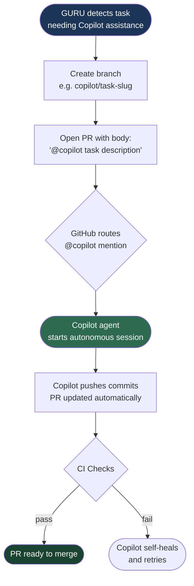

# Agent: GitHub Guru Agent

## 🎯 Agent Identity

**Agent Name**: GitHub Guru Agent
**Agent ID**: `github-guru-agent`
**Category**: Operations | Governance | Intelligence
**Version**: 1.1.0
**Status**: 🟢 Active
**Maturity**: Production
**Energy Level**: ⚡⚡⚡⚡⚡ (5/5 — Critical Infrastructure)

---

## 📋 REGISTRY BLOCK

```yaml
- id: github-guru-agent
  name: "GitHub Guru Agent"
  version: "1.1.0"
  category: operations
  subcategory: governance
  status: active
  maturity: production
  physics_model:
    primary: balance
    secondary: path
    energy: 5
  primary_skill: "GitHub repository intelligence, PR analysis, issue triage, workflow health"
  secondary_skill: "Pattern synthesis, cross-repo knowledge surfacing, developer guidance"
  capabilities:
    - pr_analysis
    - issue_triage
    - workflow_health_monitoring
    - branch_governance
    - contributor_intelligence
    - repository_hygiene_reporting
    - codebase_navigation_guidance
    - dependency_drift_detection
    - stale_resource_detection
    - label_taxonomy_enforcement
  triggers:
    - pull_request_opened
    - pull_request_reopened
    - issues_opened
    - schedule_daily
    - workflow_dispatch
  integration_points:
    - .github/workflows/github-guru.yml
    - .github/agents/github-guru-agent/main.py
    - .github/agents/AGENT_REGISTRY.yaml
    - .github/agents/AGENT_REGISTRY.md
  cognitive_brain_layer: orchestration
  safe_mode: true
  network_access: false
  test_coverage: phase_7_planned
  last_updated: "2026-02-21"
  maintainer: mbaetiong
```

---

## 🧠 Cognitive Brain Integration

| Brain Layer | Role | Connection |
|-------------|------|------------|
| 🧠 **Planner** (`cognitive_brain.base.Planner`) | Strategic triage + prioritization | Implements `Planner` ABC via `LegacyAgentAdapter` |
| 💾 **Memory** (`SimpleDictMemory`) | Stores PR/issue context, contributor patterns, label history | In-session STM; persists to `audit_artifacts/baselines/` |
| 🔄 **Orchestration** (`PhysicsInspiredOrchestrator`) | Routes tasks to specialized agents | Calls `orchestrator.select_agent_for_task()` |
| 👁️ **Observation** (`ObservationData`) | Ingests GitHub event payloads | Transforms webhook JSON → `ObservationData` |
| ⚡ **Action** (`ActionResult`) | Posts PR comments, labels, GitHub Checks | Returns `ActionResult` to orchestration layer |
| 🔁 **Self-Healing** (`SelfHealingEngine`) | Detects stale PRs, broken workflows, missing labels | Emits `DetectedIssue` with `IssueType.CONFIGURATION_ERROR` |

**Physics Equation Applied**:
```
Score = (Impact × Confidence × Momentum) / (Energy × (1 + Risk) × (1 + Friction))
```

---

## ⚡ Capabilities

| ID | Capability | Description | Output |
|----|-----------|-------------|--------|
| `C-01` | `pr_analysis` | Analyze PR: size, reviewers, CI status, conflicts, staleness | PR health score + comment |
| `C-02` | `issue_triage` | Label, prioritize, and route new issues | Labeled issue + routing suggestion |
| `C-03` | `workflow_health_monitoring` | Monitor GitHub Actions: failures, flakiness, artifact drift | Health report + issue if degraded |
| `C-04` | `branch_governance` | Detect stale branches, enforce naming conventions | Stale branch report |
| `C-05` | `contributor_intelligence` | Surface contributor patterns, ownership gaps | Contributor summary table |
| `C-06` | `repository_hygiene_reporting` | Detect orphaned files, missing docs, broken links | Hygiene score + remediation list |
| `C-07` | `codebase_navigation_guidance` | Generate navigation prompts from `AGENTS.md` | Navigation hint comment |
| `C-08` | `dependency_drift_detection` | Detect outdated requirements*.txt/pyproject.toml deps | Drift report per dep file |
| `C-09` | `stale_resource_detection` | Detect PRs/issues/branches inactive > threshold | Stale resource list |
| `C-10` | `label_taxonomy_enforcement` | Validate labels match `.github/labels.yml` taxonomy | Label compliance score |
| `C-11` | `create_copilot_pr` | Create a PR with `@copilot <task>` in the body to start a Copilot agent session | PR URL + Copilot session triggered |

---

## 🔒 Permissions

```yaml
permissions:
  contents: write    # Required by C-11 create_copilot_pr: push branch + create pull request commit
  issues: write
  pull-requests: write
  checks: write
  metadata: read
  actions: read
```

> **`contents: write` scope** is required exclusively for capability **C-11 `create_copilot_pr`**,
> which pushes a new branch and opens a pull request. All other capabilities are read-only against
> repository contents. If `create_copilot_pr` is not used in a workflow, `contents: read` is sufficient.

> ⚠️ **SAFE MODE**: This agent operates in `SAFE_MODE=true`. It will **never**:
> - Push commits or merge PRs
> - Delete branches or resources
> - Make network calls to external services
> - Embed or log secrets

---

## 🏗️ Implementation Architecture

```
.github/agents/github-guru-agent/
├── __init__.py
├── main.py              ← Core orchestration (async ASSESS→ACT→REFLECT)
├── analyzers.py         ← PR/issue/workflow analyzers
├── github_client.py     ← GitHub REST API client (retry + rate-limit aware)
├── patterns.py          ← Pattern registry (30+ signatures)
├── triage.py            ← Issue routing & label logic
├── hygiene.py           ← Repository hygiene checks
├── metrics.py           ← Performance + session tracking
├── learning.py          ← Self-evolution: capture → refine → improve
├── cognitive_adapter.py ← Wraps agent in Planner ABC (cognitive bridge)
└── tests/
    ├── test_analyzers.py
    ├── test_triage.py
    ├── test_hygiene.py
    └── test_complete_suite.py
```

---

## 🤖 Creating Copilot Agent Sessions via PR

The `create_copilot_pr` capability (C-11) creates a GitHub Pull Request whose body
begins with `@copilot <task>`. This triggers the GitHub Copilot coding agent to start
an autonomous session for the specified task.

### How It Works



### Usage

```python
# Via OODA loop
result = adapter.ooda_loop({
    "event_type": "workflow_dispatch",
    "capability": "create_copilot_pr",
    "head_branch": "copilot/fix-sql-injection-alerts",
    "base_branch": "main",
    "title": "fix: batch remediate sql-injection CodeQL alerts",
    "copilot_task": "Remediate all sql-injection CodeQL alerts in src/codex_ml/",
    "body": "Automated batch remediation triggered by nightly triage pipeline.",
})
print(result.output["pr_url"])
# → https://github.com/Aries-Serpent/_codex_/pull/NNNN

# Direct call on the adapter
pr = adapter.create_copilot_pr(
    title="fix: remediate P0 CodeQL alerts",
    copilot_task="Fix all critical CodeQL alerts flagged in the latest nightly triage run.",
    head_branch="copilot/p0-alert-remediation",
    base_branch="main",
    body="Triggered by Art_Nightly CodeQL Alert Triage pipeline (run #{{ run_id }}).",
)
```

### Integration with Resolution Pipeline

```yaml
# nightly-codeql-alert-triage.yml can trigger GURU to open a PR when P0 alerts are found:
- name: Open Copilot remediation PR for P0 alerts
  if: ${{ fromJSON(steps.pipeline.outputs.p0_count) > 0 }}
  uses: actions/github-script@v7
  with:
    script: |
      await github.rest.pulls.create({
        owner: context.repo.owner,
        repo: context.repo.repo,
        title: 'fix: remediate P0 CodeQL alerts',
        body: '@copilot Remediate all P0 (critical) CodeQL alerts surfaced by the nightly triage pipeline.',
        head: 'copilot/p0-alert-remediation',
        base: 'main',
      });
```

### Required Permissions

| Permission | Level | Reason |
|-----------|-------|--------|
| `contents` | `write` | Create/push the head branch |
| `pull-requests` | `write` | Open the PR |

---

## 📊 Version History

| Version | Date | Author | Changes |
|---------|------|--------|---------|
| 1.0.0 | 2026-02-20 | mbaetiong | Initial draft |
| 1.1.0 | 2026-02-21 | copilot | Full implementation: all modules, tests, cognitive bridge, registry entries |
| 1.2.0 | 2026-02-26 | copilot | Add C-11 `create_copilot_pr` capability; `contents: write` permission; `@copilot` PR body wiring; nightly pipeline integration diagram |

**Last Validated**: 2026-02-26
**Policy Compliance**: ✅ SAFE_MODE | ✅ OFFLINE_MODE | ✅ No secrets | ✅ Policy gate referenced
