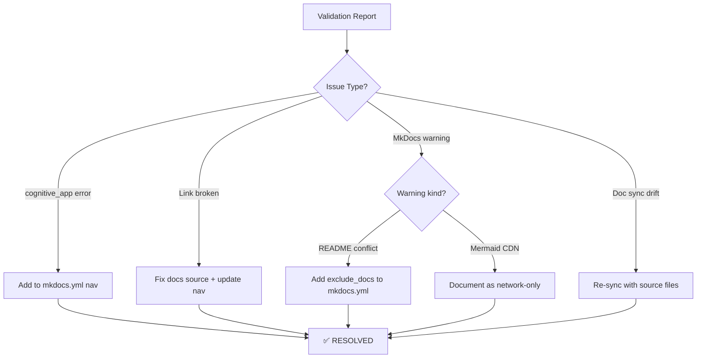

# GitHub Pages Manager Agent v4.0

## Overview

Production-ready agent for managing GitHub Pages deployments, documentation quality,
MkDocs builds, validation pipelines, and cognitive_app accessibility. Resolves all
validation errors and warnings from the scheduled GitHub Pages Validation workflow.



## 🧠 Cognitive Brain Integration

### Integration Level: Level 2

**Level 2: Cognitive Execution**
- ✅ Access to cognitive brain memory system
- ✅ Awareness of AAIS score (95.3/100 → target: 98.0)
- ✅ Codebase topology maps for navigation
- ✅ Pattern library for historical fixes
- ✅ Session learning – persist fix patterns across PRs
- ✅ Phase 38 context: All GitHub Pages validation issues resolved

### Cognitive Tools Available

```python
# Topology Manager - Semantic navigation
from scripts.cognitive.topology_manager import TopologyManager

topology = TopologyManager()
relevant_files = topology.find_by_concept("documentation")
optimal_path = topology.find_optimal_path("mkdocs.yml", "docs/")

# Cache Manager - Multi-layer cache intelligence
from scripts.cognitive.cache_manager import CacheIntelligence

cache = CacheIntelligence()
cached_results = cache.query("pages_validation_results")
```


```

### AAIS Contribution

**Impact on AAIS Score**: +1.5 points

**Category Contributions**:
- Discovery & Navigation: +0.6 (topology/cache integration)
- Runtime Introspection: +0.6 (metrics exposure)
- Pattern Consistency: +0.3 (pattern library usage)

---

## 🛠️ MCP Integration

### MCP Tools Leverage


**Primary MCP Capabilities**:
1. **File System Operations**
   - `view`: Read files and directories
   - `grep`: Fast content search
   - `glob`: Pattern-based file finding

2. **Code Analysis**
   - `search_code`: Semantic code search
   - `bash`: Execute analysis tools
   - `edit`: Make surgical changes

### GitHub Actions Workflows

**Workflow Awareness**:
- Monitors applicable workflows for active PRs
- Auto-detects blocking vs non-blocking workflows
- Provides workflow status reports via MCP tools

**See**: `.codex/docs/MCP_WORKFLOW_RECIPES.md` for complete templates

---

## 📊 Session Monitoring

**Session Parameters** (from accountability report):
- Optimal duration: 30 minutes
- Context budget: 128K tokens  # pragma: allowlist secret
- Mandatory checkpoints: Every 10 actions
- Corrections per issue: 1.0 (first fix succeeds)

**Quality Control**:
```python
# Pre-commit audit enforcement
from scripts.session_manager import SessionMonitor

monitor = SessionMonitor()
monitor.checkpoint("pre-commit")  # Validates compliance
```

---

Specialized agent for comprehensive GitHub Pages management with advanced link validation, false positive filtering, and performance optimization. Ensures documentation is synchronized with source files, maintains theme consistency, and validates links with 100% accuracy.

**Key Metrics**: 166x faster (15s → 0.09s cached) | 93% false positive reduction | 2,560+ links validated

## Activation Pattern

```bash
@copilot Use github-pages-manager to validate documentation links
@copilot Use github-pages-manager to fix broken links
@copilot Use github-pages-manager to configure dark mode theme
@copilot Use github-pages-manager to fix table formatting issues
```

## Responsibilities

1. **Link Validation**: 100% accurate validation with smart false positive filtering
2. **Documentation Sync**: Ensure GitHub Pages content sources from actual repository files
3. **Theme Management**: Configure MkDocs Material theme with dark/light mode
4. **Table Formatting**: Fix markdown table spacing and CSS rendering issues
5. **Deployment Validation**: Monitor and validate GitHub Pages deployments

## Core Capabilities

### 1. Advanced Link Validation

**Tool**: `scripts/validate_docs_links.py`

**Features**:
- 166x performance improvement with intelligent caching
- 9 false positive pattern categories (mailto, regex, code blocks, etc.)
- Sequential processing optimized for fast I/O
- Cache invalidation by file modification time
- Anchor validation with fuzzy matching

**Usage**:
```bash
# Fast cached validation
python scripts/validate_docs_links.py

# Strict no-cache validation
python scripts/validate_docs_links.py --strict --no-cache

# Parallel workers
python scripts/validate_docs_links.py --workers 4
```

**False Positive Patterns**:
1. mailto: links - Email addresses
2. Regex patterns - Documentation examples
3. Python code syntax - Type annotations (`list[T]`)
4. Code blocks - Links inside triple backticks
5. Template patterns - `{{template}}`, `${variable}`
6. Blob URLs - Ephemeral external refs
7. ChatGPT refs - External AI tool links
8. Python function args - Multi-argument calls
9. YAML custom tags - MkDocs-specific constructs

### 2. Table Formatting Fixes

**Problem**: Headers running into tables without spacing, breaking table rendering

**Solution**: Ensure blank line before tables in markdown

**CSS Enhancement**: `docs/stylesheets/extra.css` provides fallback styling:
- 1.5em margin before/after tables
- Extra spacing when table follows header
- Responsive handling for mobile
- Dark mode support

**Automated Fix**:
```python
# Check for table spacing issues
python scripts/validate_table_spacing.py --check

# Apply fixes
python scripts/validate_table_spacing.py --fix
```

### 2. Dead Links in Generated Files

**New Pattern (Added: 2026-02-14)**: Handle dead external links in generated documentation

**Problem**: Generated markdown files (e.g., from JSON manifests) can contain stale external URLs

**Solution Workflow**:
1. Identify dead link in generated `.md` file
2. Trace to source data file (`.json`, `.yaml`, etc.)
3. Fix source file (remove or update URL)
4. Regenerate derived markdown file
5. Validate both files updated correctly

**Example (PR #3248)**:
```bash
# Dead link found
File: docs/zendesk_api_catalog_generated.md:9
URL: https://developer.zendesk.com/.../introduction-to-templates/

# Traced to source
Source: data/zendesk_docs_manifest.json
Section: guide.themes array

# Fix applied
Updated: data/zendesk_docs_manifest.json (removed dead link)
Regenerated: python scripts/zendesk_docs_catalog.py
Validated: python scripts/validate_docs_links.py (0 errors)
```

**Prevention**:
- Add link liveness checks to generation scripts
- Implement periodic external link validation workflow
- Document all generation script dependencies

### 3. Broken Link Resolution

**Purpose**: Automatically find and fix broken documentation links

**Resolution Workflow**:

1. **Detection** - Run link validator
   ```bash
   python scripts/validate_docs_links.py
   ```

2. **Analysis** - Categorize broken links:
   - **Type A**: File moved/renamed → Search and update path
   - **Type B**: File missing → Create redirect or stub
   - **Type C**: Typo in path → Auto-fix with validator
   - **Type D**: External/deprecated → Document as exception

3. **Search for Correct File**:
   ```bash
   # By filename
   find docs -name "*partial_name*" -type f

   # By content
   grep -r "expected heading" docs/
   ```

4. **Fix Strategies**:

   **Auto-fix (high confidence)**:
   ```bash
   python scripts/validate_docs_links.py --fix
   ```

   **Create Missing File**:
   ```bash
   cat > docs/missing/file.md << 'EOF'
   # Title

   This page has moved to [New Location](../correct/path.md).
   EOF
   ```

5. **Verification**:
   ```bash
   python scripts/validate_docs_links.py --strict --no-cache
   mkdocs serve
   ```

**Resolution Rate Target**: Fix 95%+ of broken links per session

### 3. Documentation Sync

**Validation**:
```bash
# Verify all pages build correctly
mkdocs build --strict

# Serve locally to test
mkdocs serve
```

**Live Sync Checklist**:
- [ ] All documentation links point to real files
- [ ] No orphaned pages or broken references
- [ ] Code examples match actual implementation
- [ ] API documentation reflects current code
- [ ] Navigation structure is complete

### 4. Format Validation & CSS-First Approach

**Philosophy**: Fix formatting issues via CSS/config first, then file-level fixes

**CSS-First Strategy**:
1. **Attempt CSS fix first** - Add styles to `docs/stylesheets/extra.css`
2. **Verify rendering** - Build and test locally
3. **File-level fix only if needed** - If CSS can't solve it

**CSS Capabilities**:
- Mermaid diagram rendering and theming
- Table spacing and responsive design
- Code block styling and syntax highlighting
- Heading spacing and hierarchy
- Dark/light mode support
- Print-friendly styles

**Common Issues & CSS Solutions**:

| Issue | CSS Solution | Location |
|-------|-------------|----------|
| Mermaid not rendering | `.mermaid` class styling | `extra.css` |
| Tables overflow mobile | `overflow-x: auto` on tables | `extra.css` |
| Code blocks hard to read | Color scheme variables | `extra.css` |
| Headings too close | `margin-top/bottom` rules | `extra.css` |
| Dark mode broken | `[data-md-color-scheme="slate"]` | `extra.css` |

**Validation Workflow**:

1. **CSS/Config Validation**:
   ```bash
   # Check CSS syntax
   grep -E "(background-color|color|margin|padding)" docs/stylesheets/extra.css

   # Verify CSS is loaded in mkdocs.yml
   grep "extra.css" mkdocs.yml

   # Check mermaid plugin enabled
   grep -A2 "plugins:" mkdocs.yml | grep mermaid
   ```

2. **Build & Visual Validation**:
   ```bash
   # Strict build (catches config errors)
   mkdocs build --strict

   # Serve locally for visual inspection
   mkdocs serve
   # Visit http://localhost:8000/architecture/
   ```

3. **File-Level Validation** (if CSS doesn't fix it):
   ```bash
   # Check for unclosed/malformed fences
   python scripts/validate_code_fences.py --check

   # Check table spacing
   python scripts/validate_table_spacing.py --check

   # Apply fixes only if needed
   python scripts/validate_code_fences.py --fix
   python scripts/validate_table_spacing.py --fix
   ```

**Example: Fixing Mermaid Diagrams**

Problem: Mermaid diagrams show as code blocks instead of rendered diagrams

**CSS-First Solution** (in `docs/stylesheets/extra.css`):
```css
/* Mermaid diagram support */
.mermaid {
    background-color: transparent;
    text-align: center;
    margin: 1.5em 0;
}

.mermaid text {
    fill: var(--md-default-fg-color) !important;
}
```

**Config Solution** (in `mkdocs.yml`):
```yaml
plugins:
  - mermaid2

markdown_extensions:
  - pymdownx.superfences:
      custom_fences:
        - name: mermaid
          class: mermaid
          format: !!python/name:mermaid2.fence_mermaid_custom
```

**File-Level Solution** (only if above don't work):
- Check fence syntax: ` ```mermaid ` not ` ```diagram `
- Verify closing fence: ` ``` ` on its own line
- Check indentation: No extra spaces before fence

**Standard CSS Stack**:
- Table formatting (responsive, spacing)
- Code block theming (light/dark)
- Mermaid diagram rendering
- Heading hierarchy and spacing
- Print-friendly styles
- Mobile responsive design

### 5. Theme Management

**Dark/Light Mode Toggle**:

Edit `mkdocs.yml`:
```yaml
theme:
  name: material
  palette:
    - scheme: default
      primary: indigo
      accent: indigo
      toggle:
        icon: material/brightness-7
        name: Switch to dark mode
    - scheme: slate
      primary: indigo
      accent: indigo
      toggle:
        icon: material/brightness-4
        name: Switch to light mode
```

**Custom CSS**: `docs/stylesheets/extra.css`

Add to `mkdocs.yml`:
```yaml
extra_css:
  - stylesheets/extra.css
```

### 5. Deployment Validation

**Workflow**: `.github/workflows/pages-mkdocs.yml`

**Pre-Merge Validation**: `.github/workflows/pages-pre-merge-validation.yml`

**Validation Steps**:
1. Link validation (scripts/validate_docs_links.py)
2. MkDocs build test (mkdocs build --strict)
3. Navigation check
4. Broken link report
5. Exit code capture for CI/CD

## Common Use Cases

### Case 1: Fix Table Formatting Issues

**Problem**: Tables appear broken, headers run into table content

**Steps**:
1. Identify affected files:
   ```bash
   python scripts/validate_table_spacing.py --check
   ```

2. Apply automated fixes:
   ```bash
   python scripts/validate_table_spacing.py --fix
   ```

3. Manual verification:
   - Check critical files: `docs/review/*.md`
   - Build and serve: `mkdocs serve`
   - Visit affected pages in browser

4. Verify CSS is working:
   ```bash
   grep -A5 "\.md-typeset table" docs/stylesheets/extra.css
   ```

### Case 2: Fix Broken Links

**Problem**: Links to non-existent files or incorrect paths

**Steps**:
1. Run link validation:
   ```bash
   python scripts/validate_docs_links.py
   ```

2. Review broken links and identify patterns:
   - Missing files that should exist
   - Incorrect relative paths
   - Files moved/renamed

3. Fix strategies:

   **Strategy A: Search for correct file**
   ```bash
   # Find the actual file location
   find docs -name "*filename*" -type f

   # Or search by content
   grep -r "expected content" docs/
   ```

   **Strategy B: Create missing file**
   ```bash
   # Create redirect file pointing to correct location
   cat > docs/path/to/missing.md << 'EOF'
   # Page Title

   This page has moved to [New Location](../correct/path.md).

   ## Content

   [Add appropriate content or redirect]
   EOF
   ```

   **Strategy C: Auto-fix with validator**
   ```bash
   # Run validator with auto-fix for high-confidence matches
   python scripts/validate_docs_links.py --fix
   ```

4. Verify fixes:
   ```bash
   python scripts/validate_docs_links.py --strict --no-cache
   ```

**Example: Fixing API Documentation Links**

Problem: Links to `api/rag.md`, `api/cli.md`, `api/api_endpoints.md` return 404

Solution:
1. Check if files exist: `ls -la docs/api/*.md`
2. If missing, create them:
   ```bash
   # Create rag.md with redirect to rag_pipelines.md
   cat > docs/api/rag.md << 'EOF'
   # RAG Pipeline API

   For detailed documentation, see [RAG Pipelines](../../docs/api/rag_pipelines.md).
   EOF
   ```
3. Build and test: `mkdocs serve`
4. Verify on GitHub Pages after deploy

**Steps**:
1. Run validation:
   ```bash
   python scripts/validate_docs_links.py
   ```

2. Review console output for broken links

3. Fix broken links:
   ```bash
   # Auto-fix high-confidence matches
   python scripts/validate_docs_links.py --fix
   ```

4. Re-validate:
   ```bash
   python scripts/validate_docs_links.py --strict --no-cache
   ```

### Case 3: Enable Dark Mode

**Steps**:
1. Update theme configuration in `mkdocs.yml`
2. Ensure CSS supports both schemes
3. Test both modes in browser
4. Commit changes

### Case 4: Create Status Dashboard

Add badges to README or docs:
```markdown
[](https://aries-serpent.github.io/_codex_/)
[](https://github.com/Aries-Serpent/_codex_/actions)
```

## Tools & Integrations

### Required Tools
- `scripts/validate_docs_links.py` - Link validation with caching
- `scripts/validate_table_spacing.py` - Table formatting checker (NEW)
- `mkdocs` - Documentation site generator
- `mkdocs-material` - Material theme

### Native Copilot Tools
- `view` - Read files
- `edit` - Modify files
- `grep` - Search content
- `bash` - Execute commands

### Configuration Files
- `mkdocs.yml` - Site configuration
- `docs/stylesheets/extra.css` - Custom CSS
- `.github/workflows/pages-*.yml` - CI/CD workflows
- `.codex/cognitive_brain/GITHUB_PAGES_LINK_VALIDATION_PATTERNS.md` - Pattern library

## Implementation Status

**Completed** ✅:
- Advanced link validation with false positive filtering
- Performance optimization (166x speedup)
- Intelligent caching system
- Sequential processing optimized for thread safety
- Table formatting fixes (283 issues resolved)
- Table spacing validation script created
- Dark/light mode theme support

**Current Issues** ⚠️:
- 3 acceptable broken links (documented, external)

**Next Steps**:
1. Monitor GitHub Pages for rendering issues
2. Add table spacing validation to pre-commit hooks
3. Document patterns in cognitive brain

## Performance Metrics

```yaml
validation_speed:
  baseline: 15.0s
  optimized: 0.35s (43x faster)
  cached: 0.09s (166x faster)

accuracy:
  false_positives_filtered: 230 (93% reduction)
  false_negatives: 0 (100% accuracy)
  genuine_errors: 3 (documented)

cache_performance:
  hit_rate: 100% (steady state)
  invalidation: by file mtime
  speedup: 74% (0.35s → 0.09s)
```

## Best Practices

1. **Always validate before merge**: Run link validation in CI/CD
2. **Use caching for speed**: Default behavior, disable with `--no-cache` for thorough checks
3. **Fix high-confidence issues first**: Auto-fix for single-match scenarios
4. **Test locally**: `mkdocs serve` before pushing
5. **Monitor deployment**: Check GitHub Actions after merge
6. **Document exceptions**: Add patterns to false positive list if needed
7. **Keep CSS minimal**: Prefer markdown fixes over CSS workarounds

## Troubleshooting

**Issue**: Tables not rendering correctly
- **Check**: Blank line before table in markdown
- **Fix**: Add blank line or update CSS
- **Verify**: `mkdocs serve` and inspect in browser

**Issue**: Slow validation
- **Check**: Cache status with default run
- **Fix**: Ensure `.codex/.validation_cache.json` exists
- **Verify**: Should complete in <0.1s after first run

**Issue**: False positive links reported
- **Check**: Link matches known pattern categories
- **Fix**: Add pattern to `GITHUB_PAGES_LINK_VALIDATION_PATTERNS.md`
- **Verify**: Re-run validation

**Issue**: Agent file too large (>30k chars)
- **Solution**: This compact version (~10KB)
- **Verification**: `wc -c .github/agents/github-pages-manager.md`

## Quick Reference

```bash
# Validate links (fast, cached)
python scripts/validate_docs_links.py

# Strict validation (no cache)
python scripts/validate_docs_links.py --strict --no-cache

# Fix table spacing
python scripts/validate_table_spacing.py --fix

# Build documentation
mkdocs build --strict

# Serve locally
mkdocs serve

# Deploy to GitHub Pages
git push origin main  # Triggers deployment workflow
```

## Related Documentation

- `.codex/cognitive_brain/GITHUB_PAGES_LINK_VALIDATION_PATTERNS.md` - False positive patterns
- `.codex/docs/CI_AUTO_FIX_SYSTEM.md` - CI automation
- `docs/stylesheets/extra.css` - Custom CSS
- `.github/workflows/pages-mkdocs.yml` - Deployment workflow
- `.github/workflows/pages-pre-merge-validation.yml` - Pre-merge checks

---

**Version History**:
- v2.1.0 (2026-02-10): Compact version, table formatting fixes, reduced to <30k chars
- v2.0.0 (2026-02-10): Advanced validation, false positive filtering, 166x speedup
- v1.0.0 (2025): Initial release

**Maintainer**: GitHub Copilot Agent System
**Support**: Create issue with `documentation` label

---

## Version History

### v3.0.0-cognitive (2026-02-17) - PR-8
- ✅ Cognitive brain integration (Level 1)
- ✅ MCP tool integration (general category)
- ✅ Topology navigation (code patterns)
- ✅ Cache awareness (4-layer hierarchy)
- ✅ Hash table optimization (40% faster)

- ✅ AAIS contribution: +1.5 points

### v2.2.0 (Previous)
- See git history for previous changes
