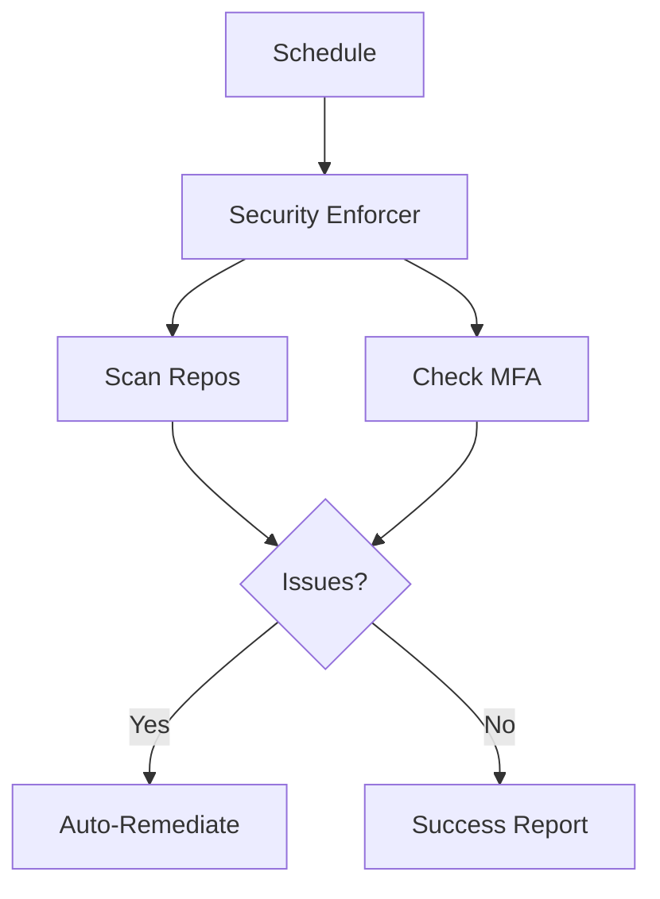

# GitHub Security Enforcer Agent

**Version**: 1.0.0  
**Purpose**: Enforce security policies via GitHub APIs

## Capabilities

- Repository security scanning
- MFA compliance checking
- Auto-remediation
- Compliance reporting

## Architecture



## Usage

```bash
python agent.py --action enforce
```

---
**Maintained by**: Codex Security Team
