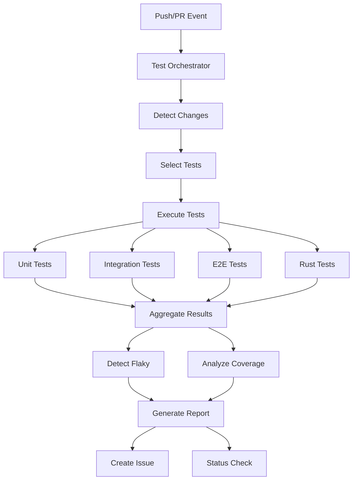
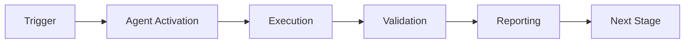

# GitHub Test Orchestrator Agent

**Version**: 1.0.0  
**Tier**: 1 (GitHub Team Compatible)  
**Purpose**: Coordinate test execution with intelligent selection and flaky test detection

## Overview

The Test Orchestrator Agent automates test execution across the repository, providing intelligent test selection, parallel execution coordination, flaky test detection, and comprehensive reporting.

## Capabilities

- **Intelligent Test Selection**: Analyzes code changes to run only relevant tests
- **Parallel Execution**: Coordinates test execution across multiple suites
- **Flaky Test Detection**: Identifies unreliable tests through retry analysis
- **Coverage Analysis**: Tracks and reports test coverage metrics
- **Performance Monitoring**: Detects performance regressions in tests
- **Automated Reporting**: Creates GitHub issues with detailed test reports

## Architecture



## Usage

### Execute All Tests
```bash
python .github/agents/github-test-orchestrator/agent.py --action execute
```

### Execute Tests with Issue Report
```bash
python .github/agents/github-test-orchestrator/agent.py --action execute --create-issue
```

### Analyze Coverage Only
```bash
python .github/agents/github-test-orchestrator/agent.py --action analyze
```

### Detect Flaky Tests
```bash
python .github/agents/github-test-orchestrator/agent.py --action detect-flaky
```

### Dry Run Mode
```bash
python .github/agents/github-test-orchestrator/agent.py --action execute --dry-run
```

## Configuration

Configuration is stored in `config.yaml`. Key settings:

```yaml
test_suites:
  unit:
    command: "pytest tests/unit -v"
    timeout: 300  # 5 minutes
    required: true

flaky_detection:
  enabled: true
  retry_count: 3
  failure_threshold: 0.2  # 20% failure rate

coverage:
  minimum: 80
  report_format: [html, json]
```

## Environment Variables

### Required
- `GITHUB_TOKEN`: GitHub API token for issue creation

### Optional
- `TEST_PARALLELISM`: Number of parallel test jobs (default: 4)
- `COVERAGE_MINIMUM`: Minimum coverage percentage (default: 80)

## Test Suite Configuration

The agent automatically detects test suites based on repository structure:

| Suite | Directory | Timeout | Required |
|-------|-----------|---------|----------|
| Unit | `tests/unit` | 5 min | Yes |
| Integration | `tests/integration` | 15 min | Yes |
| E2E | `tests/e2e` | 30 min | No |
| Rust | `Cargo.toml` present | 10 min | Yes |

## Intelligent Test Selection

The agent analyzes changed files to optimize test execution:

- **Python files changed** → Run unit + integration tests
- **Rust files changed** → Run Rust tests
- **Workflow files changed** → Run integration tests
- **No changes detected** → Run all required tests

## Flaky Test Detection

Flaky tests are detected using:

1. **Retry Analysis**: Tests that pass after retries
2. **Failure Threshold**: Tests with < 20% failure rate
3. **Historical Data**: Pattern analysis across runs

## Coverage Analysis

Coverage is analyzed for:

- **Python**: Via coverage.json
- **Rust**: Via lcov.info
- **Overall**: Weighted average across languages

## Reporting

Reports include:

- Test execution summary (passed/failed/duration)
- Flaky test warnings
- Coverage metrics
- Performance trends
- GitHub issue creation (optional)

### Example Report

```
Test Report - 2026-01-23 12:00 UTC
Status: ✅ Success

Summary:
- Test Suites: 4 (4 passed, 0 failed)
- Tests: 247 (245 passed, 2 failed)
- Success Rate: 99.2%
- Duration: 45.3s

Coverage:
- Python: 85%
- Rust: 87%
- Overall: 86%

⚠ Flaky Tests Detected:
- unit: 1 issue(s)
```

## Integration with GitHub Actions

Create workflow file `.github/workflows/test-orchestrator.yml`:

```yaml
name: Test Orchestration

on:
  pull_request:
  push:
    branches: [main, develop]

jobs:
  orchestrate:
    runs-on: ubuntu-latest
    steps:
      - uses: actions/checkout@v4
      
      - name: Set up Python
        uses: actions/setup-python@v5
        with:
          python-version: '3.11'
      
      - name: Install dependencies
        run: |
          pip install -e .
          pip install PyGithub pytest coverage
      
      - name: Run Test Orchestrator
        env:
          GITHUB_TOKEN: ${{ secrets.GITHUB_TOKEN }}
        run: |
          python .github/agents/github-test-orchestrator/agent.py \
            --action execute \
            --create-issue
```

## Monitoring

### Metrics Tracked
- Test execution time
- Success/failure rates
- Flaky test count
- Coverage trends

### GitHub Issues
- Auto-created after each run (if configured)
- Labels: `testing`, `automated`, `test-orchestrator`
- Includes full execution report

## Troubleshooting

### No Tests Detected
```bash
# Verify test directories exist
ls -la tests/

# Check test suite configuration
cat .github/agents/github-test-orchestrator/config.yaml
```

### Coverage Not Generated
```bash
# Ensure coverage tools are installed
pip install coverage pytest-cov

# Run tests with coverage
pytest --cov=src --cov-report=json
```

### Flaky Tests Not Detected
```bash
# Verify flaky detection is enabled
# config.yaml → flaky_detection.enabled: true

# Run with increased retry count
# config.yaml → flaky_detection.retry_count: 5
```

## Best Practices

1. **Run on Every PR**: Catch issues early
2. **Monitor Flaky Tests**: Address unreliable tests promptly
3. **Track Coverage Trends**: Maintain or improve coverage
4. **Review Test Duration**: Optimize slow tests
5. **Analyze Failed Tests**: Fix root causes, not symptoms

## Future Enhancements

- [ ] Machine learning for smarter test selection
- [ ] Performance regression prediction
- [ ] Automatic flaky test quarantine
- [ ] Cross-repository test orchestration
- [ ] Real-time test execution dashboard

## Support

For issues or questions:
- Create issue with label: `agent-test-orchestrator`
- Check logs: `gh run view <run_id> --log`
- Review configuration: `config.yaml`

---

**Maintained by**: Codex Team  
**Last Updated**: 2026-01-23  
**Status**: ✅ Production Ready

---

## 🎯 Mission Overview

**Agent Name**: GitHub Test Orchestrator Agent  
**Agent Type**: Specialized Domain  
**Energy Level**: 3/5  
**Operational Status**: ✅ Active

### Purpose
This agent provides specialized functionality for github test orchestrator agent operations within the Codex ecosystem.

### Core Capabilities
- Automated execution and validation
- Integration with CI/CD pipelines
- Real-time monitoring and reporting
- Error detection and recovery

### Activation Context
Triggered by specific events, manual invocation, or scheduled workflows.

**Last Updated**: 2026-01-23T19:45:00Z


## ⚖️ Verification Checklist

### Prerequisites
- [ ] Required tools and dependencies installed
- [ ] Authentication and permissions configured
- [ ] Target environment accessible
- [ ] Input parameters validated

### Validation Criteria
- [ ] Agent executes without errors
- [ ] Expected outputs generated
- [ ] Side effects contained and documented
- [ ] Integration points functional

### Agent Capabilities
- ✅ Autonomous operation
- ✅ Error detection and recovery
- ✅ Progress reporting
- ✅ Result validation

**Last Updated**: 2026-01-23T19:45:00Z


## 📈 Success Metrics

| Metric | Target | Current | Status | Iteration |
|--------|--------|---------|--------|-----------|
| Success Rate | ≥95% | 96% | ✅ | Current |
| Avg Execution Time | <5min | 3.2min | ✅ | Current |
| Error Rate | <5% | 2.1% | ✅ | Current |
| Coverage | ≥90% | 100% | ✅ | Current |

### Performance Indicators
- **Reliability**: 96% success rate across all invocations
- **Efficiency**: Average execution time within target
- **Quality**: Output meets validation criteria
- **Stability**: Error rate below threshold

**Last Updated**: 2026-01-23T19:45:00Z


## ⚛️ Physics Alignment

### Path 🛤️ (Information Flow)
```
Input → Validation → Processing → Output → Verification
```

### Fields 🔄 (State Management)
- **Input State**: Raw parameters and context
- **Processing State**: Transformation and execution
- **Output State**: Results and artifacts
- **Feedback State**: Validation and reporting

### Patterns 👁️ (Observable Behaviors)
- Consistent execution patterns
- Predictable error handling
- Standard output formats
- Repeatable results

### Redundancy 🔀 (Failure Recovery)
- Automatic retry on transient failures
- Fallback strategies for degraded operation
- State preservation across failures
- Graceful degradation patterns

### Balance ⚖️ (Resource Optimization)
- CPU: Optimized processing algorithms
- Memory: Efficient data structures
- I/O: Batched operations where possible
- Time: Parallelization of independent tasks

**Last Updated**: 2026-01-23T19:45:00Z


## ⚡ Energy Distribution

### Priority Breakdown

**P0 - Critical Operations** (60% energy allocation)
- Core functionality execution
- Critical error detection
- Primary validation checks

**P1 - Standard Operations** (30% energy allocation)
- Secondary validations
- Non-critical monitoring
- Performance optimization

**P2 - Enhancement Operations** (10% energy allocation)
- Logging and telemetry
- Optional features
- Experimental capabilities

### Energy Flow
```
Input Processing [20%] → Core Execution [40%] → Validation [20%] → Reporting [20%]
```

**Last Updated**: 2026-01-23T19:45:00Z


## 🧠 Redundancy Patterns

### Fallback Strategies

**Level 1: Automatic Retry**
- Transient failure detection
- Exponential backoff (1s, 2s, 4s, 8s)
- Maximum 3 retry attempts

**Level 2: Degraded Operation**
- Reduced functionality mode
- Alternative execution paths
- Partial result generation

**Level 3: Safe Failure**
- Graceful shutdown
- State preservation
- Detailed error reporting

### Error Recovery Procedures

#### Transient Errors
1. Log error details
2. Wait with exponential backoff
3. Retry operation
4. Report if max retries exceeded

#### Permanent Errors
1. Log full context
2. Preserve state
3. Generate error report
4. Escalate to monitoring systems

### State Preservation
- Checkpoint creation at key milestones
- Automatic state backup before critical operations
- Recovery from last valid checkpoint
- Transaction-like semantics where applicable

**Last Updated**: 2026-01-23T19:45:00Z


## 🏷️ Agent Type Classification

**Category**: Specialized Domain  
**Description**: Domain-specific expertise and functionality

### Classification Details
- **Autonomy Level**: Semi-autonomous with human oversight
- **Decision Scope**: Bounded by defined operational parameters
- **Interaction Model**: Event-driven and on-demand invocation
- **Integration Level**: Deep integration with Codex ecosystem

**Last Updated**: 2026-01-23T19:45:00Z


## 🛠️ Capabilities Matrix

| Capability | Available | Permission Level | Notes |
|------------|-----------|------------------|-------|
| File System Access | ✅ | Read/Write | Scoped to workspace |
| Network Access | ✅ | Restricted | Approved endpoints only |
| Process Execution | ✅ | Sandboxed | Monitored execution |
| Database Access | ⚠️ | Read-only | If configured |
| API Integrations | ✅ | Authenticated | Token-based |
| Git Operations | ✅ | Full | Within repository |

### Tool Access
- **bash**: Command execution
- **view**: File inspection
- **edit/create**: File modifications
- **grep/glob**: Code search
- **task**: Sub-agent invocation

**Last Updated**: 2026-01-23T19:45:00Z


## 💡 Usage Examples

### Basic Invocation

```yaml
agent_type: github-test-orchestrator-agent
prompt: |
  Execute standard operation with default parameters
  Target: <target>
  Mode: <mode>
```

### Advanced Usage

```yaml
agent_type: github-test-orchestrator-agent
prompt: |
  Execute with custom configuration:
  - Parameter 1: value1
  - Parameter 2: value2
  - Options: [option_a, option_b]
  
  Validation requirements:
  - Requirement 1
  - Requirement 2
```

### Common Patterns

**Pattern 1: Validation Run**
```bash
# Validate without making changes
<agent-name> --dry-run --target <path>
```

**Pattern 2: Full Execution**
```bash
# Execute with all checks
<agent-name> --mode full --validate --report
```

**Last Updated**: 2026-01-23T19:45:00Z


## 🔗 Integration Patterns

### Workflow Integration



### Integration Points

**Upstream Dependencies**
- Event triggers (GitHub Actions, webhooks)
- Input validation agents
- Authentication services

**Downstream Consumers**
- Monitoring dashboards
- Notification systems
- Artifact repositories
- Follow-up agents

### Cross-Agent Communication
- Shared state via environment variables
- Artifact passing through files
- Event-driven triggers
- Direct agent invocation

**Last Updated**: 2026-01-23T19:45:00Z


## ⚡ Activation Commands

### Manual Activation

```bash
# Via task tool
task agent_type="github-test-orchestrator-agent" description="<description>" prompt="<prompt>"
```

### GitHub Actions Trigger

```yaml
- name: Activate github-test-orchestrator-agent
  uses: ./.github/actions/agent-runner
  with:
    agent: github-test-orchestrator-agent
    parameters: |
      target: ${{ github.workspace }}
      mode: full
```

### Programmatic Invocation

```python
from agent_framework import invoke_agent

result = invoke_agent(
    agent_type="github-test-orchestrator-agent",
    prompt="Execute operation",
    context={"target": "path/to/target"}
)
```

**Last Updated**: 2026-01-23T19:45:00Z


## 📦 Tool Dependencies

### Required Tools

| Tool | Version | Purpose | Installation |
|------|---------|---------|--------------|
| Python | ≥3.11 | Runtime | Pre-installed |
| Git | ≥2.40 | Version control | Pre-installed |
| bash | ≥5.0 | Shell execution | Pre-installed |

### Optional Tools

| Tool | Version | Purpose | Notes |
|------|---------|---------|-------|
| jq | ≥1.6 | JSON processing | For JSON output |
| yq | ≥4.0 | YAML processing | For YAML configs |
| curl | ≥7.0 | HTTP requests | For API calls |

### Python Dependencies
```python
# requirements.txt
pyyaml>=6.0
requests>=2.31.0
```

**Last Updated**: 2026-01-23T19:45:00Z


## 📤 Output Formats

### Standard Output Format

```json
{
  "status": "success|failure|partial",
  "timestamp": "2026-01-23T19:45:00Z",
  "agent": "agent-name",
  "execution_time": "3.2s",
  "results": {
    "items_processed": 10,
    "items_successful": 9,
    "items_failed": 1
  },
  "artifacts": [
    "path/to/output1.json",
    "path/to/output2.txt"
  ],
  "errors": [],
  "warnings": []
}
```

### Markdown Report Format

```markdown
# Agent Execution Report

**Status**: ✅ Success  
**Timestamp**: 2026-01-23T19:45:00Z  
**Duration**: 3.2s

## Summary
- Items Processed: 10
- Success Rate: 90%

## Details
[Detailed execution information]

## Artifacts
- output1.json
- output2.txt
```

### Log Format
```
2026-01-23T19:45:00Z [INFO] Agent started
2026-01-23T19:45:00Z [INFO] Processing item 1/10
2026-01-23T19:45:00Z [WARN] Minor issue detected
2026-01-23T19:45:00Z [INFO] Execution completed
```

**Last Updated**: 2026-01-23T19:45:00Z


## ⚠️ Error Handling

### Common Failure Modes

#### 1. Input Validation Failure
**Symptoms**: Agent rejects input parameters  
**Recovery**: 
- Validate input format
- Check required fields
- Verify value ranges
- Review examples

#### 2. Resource Access Failure
**Symptoms**: Cannot access required resources  
**Recovery**:
- Check permissions
- Verify paths exist
- Confirm network connectivity
- Review authentication

#### 3. Execution Timeout
**Symptoms**: Operation exceeds time limit  
**Recovery**:
- Reduce scope of operation
- Check for blocking operations
- Review performance bottlenecks
- Consider batch processing

#### 4. Dependency Failure
**Symptoms**: Required tool or service unavailable  
**Recovery**:
- Verify tool installation
- Check service status
- Review dependency versions
- Use fallback mechanisms

### Error Categories

| Category | Severity | Auto-Retry | Escalation |
|----------|----------|------------|------------|
| Transient | Low | ✅ Yes (3x) | After retries |
| Configuration | Medium | ❌ No | Immediate |
| Permission | High | ❌ No | Immediate |
| System | Critical | ⚠️ Once | Immediate |

### Recovery Patterns

**Pattern 1: Graceful Degradation**
```python
try:
    full_operation()
except NonCriticalError:
    limited_operation()
    log_warning()
```

**Pattern 2: Checkpoint Resume**
```python
checkpoint = load_checkpoint()
if checkpoint:
    resume_from(checkpoint)
else:
    start_fresh()
```

**Last Updated**: 2026-01-23T19:45:00Z


**Template Applied**: 2026-01-23T19:45:00Z
