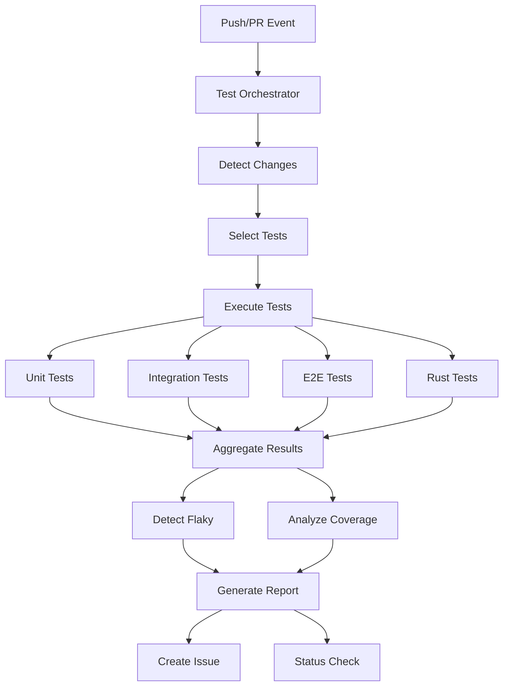

# GitHub Test Orchestrator Agent

**Version**: 1.0.0  
**Tier**: 1 (GitHub Team Compatible)  
**Purpose**: Coordinate test execution with intelligent selection and flaky test detection

## Overview

The Test Orchestrator Agent automates test execution across the repository, providing intelligent test selection, parallel execution coordination, flaky test detection, and comprehensive reporting.

## Capabilities

- **Intelligent Test Selection**: Analyzes code changes to run only relevant tests
- **Parallel Execution**: Coordinates test execution across multiple suites
- **Flaky Test Detection**: Identifies unreliable tests through retry analysis
- **Coverage Analysis**: Tracks and reports test coverage metrics
- **Performance Monitoring**: Detects performance regressions in tests
- **Automated Reporting**: Creates GitHub issues with detailed test reports

## Architecture



## Usage

### Execute All Tests
```bash
python .github/agents/github-test-orchestrator/agent.py --action execute
```

### Execute Tests with Issue Report
```bash
python .github/agents/github-test-orchestrator/agent.py --action execute --create-issue
```

### Analyze Coverage Only
```bash
python .github/agents/github-test-orchestrator/agent.py --action analyze
```

### Detect Flaky Tests
```bash
python .github/agents/github-test-orchestrator/agent.py --action detect-flaky
```

### Dry Run Mode
```bash
python .github/agents/github-test-orchestrator/agent.py --action execute --dry-run
```

## Configuration

Configuration is stored in `config.yaml`. Key settings:

```yaml
test_suites:
  unit:
    command: "pytest tests/unit -v"
    timeout: 300  # 5 minutes
    required: true

flaky_detection:
  enabled: true
  retry_count: 3
  failure_threshold: 0.2  # 20% failure rate

coverage:
  minimum: 80
  report_format: [html, json]
```

## Environment Variables

### Required
- `GITHUB_TOKEN`: GitHub API token for issue creation

### Optional
- `TEST_PARALLELISM`: Number of parallel test jobs (default: 4)
- `COVERAGE_MINIMUM`: Minimum coverage percentage (default: 80)

## Test Suite Configuration

The agent automatically detects test suites based on repository structure:

| Suite | Directory | Timeout | Required |
|-------|-----------|---------|----------|
| Unit | `tests/unit` | 5 min | Yes |
| Integration | `tests/integration` | 15 min | Yes |
| E2E | `tests/e2e` | 30 min | No |
| Rust | `Cargo.toml` present | 10 min | Yes |

## Intelligent Test Selection

The agent analyzes changed files to optimize test execution:

- **Python files changed** → Run unit + integration tests
- **Rust files changed** → Run Rust tests
- **Workflow files changed** → Run integration tests
- **No changes detected** → Run all required tests

## Flaky Test Detection

Flaky tests are detected using:

1. **Retry Analysis**: Tests that pass after retries
2. **Failure Threshold**: Tests with < 20% failure rate
3. **Historical Data**: Pattern analysis across runs

## Coverage Analysis

Coverage is analyzed for:

- **Python**: Via coverage.json
- **Rust**: Via lcov.info
- **Overall**: Weighted average across languages

## Reporting

Reports include:

- Test execution summary (passed/failed/duration)
- Flaky test warnings
- Coverage metrics
- Performance trends
- GitHub issue creation (optional)

### Example Report

```
Test Report - 2024-01-16 12:00 UTC
Status: ✅ Success

Summary:
- Test Suites: 4 (4 passed, 0 failed)
- Tests: 247 (245 passed, 2 failed)
- Success Rate: 99.2%
- Duration: 45.3s

Coverage:
- Python: 85%
- Rust: 87%
- Overall: 86%

⚠ Flaky Tests Detected:
- unit: 1 issue(s)
```

## Integration with GitHub Actions

Create workflow file `.github/workflows/test-orchestrator.yml`:

```yaml
name: Test Orchestration

on:
  pull_request:
  push:
    branches: [main, develop]

jobs:
  orchestrate:
    runs-on: ubuntu-latest
    steps:
      - uses: actions/checkout@v4
      
      - name: Set up Python
        uses: actions/setup-python@v5
        with:
          python-version: '3.11'
      
      - name: Install dependencies
        run: |
          pip install -e .
          pip install PyGithub pytest coverage
      
      - name: Run Test Orchestrator
        env:
          GITHUB_TOKEN: ${{ secrets.GITHUB_TOKEN }}
        run: |
          python .github/agents/github-test-orchestrator/agent.py \
            --action execute \
            --create-issue
```

## Monitoring

### Metrics Tracked
- Test execution time
- Success/failure rates
- Flaky test count
- Coverage trends

### GitHub Issues
- Auto-created after each run (if configured)
- Labels: `testing`, `automated`, `test-orchestrator`
- Includes full execution report

## Troubleshooting

### No Tests Detected
```bash
# Verify test directories exist
ls -la tests/

# Check test suite configuration
cat .github/agents/github-test-orchestrator/config.yaml
```

### Coverage Not Generated
```bash
# Ensure coverage tools are installed
pip install coverage pytest-cov

# Run tests with coverage
pytest --cov=src --cov-report=json
```

### Flaky Tests Not Detected
```bash
# Verify flaky detection is enabled
# config.yaml → flaky_detection.enabled: true

# Run with increased retry count
# config.yaml → flaky_detection.retry_count: 5
```

## Best Practices

1. **Run on Every PR**: Catch issues early
2. **Monitor Flaky Tests**: Address unreliable tests promptly
3. **Track Coverage Trends**: Maintain or improve coverage
4. **Review Test Duration**: Optimize slow tests
5. **Analyze Failed Tests**: Fix root causes, not symptoms

## Future Enhancements

- [ ] Machine learning for smarter test selection
- [ ] Performance regression prediction
- [ ] Automatic flaky test quarantine
- [ ] Cross-repository test orchestration
- [ ] Real-time test execution dashboard

## Support

For issues or questions:
- Create issue with label: `agent-test-orchestrator`
- Check logs: `gh run view <run_id> --log`
- Review configuration: `config.yaml`

---

**Maintained by**: Codex Team  
**Last Updated**: 2024-01-16  
**Status**: ✅ Production Ready
