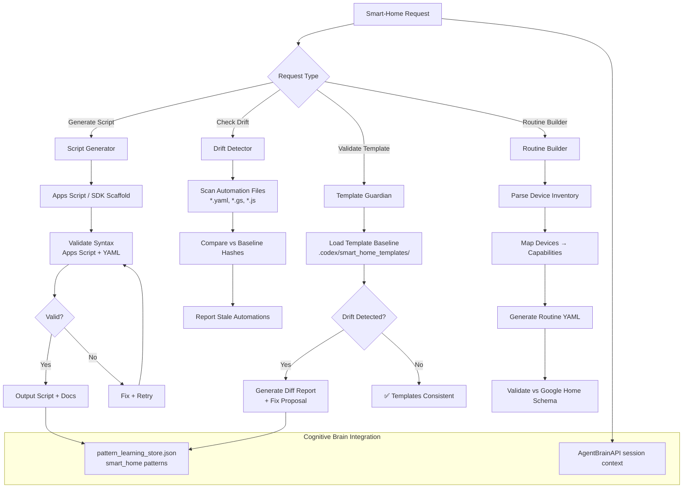

# ⚠️ DEPRECATED: Google Home Script Agent v1.0

> **Status**: 🗑️ Archived 2026-07-01
> 
> This agent is no longer maintained or available for use. See [`GOOGLE_HOME_SCRIPT_AGENT_DEPRECATION.md`](../../GOOGLE_HOME_SCRIPT_AGENT_DEPRECATION.md) for rationale and archive information.

---

# Original Documentation (Archived)

> Production-ready Copilot custom agent for generating and validating
> Google Home automation scripts, detecting template drift, and enforcing
> smart-home scripting best practices across the codebase.

## Architecture

```
User Request → Script Generator → Template Guardian → Validator → Output
```

### Full Integration Diagram



## Capabilities

### 1. Script Generation
Generate Google Apps Script or Google Home SDK scripts for:
- Device control (lights, thermostats, locks, cameras)
- Scheduled automations (time-based, event-based)
- Multi-device routines (scenes, sequences)
- Webhook integrations (IFTTT, Home Assistant bridge)

### 2. Template Guardian
Monitor and enforce consistency of smart-home automation templates:
- Track `.codex/smart_home_templates/` baseline hashes
- Detect stale/drifted automations vs. approved templates
- Auto-generate fix proposals for drifted templates
- Integrate with `sync_tracked_files.py` for baseline management

### 3. Validation Pipeline
Validate generated scripts before deployment:
- **Syntax check**: `clasp lint` for Apps Script, YAML schema validation
- **Capability check**: verify device capabilities match requested actions
- **Security scan**: check for exposed credentials, hardcoded tokens
- **Dry-run mode**: simulate automation execution without device changes

### 4. Routine Builder
Build structured Google Home routines from natural language:
- Parse device inventory (provided via prompt context)
- Map natural language actions to Google Home capabilities
- Generate compliant YAML automation definitions
- Validate against Google Home Schema v2

## Activation Commands

```
@copilot Use the Google Home Script Agent to generate a morning routine automation
@copilot Use the Google Home Script Agent to validate all automation templates
@copilot Use the Google Home Script Agent to check for smart-home template drift
@copilot Use the Google Home Script Agent to build a device routine for [description]
```

## Template Guardian Protocol

The template guardian enforces these invariants:

1. **Baseline Registry**: `.codex/smart_home_templates/registry.yaml` — lists
   all managed templates with their SHA256 fingerprints.
2. **Drift Detection**: Any automation file whose hash diverges from the registry
   is flagged as "drifted" and a fix proposal is generated.
3. **Auto-Sync**: Running `--fix` mode updates the registry after human approval.
4. **CI Gate**: Template drift check runs in `pre-merge-validation.yml` alongside
   the Mermaid drift check.

### Sample Template Registry Format

```yaml
# .codex/smart_home_templates/registry.yaml
version: "1.0"
templates:
  morning_routine:
    path: automations/morning_routine.yaml
    sha256: "<hash>"
    last_validated: "2026-03-25"
    owner: "@mbaetiong"
  security_arm:
    path: automations/security_arm.yaml
    sha256: "<hash>"
    last_validated: "2026-03-25"
    owner: "@mbaetiong"
```

## Script Templates

### Basic Device Control (Google Home SDK — Node.js)

```javascript
/**
 * Google Home Script: Control a single device
 * Generated by: google-home-script-agent v1.0
 * NOTE: This uses the Google Home SDK (Node.js). For Google Apps Script,
 * use UrlFetchApp.fetch() with the Smart Device Management API instead.
 */
const { HomeApp } = require('@google/home-app');

const app = new HomeApp();

async function controlDevice(deviceId, command, params) {
  // HOME_GRAPH_TOKEN should be stored in environment variables,
  // never hardcoded. In Apps Script, use PropertiesService.
  const home = await app.getHome(process.env.HOME_GRAPH_TOKEN);
  const device = await home.device(deviceId);
  return device.executeCommand(command, params);
}

// Example: Turn on living room light
controlDevice('living_room_light', 'action.devices.commands.OnOff', {
  on: true
});
```

### YAML Automation Template

```yaml
# Google Home Automation Template
# Generated by: google-home-script-agent v1.0
automation:
  name: "Morning Routine"
  trigger:
    type: time
    at: "07:00"
    days: [mon, tue, wed, thu, fri]
  actions:
    - device: living_room_lights
      command: OnOff
      params:
        on: true
    - device: thermostat
      command: ThermostatTemperatureSetpoint
      params:
        thermostatTemperatureSetpoint: 22
    - delay: 300  # 5 minutes
    - device: coffee_maker
      command: StartStop
      params:
        start: true
```

## Integration with CI/CD

The smart-home template guardian integrates with the existing CI pipeline:

```yaml
# .github/workflows/pre-merge-validation.yml addition
- name: Smart-home template drift check
  id: smart_home_check
  run: |
    if [ -f ".codex/smart_home_templates/registry.yaml" ]; then
      python3 scripts/ci/check_smart_home_templates.py --check
    else
      echo "No smart-home templates registered — skip"
    fi
  continue-on-error: true
```

## Security Guidelines

1. **Never hardcode tokens** — use `${{ secrets.HOME_GRAPH_TOKEN }}` in workflows
2. **Validate device IDs** — always verify device IDs against the home graph before commands
3. **Scope permissions minimally** — request only `homegraph` scope, not `cloud-platform`
4. **Audit trail** — all generated scripts include a `# Generated by:` header for traceability

## Output Formats

- **Apps Script** (`.gs`): JavaScript for Google Apps Script
- **Home SDK** (`.js`): Node.js for Google Home SDK
- **YAML automations** (`.yaml`): Device automation definitions
- **Routine JSON** (`.json`): Google Home routine export format

## Related Agents

- `ci-testing-agent.md` — CI/CD pipeline validation
- `code-analysis-agent.md` — static analysis of generated scripts
- `security-audit-agent.md` — security scanning for credentials/tokens
- `config-validator.md` — YAML schema validation

---

_Agent designed per `.github/agents/AGENT_DEVELOPMENT_GUIDE.md` conventions._
_Phase 8 P5 — S201 PR #3743._
