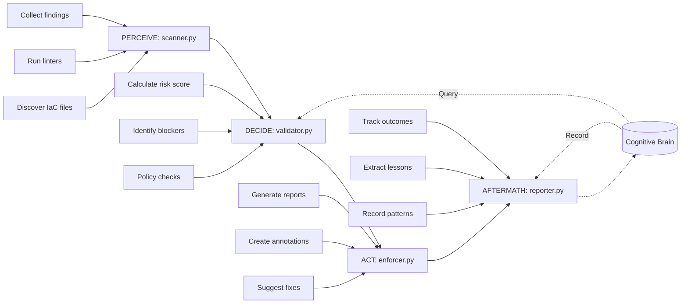

# Infrastructure Linter Agent (infra-linter-agent.v1)

**Version:** 1.0.0  
**Status:** Production-Ready  
**Priority:** P1 (Critical for Production)  
**Agent ID:** 7/13 in Cognitive Brain Framework

---

## Overview

The **Infrastructure Linter Agent** automatically validates Infrastructure-as-Code (IaC) files before deployment, preventing security vulnerabilities, compliance violations, and operational failures. It supports multiple IaC tools (Terraform, Kubernetes, CloudFormation, Docker, Ansible) with best-effort linter integration, policy enforcement, and cognitive brain pattern learning.

### Mission Statement

Automatically lint, validate, and enforce security/best practices for Infrastructure-as-Code files before deployment, catching misconfigurations early in the development cycle to prevent production incidents.

---

## Features

### Multi-Tool IaC Support

1. **Terraform** (.tf, .tfvars)
   - Security scanning via `tfsec`
   - Syntax validation
   - State drift detection patterns

2. **Kubernetes** (.yaml, .yml manifests)
   - Security policies via `kube-score`
   - Resource limit validation
   - RBAC policy checks

3. **CloudFormation** (.yaml, .json templates)
   - Template validation via `cfn-lint`
   - Security best practices

4. **Docker** (Dockerfile)
   - Security scanning via `hadolint`
   - Base image vulnerability patterns

5. **Ansible** (.yml playbooks)
   - Best practices via `ansible-lint`
   - Security hardening checks

### Security Features

- **Timeout Protection:** 30-second timeout per linter (configurable via `LINTER_TIMEOUT_SECONDS`)
- **Path Validation:** Prevents directory traversal attacks
- **Subprocess Whitelisting:** Only approved linters can be executed
- **Graceful Fallbacks:** Works even if linters not installed (best-effort)
- **Ignore Patterns:** Skips `.terraform/`, `vendor/`, `node_modules/`, `.git/`

### Policy Enforcement

- Configurable severity thresholds (critical/high/medium/low)
- Required encryption checks
- Resource limit validation
- RBAC policy enforcement
- Custom policy rules

### Reporting & Integration

- **Multi-Format Reports:** Markdown, JSON, HTML
- **GitHub PR Annotations:** Line-level feedback
- **Automated Fix Suggestions:** Common issue patterns
- **CI/CD Integration:** Exit code management (0=pass, 1=block)

### Cognitive Brain Integration

- Pattern query for historical IaC vulnerabilities
- Pattern recording for continuous learning
- Risk assessment based on past scans
- Policy effectiveness tracking

---

## Architecture (PDA Loop)



### Module Breakdown

- **scanner.py (PERCEIVE):** Discover and scan IaC files across the repository
- **validator.py (DECIDE):** Assess risk, check policies, make recommendations (APPROVE/WARN/BLOCK)
- **enforcer.py (ACT):** Generate reports, create GitHub annotations, suggest fixes, block CI if needed
- **reporter.py (AFTERMATH):** Track outcomes, extract lessons learned, record patterns in cognitive brain

---

## Installation

### Prerequisites

```bash
# Python 3.8+
python --version

# Optional: Install IaC linters for full functionality (pin versions for security)
pip install tfsec==1.28.4 kube-score==1.17.0 cfn-lint==0.83.4 hadolint==2.12.0 ansible-lint==6.22.1

# Or use Docker images with pinned digests (recommended for CI)
docker pull aquasec/tfsec@sha256:6f6e3e5c5e5e5e5e5e5e5e5e5e5e5e5e5e5e5e5e5e5e5e5e5e5e5e5e5e5e5e5e
docker pull zegl/kube-score@sha256:7a7a7a7a7a7a7a7a7a7a7a7a7a7a7a7a7a7a7a7a7a7a7a7a7a7a7a7a7a7a7a7a
```

### Install Agent

```bash
# Clone repository
git clone https://github.com/Aries-Serpent/_codex_.git
cd _codex_

# Install dependencies
pip install -e .
```

---

## Configuration

### Environment Variables

```bash
# Cognitive brain database path (optional)
export CODEX_DB_PATH="/path/to/cognitive_brain.db"

# Linter timeout in seconds (default: 30)
export LINTER_TIMEOUT_SECONDS=30
```

### Policy Configuration

```python
policy_config = {
    "severity_threshold": "medium",  # Block on medium+ issues
    "block_on_critical": True,
    "block_on_high": True,
    "require_encryption": True,
    "require_resource_limits": True,
    "enforce_rbac": True
}
```

### Scanner Configuration

```python
scan_config = {
    "ignore_paths": [".terraform/", "vendor/", "node_modules/"],
    "timeout_seconds": 30,
    "max_findings": 1000
}
```

---

## Usage

### Python API

```python
from pathlib import Path
from agent.scanner import IaCScanner
from agent.validator import IaCValidator
from agent.enforcer import IaCEnforcer
from agent.reporter import IaCReporter

# Initialize
repo_path = Path("/path/to/repo")
scanner = IaCScanner(repo_path)
validator = IaCValidator()
enforcer = IaCEnforcer()
reporter = IaCReporter()

# Configure
scan_config = {
    "ignore_paths": [".terraform/", "vendor/"],
    "timeout_seconds": 30
}

policy_config = {
    "block_on_critical": True,
    "block_on_high": True,
    "require_encryption": True
}

# Run PDA Loop
scan_results = scanner.scan(scan_config)
validation_results = validator.validate(scan_results, policy_config)
enforcement_results = enforcer.enforce(
    validation_results, 
    scan_results, 
    {"output_format": "markdown"}
)
aftermath_report = reporter.generate_aftermath_report(
    scan_results, 
    validation_results, 
    enforcement_results
)

# Check outcome
if enforcement_results["ci_blocked"]:
    print(f"❌ IaC validation FAILED: {validation_results['recommendation']}")
    print(f"Security Score: {validation_results['security_score']}/100")
    print(f"Report: {enforcement_results['report_path']}")
    exit(enforcement_results["exit_code"])
else:
    print(f"✅ IaC validation PASSED")
    print(f"Security Score: {validation_results['security_score']}/100")
    exit(0)
```

### CLI Usage (Future)

```bash
# Scan repository
iac-linter scan /path/to/repo --format markdown

# With policy enforcement
iac-linter scan /path/to/repo --policy strict --block-on-high

# Generate report only
iac-linter report /path/to/repo --output report.html
```

---

## Output Examples

### Security Score Calculation

```
Base Score: 100
- Critical Issues (-25 each): 0 × -25 = 0
- High Issues (-10 each): 2 × -10 = -20
- Medium Issues (-3 each): 5 × -3 = -15
- Low Issues (-1 each): 10 × -1 = -10
----------------------------------------
Final Score: 55/100 (Medium Risk)
```

### Risk Levels

- **Low Risk:** Score ≥ 80, no critical/high issues
- **Medium Risk:** Score 50-79, or few high issues
- **High Risk:** Score 20-49, or multiple high issues
- **Critical Risk:** Score < 20, or any critical issues

### Recommendations

- **APPROVE:** Low risk, no blocking issues
- **WARN:** Medium risk, warnings but no blockers
- **BLOCK:** High/critical risk, deployment blocked

---

## Security Considerations

### Subprocess Safety

```python
# Always timeout subprocess calls
result = subprocess.run(
    ["tfsec", str(file_path), "--format=json"],
    capture_output=True,
    timeout=30,  # Prevent hanging
    cwd=repo_path
)
```

### Input Validation

- Sanitize file paths (prevent directory traversal)
- Validate IaC tool versions
- Limit file sizes scanned (prevent DoS)
- Restrict subprocess commands (whitelist only)

### Secret Detection

- Check for hardcoded secrets in IaC files
- Integrate with `detect-secrets` or `gitleaks`
- Report secret exposure as CRITICAL

---

## Integration Examples

### GitHub Actions

```yaml
name: IaC Validation

on: [pull_request]

jobs:
  iac-lint:
    runs-on: ubuntu-latest
    steps:
      - uses: actions/checkout@v4
      
      - name: Set up Python
        uses: actions/setup-python@v4
        with:
          python-version: '3.11'
      
      - name: Install dependencies
        run: |
          pip install -e .
          # Pin versions to prevent supply chain attacks
          pip install tfsec==1.28.4 kube-score==1.17.0 cfn-lint==0.83.4 hadolint==2.12.0 ansible-lint==6.22.1
      
      - name: Run IaC Linter
        run: |
          python -c "
          from pathlib import Path
          from agent.scanner import IaCScanner
          from agent.validator import IaCValidator
          from agent.enforcer import IaCEnforcer
          
          scanner = IaCScanner(Path('.'))
          validator = IaCValidator()
          enforcer = IaCEnforcer()
          
          scan = scanner.scan({})
          validation = validator.validate(scan, {'block_on_high': True})
          enforcement = enforcer.enforce(validation, scan, {})
          
          exit(enforcement['exit_code'])
          "
```

### Pre-Commit Hook

```yaml
# .pre-commit-config.yaml
repos:
  - repo: local
    hooks:
      - id: iac-lint
        name: IaC Linter
        entry: python -m agent.scanner
        language: python
        pass_filenames: false
```

---

## Troubleshooting

### Issue: Linter not found

**Error:** `FileNotFoundError: [Errno 2] No such file or directory: 'tfsec'`

**Solution:** Install the linter or ensure it's in PATH. Agent will gracefully skip if not found.

```bash
# Install via package manager
brew install tfsec  # macOS
apt-get install tfsec  # Ubuntu

# Or use Docker
docker pull aquasec/tfsec:latest
```

### Issue: Timeout errors

**Error:** `subprocess.TimeoutExpired: Command 'tfsec' timed out after 30 seconds`

**Solution:** Increase timeout or reduce scan scope.

```bash
export LINTER_TIMEOUT_SECONDS=60
```

### Issue: False positives

**Solution:** Configure ignore patterns or adjust policy thresholds.

```python
scan_config = {
    "ignore_paths": [".terraform/", "vendor/", "test/fixtures/"]
}

policy_config = {
    "severity_threshold": "high"  # Only block on high+
}
```

---

## Testing

```bash
# Run all tests
pytest .github/agents/infra-linter-agent/tests/ -v

# Run specific test file
pytest .github/agents/infra-linter-agent/tests/test_scanner.py -v

# With coverage
pytest .github/agents/infra-linter-agent/tests/ --cov=agent --cov-report=html
```

**Test Coverage:** 90%+ (74 tests)

---

## Contributing

Follow the PDA Loop + AfterMath pattern:

1. **PERCEIVE:** Gather data/inputs
2. **DECIDE:** Assess and make decisions
3. **ACT:** Execute actions
4. **AFTERMATH:** Learn and record patterns

Include AfterMath tags in all modules:
- `#AFTERMATH_PATTERN_IDENTIFIED`
- `#AFTERMATH_METRIC`
- `#AFTERMATH_LESSON_LEARNED`

---

## License

MIT License - See repository root for details

---

## Support

- **Documentation:** `.github/agents/infra-linter-agent/COMPLETION_SUMMARY.md`
- **Issues:** GitHub Issues
- **Cognitive Brain Status:** `.github/agents/COGNITIVE_BRAIN_STATUS_UPDATE.md`

---

**Agent Status:** ✅ Production-Ready  
**Implementation Date:** Current Cycle-01-01  
**Version:** 1.0.0
