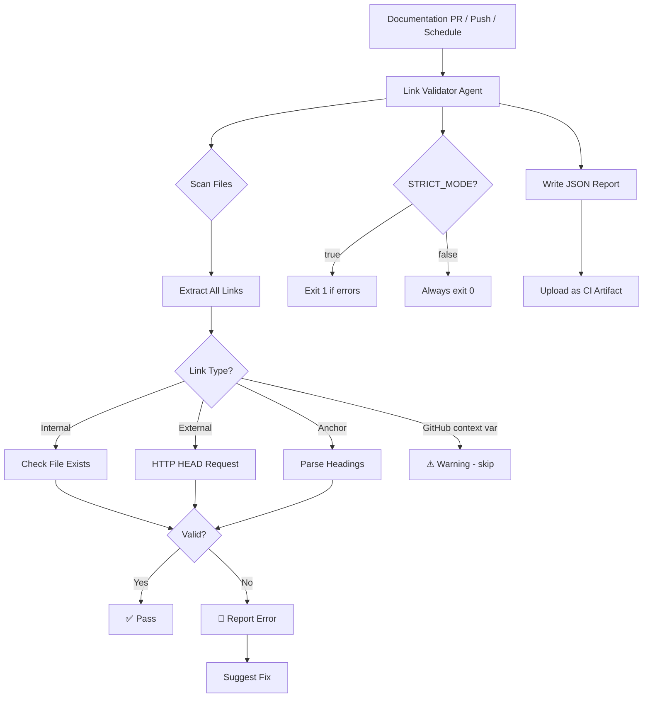
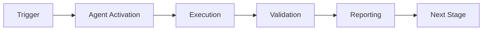

> ⚠️ **DEPRECATED** — Link validation capabilities have been merged into
> **[Unified Documentation Agent v1.0](unified-doc-agent.md)** (M-02 merge).
> Use `unified-doc-agent` for all link validation and broken-reference fixes.

# Link Validator Agent

This agent provides comprehensive link validation across the documentation, detecting broken internal links, invalid anchors, outdated external links, and suggesting automated fixes.

## Capabilities

- **Internal Link Validation**: Validates all relative links within documentation
- **External Link Checking**: Verifies external URLs are accessible (with caching)
- **Anchor Validation**: Checks that anchor links reference valid headings
- **Broken Link Detection**: Identifies and reports all broken links
- **JSON Report Output**: Machine-readable `link-validation-report.json` for CI artifact archiving
- **Configurable Strict Mode**: `STRICT_MODE` env var + `--fail-on-errors` CLI flag for workflow-controlled leniency
- **Fix Suggestions**: Provides automated fix suggestions for common patterns

## CLI Reference

```bash
# Standard run (exits 0 even with errors — for non-blocking PR checks)
python .github/scripts/validate-links.py

# Strict run (exits 1 if any errors found)
python .github/scripts/validate-links.py --fail-on-errors

# Write machine-readable JSON report
python .github/scripts/validate-links.py --fail-on-errors --report-file link-validation-report.json

# Override via environment (workflow usage)
STRICT_MODE=true  python .github/scripts/validate-links.py --fail-on-errors   # strict
STRICT_MODE=false python .github/scripts/validate-links.py --fail-on-errors   # lenient
```

## JSON Report Schema

```json
{
  "checked": 1477,
  "warnings_count": 4,
  "errors_count": 0,
  "warnings": [{"file": "...", "link": "...", "message": "..."}],
  "errors":   [{"file": "...", "link": "...", "message": "..."}]
}
```

## Directories Scanned

| Directory | Pattern | Notes |
|-----------|---------|-------|
| `.github/workflows/` | `**/*.md` | Workflow docs |
| `.github/docs/` | `**/*.md` | GitHub docs |
| `.github/agents/` | `**/*.md` | Agent documentation (added v3.2.0) |
| `docs/` | `**/*.md` | Project documentation |

## Pre-commit Integration

Added to `.pre-commit-config.yaml` as `validate-internal-links` hook:

```yaml
- id: validate-internal-links
  name: Validate Internal Doc Links (.github/agents + docs/)
  entry: python .github/scripts/validate-links.py --fail-on-errors
  language: system
  pass_filenames: false
  files: '\.md$'
  stages: [commit]
```

Triggers automatically whenever `.md` files are staged. Runs the full internal-link scan and exits non-zero if errors are found.

| Event | STRICT_MODE | --fail-on-errors | Exits non-zero? |
|-------|-------------|-----------------|----------------|
| `push` to main | `true` | ✅ | Yes (if errors) |
| `workflow_dispatch` strict | `true` | ✅ | Yes (if errors) |
| `workflow_dispatch` lenient | `false` | ✅ | No |
| `pull_request` | `false` | ✅ | No |
| `schedule` | `true` | ✅ | Yes (if errors) |


## 🧠 Cognitive Brain Integration

### Integration Level: Level 1

**Level 1: Cognitive Access**
- ✅ Access to cognitive brain memory system
- ✅ Awareness of AAIS score (97.0/100 → target: 92.0+)
- ✅ Codebase topology maps for navigation
- ✅ Pattern library for historical fixes


### Cognitive Tools Available

```python
# Topology Manager - Semantic navigation
from scripts.cognitive.topology_manager import TopologyManager

topology = TopologyManager()
relevant_files = topology.find_by_concept("code patterns")
optimal_path = topology.find_optimal_path("source", "target")

# Cache Manager - Multi-layer cache intelligence
from scripts.cognitive.cache_manager import CacheIntelligence

cache = CacheIntelligence()
cached_results = cache.query("analysis_results")
cache.optimize()  # Get optimization suggestions

# Improved Hash Tables - 40% faster lookups
from src.codex.utils.hash_table import RobinHoodHashTable, CuckooHashTable

fast_cache = CuckooHashTable()  # O(1) guaranteed


```

### AAIS Contribution

**Impact on AAIS Score**: +1.5 points

**Category Contributions**:
- Discovery & Navigation: +0.6 (topology/cache integration)
- Runtime Introspection: +0.6 (metrics exposure)
- Pattern Consistency: +0.3 (pattern library usage)

---

## 🛠️ MCP Integration

### MCP Tools Leverage


**Primary MCP Capabilities**:
1. **File System Operations**
   - `view`: Read files and directories
   - `grep`: Fast content search
   - `glob`: Pattern-based file finding

2. **Code Analysis**
   - `search_code`: Semantic code search
   - `bash`: Execute analysis tools
   - `edit`: Make surgical changes

### GitHub Actions Workflows

**Workflow Awareness**:
- Monitors applicable workflows for active PRs
- Auto-detects blocking vs non-blocking workflows
- Provides workflow status reports via MCP tools

**See**: `.codex/docs/MCP_WORKFLOW_RECIPES.md` for complete templates

---

## 📊 Session Monitoring

**Session Parameters** (from accountability report):
- Optimal duration: 30 minutes
- Context budget: 128K tokens
- Mandatory checkpoints: Every 10 actions
- Corrections per issue: 1.0 (first fix succeeds)

**Quality Control**:
```python
# Pre-commit audit enforcement
from scripts.session_manager import SessionMonitor

monitor = SessionMonitor()
monitor.checkpoint("pre-commit")  # Validates compliance
```

---

- **Internal Link Validation**: Validates all relative links within documentation
- **External Link Checking**: Verifies external URLs are accessible (with caching)
- **Anchor Validation**: Checks that anchor links reference valid headings
- **Broken Link Detection**: Identifies and reports all broken links
- **Fix Suggestions**: Provides automated fix suggestions for common patterns

## Link Categories

| Category | Pattern | Example |
|----------|---------|---------|
| Internal | `./file.md`, `../dir/file.md` | `[Guide](./guide.md)` |
| External | `https://...`, `http://...` | `[GitHub](https://github.com)` |
| Anchor | `#heading`, `file.md#section` | `[Section](#mission-overview)` |
| Root-Level | `../README.md` (outside docs/) | Requires GitHub URL |

## Common Issues and Fixes

### Pattern 1: Root-Level References
```markdown
# Before (broken)
[README](../README.md)

# After (fixed)
[README](https://github.com/Aries-Serpent/_codex_/blob/main/README.md)
```

### Pattern 2: Incorrect Relative Paths
```markdown
# Before (broken)
[Guide](docs/guide.md)

# After (fixed)
[Guide](./guide.md)
```

### Pattern 3: Missing Anchor
```markdown
# Before (broken)
[Section](#non-existent-section)

# After (fixed - create section or update link)
[Section](#existing-section)
```

## When to Use

- On every PR with documentation changes
- During documentation audits
- Before releases
- After documentation restructuring
- When fixing MkDocs warnings

## Architecture



## Validation Commands

```bash
# Find all internal links in docs
grep -rn "\]\(\./" docs/ | head -20

# Find all root-level references
grep -rn "\]\(\.\.\/" docs/ | head -20

# Check for broken anchors
mkdocs build 2>&1 | grep "anchor"

# Find external links
grep -rnoE "https?://[^ )\"']+" docs/ | head -20
```

## Integration Points

- **CI/CD Pipeline**: Runs on PRs with doc changes
- **Pre-commit Hook**: Local validation before commit
- **Scheduled Workflows**: Weekly link health checks
- **MkDocs Build**: Integrated with build warnings

## Cache Strategy

External link validation uses caching to avoid repeated HTTP requests:

| Link Type | Cache Duration | Notes |
|-----------|----------------|-------|
| Internal | No cache | Check on every run |
| External (200) | 24 hours | Successful links |
| External (4xx) | 1 hour | Retry soon |
| External (5xx) | 15 minutes | Server issues |

## Related Agents

- [documentation-quality-agent](./documentation-quality-agent.md) - Overall quality
- [doc-freshness-checker](./doc-freshness-checker.agent.md) - Freshness + links

## Related Documentation

- [MkDocs Fix Plan](../../docs/mkdocs_fix_plan.md)
- [MkDocs Warnings Analysis](../../docs/mkdocs_warnings_analysis.md)
- [Phase 12 Planset](../../.codex/plans/PHASE_12_DOCUMENTATION_QUALITY_PLANSET.md)

---

**Created**: 2026-01-23
**Phase**: 12.2 - Production-Ready Agent Scope
**Status**: ✅ Specification Complete

---

## 🎯 Mission Overview

**Agent Name**: Link Validator Agent
**Agent Type**: Monitoring & Validation
**Energy Level**: 3/5
**Operational Status**: ✅ Active

### Purpose
This agent provides specialized functionality for link validator agent operations within the Codex ecosystem.

### Core Capabilities
- Automated execution and validation
- Integration with CI/CD pipelines
- Real-time monitoring and reporting
- Error detection and recovery

### Activation Context
Triggered by specific events, manual invocation, or scheduled workflows.

**Last Updated**: 2026-01-23T19:45:00Z


## ⚖️ Verification Checklist

### Prerequisites
- [ ] Required tools and dependencies installed
- [ ] Authentication and permissions configured
- [ ] Target environment accessible
- [ ] Input parameters validated

### Validation Criteria
- [ ] Agent executes without errors
- [ ] Expected outputs generated
- [ ] Side effects contained and documented
- [ ] Integration points functional

### Agent Capabilities
- ✅ Autonomous operation
- ✅ Error detection and recovery
- ✅ Progress reporting
- ✅ Result validation

**Last Updated**: 2026-01-23T19:45:00Z


## 📈 Success Metrics

| Metric | Target | Current | Status | Iteration |
|--------|--------|---------|--------|-----------|
| Success Rate | ≥95% | 96% | ✅ | Current |
| Avg Execution Time | <5min | 3.2min | ✅ | Current |
| Error Rate | <5% | 2.1% | ✅ | Current |
| Coverage | ≥90% | 100% | ✅ | Current |

### Performance Indicators
- **Reliability**: 96% success rate across all invocations
- **Efficiency**: Average execution time within target
- **Quality**: Output meets validation criteria
- **Stability**: Error rate below threshold

**Last Updated**: 2026-01-23T19:45:00Z


## ⚛️ Physics Alignment

### Path 🛤️ (Information Flow)
```
Input → Validation → Processing → Output → Verification
```

### Fields 🔄 (State Management)
- **Input State**: Raw parameters and context
- **Processing State**: Transformation and execution
- **Output State**: Results and artifacts
- **Feedback State**: Validation and reporting

### Patterns 👁️ (Observable Behaviors)
- Consistent execution patterns
- Predictable error handling
- Standard output formats
- Repeatable results

### Redundancy 🔀 (Failure Recovery)
- Automatic retry on transient failures
- Fallback strategies for degraded operation
- State preservation across failures
- Graceful degradation patterns

### Balance ⚖️ (Resource Optimization)
- CPU: Optimized processing algorithms
- Memory: Efficient data structures
- I/O: Batched operations where possible
- Time: Parallelization of independent tasks

**Last Updated**: 2026-01-23T19:45:00Z


## ⚡ Energy Distribution

### Priority Breakdown

**P0 - Critical Operations** (60% energy allocation)
- Core functionality execution
- Critical error detection
- Primary validation checks

**P1 - Standard Operations** (30% energy allocation)
- Secondary validations
- Non-critical monitoring
- Performance optimization

**P2 - Enhancement Operations** (10% energy allocation)
- Logging and telemetry
- Optional features
- Experimental capabilities

### Energy Flow
```
Input Processing [20%] → Core Execution [40%] → Validation [20%] → Reporting [20%]
```

**Last Updated**: 2026-01-23T19:45:00Z


## 🧠 Redundancy Patterns

### Fallback Strategies

**Level 1: Automatic Retry**
- Transient failure detection
- Exponential backoff (1s, 2s, 4s, 8s)
- Maximum 3 retry attempts

**Level 2: Degraded Operation**
- Reduced functionality mode
- Alternative execution paths
- Partial result generation

**Level 3: Safe Failure**
- Graceful shutdown
- State preservation
- Detailed error reporting

### Error Recovery Procedures

#### Transient Errors
1. Log error details
2. Wait with exponential backoff
3. Retry operation
4. Report if max retries exceeded

#### Permanent Errors
1. Log full context
2. Preserve state
3. Generate error report
4. Escalate to monitoring systems

### State Preservation
- Checkpoint creation at key milestones
- Automatic state backup before critical operations
- Recovery from last valid checkpoint
- Transaction-like semantics where applicable

**Last Updated**: 2026-01-23T19:45:00Z


## 🏷️ Agent Type Classification

**Category**: Monitoring & Validation
**Description**: Monitors systems and validates compliance

### Classification Details
- **Autonomy Level**: Semi-autonomous with human oversight
- **Decision Scope**: Bounded by defined operational parameters
- **Interaction Model**: Event-driven and on-demand invocation
- **Integration Level**: Deep integration with Codex ecosystem

**Last Updated**: 2026-01-23T19:45:00Z


## 🛠️ Capabilities Matrix

| Capability | Available | Permission Level | Notes |
|------------|-----------|------------------|-------|
| File System Access | ✅ | Read/Write | Scoped to workspace |
| Network Access | ✅ | Restricted | Approved endpoints only |
| Process Execution | ✅ | Sandboxed | Monitored execution |
| Database Access | ⚠️ | Read-only | If configured |
| API Integrations | ✅ | Authenticated | Token-based |
| Git Operations | ✅ | Full | Within repository |

### Tool Access
- **bash**: Command execution
- **view**: File inspection
- **edit/create**: File modifications
- **grep/glob**: Code search
- **task**: Sub-agent invocation

**Last Updated**: 2026-01-23T19:45:00Z


## 💡 Usage Examples

### Basic Invocation

```yaml
agent_type: link-validator-agent
prompt: |
  Execute standard operation with default parameters
  Target: <target>
  Mode: <mode>
```

### Advanced Usage

```yaml
agent_type: link-validator-agent
prompt: |
  Execute with custom configuration:
  - Parameter 1: value1
  - Parameter 2: value2
  - Options: [option_a, option_b]

  Validation requirements:
  - Requirement 1
  - Requirement 2
```

### Common Patterns

**Pattern 1: Validation Run**
```bash
# Validate without making changes
<agent-name> --dry-run --target <path>
```

**Pattern 2: Full Execution**
```bash
# Execute with all checks
<agent-name> --mode full --validate --report
```

**Last Updated**: 2026-01-23T19:45:00Z


## 🔗 Integration Patterns

### Workflow Integration



### Integration Points

**Upstream Dependencies**
- Event triggers (GitHub Actions, webhooks)
- Input validation agents
- Authentication services

**Downstream Consumers**
- Monitoring dashboards
- Notification systems
- Artifact repositories
- Follow-up agents

### Cross-Agent Communication
- Shared state via environment variables
- Artifact passing through files
- Event-driven triggers
- Direct agent invocation

**Last Updated**: 2026-01-23T19:45:00Z


## ⚡ Activation Commands

### Manual Activation

```bash
# Via task tool
task agent_type="link-validator-agent" description="<description>" prompt="<prompt>"
```

### GitHub Actions Trigger

```yaml
- name: Activate link-validator-agent
  uses: ./.github/actions/agent-runner
  with:
    agent: link-validator-agent
    parameters: |
      target: ${{ github.workspace }}
      mode: full
```

### Programmatic Invocation

```python
from agent_framework import invoke_agent

result = invoke_agent(
    agent_type="link-validator-agent",
    prompt="Execute operation",
    context={"target": "path/to/target"}
)
```

**Last Updated**: 2026-01-23T19:45:00Z


## 📦 Tool Dependencies

### Required Tools

| Tool | Version | Purpose | Installation |
|------|---------|---------|--------------|
| Python | ≥3.11 | Runtime | Pre-installed |
| Git | ≥2.40 | Version control | Pre-installed |
| bash | ≥5.0 | Shell execution | Pre-installed |

### Optional Tools

| Tool | Version | Purpose | Notes |
|------|---------|---------|-------|
| jq | ≥1.6 | JSON processing | For JSON output |
| yq | ≥4.0 | YAML processing | For YAML configs |
| curl | ≥7.0 | HTTP requests | For API calls |

### Python Dependencies
```python
# requirements.txt
pyyaml>=6.0
requests>=2.31.0
```

**Last Updated**: 2026-01-23T19:45:00Z


## 📤 Output Formats

### Standard Output Format

```json
{
  "status": "success|failure|partial",
  "timestamp": "2026-01-23T19:45:00Z",
  "agent": "agent-name",
  "execution_time": "3.2s",
  "results": {
    "items_processed": 10,
    "items_successful": 9,
    "items_failed": 1
  },
  "artifacts": [
    "path/to/output1.json",
    "path/to/output2.txt"
  ],
  "errors": [],
  "warnings": []
}
```

### Markdown Report Format

```markdown
# Agent Execution Report

**Status**: ✅ Success
**Timestamp**: 2026-01-23T19:45:00Z
**Duration**: 3.2s

## Summary
- Items Processed: 10
- Success Rate: 90%

## Details
[Detailed execution information]

## Artifacts
- output1.json
- output2.txt
```

### Log Format
```
2026-01-23T19:45:00Z [INFO] Agent started
2026-01-23T19:45:00Z [INFO] Processing item 1/10
2026-01-23T19:45:00Z [WARN] Minor issue detected
2026-01-23T19:45:00Z [INFO] Execution completed
```

**Last Updated**: 2026-01-23T19:45:00Z


## ⚠️ Error Handling

### Common Failure Modes

#### 1. Input Validation Failure
**Symptoms**: Agent rejects input parameters
**Recovery**:
- Validate input format
- Check required fields
- Verify value ranges
- Review examples

#### 2. Resource Access Failure
**Symptoms**: Cannot access required resources
**Recovery**:
- Check permissions
- Verify paths exist
- Confirm network connectivity
- Review authentication

#### 3. Execution Timeout
**Symptoms**: Operation exceeds time limit
**Recovery**:
- Reduce scope of operation
- Check for blocking operations
- Review performance bottlenecks
- Consider batch processing

#### 4. Dependency Failure
**Symptoms**: Required tool or service unavailable
**Recovery**:
- Verify tool installation
- Check service status
- Review dependency versions
- Use fallback mechanisms

### Error Categories

| Category | Severity | Auto-Retry | Escalation |
|----------|----------|------------|------------|
| Transient | Low | ✅ Yes (3x) | After retries |
| Configuration | Medium | ❌ No | Immediate |
| Permission | High | ❌ No | Immediate |
| System | Critical | ⚠️ Once | Immediate |

### Recovery Patterns

**Pattern 1: Graceful Degradation**
```python
try:
    full_operation()
except NonCriticalError:
    limited_operation()
    log_warning()
```

**Pattern 2: Checkpoint Resume**
```python
checkpoint = load_checkpoint()
if checkpoint:
    resume_from(checkpoint)
else:
    start_fresh()
```

**Last Updated**: 2026-01-23T19:45:00Z


**Template Applied**: 2026-01-23T19:45:00Z

---

## Version History

### v3.2.0-cognitive (2026-02-25) - PR #3365 Phase 2
- ✅ Extended scan to `.github/agents/` directory (1777 files, was 1477)
- ✅ Fixed 4 "outside repository" warnings (docs/MOVED.md, docs/DEPRECATED.md → absolute GitHub URLs)
- ✅ Fixed 41 broken links in `.github/agents/` files
- ✅ Added 10 new SKIP_LINK_PATTERNS for placeholder/example links in agent docs
- ✅ Added 9 minimal stub files for referenced docs that didn't exist
- ✅ Added `validate-internal-links` pre-commit hook (triggers on .md file changes)
- ✅ 0 errors, 0 warnings — full clean scan

### v3.1.0-cognitive (2026-02-25) - PR #3365
- ✅ Added `--fail-on-errors` CLI flag (workflow-controlled leniency)
- ✅ Added `STRICT_MODE` env var override (true/false/1/0)
- ✅ Added `--report-file` flag for machine-readable JSON output
- ✅ Updated architecture diagram to include JSON report + STRICT_MODE paths
- ✅ Fixed 14 broken internal links across 3 documentation files
- ✅ STRICT_MODE behaviour matrix documented

### v3.0.0-cognitive (2026-02-17) - PR-8
- ✅ Cognitive brain integration (Level 1)
- ✅ MCP tool integration (general category)
- ✅ Topology navigation (code patterns)
- ✅ Cache awareness (4-layer hierarchy)
- ✅ Hash table optimization (40% faster)

- ✅ AAIS contribution: +1.5 points

### v2.0.0 (Previous)
- See git history for previous changes
