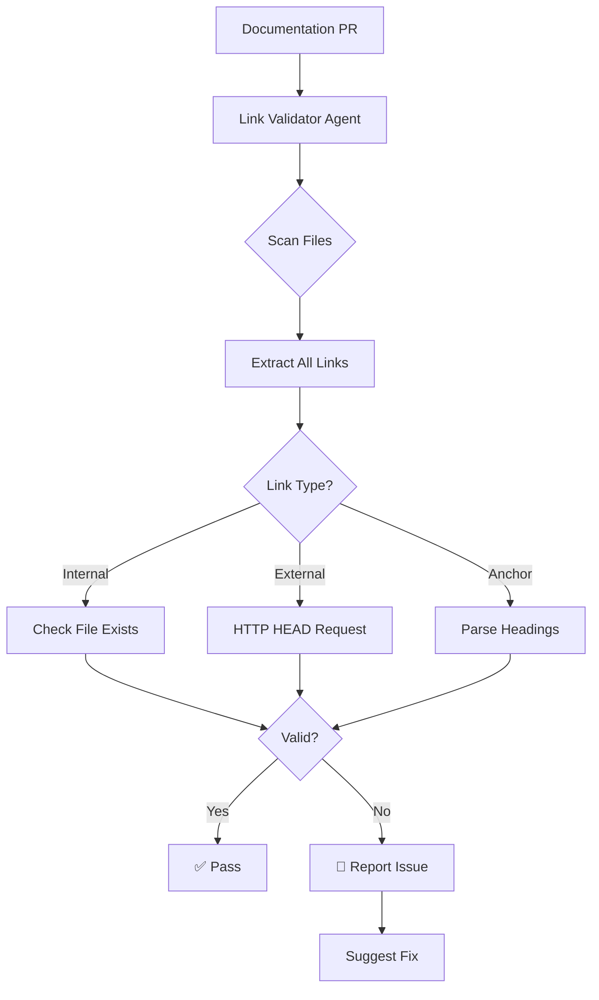

# Link Validator Agent

This agent provides comprehensive link validation across the documentation, detecting broken internal links, invalid anchors, outdated external links, and suggesting automated fixes.

## Capabilities

- **Internal Link Validation**: Validates all relative links within documentation
- **External Link Checking**: Verifies external URLs are accessible (with caching)
- **Anchor Validation**: Checks that anchor links reference valid headings
- **Broken Link Detection**: Identifies and reports all broken links
- **Fix Suggestions**: Provides automated fix suggestions for common patterns

## Link Categories

| Category | Pattern | Example |
|----------|---------|---------|
| Internal | `./file.md`, `../dir/file.md` | `[Guide](./guide.md)` |
| External | `https://...`, `http://...` | `[GitHub](https://github.com)` |
| Anchor | `#heading`, `file.md#section` | `[Section](#overview)` |
| Root-Level | `../README.md` (outside docs/) | Requires GitHub URL |

## Common Issues and Fixes

### Pattern 1: Root-Level References
```markdown
# Before (broken)
[README](../README.md)

# After (fixed)
[README](https://github.com/Aries-Serpent/_codex_/blob/main/README.md)
```

### Pattern 2: Incorrect Relative Paths
```markdown
# Before (broken)
[Guide](docs/guide.md)

# After (fixed)
[Guide](./guide.md)
```

### Pattern 3: Missing Anchor
```markdown
# Before (broken)
[Section](#non-existent-section)

# After (fixed - create section or update link)
[Section](#existing-section)
```

## When to Use

- On every PR with documentation changes
- During documentation audits
- Before releases
- After documentation restructuring
- When fixing MkDocs warnings

## Architecture



## Validation Commands

```bash
# Find all internal links in docs
grep -rn "\]\(\./" docs/ | head -20

# Find all root-level references
grep -rn "\]\(\.\.\/" docs/ | head -20

# Check for broken anchors
mkdocs build 2>&1 | grep "anchor"

# Find external links
grep -rnoE "https?://[^ )\"']+" docs/ | head -20
```

## Integration Points

- **CI/CD Pipeline**: Runs on PRs with doc changes
- **Pre-commit Hook**: Local validation before commit
- **Scheduled Workflows**: Weekly link health checks
- **MkDocs Build**: Integrated with build warnings

## Cache Strategy

External link validation uses caching to avoid repeated HTTP requests:

| Link Type | Cache Duration | Notes |
|-----------|----------------|-------|
| Internal | No cache | Check on every run |
| External (200) | 24 hours | Successful links |
| External (4xx) | 1 hour | Retry soon |
| External (5xx) | 15 minutes | Server issues |

## Related Agents

- [documentation-quality-agent](./documentation-quality-agent.md) - Overall quality
- [doc-freshness-checker](./doc-freshness-checker.agent.md) - Freshness + links

## Related Documentation

- [MkDocs Fix Plan](../../docs/mkdocs_fix_plan.md)
- [MkDocs Warnings Analysis](../../docs/mkdocs_warnings_analysis.md)
- [Phase 12 Planset](../../.codex/plans/PHASE_12_DOCUMENTATION_QUALITY_PLANSET.md)

---

**Created**: 2026-01-17  
**Phase**: 12.2 - Production-Ready Agent Scope  
**Status**: ✅ Specification Complete
