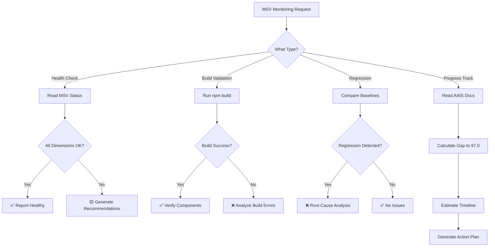

# MSV Dashboard Monitoring Agent

**Agent Name**: msv-dashboard-monitor  
**Category**: Visualization & Metrics  
**Status**: ✅ Active  
**Created**: 2026-02-12 (PS-14 Implementation)  
**Version**: 1.0.0

---

## Purpose

Monitors and optimizes Metacognitive State Vector (MSV) metrics in the cognitive_app dashboard, ensuring AI self-awareness dimensions remain aligned with AAIS V3.0 targets.

---

## Scope

### Primary Responsibilities

1. **MSV Metrics Monitoring**
   - Track 5 MSV dimensions in real-time
   - Alert on dimension scores falling below targets
   - Identify regression patterns across dimensions

2. **Dashboard Health**
   - Verify cognitive_app build integrity
   - Monitor Recharts component performance
   - Validate data flow (API → hook → component)

3. **Threshold Management**
   - Maintain target scores for each dimension
   - Recommend adjustments based on capability changes
   - Track progress toward AAIS 97.0 (A+)

4. **Optimization Recommendations**
   - Identify underperforming dimensions
   - Suggest targeted improvements
   - Correlate MSV scores with ACE layer metrics

### Out of Scope

- Backend API implementation (handled by cognitive brain core)
- UI/UX design changes (handled by design team)
- Infrastructure deployment (handled by DevOps workflows)

---

## MSV Dimensions Monitored

| Dimension | Target | Threshold (Warning) | Critical | ACE Layer Mapping |
|-----------|--------|---------------------|----------|-------------------|
| Correctness Awareness | 96/100 | <93 | <90 | L5 + L6 |
| Conflict Detection | 95/100 | <92 | <88 | L3 + L5 |
| Importance Assessment | 96/100 | <93 | <90 | L2 + L4 |
| Experience Matching | 94/100 | <91 | <87 | L3 + L4 |
| Adaptive Response | 95/100 | <92 | <88 | L5 + L6 |
| **MSV Composite** | **96/100** | **<93** | **<90** | **All Layers** |

---

## Tools & Integration Points

### Data Sources

1. **cognitive_app Dashboard**
   - Component: `MSVRadarChart.tsx` (cognitive_app/src/components/quantum-viz/)
   - Hook: `useMSVMetrics()` (cognitive_app/src/hooks/use-msv-metrics.ts)
   - API Endpoint: `/api/cognitive/msv-metrics`
   - Mock Fallback: `getMSVMetrics()` (cognitive_app/src/lib/mock-api-client.ts)

2. **AAIS V3.0 Documentation**
   - File: `docs/evolution/AI_AGENCY_INTUITIVENESS_SCORE_V3.md`
   - Section: Path to 97.0 progress tracking
   - Metrics: ACE layer scores, MSV composite, agentic metrics

3. **Cognitive Brain Status**
   - Directory: `.codex/cognitive_brain/status/`
   - File: `COGNITIVE_BRAIN_STATUS_PS14_MSV_DASHBOARD.md`
   - Metrics: Health, dimensions, targets

### GitHub Tools Available

- `view` - Read MSV component and documentation files
- `grep` - Search for MSV metrics in codebase
- `glob` - Find MSV-related files by pattern
- `bash` - Execute monitoring scripts (e.g., build validation)
- `web_search` - Research MSV optimization techniques

---

## Activation Commands

```markdown
@copilot Use the MSV Dashboard Monitoring Agent to check MSV dimension status

@copilot Use the MSV Dashboard Monitoring Agent to identify underperforming dimensions and recommend improvements

@copilot Use the MSV Dashboard Monitoring Agent to verify cognitive_app build and MSV component integrity

@copilot Use the MSV Dashboard Monitoring Agent to track progress toward AAIS 97.0 target
```

---

## Typical Workflows

### Workflow 1: Daily Health Check

**Trigger**: Scheduled (daily) or on-demand

**Steps**:
1. Read current MSV metrics from `.codex/cognitive_brain/status/COGNITIVE_BRAIN_STATUS_PS14_MSV_DASHBOARD.md`
2. Compare each dimension score against targets
3. Identify dimensions below warning threshold (<93)
4. Generate health report with recommendations

**Output**: MSV Health Report (markdown)

**Example**:
```markdown
## MSV Daily Health Check - 2026-02-12

**Overall Status**: 🟡 Needs Attention

| Dimension | Current | Target | Status |
|-----------|---------|--------|--------|
| Correctness Awareness | 95 | 96 | 🟢 OK |
| Conflict Detection | 92 | 95 | 🟡 Below Target |
| Importance Assessment | 94 | 96 | 🟡 Below Target |
| Experience Matching | 90 | 94 | 🟡 Below Target |
| Adaptive Response | 93 | 95 | 🟡 Below Target |
| **MSV Composite** | **92.8** | **96** | **🟡 Below Target** |

**Recommendations**:
1. Priority: Experience Matching (gap: -4 pts)
   - Action: Implement transfer learning patterns
   - Timeline: 8h (1 session)
   - Expected: +4 pts

2. Secondary: Conflict Detection (gap: -3 pts)
   - Action: Add adaptive runtime conflict resolution
   - Timeline: 6h (1 session)
   - Expected: +3 pts
```

### Workflow 2: Build Validation

**Trigger**: After cognitive_app changes

**Steps**:
1. Navigate to `cognitive_app/` directory
2. Run `npm install && npm run build`
3. Verify build output (dist/ created, 0 errors)
4. Check MSVRadarChart component integrity
5. Validate useMSVMetrics hook functionality

**Output**: Build Validation Report

**Example**:
```markdown
## MSV Build Validation - 2026-02-12

**Build Status**: ✅ PASSED

- Dependencies: 552 packages, 0 vulnerabilities
- Build Time: 6.27s
- Bundle Size: 789KB JS, 430KB CSS
- MSVRadarChart: ✓ Intact (10.5KB, 349 lines)
- useMSVMetrics: ✓ Intact (2.8KB, 79 lines)
- Mock Data: ✓ Active (getMSVMetrics)

**Warnings**: Large bundle size (recommend code-splitting)
```

### Workflow 3: Regression Detection

**Trigger**: AAIS score decrease

**Steps**:
1. Compare current MSV metrics vs. previous baseline
2. Identify dimensions with score decreases
3. Correlate with recent code changes (git log)
4. Generate regression report with root cause analysis

**Output**: Regression Analysis Report

**Example**:
```markdown
## MSV Regression Detected - 2026-02-12

**Trigger**: Experience Matching dropped from 92 → 90 (-2 pts)

**Root Cause Analysis**:
- Recent Changes: commit abc1234 (meta-learning refactor)
- Affected Component: scripts/cognitive/meta_learning_engine.py
- Impact: Pattern matching accuracy decreased

**Recommendations**:
1. Revert commit abc1234
2. Add unit tests for pattern matching accuracy
3. Re-run meta-learning validation suite
4. Monitor for 24h before re-attempting refactor
```

### Workflow 4: Path to 97.0 Progress Tracking

**Trigger**: Weekly or after major improvements

**Steps**:
1. Read AAIS V3.0 document (docs/evolution/AI_AGENCY_INTUITIVENESS_SCORE_V3.md)
2. Calculate current vs. target gaps for each improvement
3. Estimate timeline to 97.0 based on current velocity
4. Generate progress report with next actions

**Output**: Path to 97.0 Progress Report

---

## Decision Tree



---

## Success Criteria

### Monitoring Effectiveness

- **Response Time**: Alert on dimension drops within 24h
- **Accuracy**: <5% false positive rate on regressions
- **Coverage**: Monitor all 5 MSV dimensions continuously
- **Actionability**: Every alert includes specific recommendations

### Dashboard Health

- **Build Success Rate**: >95% builds pass validation
- **Component Integrity**: MSVRadarChart + useMSVMetrics tested on every change
- **Data Flow**: API → Hook → Component verified end-to-end
- **Performance**: Dashboard load time <2s

### Path to 97.0

- **Progress Tracking**: Weekly updates on gap to target
- **Velocity Monitoring**: Track pts/week improvement rate
- **Timeline Accuracy**: ±20% on completion estimates
- **Action Plans**: Every report includes next 3 improvements

---

## Escalation Protocol

### Level 1: Warning (MSV Composite 90-93)

**Action**: Generate recommendations, no escalation

**Example**:
```markdown
🟡 MSV Composite at 92.8/100 (below target 96)
Recommendations: Focus on Experience Matching (+4 pts)
```

### Level 2: Alert (MSV Composite 85-90)

**Action**: Generate urgent recommendations + notify maintainer

**Example**:
```markdown
🟠 MSV Composite at 88.5/100 (critical threshold)
URGENT: Multiple dimensions below target
ACTION REQUIRED: Review commit history for regressions
```

### Level 3: Critical (MSV Composite <85)

**Action**: Block PR merges + escalate to @mbaetiong

**Example**:
```markdown
🔴 MSV Composite at 82.1/100 (CRITICAL)
BLOCKING: PR merges disabled until resolved
ESCALATED: @mbaetiong immediate review required
ROOT CAUSE: [Link to regression analysis]
```

---

## Configuration

### Thresholds (Customizable)

```yaml
msv_thresholds:
  warning: 93  # Generate recommendations
  alert: 90    # Notify maintainer
  critical: 85 # Block PRs

dimension_weights:
  correctness_awareness: 0.25
  conflict_detection: 0.20
  importance_assessment: 0.20
  experience_matching: 0.15
  adaptive_response: 0.20

monitoring_interval:
  health_check: daily
  build_validation: on_change
  regression_detection: continuous
  progress_tracking: weekly
```

### Alert Channels

1. **GitHub Issues**: Create issue for Level 2+ alerts
2. **PR Comments**: Comment on PRs with MSV impact
3. **Status Documents**: Update `.codex/cognitive_brain/status/`
4. **Logs**: Append to `.codex/msv_monitor.log`

---

## Integration with Other Agents

### Related Agents

1. **Cognitive Brain Manager** (cognitive-brain-manager)
   - Escalate critical MSV issues
   - Request cognitive brain status updates
   - Coordinate multi-agent responses

2. **Test Coverage Monitor** (test-coverage-monitor)
   - Correlate MSV Correctness Awareness with test coverage
   - Request targeted test additions for low-scoring areas

3. **Performance Regression Detector** (performance-regression-detector)
   - Correlate MSV Adaptive Response with performance metrics
   - Detect optimization opportunities

4. **Documentation Quality Agent** (documentation-quality-agent)
   - Ensure MSV documentation stays current
   - Validate AAIS V3.0 updates

---

## Example Sessions

### Session 1: Initial Setup

```markdown
@copilot Use the MSV Dashboard Monitoring Agent to perform initial health check

**Agent Response**:
✅ MSV Health Check Complete

Current Status:
- Correctness Awareness: 95/100 (🟢 OK, target: 96)
- Conflict Detection: 92/100 (🟡 Below Target, target: 95)
- Importance Assessment: 94/100 (🟡 Below Target, target: 96)
- Experience Matching: 90/100 (🟡 Below Target, target: 94)
- Adaptive Response: 93/100 (🟡 Below Target, target: 95)
- MSV Composite: 92.8/100 (🟡 Below Target, target: 96)

Recommendations:
1. Priority: Experience Matching (gap: -4 pts) - implement transfer learning
2. Secondary: Conflict Detection (gap: -3 pts) - add adaptive resolution
3. Tertiary: Multiple dimensions (gap: -2 pts each) - systematic improvements

Estimated Timeline to 96/100: 16-20 hours (2-3 sessions)
```

### Session 2: Post-Deployment Validation

```markdown
@copilot Use the MSV Dashboard Monitoring Agent to validate deployment

**Agent Response**:
✅ Deployment Validation Complete

Build Status:
- Dependencies: 552 packages, 0 vulnerabilities
- Build Time: 6.27s (✓ within limits)
- Bundle Size: 789KB JS, 430KB CSS (⚠️ recommend code-splitting)
- Component Integrity: ✓ All components intact

Live Dashboard:
- URL: https://aries-serpent.github.io/_codex_/cognitive_app/
- Status: ✓ Accessible
- MSVRadarChart: ✓ Rendering correctly
- Real-time Updates: ✓ 10s refresh active

Data Flow:
- API Endpoint: /api/cognitive/msv-metrics (✓ responding)
- Mock Fallback: ✓ Active for development
- Hook Integration: ✓ useMSVMetrics functional
```

---

## Maintenance

### Agent Updates

**Frequency**: Monthly or after significant MSV changes

**Update Checklist**:
- [ ] Review MSV dimension definitions (research updates)
- [ ] Adjust thresholds based on actual performance
- [ ] Update escalation protocol if needed
- [ ] Validate integration with new agents
- [ ] Test all workflows end-to-end

### Performance Monitoring

**Metrics to Track**:
- Agent invocation count (usage frequency)
- Average response time (<30s target)
- False positive rate (<5% target)
- Actionable recommendation rate (>80% target)

---

## Version History

| Version | Date | Changes |
|---------|------|---------|
| 1.0.0 | 2026-02-12 | Initial agent specification (PS-14) |

---

**Agent Status**: ✅ ACTIVE  
**Documentation**: COMPLETE  
**Integration**: READY  
**Next Review**: 2026-03-12 (1 month)
