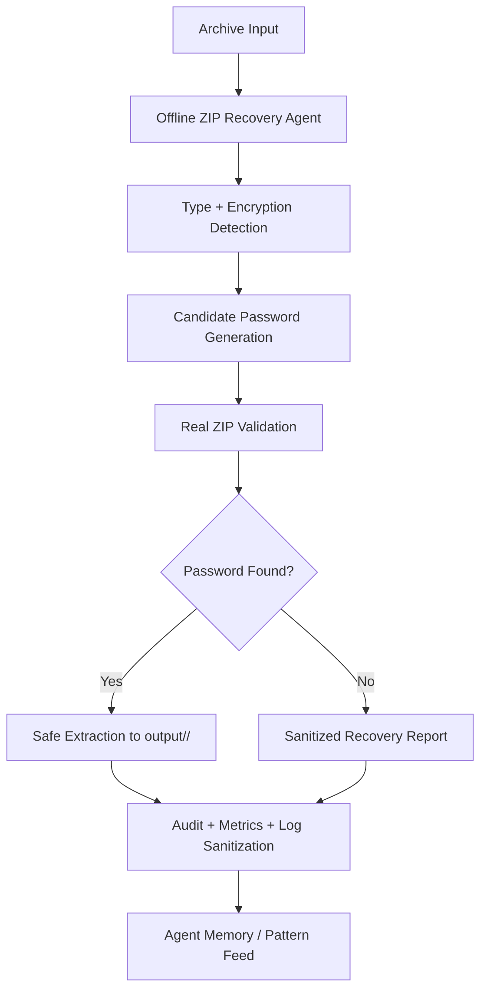

# Offline ZIP Recovery Agent

## Overview

The `offline-zip-recovery-agent` operates as a secure, air-gapped archive-recovery specialist built around `scripts/security/offline_zip_keymaster.py`. Its core mission is to recover password-protected ZIP archives without relying on cloud services, repository secrets, or external network calls. It performs real archive validation against candidate passwords, extracts safely into a self-titled directory, and emits sanitized audit output so failure cases remain private and reproducible.

## Role and responsibility

This agent is not a generic key generator. It acts as the repository's recovery operator for:

- local key generation and keyfile creation
- archive type detection and encryption posture checks
- candidate password generation from dictionaries, masks, seed-derived rules, and archive-name hints
- direct validation against real ZIP entries using `zipfile`
- safe unpacking into `output/<archive_stem>/`
- traversal blocking, duplicate target rejection, and malformed-archive handling
- audit-friendly, sanitized reporting with masked secrets and keys

## Core workflow

1. Intake the archive path and candidate source.
2. Confirm whether the archive is a standard password-protected ZIP or a custom encrypted bundle.
3. Build a candidate password pool from wordlists, masks, archive stem, and rule mutations.
4. Validate candidates against actual ZIP content rather than trusting metadata alone.
5. If a password succeeds, extract into the derived self-titled directory.
6. Capture sanitized recovery telemetry and final audit summary.

## Recovery-first design

The agent prefers direct archive validation over hidden key derivation. In practice this means:

- it does not assume a special bundle format when a standard ZIP is provided
- it tests passwords against archive members with a real open/read attempt
- it treats password verification as the source of truth
- it keeps `mask_token()`, `sanitize_log()`, and safe output guards in the operational path

## Safety posture

- Zero remote dependencies: no network calls, no GitHub Secrets, no external API lookups
- Safe extraction to a canonical output directory derived from the archive stem
- Path traversal prevention using `Path.resolve()` and `os.path.commonpath()`
- Rejection of symlinks, duplicate targets, malformed entries, and oversized payloads
- Sanitized logs with masked token-like values and no raw key bytes exposed in console output

## Candidate generation model

The agent can build candidate pools from a mix of sources:

- dictionary wordlists
- archive stem and filename hints
- mask patterns and rule mutations
- brute-force bounds within configured limits
- seed-derived variants when the caller supplies a deterministic seed

The recovery flow should prioritize the highest-probability candidates first and record the source of each accepted or rejected attempt.

## File and code boundaries

The runtime behavior remains rooted in `scripts/security/offline_zip_keymaster.py`. This custom agent acts as a human-facing and Copilot-facing operational specification around the application rather than replacing the underlying implementation.

Recommended integration points:

- `scripts/security/offline_zip_keymaster.py` — source of truth for key generation, validation, and extraction logic
- `scripts/security/offline_zip_recovery_agent.py` — optional thin orchestration wrapper if a CLI-style agent interface is added later
- `.github/agents/offline-zip-recovery-agent.md` — human and Copilot invocation contract

## Recovery lifecycle



## Suggested modes

### Recover

Recover a password by validating candidate values against the real archive contents.

### Recover + unpack

A single orchestration step that finds the password, validates it, and extracts into the derived output directory.

### Dry run

Generate and rank candidates without actually attempting to decrypt or open the archive, useful for reviewing incident handling or candidate strategy.

### Safe extract only

Given a known password, validate the archive and extract into the self-titled destination while enforcing canonical safety checks.

## Operational contract

### Inputs

- `archive_path` (required)
- `key_file` (optional for local generated keys)
- `wordlist` (optional)
- `mask` (optional)
- `seed` (optional)
- `rules` (optional)
- `output_dir` (optional default: caller parent or working directory)

### Outputs

- recovered password status
- candidate source summary
- archive stem and output path
- extracted file list
- blocked traversal attempts and unsafe members
- sanitized JSON or text audit report

## Validation requirements

The following validations are required for acceptance:

- true encrypted standard ZIP files are accepted by the recovery flow
- candidate validation succeeds against real ZIP members
- extraction lands in `output/<archive_stem>/`
- malicious traversal attempts are rejected before any write occurs
- malformed manifest or keyfile errors are handled without leaking sensitive data
- sanitized logs never emit raw keys, passwords, or cleartext credentials

## Example activation

```text
Use offline.zip.recovery agent to recover archive password and unpack into the self-titled output directory.
```

## Example outcome

```text
Recovered password: yes (source: wordlist)
Archive stem: audit_logs_2026
Destination: ./output/audit_logs_2026/
Files extracted: 14
Traversal blocks: 0
Sanitized report: ok
```

## Compliance and governance

- Zero network reliance and zero cloud secret dependency
- Air-gap safe by design
- Strict path and archive validation before extraction
- Log sanitization before any stdout or file output
- No raw stack traces for expected invalid-key or malformed-archive failures

## Performance characteristics

- Recovery latency depends on archive size and candidate pool size
- Candidate testing is the primary bottleneck, not key generation
- Safe extraction and validation are deterministic and bounded
- Structured audit report remains lightweight for repeated recovery tasks

## Success criteria

- ✅ Valid password-protected ZIPs are accepted and processed
- ✅ Candidate testing uses the archive itself as the truth source
- ✅ Output extraction lands under the archive-derived self-titled directory
- ✅ Unsafe paths are rejected before file creation
- ✅ No secrets or raw keys appear in logs or summary output

## Related references

- `scripts/security/offline_zip_keymaster.py`
- `tests/security/test_offline_zip_keymaster.py`
- `.github/agents/README.md`
- `.github/agents/CUSTOM_COPILOT_AGENTS_SPECIFICATION.md`

## Testing guidance

Recommended validation cases:

- standard encrypted ZIP generated with Python `zipfile.setpassword`
- archive encrypted with system `zip -P`
- wordlist and mask recovery flows
- traversal rejection checks using `../` and absolute paths
- malformed key file and corrupted archive handling
- sanitized logging with masked values

---

Created for the repository custom-agent ecosystem as a focused operational wrapper for the air-gapped ZIP recovery application.
