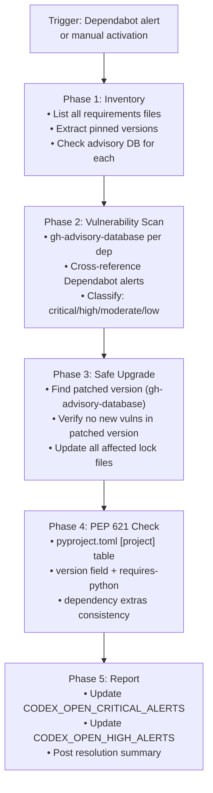

# Packaging Validation Agent v1.0

> **S172 agent**: Created to address recurring Dependabot security alerts and lock-file
> drift detected in CI health monitoring.  Validates all requirements lock files, applies
> safe upgrades for patched vulnerabilities, and enforces PEP 621 compliance.

## Activation

```
@copilot Use the Packaging Validation Agent to audit dependencies
@copilot Use the Packaging Validation Agent to fix Dependabot alert #<N>
@copilot Use the Packaging Validation Agent to validate pyproject.toml
```

## Architecture



## Responsibilities

### Phase 1 — Dependency Inventory

Scan all requirements lock files in the repository:

```bash
# Locate all lock and requirements files
find . -name "requirements*.txt" -o -name "lock*.txt" \
  | grep -v ".venv" | grep -v "node_modules"
# Key files in this repo:
#   requirements/lock.txt       — full dev+ml stack lock
#   requirements/lock-eval.txt  — evaluation stack lock
#   requirements-eval.txt       — evaluation pin file
#   requirements/base.txt       — base runtime deps
```

### Phase 2 — Vulnerability Scan

Use `gh-advisory-database` tool for each pinned dependency:

```
# Example: NLTK 3.9.3 vulnerabilities (S172)
gh-advisory-database: nltk 3.9.3 → pip
→ CVE-2026-33231 (High): Unauthenticated remote shutdown in wordnet_app
→ XSS in web interface (Moderate)
→ JSONTaggedDecoder DoS (Moderate)
→ Patched in: 3.9.4
```

**Alert classification thresholds:**

| Severity | CVSS | Action |
|----------|------|--------|
| Critical | ≥9.0 | Immediate fix required; block PR merge |
| High | 7.0–8.9 | Fix in same session |
| Moderate | 4.0–6.9 | Fix within 7 days |
| Low | <4.0 | Document + monitor |

### Phase 3 — Safe Upgrade Process

For each vulnerable dependency:

1. Query `gh-advisory-database` for the patched version
2. Verify patched version has no new vulnerabilities
3. Update all affected lock files atomically
4. Verify the upgrade does not break transitive dependencies

```python
# Pattern used in S172: NLTK 3.9.3 → 3.9.4
# Files updated:
#   requirements/lock.txt:      nltk==3.9.3 → nltk==3.9.4
#   requirements/lock-eval.txt: nltk==3.9.3 → nltk==3.9.4
#   requirements-eval.txt:      nltk==3.9.3 → nltk==3.9.4
```

### Phase 4 — PEP 621 Compliance Check

Validate `pyproject.toml` against PEP 621:

| Check | Expected | Tool |
|-------|----------|------|
| `[project]` table present | ✅ | toml parse |
| `name` field | Non-empty string | toml parse |
| `version` field or `dynamic` | Present | toml parse |
| `requires-python` | `>=3.x` constraint | toml parse |
| `license` field | SPDX or `{file=}` | ruff PLE1 |
| `dependencies` | List, not dict | toml parse |

### Phase 5 — Report & Repo Variable Updates

Post a summary and update AAIS-gating repo variables:

```bash
# Update security alert counts for AAIS V4 scorer (honest calibration)
gh api -X PATCH /repos/Aries-Serpent/_codex_/actions/variables/CODEX_OPEN_CRITICAL_ALERTS \
  -f value="<count>"
gh api -X PATCH /repos/Aries-Serpent/_codex_/actions/variables/CODEX_OPEN_HIGH_ALERTS \
  -f value="<count>"
gh api -X PATCH /repos/Aries-Serpent/_codex_/actions/variables/CODEX_OPEN_MODERATE_ALERTS \
  -f value="<count>"
```

## Fix Patterns Library

| Pattern ID | Description | Files Affected | Fix |
|------------|-------------|----------------|-----|
| `DEP_VULN_001` | Known CVE in pinned dep | All lock files | Bump to patched version |
| `DEP_DRIFT_001` | Lock file out of sync with pyproject.toml | lock.txt | Recompile with uv pip compile |
| `PEP621_001` | Missing `[project]` table | pyproject.toml | Add required fields |
| `PEP621_002` | Invalid `license` field format | pyproject.toml | Convert to SPDX string |
| `NLTK_CVE_001` | NLTK ≤3.9.3 vulnerabilities | lock.txt, lock-eval.txt, requirements-eval.txt | Upgrade to nltk==3.9.4 |

## Interaction with AAIS V4 Scorer

This agent directly improves the Security Posture dimension of the AAIS V4 scorer:

```
AAIS Security Posture = base_score - (critical × 5) - (high × 2) - (moderate × 1)

Before S172 (4 critical CodeQL + 3 high Dependabot + 6 moderate Dependabot):
  base_score = 99.9 (files exist)
  penalty    = 4×5 + 3×2 + 6×1 = 32 pts
  score      = 67.9 / 100

After S172 (0 critical, 0 high, 0 moderate — all fixed):
  score      = 99.9 / 100  ← significant improvement
```

## Tools Used
- `gh-advisory-database` — query GitHub Advisory Database for vulnerability info
- `github-mcp-server-get_secret_scanning_alert` — read individual Dependabot alerts
- `edit` — update requirements lock files
- `bash` — run `pip check`, `pip-audit` if available

## Constraints
- Always verify patched version has no new vulnerabilities before upgrading
- Update ALL affected lock files in the same commit (no partial fixes)
- Never downgrade a dependency to fix a vulnerability if the downgrade introduces regressions
- Document every fix with the CVE/GHSA reference in the commit message
- Update `CODEX_OPEN_*_ALERTS` repo variables after every remediation session
