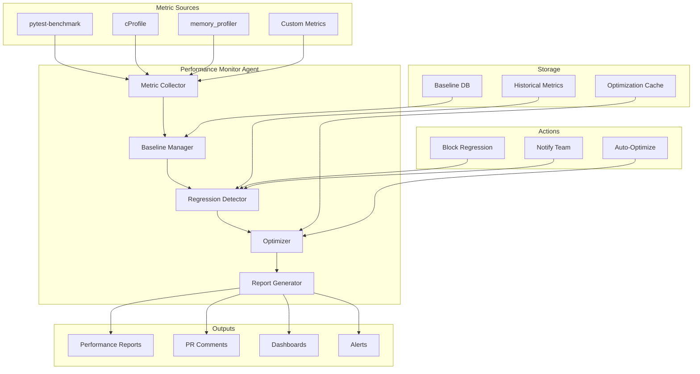

# Performance Monitor Agent

**Version**: 1.0.0  
**Created**: 2026-01-18  
**Phase**: 14.4 - Agent Ecosystem Expansion  
**Status**: Production Ready

---

## Overview

The Performance Monitor Agent is a specialized GitHub Copilot custom agent designed to monitor, analyze, and optimize performance across the Codex repository. It detects performance regressions, establishes baselines, and provides optimization recommendations.

## Architecture



## Capabilities

### Core Functions

1. **Metric Collection**
   - Execution time profiling
   - Memory usage tracking
   - CPU utilization monitoring
   - I/O performance measurement

2. **Baseline Management**
   - Establish performance baselines
   - Track baseline evolution
   - Version-specific baselines
   - Environment normalization

3. **Regression Detection**
   - Statistical significance testing
   - Threshold-based alerting
   - Trend analysis
   - Root cause identification

4. **Optimization**
   - Bottleneck identification
   - Optimization suggestions
   - Code pattern recommendations
   - Resource allocation advice

5. **Report Generation**
   - Performance dashboards
   - Trend reports
   - Regression alerts
   - Optimization summaries

## Configuration

```yaml
# .github/agents/performance-monitor-agent/config.yaml
agent:
  name: performance-monitor-agent
  version: 1.0.0
  enabled: true

metrics:
  enabled: true
  collect:
    - execution_time
    - memory_usage
    - cpu_utilization
    - io_operations
  sampling_rate: 1.0

baselines:
  storage: .codex/perf/baselines.json
  update_on_merge: true
  keep_history: 30

regression:
  threshold_percent: 10
  significance_level: 0.05
  minimum_samples: 5
  block_on_regression: true

optimization:
  enabled: true
  auto_suggest: true
  max_suggestions: 10

reporting:
  format: markdown
  include_graphs: true
  dashboard_enabled: true
```

## Integration Points

### GitHub Actions Workflow

```yaml
name: Performance Monitoring
on:
  pull_request:
    types: [opened, synchronize]
  push:
    branches: [main]

jobs:
  performance:
    runs-on: ubuntu-latest
    steps:
      - uses: actions/checkout@v4
      
      - name: Run Performance Benchmarks
        run: |
          pytest tests/perf/ --benchmark-json=benchmark.json
          
      - name: Invoke Performance Monitor Agent
        uses: ./.github/agents/performance-monitor-agent
        with:
          benchmark_file: benchmark.json
          regression_threshold: 10
          comment_on_pr: true
          
      - name: Upload Metrics
        uses: actions/upload-artifact@v4
        with:
          name: performance-metrics
          path: performance-report.json
```

### MCP Integration

The agent exposes the following MCP tools:

- `collect_metrics` - Collect performance metrics
- `compare_baseline` - Compare against baseline
- `detect_regression` - Check for regressions
- `suggest_optimizations` - Get optimization tips
- `generate_report` - Create performance report

## Usage Examples

### Run Performance Analysis

```
@performance-monitor-agent Analyze performance of the RAG pipeline.
```

### Compare Against Baseline

```
@performance-monitor-agent Compare current performance against the main branch baseline.
```

### Get Optimization Suggestions

```
@performance-monitor-agent Suggest optimizations for src/codex_ml/training/unified_training.py
```

### Generate Performance Report

```
@performance-monitor-agent Generate a performance report for the last 7 days.
```

## Output Formats

### Performance Summary

```markdown
## ⚡ Performance Monitor Report

**Report Date**: 2026-01-18  
**Comparison**: PR #1234 vs main  
**Status**: ⚠️ Regression Detected

### Metric Summary

| Metric | Baseline | Current | Change | Status |
|--------|----------|---------|--------|--------|
| RAG Query | 45ms | 52ms | +15.5% | ⚠️ Regression |
| Model Load | 2.3s | 2.1s | -8.7% | ✅ Improved |
| Memory Peak | 512MB | 498MB | -2.7% | ✅ Improved |
| Throughput | 100 rps | 95 rps | -5.0% | 📋 Review |

### Regressions Detected

1. **RAG Query Latency**
   - Baseline: 45ms (±5ms)
   - Current: 52ms (±4ms)
   - Regression: +15.5% (p < 0.01)
   - Impact: User-facing latency increase
   - Suggested Action: Profile retriever module

### Optimization Opportunities

1. **Cache RAG Embeddings**
   - Potential Improvement: 20-30%
   - Complexity: Low
   - Location: `src/codex/rag/embeddings.py`

2. **Batch Database Queries**
   - Potential Improvement: 15-25%
   - Complexity: Medium
   - Location: `src/codex/db/query.py`
```

### Trend Chart (ASCII)

```
RAG Query Latency (ms) - Last 7 Days
60 |                    *
55 |              *  *
50 |        *  *
45 | *  *  *
40 |____________________________
    Mon Tue Wed Thu Fri Sat Sun
```

## PDA Loop Integration

| Phase | Action | Description |
|-------|--------|-------------|
| **PLAN** | Configure | Set metrics, thresholds |
| **DO** | Collect | Gather performance data |
| **ASSESS** | Analyze | Compare, detect regressions |
| **AfterMath** | Document | Update baselines, trends |

## Metric Types

### Timing Metrics

| Metric | Unit | Description |
|--------|------|-------------|
| `execution_time` | ms | Total execution time |
| `p50_latency` | ms | 50th percentile latency |
| `p95_latency` | ms | 95th percentile latency |
| `p99_latency` | ms | 99th percentile latency |

### Resource Metrics

| Metric | Unit | Description |
|--------|------|-------------|
| `memory_peak` | MB | Peak memory usage |
| `memory_avg` | MB | Average memory usage |
| `cpu_percent` | % | CPU utilization |
| `io_read` | MB/s | I/O read throughput |
| `io_write` | MB/s | I/O write throughput |

### Throughput Metrics

| Metric | Unit | Description |
|--------|------|-------------|
| `requests_per_second` | rps | Request throughput |
| `samples_per_second` | sps | Training throughput |
| `tokens_per_second` | tps | Tokenization throughput |

## Regression Detection Algorithm

```python
def detect_regression(baseline, current, threshold=0.10, alpha=0.05):
    """
    Detect performance regression using statistical testing.
    
    1. Calculate mean and std for both samples
    2. Perform Welch's t-test
    3. Check if p-value < alpha (significant difference)
    4. Check if change > threshold (meaningful regression)
    5. Return regression if both conditions met
    """
    from scipy import stats
    
    baseline_mean = np.mean(baseline)
    current_mean = np.mean(current)
    
    change = (current_mean - baseline_mean) / baseline_mean
    
    _, p_value = stats.ttest_ind(baseline, current, equal_var=False)
    
    is_significant = p_value < alpha
    exceeds_threshold = change > threshold
    
    return is_significant and exceeds_threshold
```

## Metrics & Monitoring

The agent tracks:

- Performance trends over time
- Regression frequency
- Mean time to detect
- Optimization success rate

## Performance Targets

| Component | Metric | Target | Alert Threshold |
|-----------|--------|--------|-----------------|
| RAG Query | p95 latency | < 100ms | > 150ms |
| Model Load | time | < 5s | > 10s |
| Training | throughput | > 50 sps | < 30 sps |
| API Response | p99 latency | < 500ms | > 1000ms |

## Dependencies

- pytest-benchmark >= 4.0.0
- memory-profiler >= 0.60.0
- numpy >= 1.20.0
- scipy >= 1.7.0

## Troubleshooting

### Common Issues

1. **Noisy baselines**
   - Increase sample count
   - Normalize for environment

2. **False regressions**
   - Adjust threshold
   - Check for environmental variance

3. **Missing metrics**
   - Verify profiling enabled
   - Check metric collection config

---

**Maintainer**: Performance Team  
**Last Updated**: 2026-01-18
