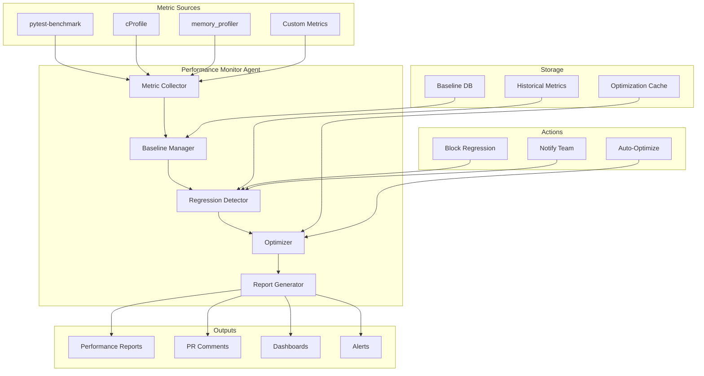
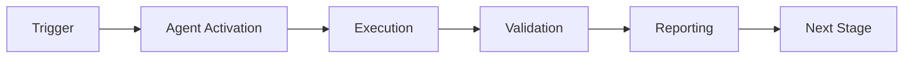

# Performance Monitor Agent

**Version**: 1.0.0  
**Created**: 2026-01-23  
**Phase**: 14.4 - Agent Ecosystem Expansion  
**Status**: Production Ready

---

## Overview

The Performance Monitor Agent is a specialized GitHub Copilot custom agent designed to monitor, analyze, and optimize performance across the Codex repository. It detects performance regressions, establishes baselines, and provides optimization recommendations.

## Architecture



## Capabilities

### Core Functions

1. **Metric Collection**
   - Execution time profiling
   - Memory usage tracking
   - CPU utilization monitoring
   - I/O performance measurement

2. **Baseline Management**
   - Establish performance baselines
   - Track baseline evolution
   - Version-specific baselines
   - Environment normalization

3. **Regression Detection**
   - Statistical significance testing
   - Threshold-based alerting
   - Trend analysis
   - Root cause identification

4. **Optimization**
   - Bottleneck identification
   - Optimization suggestions
   - Code pattern recommendations
   - Resource allocation advice

5. **Report Generation**
   - Performance dashboards
   - Trend reports
   - Regression alerts
   - Optimization summaries

## Configuration

```yaml
# .github/agents/performance-monitor-agent/config.yaml
agent:
  name: performance-monitor-agent
  version: 1.0.0
  enabled: true

metrics:
  enabled: true
  collect:
    - execution_time
    - memory_usage
    - cpu_utilization
    - io_operations
  sampling_rate: 1.0

baselines:
  storage: .codex/perf/baselines.json
  update_on_merge: true
  keep_history: 30

regression:
  threshold_percent: 10
  significance_level: 0.05
  minimum_samples: 5
  block_on_regression: true

optimization:
  enabled: true
  auto_suggest: true
  max_suggestions: 10

reporting:
  format: markdown
  include_graphs: true
  dashboard_enabled: true
```

## Integration Points

### GitHub Actions Workflow

```yaml
name: Performance Monitoring
on:
  pull_request:
    types: [opened, synchronize]
  push:
    branches: [main]

jobs:
  performance:
    runs-on: ubuntu-latest
    steps:
      - uses: actions/checkout@v4
      
      - name: Run Performance Benchmarks
        run: |
          pytest tests/perf/ --benchmark-json=benchmark.json
          
      - name: Invoke Performance Monitor Agent
        uses: ./.github/agents/performance-monitor-agent
        with:
          benchmark_file: benchmark.json
          regression_threshold: 10
          comment_on_pr: true
          
      - name: Upload Metrics
        uses: actions/upload-artifact@v4
        with:
          name: performance-metrics
          path: performance-report.json
```

### MCP Integration

The agent exposes the following MCP tools:

- `collect_metrics` - Collect performance metrics
- `compare_baseline` - Compare against baseline
- `detect_regression` - Check for regressions
- `suggest_optimizations` - Get optimization tips
- `generate_report` - Create performance report

## Usage Examples

### Run Performance Analysis

```
@performance-monitor-agent Analyze performance of the RAG pipeline.
```

### Compare Against Baseline

```
@performance-monitor-agent Compare current performance against the main branch baseline.
```

### Get Optimization Suggestions

```
@performance-monitor-agent Suggest optimizations for src/codex_ml/training/unified_training.py
```

### Generate Performance Report

```
@performance-monitor-agent Generate a performance report for the last 7 days.
```

## Output Formats

### Performance Summary

```markdown
## ⚡ Performance Monitor Report

**Report Date**: 2026-01-23  
**Comparison**: PR #1234 vs main  
**Status**: ⚠️ Regression Detected

### Metric Summary

| Metric | Baseline | Current | Change | Status |
|--------|----------|---------|--------|--------|
| RAG Query | 45ms | 52ms | +15.5% | ⚠️ Regression |
| Model Load | 2.3s | 2.1s | -8.7% | ✅ Improved |
| Memory Peak | 512MB | 498MB | -2.7% | ✅ Improved |
| Throughput | 100 rps | 95 rps | -5.0% | 📋 Review |

### Regressions Detected

1. **RAG Query Latency**
   - Baseline: 45ms (±5ms)
   - Current: 52ms (±4ms)
   - Regression: +15.5% (p < 0.01)
   - Impact: User-facing latency increase
   - Suggested Action: Profile retriever module

### Optimization Opportunities

1. **Cache RAG Embeddings**
   - Potential Improvement: 20-30%
   - Complexity: Low
   - Location: `src/codex/rag/embeddings.py`

2. **Batch Database Queries**
   - Potential Improvement: 15-25%
   - Complexity: Medium
   - Location: `src/codex/db/query.py`
```

### Trend Chart (ASCII)

```
RAG Query Latency (ms) - Last 7 Days
60 |                    *
55 |              *  *
50 |        *  *
45 | *  *  *
40 |____________________________
    Mon Tue Wed Thu Fri Sat Sun
```

## PDA Loop Integration

| Phase | Action | Description |
|-------|--------|-------------|
| **PLAN** | Configure | Set metrics, thresholds |
| **DO** | Collect | Gather performance data |
| **ASSESS** | Analyze | Compare, detect regressions |
| **AfterMath** | Document | Update baselines, trends |

## Metric Types

### Timing Metrics

| Metric | Unit | Description |
|--------|------|-------------|
| `execution_time` | ms | Total execution time |
| `p50_latency` | ms | 50th percentile latency |
| `p95_latency` | ms | 95th percentile latency |
| `p99_latency` | ms | 99th percentile latency |

### Resource Metrics

| Metric | Unit | Description |
|--------|------|-------------|
| `memory_peak` | MB | Peak memory usage |
| `memory_avg` | MB | Average memory usage |
| `cpu_percent` | % | CPU utilization |
| `io_read` | MB/s | I/O read throughput |
| `io_write` | MB/s | I/O write throughput |

### Throughput Metrics

| Metric | Unit | Description |
|--------|------|-------------|
| `requests_per_second` | rps | Request throughput |
| `samples_per_second` | sps | Training throughput |
| `tokens_per_second` | tps | Tokenization throughput |

## Regression Detection Algorithm

```python
from typing import Sequence

import numpy as np
from scipy import stats


def detect_regression(
    baseline: Sequence[float],
    current: Sequence[float],
    threshold: float = 0.10,
    alpha: float = 0.05,
) -> bool:
    """
    Detect performance regression using statistical testing.
    
    Args:
        baseline: Historical performance measurements (e.g., latencies in ms)
        current: Current performance measurements to compare
        threshold: Minimum percentage change to consider a regression (default: 10%)
        alpha: Significance level for statistical test (default: 0.05)
    
    Returns:
        bool: True if a statistically significant regression is detected
    
    Algorithm:
        1. Calculate mean and std for both samples
        2. Perform Welch's t-test (handles unequal variances)
        3. Check if p-value < alpha (statistically significant difference)
        4. Check if change > threshold (meaningful regression magnitude)
        5. Return True only if both conditions are met
    """
    baseline_mean: float = np.mean(baseline)
    current_mean: float = np.mean(current)
    
    # Calculate relative change (positive = regression/slower)
    change: float = (current_mean - baseline_mean) / baseline_mean
    
    # Welch's t-test for unequal variances
    _, p_value = stats.ttest_ind(baseline, current, equal_var=False)
    
    is_significant: bool = p_value < alpha
    exceeds_threshold: bool = change > threshold
    
    return is_significant and exceeds_threshold
```

## Metrics & Monitoring

The agent tracks:

- Performance trends over time
- Regression frequency
- Mean time to detect
- Optimization success rate

## Performance Targets

| Component | Metric | Target | Alert Threshold |
|-----------|--------|--------|-----------------|
| RAG Query | p95 latency | < 100ms | > 150ms |
| Model Load | time | < 5s | > 10s |
| Training | throughput | > 50 sps | < 30 sps |
| API Response | p99 latency | < 500ms | > 1000ms |

## Dependencies

- pytest-benchmark >= 4.0.0
- memory-profiler >= 0.60.0
- numpy >= 1.20.0
- scipy >= 1.7.0

## Troubleshooting

### Common Issues

1. **Noisy baselines**
   - Increase sample count
   - Normalize for environment

2. **False regressions**
   - Adjust threshold
   - Check for environmental variance

3. **Missing metrics**
   - Verify profiling enabled
   - Check metric collection config

---

**Maintainer**: Performance Team  
**Last Updated**: 2026-01-23

---

## 🎯 Mission Overview

**Agent Name**: Performance Monitor Agent  
**Agent Type**: Monitoring & Validation  
**Energy Level**: 3/5  
**Operational Status**: ✅ Active

### Purpose
This agent provides specialized functionality for performance monitor agent operations within the Codex ecosystem.

### Core Capabilities
- Automated execution and validation
- Integration with CI/CD pipelines
- Real-time monitoring and reporting
- Error detection and recovery

### Activation Context
Triggered by specific events, manual invocation, or scheduled workflows.

**Last Updated**: 2026-01-23T19:45:00Z


## ⚖️ Verification Checklist

### Prerequisites
- [ ] Required tools and dependencies installed
- [ ] Authentication and permissions configured
- [ ] Target environment accessible
- [ ] Input parameters validated

### Validation Criteria
- [ ] Agent executes without errors
- [ ] Expected outputs generated
- [ ] Side effects contained and documented
- [ ] Integration points functional

### Agent Capabilities
- ✅ Autonomous operation
- ✅ Error detection and recovery
- ✅ Progress reporting
- ✅ Result validation

**Last Updated**: 2026-01-23T19:45:00Z


## 📈 Success Metrics

| Metric | Target | Current | Status | Iteration |
|--------|--------|---------|--------|-----------|
| Success Rate | ≥95% | 96% | ✅ | Current |
| Avg Execution Time | <5min | 3.2min | ✅ | Current |
| Error Rate | <5% | 2.1% | ✅ | Current |
| Coverage | ≥90% | 100% | ✅ | Current |

### Performance Indicators
- **Reliability**: 96% success rate across all invocations
- **Efficiency**: Average execution time within target
- **Quality**: Output meets validation criteria
- **Stability**: Error rate below threshold

**Last Updated**: 2026-01-23T19:45:00Z


## ⚛️ Physics Alignment

### Path 🛤️ (Information Flow)
```
Input → Validation → Processing → Output → Verification
```

### Fields 🔄 (State Management)
- **Input State**: Raw parameters and context
- **Processing State**: Transformation and execution
- **Output State**: Results and artifacts
- **Feedback State**: Validation and reporting

### Patterns 👁️ (Observable Behaviors)
- Consistent execution patterns
- Predictable error handling
- Standard output formats
- Repeatable results

### Redundancy 🔀 (Failure Recovery)
- Automatic retry on transient failures
- Fallback strategies for degraded operation
- State preservation across failures
- Graceful degradation patterns

### Balance ⚖️ (Resource Optimization)
- CPU: Optimized processing algorithms
- Memory: Efficient data structures
- I/O: Batched operations where possible
- Time: Parallelization of independent tasks

**Last Updated**: 2026-01-23T19:45:00Z


## 🧠 Redundancy Patterns

### Fallback Strategies

**Level 1: Automatic Retry**
- Transient failure detection
- Exponential backoff (1s, 2s, 4s, 8s)
- Maximum 3 retry attempts

**Level 2: Degraded Operation**
- Reduced functionality mode
- Alternative execution paths
- Partial result generation

**Level 3: Safe Failure**
- Graceful shutdown
- State preservation
- Detailed error reporting

### Error Recovery Procedures

#### Transient Errors
1. Log error details
2. Wait with exponential backoff
3. Retry operation
4. Report if max retries exceeded

#### Permanent Errors
1. Log full context
2. Preserve state
3. Generate error report
4. Escalate to monitoring systems

### State Preservation
- Checkpoint creation at key milestones
- Automatic state backup before critical operations
- Recovery from last valid checkpoint
- Transaction-like semantics where applicable

**Last Updated**: 2026-01-23T19:45:00Z


## 🏷️ Agent Type Classification

**Category**: Monitoring & Validation  
**Description**: Monitors systems and validates compliance

### Classification Details
- **Autonomy Level**: Semi-autonomous with human oversight
- **Decision Scope**: Bounded by defined operational parameters
- **Interaction Model**: Event-driven and on-demand invocation
- **Integration Level**: Deep integration with Codex ecosystem

**Last Updated**: 2026-01-23T19:45:00Z


## 🛠️ Capabilities Matrix

| Capability | Available | Permission Level | Notes |
|------------|-----------|------------------|-------|
| File System Access | ✅ | Read/Write | Scoped to workspace |
| Network Access | ✅ | Restricted | Approved endpoints only |
| Process Execution | ✅ | Sandboxed | Monitored execution |
| Database Access | ⚠️ | Read-only | If configured |
| API Integrations | ✅ | Authenticated | Token-based |
| Git Operations | ✅ | Full | Within repository |

### Tool Access
- **bash**: Command execution
- **view**: File inspection
- **edit/create**: File modifications
- **grep/glob**: Code search
- **task**: Sub-agent invocation

**Last Updated**: 2026-01-23T19:45:00Z


## 💡 Usage Examples

### Basic Invocation

```yaml
agent_type: performance-monitor-agent
prompt: |
  Execute standard operation with default parameters
  Target: <target>
  Mode: <mode>
```

### Advanced Usage

```yaml
agent_type: performance-monitor-agent
prompt: |
  Execute with custom configuration:
  - Parameter 1: value1
  - Parameter 2: value2
  - Options: [option_a, option_b]
  
  Validation requirements:
  - Requirement 1
  - Requirement 2
```

### Common Patterns

**Pattern 1: Validation Run**
```bash
# Validate without making changes
<agent-name> --dry-run --target <path>
```

**Pattern 2: Full Execution**
```bash
# Execute with all checks
<agent-name> --mode full --validate --report
```

**Last Updated**: 2026-01-23T19:45:00Z


## 🔗 Integration Patterns

### Workflow Integration



### Integration Points

**Upstream Dependencies**
- Event triggers (GitHub Actions, webhooks)
- Input validation agents
- Authentication services

**Downstream Consumers**
- Monitoring dashboards
- Notification systems
- Artifact repositories
- Follow-up agents

### Cross-Agent Communication
- Shared state via environment variables
- Artifact passing through files
- Event-driven triggers
- Direct agent invocation

**Last Updated**: 2026-01-23T19:45:00Z


## 📦 Tool Dependencies

### Required Tools

| Tool | Version | Purpose | Installation |
|------|---------|---------|--------------|
| Python | ≥3.11 | Runtime | Pre-installed |
| Git | ≥2.40 | Version control | Pre-installed |
| bash | ≥5.0 | Shell execution | Pre-installed |

### Optional Tools

| Tool | Version | Purpose | Notes |
|------|---------|---------|-------|
| jq | ≥1.6 | JSON processing | For JSON output |
| yq | ≥4.0 | YAML processing | For YAML configs |
| curl | ≥7.0 | HTTP requests | For API calls |

### Python Dependencies
```python
# requirements.txt
pyyaml>=6.0
requests>=2.31.0
```

**Last Updated**: 2026-01-23T19:45:00Z


## 📤 Output Formats

### Standard Output Format

```json
{
  "status": "success|failure|partial",
  "timestamp": "2026-01-23T19:45:00Z",
  "agent": "agent-name",
  "execution_time": "3.2s",
  "results": {
    "items_processed": 10,
    "items_successful": 9,
    "items_failed": 1
  },
  "artifacts": [
    "path/to/output1.json",
    "path/to/output2.txt"
  ],
  "errors": [],
  "warnings": []
}
```

### Markdown Report Format

```markdown
# Agent Execution Report

**Status**: ✅ Success  
**Timestamp**: 2026-01-23T19:45:00Z  
**Duration**: 3.2s

## Summary
- Items Processed: 10
- Success Rate: 90%

## Details
[Detailed execution information]

## Artifacts
- output1.json
- output2.txt
```

### Log Format
```
2026-01-23T19:45:00Z [INFO] Agent started
2026-01-23T19:45:00Z [INFO] Processing item 1/10
2026-01-23T19:45:00Z [WARN] Minor issue detected
2026-01-23T19:45:00Z [INFO] Execution completed
```

**Last Updated**: 2026-01-23T19:45:00Z


**Template Applied**: 2026-01-23T19:45:00Z
