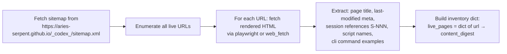

# Post-Merge Documentation Alignment Agent

## Purpose

After a promotion branch (e.g. `0D_base_` → `main`) is merged, this agent:

1. **Traverses** the live GitHub Pages site to inventory every rendered page
2. **Diffs** each page's content against the current source file in `docs/`
3. **Detects** four classes of drift: stale session references, broken nav entries, outdated code examples, and missing new pages
4. **Fixes** all detected drift in a single commit
5. **Verifies** the MkDocs build produces zero warnings after fixes

---

## Activation

```
@copilot Use post-merge-doc-alignment-agent after PR #3818 merges to main
```

Or trigger with the ready-to-use session prompt:

```
@copilot Execute docs/agents/POST_MERGE_ALIGNMENT_PROMPT.md
```

---

## Four-Phase Execution Protocol

### Phase 1 — Site Inventory (Read-Only)



**Tools:** `playwright-browser_navigate`, `web_fetch`, `playwright-browser_snapshot`

**Output:** `live_inventory` — dict mapping rendered URL → `{title, content_hash, session_refs[], script_refs[], cli_examples[]}`

---

### Phase 2 — Source Diff (Detect Drift)

For every page in `live_inventory`, locate the corresponding `docs/` source file and run:

```python
# Pseudo-algorithm
for url, live in live_inventory.items():
    source_path = url_to_source_path(url)          # e.g. /ci/CI_RESCUE_PIPELINE/ → docs/ci/CI_RESCUE_PIPELINE.md
    if not source_path.exists():
        drift["missing_source"].append(url)
        continue
    source_text = source_path.read_text()
    for session_ref in live["session_refs"]:        # e.g. "S237", "S241"
        if session_ref not in source_text:
            drift["stale_session_ref"].append((url, session_ref))
    for script in live["script_refs"]:              # e.g. "generate_coverage_map.py"
        if not Path(f"scripts/ci/{script}").exists():
            drift["broken_script_ref"].append((url, script))
    for example in live["cli_examples"]:            # e.g. "python3 ci_rescue.py --run-id"
        if not syntax_valid(example):
            drift["broken_cli_example"].append((url, example))
```

**Also check `mkdocs.yml` nav:**
- Every `docs/` path in the nav must resolve to a real file
- Every new file added to `docs/` since last release must appear in the nav

---

### Phase 3 — Apply Fixes

Fix in priority order:

| Priority | Drift Class | Fix Action |
|----------|-------------|-----------|
| P1 | `missing_nav_entry` | Add entry to `mkdocs.yml` nav under the correct section |
| P1 | `broken_nav_path` | Correct path or create stub file |
| P2 | `stale_session_ref` | Update session ID, commit SHA, and date in source file |
| P2 | `outdated_script_path` | Update path references to match actual file locations |
| P3 | `broken_cli_example` | Update syntax to match current script CLI |
| P3 | `stale_architecture_claim` | Update component counts, version numbers, status badges |

**Rules:**
- Edit only the `docs/` source files and `mkdocs.yml` — never edit generated/output files
- Use exact `edit` tool calls — no wholesale file rewrites unless the file has >50% stale content
- Preserve all Mermaid diagrams unless the diagram's data is factually wrong
- If a stale claim cannot be verified from the repo source files, add a `<!-- TODO: verify -->` comment and continue

---

### Phase 4 — Verify Build

```bash
# Install MkDocs dependencies
pip install mkdocs mkdocs-material mkdocs-mermaid2-plugin --quiet

# Build and check for warnings
mkdocs build --strict 2>&1 | tee /tmp/mkdocs_build.log

# Parse results
grep -E "WARNING|ERROR" /tmp/mkdocs_build.log || echo "✅ Zero warnings"
```

If warnings remain, fix each one and re-run until clean.

---

## Staleness Heuristics

The agent uses these heuristics to identify stale content without full semantic comparison:

```python
STALENESS_PATTERNS = [
    # Session references older than the merge
    (r'\bS2[0-3]\d\b', "session_id", "update to S244 or remove"),
    # Commit SHAs from the old branch
    (r'\b[0-9a-f]{8,12}\b(?=.*0D_base_)', "commit_sha", "verify against main HEAD"),
    # 'draft: true' mentions (PR should be merged)
    (r'draft:\s*true', "pr_draft_status", "update to draft: false or remove"),
    # Old branch name in docs
    (r'0D_base_', "branch_name", "update to main where appropriate"),
    # Coverage percentages that may have changed
    (r'\b\d+\.?\d*%\s+coverage\b', "coverage_stat", "verify against latest coverage.xml"),
    # Workflow run IDs (ephemeral — should not be in stable docs)
    (r'runs/\d{10,}', "run_id_in_docs", "replace with workflow name reference"),
]
```

---

## Scope: PR #3818 → main Post-Merge Alignment

The following specific items are known to need alignment after PR #3818 merges:

### New Pages to Verify on Live Site
- `https://aries-serpent.github.io/_codex_/ci/CI_RESCUE_PIPELINE/`
  - Verify all 9 Mermaid diagrams render (flowchart, sequenceDiagram, stateDiagram-v2, timeline, graph, graph LR ×3)
  - Verify code blocks are syntax-highlighted
  - Verify all internal cross-links resolve
- `https://aries-serpent.github.io/_codex_/ci/` (INDEX page)
  - Verify CI Rescue Pipeline is listed at top

### Nav Entries to Verify
```yaml
# These must appear in live site nav after merge:
- CI Rescue & Health:
  - CI Rescue Pipeline: ci/CI_RESCUE_PIPELINE.md     # NEW S244
  - CI/CD Index: ci/INDEX.md                          # UPDATED S244
  - Failure Analysis: ci/CI_FAILURE_ANALYSIS.md
  - CI Fix Summary: ci/CI_FIX_SUMMARY.md
  - Root Org Validation: ci/ROOT_ORG_VALIDATION.md
```

### Docs to Check for Staleness After Merge
| File | What to verify |
|------|----------------|
| `docs/index.md` | CI Rescue Pipeline quick-link present; "Last Updated" date ≥ 2026-03-30 |
| `docs/ci/CI_RESCUE_PIPELINE.md` | Branch references: `0D_base_` → replace with `main` where contextually appropriate (preserve historical references in the golden-path sequence diagram) |
| `docs/ci/INDEX.md` | CI Rescue Pipeline entry at top |
| `docs/accountability/AGENT_ACCOUNTABILITY_REPORT.md` | S244 entry present |
| `docs/CHANGELOG.md` | S244 entries in `## [Unreleased]` section |
| `.github/agents/cognitive-brain-manager.md` | Version shows v4.3.0; S244 session documented |

### Scripts Inventory to Verify in Docs
All script references in docs must resolve to real files in these locations:

```
scripts/ci/
  generate_coverage_map.py    ← NEW S237 — verify docs reference correct path
  ci_rescue.py                ← UPDATED S243/S244
  auto_fix_common_issues.py   ← UPDATED S244
  sync_tracked_files.py       ← UPDATED S240/S243
  check_cross_references.py   ← UPDATED S242
  check_pr_comments.py        ← UPDATED S240
  session_bootstrap.py        ← UPDATED S243
```

---

## Output Format

After execution, produce this structured report as a PR comment:

```markdown
## 📚 Post-Merge Documentation Alignment — S244

**Site:** https://aries-serpent.github.io/_codex_/
**Triggered by:** Merge of PR #3818 (0D_base_ → main)
**Session:** S244-doc-align

### Phase 1 — Site Inventory
- Pages crawled: N
- New pages verified: N
- Mermaid diagrams rendering: N/N ✅

### Phase 2 — Drift Detected
| Class | Count | Examples |
|-------|-------|---------|
| stale_session_ref | N | … |
| broken_nav_path | N | … |
| outdated_script_path | N | … |
| branch_name (0D_base_ → main) | N | … |

### Phase 3 — Fixes Applied
- N files updated
- N nav entries added/corrected
- Commit: `fix(docs): post-merge alignment S244 → main`

### Phase 4 — Build Verification
- MkDocs build: ✅ 0 warnings / ❌ N warnings (see details)
```

---

## Related Files

| File | Role |
|------|------|
| `docs/ci/CI_RESCUE_PIPELINE.md` | Primary new doc from S244 — verify Mermaid renders |
| `mkdocs.yml` | Nav config — source of truth for site structure |
| `docs/index.md` | Homepage — verify quick-links are current |
| `scripts/validate_docs_links.py` | Link validator — run before and after fixes |
| `.github/workflows/docs-health.yml` | CI gate — fires on main after merge |
| `docs/agents/POST_MERGE_ALIGNMENT_PROMPT.md` | Executable session prompt |

---

*Agent version 1.0.0 — Created S244 (2026-03-30) for use after PR #3818 merges to main*
