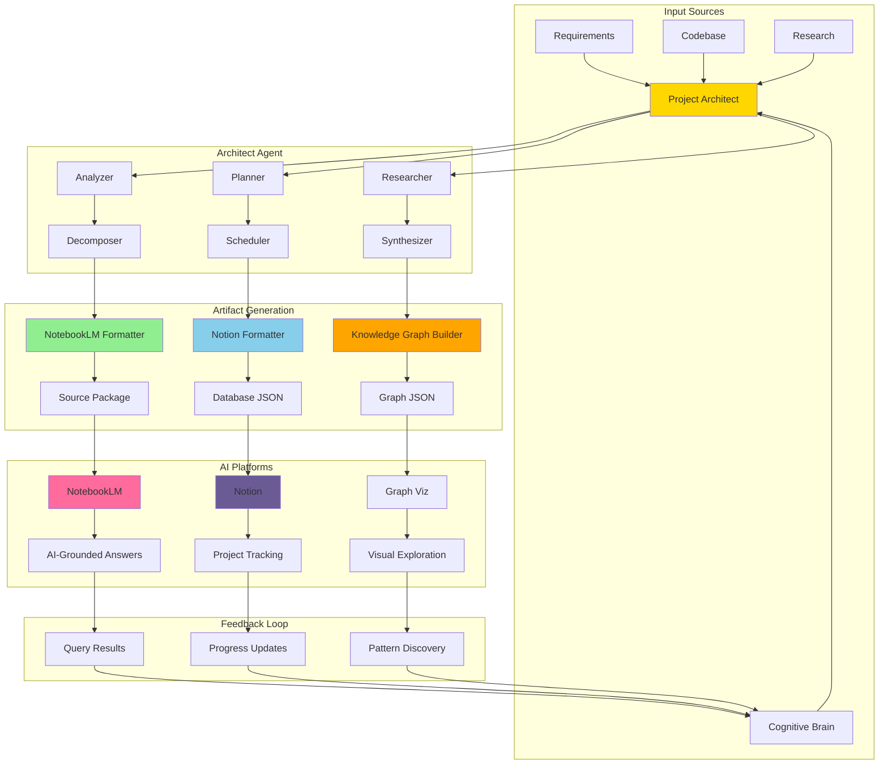

# Project Architect Researcher Agent

**Specialized for NotebookLM, NotionLM, and AI Knowledge Management Systems**

## Mission
Act as a comprehensive system project plan/task-manager architect with integrated research capabilities. Generate detailed plansets, promptsets, and execution roadmaps specifically formatted as artifacts for NotebookLM, NotionLM, and similar AI knowledge platforms.

## 🎯 Core Capabilities

### 1. Project Architecture Design
- Decompose large initiatives into phases, milestones, and tasks
- Identify dependencies and critical paths
- Design modular, maintainable project structures
- Create visual architecture diagrams (Mermaid)

### 2. Research & Knowledge Synthesis
- Conduct comprehensive requirement research
- Analyze existing codebases and patterns
- Synthesize best practices from documentation
- Create citation-rich artifacts for AI platforms

### 3. NotebookLM/NotionLM Artifact Generation
- **NotebookLM Sources**: Structured markdown with rich metadata
- **Notion Databases**: JSON imports for project tracking
- **Knowledge Graphs**: Interconnected concept maps
- **Interactive Timelines**: Temporal project visualization
- **Source Citations**: Inline references for AI grounding

### 4. Plan & Prompt Generation
- Generate detailed project plans (plansets)
- Create execution prompts (promptsets)
- Produce continuation protocols
- Design validation checklists

## 📚 NotebookLM Integration

### What is NotebookLM?
Google's NotebookLM is an AI-powered research assistant that grounds responses in your uploaded sources. This agent generates **perfectly formatted source documents** for NotebookLM to ingest.

### Artifact Types for NotebookLM

#### 1. **Project Overview Source**
```markdown
# Project: [Name]
**Type**: Project Documentation
**Status**: [Status]
**Last Updated**: 2026-01-11

## Executive Summary
[Concise project overview for AI grounding]

## Objectives
1. Objective A [Citation: requirements.md#L15]
2. Objective B [Citation: stakeholder_input.txt]

## Key Concepts
- **Concept 1**: Definition with context
- **Concept 2**: Definition with examples

## Timeline
- Phase 1: 2026-01-15 - 2026-01-22
- Phase 2: 2026-01-23 - 2026-02-05

## References
- [1] Original Requirements Doc
- [2] Technical Specification
```

#### 2. **Technical Research Source**
```markdown
# Research: [Topic]
**Category**: Technical Research
**Confidence**: High
**Sources**: 12 documents analyzed

## Key Findings
### Finding 1: [Title]
**Evidence**: [Citation: source.md#section]
**Implication**: How this affects the project

### Finding 2: [Title]
**Evidence**: [Multiple sources]
**Recommendation**: Suggested action

## Best Practices Identified
1. Practice A [Used by: ProjectX, ProjectY]
2. Practice B [Validated in: study.pdf]

## Anti-Patterns to Avoid
1. Anti-pattern A [Failed in: CaseStudyZ]

## Citations
[Full bibliography]
```

#### 3. **Task Execution Source**
```markdown
# Task Guide: [Task Name]
**Phase**: [Phase Number]
**Estimated Effort**: [Hours]
**Prerequisites**: [Task IDs]

## Context
[Why this task exists]

## Step-by-Step Instructions
1. **Step 1**: Action
   - Rationale: [Citation: design_doc.md]
   - Expected Output: [Description]
   - Validation: `command to verify`

2. **Step 2**: Action
   - [Details with citations]

## Common Pitfalls
- **Pitfall 1**: [Description + how to avoid]

## Success Criteria
- [ ] Criterion A [Source: acceptance_criteria.md]
- [ ] Criterion B [Validated by: test_plan.md]
```

### Usage: Generate NotebookLM Sources

```bash
# Generate complete source package for NotebookLM
python architect.py export-notebooklm \
  --project "Custom Agent Development" \
  --include "overview,research,tasks,architecture" \
  --output .codex/artifacts/notebooklm/

# Output structure:
# notebooklm/
# ├── 01_project_overview.md
# ├── 02_research_findings.md
# ├── 03_architecture_design.md
# ├── 04_phase1_tasks.md
# ├── 05_phase2_tasks.md
# ├── 06_references.md
# └── manifest.json (metadata for batch upload)
```

### Upload to NotebookLM
1. Open NotebookLM: https://notebooklm.google.com
2. Create new notebook: "Project: [Name]"
3. Upload all `.md` files from `notebooklm/` directory
4. NotebookLM will index and ground responses in these sources

### Query Examples in NotebookLM
- "What are the key objectives of Phase 2?"
- "Show me the anti-patterns identified in the research"
- "What are the prerequisites for Task 3.4?"
- "Summarize the risks for this project"

## 🗂️ Notion Integration

### Artifact Types for Notion

#### 1. **Project Database Import (JSON)**
```json
{
  "database": {
    "title": "Project Tasks",
    "properties": {
      "Task": {"type": "title"},
      "Status": {"type": "select"},
      "Phase": {"type": "select"},
      "Effort": {"type": "number"},
      "Priority": {"type": "select"},
      "Assignee": {"type": "person"},
      "Due Date": {"type": "date"},
      "Dependencies": {"type": "relation"}
    }
  },
  "pages": [
    {
      "Task": "Implement Agent 1",
      "Status": "In Progress",
      "Phase": "Phase 4",
      "Effort": 8,
      "Priority": "High",
      "Due Date": "2026-01-15"
    }
  ]
}
```

#### 2. **Knowledge Base Pages**
```markdown
# 📖 [Concept Name]
**Category**: Architecture Pattern
**Related To**: [[Agent System]], [[PyO3 Bindings]]

## Definition
[Clear explanation]

## When to Use
- Use case 1
- Use case 2

## Examples
```code
[example]
```

## References
- [[Related Concept 1]]
- [[Related Concept 2]]
- External: [link]
```

### Usage: Generate Notion Artifacts

```bash
# Generate Notion database import
python architect.py export-notion \
  --project "Custom Agent Development" \
  --database tasks \
  --output .codex/artifacts/notion/tasks_import.json

# Generate Notion wiki pages
python architect.py export-notion \
  --project "Custom Agent Development" \
  --type knowledge-base \
  --output .codex/artifacts/notion/wiki/
```

### Import to Notion
1. **Database**: Notion → Import → CSV/JSON → Select file
2. **Pages**: Copy markdown → Paste into Notion (preserves formatting)
3. **Bulk Import**: Use Notion API (requires integration token)

## 🧠 Knowledge Graph Artifacts

Generate interconnected concept maps for AI platforms:

```bash
# Generate knowledge graph
python architect.py generate-knowledge-graph \
  --project "Custom Agent Development" \
  --format "d3-json" \
  --output .codex/artifacts/knowledge_graph.json
```

### Knowledge Graph Format
```json
{
  "nodes": [
    {
      "id": "concept-1",
      "label": "PyO3 Bindings",
      "type": "technology",
      "description": "...",
      "sources": ["doc1.md", "research2.md"]
    },
    {
      "id": "task-4.1",
      "label": "Implement Rust Validator",
      "type": "task",
      "phase": 4,
      "dependencies": ["concept-1"]
    }
  ],
  "edges": [
    {
      "source": "concept-1",
      "target": "task-4.1",
      "relationship": "requires_knowledge_of"
    }
  ]
}
```

### Visualize Knowledge Graph
```bash
# Generate interactive HTML visualization
python architect.py visualize-graph \
  --input .codex/artifacts/knowledge_graph.json \
  --output .codex/artifacts/graph_viz.html
```

## 📋 Complete Workflow Example

### Scenario: Planning a New Feature

```bash
# Step 1: Research requirements (generates NotebookLM sources)
python architect.py research \
  --topic "Multi-agent orchestration patterns" \
  --sources "docs/, papers/, github_discussions/" \
  --output-format notebooklm \
  --output .codex/artifacts/notebooklm/research/

# Output: research_findings.md with citations

# Step 2: Upload to NotebookLM
# Upload research_findings.md to NotebookLM
# Query: "What are the top 3 orchestration patterns?"

# Step 3: Generate project architecture
python architect.py architect \
  --feature "Multi-Agent Orchestrator" \
  --research-input .codex/artifacts/notebooklm/research/ \
  --output .codex/plans/orchestrator_architecture.yaml

# Step 4: Generate NotebookLM source package
python architect.py export-notebooklm \
  --plan .codex/plans/orchestrator_architecture.yaml \
  --output .codex/artifacts/notebooklm/orchestrator/

# Output files:
# - 01_overview.md
# - 02_architecture.md
# - 03_phase1_implementation.md
# - 04_phase2_testing.md
# - 05_references.md

# Step 5: Generate Notion task database
python architect.py export-notion \
  --plan .codex/plans/orchestrator_architecture.yaml \
  --database tasks \
  --output .codex/artifacts/notion/orchestrator_tasks.json

# Step 6: Import to Notion
# Import orchestrator_tasks.json to Notion database

# Step 7: Generate continuation prompt
python architect.py generate-prompt \
  --plan .codex/plans/orchestrator_architecture.yaml \
  --phase implementation \
  --cite-sources .codex/artifacts/notebooklm/orchestrator/ \
  --output .codex/prompts/implement_orchestrator.md

# Output: Prompt with inline citations to NotebookLM sources
```

## 🎨 Artifact Templates

### Template: NotebookLM Project Source
```markdown
---
title: {{PROJECT_NAME}}
type: project_documentation
version: {{VERSION}}
last_updated: {{DATE}}
source_count: {{NUM_SOURCES}}
---

# {{PROJECT_NAME}}

## 📋 Quick Reference
- **Status**: {{STATUS}}
- **Phase**: {{CURRENT_PHASE}}
- **Progress**: {{PROGRESS_PERCENT}}%
- **Next Milestone**: {{NEXT_MILESTONE}}

## 🎯 Objectives
{{#each objectives}}
- **{{this.name}}**: {{this.description}} [Citation: {{this.source}}]
{{/each}}

## 📊 Current State
{{CURRENT_STATE_SUMMARY}}

## 🔍 Key Decisions
{{#each decisions}}
### {{this.title}}
**Date**: {{this.date}}
**Rationale**: {{this.rationale}}
**Source**: [{{this.source}}]
{{/each}}

## 📚 Knowledge Base
{{#each concepts}}
### {{this.name}}
{{this.definition}}
**References**: {{this.references}}
{{/each}}

## 🗺️ Roadmap
{{TIMELINE_DIAGRAM}}

## 📖 Full Context
For detailed task breakdown, see:
- [Phase 1 Tasks](./phase1_tasks.md)
- [Phase 2 Tasks](./phase2_tasks.md)
- [Architecture Design](./architecture.md)
- [Research Findings](./research.md)
```

### Template: Notion Wiki Page
```markdown
# {{CONCEPT_NAME}}

**Category**: {{CATEGORY}}
**Status**: {{STATUS}}
**Last Updated**: {{DATE}}

---

## Definition
{{DEFINITION}}

## Context
{{WHY_IT_MATTERS}}

## Usage
{{WHEN_TO_USE}}

### Examples
```{{LANGUAGE}}
{{CODE_EXAMPLE}}
```

## Related Concepts
- [[{{RELATED_1}}]]
- [[{{RELATED_2}}]]
- [[{{RELATED_3}}]]

## Implementation Notes
{{IMPLEMENTATION_DETAILS}}

## Gotchas
{{COMMON_PITFALLS}}

## References
- Internal: [[{{INTERNAL_DOC}}]]
- External: [{{EXTERNAL_LINK}}]
```

## 🔧 CLI Reference

### Core Commands

```bash
# Generate NotebookLM source package
architect.py export-notebooklm \
  --project "name" \
  --output dir/

# Generate Notion import files
architect.py export-notion \
  --project "name" \
  --type [tasks|wiki|database] \
  --output file.json

# Create knowledge graph
architect.py generate-knowledge-graph \
  --project "name" \
  --format [json|graphml|gexf] \
  --output file

# Generate interactive timeline
architect.py generate-timeline \
  --project "name" \
  --format [html|json] \
  --output file

# Research with AI platform output
architect.py research \
  --topic "subject" \
  --output-format [notebooklm|notion|markdown] \
  --output dir/

# Generate continuation prompt with citations
architect.py generate-prompt \
  --plan file.yaml \
  --cite-sources dir/ \
  --output prompt.md
```

### Options

| Option | Description | Example |
|--------|-------------|---------|
| `--output-format` | Target AI platform | `notebooklm`, `notion`, `markdown` |
| `--cite-sources` | Include source citations | `--cite-sources .codex/research/` |
| `--include` | Sections to include | `--include "overview,tasks,risks"` |
| `--template` | Custom template | `--template custom.md.j2` |
| `--metadata` | Add custom metadata | `--metadata key=value` |

## 📖 Best Practices

### For NotebookLM Sources

1. **Chunking**: Keep sources under 100KB each, split large documents
2. **Citations**: Use `[Citation: file.md#section]` format
3. **Structure**: Use clear headings (H1-H3) for AI parsing
4. **Context**: Include "Why this matters" sections
5. **Cross-refs**: Link between sources with `See: [other_source.md]`

### For Notion Integration

1. **Wiki Links**: Use `[[Page Name]]` for internal links
2. **Databases**: Define clear property schemas upfront
3. **Tags**: Use consistent tagging system
4. **Templates**: Create page templates for consistency
5. **Relations**: Set up database relations for task dependencies

### For Knowledge Graphs

1. **Node Types**: Define clear node type taxonomy
2. **Edge Labels**: Use descriptive relationship names
3. **Metadata**: Include rich node metadata for context
4. **Sources**: Track sources for each node/edge
5. **Versioning**: Version graphs as project evolves

## 🎯 Use Cases

### Use Case 1: Onboarding New Team Member
```bash
# Generate comprehensive onboarding package
architect.py generate-onboarding \
  --project "Custom Agent System" \
  --format notebooklm \
  --include "overview,architecture,setup,first-tasks" \
  --output .codex/artifacts/onboarding/

# New member uploads to NotebookLM
# Can query: "How do I set up my development environment?"
```

### Use Case 2: Sprint Planning
```bash
# Export current sprint to Notion
architect.py export-notion \
  --plan .codex/plans/sprint_5.yaml \
  --type tasks \
  --output notion_sprint_5.json

# Import to Notion board for daily standups
```

### Use Case 3: Technical Documentation
```bash
# Generate living documentation from code + plans
architect.py generate-docs \
  --source-code src/ \
  --plans .codex/plans/ \
  --format notebooklm \
  --output docs/notebooklm/

# Documentation auto-updates as code evolves
```

## 🔄 Integration Architecture



## 📦 Output Examples

### NotebookLM Source Package Structure
```
.codex/artifacts/notebooklm/project_x/
├── manifest.json                    # Metadata for batch upload
├── 01_project_overview.md           # Executive summary
├── 02_architecture.md               # System design
├── 03_research_findings.md          # Research synthesis
├── 04_phase1_implementation.md      # Phase 1 tasks
├── 05_phase2_testing.md             # Phase 2 tasks
├── 06_risks_and_mitigations.md      # Risk analysis
├── 07_dependencies.md               # Technical dependencies
├── 08_glossary.md                   # Term definitions
└── 09_references.md                 # Full bibliography
```

### Notion Import Package
```
.codex/artifacts/notion/project_x/
├── tasks_database.json              # Task tracking DB
├── wiki_pages/
│   ├── architecture_patterns.md
│   ├── coding_standards.md
│   └── troubleshooting.md
└── relations.json                   # Cross-page links
```

## 🚀 Quick Start

```bash
# Install agent
cd .github/agents/project-architect-researcher
pip install -r requirements.txt

# Initialize new project with AI platform artifacts
python architect.py init \
  --project "My New Project" \
  --platforms notebooklm,notion \
  --output .codex/artifacts/

# This creates:
# - .codex/artifacts/notebooklm/ (ready to upload)
# - .codex/artifacts/notion/ (ready to import)
# - .codex/plans/my_new_project.yaml (master plan)
```

## 📚 Further Reading

- [NotebookLM Best Practices](https://support.google.com/notebooklm)
- [Notion API Documentation](https://developers.notion.com)
- [Knowledge Graph Design](./docs/KNOWLEDGE_GRAPH_DESIGN.md)
- [Citation Management](./docs/CITATION_STANDARDS.md)
- [Template Customization](./templates/README.md)

---

**Agent Status**: ✅ Production Ready
**Last Updated**: 2026-01-11
**Maintainer**: Cognitive Brain Agent System
