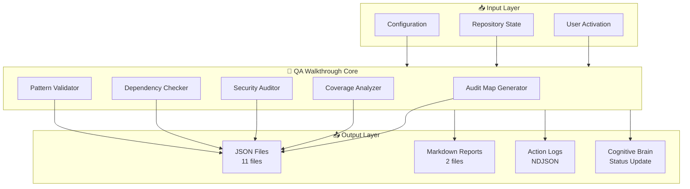
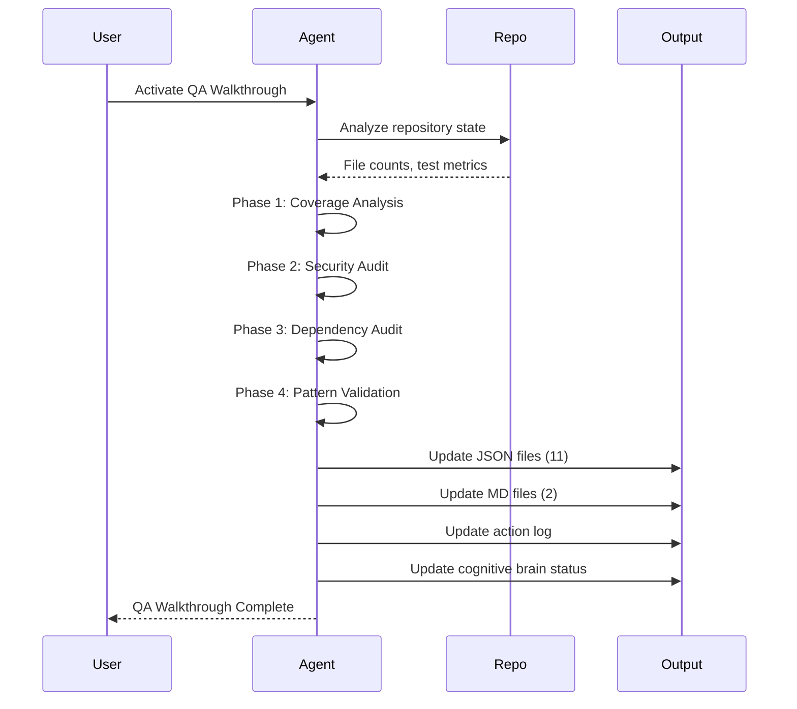

# QA Walkthrough Agent

## Purpose
Execute the repository-wide QA walkthrough plan with deterministic, evidence-based outputs covering governance, architecture, security, and CI/CD gating.

## Responsibilities
- Build a tokenization-friendly audit map (tree snapshot + key file indices).
- Run built-in audit tooling (space traversal, dependency checks).
- Produce a conflict matrix between legacy and modern modules.
- Verify critical security and data integrity paths.
- Track coverage gaps and propose test additions to reach 70%+ and 100% targets.
- Log all actions to `.codex/action_log.ndjson`, `.codex/change_log.md`, `.codex/results.md`.
- Update cognitive brain status with phase completion details.

## Architecture Diagram



## Workflow Sequence



## Output Files

### JSON Files (11)
| File | Description | Update Frequency |
|------|-------------|------------------|
| `coverage_analysis.json` | Test coverage metrics | Per phase |
| `codebase_map.json` | Repository structure | Per phase |
| `capability_registry.json` | Custom agents inventory | Per phase |
| `security_audit.json` | Security posture | Per phase |
| `dependency_audit.json` | Dependency analysis | Per phase |
| `improvement_proposals.json` | Tracked proposals | As needed |
| `reusable_patterns.json` | Documented patterns | As needed |
| `test_priority_matrix.json` | Test priorities | As needed |
| `conflict_matrix.json` | Legacy/modern conflicts | As needed |
| `tree_structure.json` | Directory tree | As needed |
| `module_inventory.jsonl` | Module details | Monthly |

### Markdown Files (2)
| File | Description |
|------|-------------|
| `README.md` | QA walkthrough documentation |
| `WALKTHROUGH_SUMMARY.md` | Executive summary |

### Log Files
| File | Format | Description |
|------|--------|-------------|
| `.codex/action_log.ndjson` | NDJSON | All QA actions |
| `.codex/change_log.md` | Markdown | Change audit trail |

## Current Metrics (2026-01-21)

| Metric | Value |
|--------|-------|
| Python Files | 4,191 |
| Test Files | 1,797 |
| Test Functions | 15,640+ |
| Source Modules | 1,043 |
| Coverage | 17.26% |
| Markdown Files | 2,684 |
| Workflows | 88 |
| Custom Agents | 109 |

## Activation Examples

### Basic Activation
```markdown
@copilot Use qa-walkthrough-agent to execute the repository-wide QA walkthrough plan.
```

### Full Walkthrough with Status Update
```markdown
@copilot Execute a comprehensive QA walkthrough using qa-walkthrough-agent. 
Update all QA walkthrough files in .codex/qa_walkthrough/ and create a new 
cognitive brain status update.
```

### Targeted Walkthrough
```markdown
@copilot Use qa-walkthrough-agent to update coverage_analysis.json and 
capability_registry.json with current repository metrics.
```

## Integration with Other Agents

| Agent | Integration |
|-------|-------------|
| `test-coverage-enforcer` | Uses coverage_analysis.json for enforcement |
| `security-vulnerability-patcher` | Uses security_audit.json for vulnerability tracking |
| `doc-freshness-checker` | Uses codebase_map.json for documentation analysis |
| `cognitive-brain-agent` | Receives status updates from QA walkthrough |

## AI Agency Policy Compliance

The qa-walkthrough-agent follows all AI Agency Policy requirements:
- ✅ Complete all tasks until completion
- ✅ Address all issues found (including out-of-scope)
- ✅ Update cognitive brain status
- ✅ Log all actions
- ✅ Follow PDA loop (Plan → Do → Assess)
- ✅ Leave codebase better than found

## Version History

| Version | Date | Changes |
|---------|------|---------|
| 3.0.0 | 2026-01-21 | Added architecture diagrams, updated metrics, AI Agency Policy compliance |
| 2.0.0 | 2026-01-19 | Phase 20.2 support, expanded responsibilities |
| 1.0.0 | 2026-01-16 | Initial release |

---

**Maintained by**: qa-walkthrough-agent  
**Category**: Quality Assurance  
**Status**: Production  
**Last Updated**: 2026-01-21T22:12:00Z
