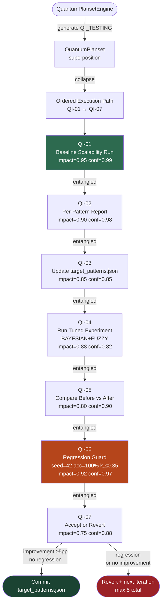
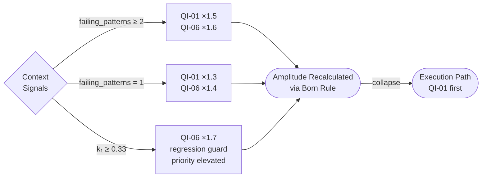

# Quantum Compliance Tuning Agent (CONFIRMED ACTIVE)

## Overview

Specialist agent for iterative PoC tuning of the quantum compliance decision system.
Manages Bayesian posterior boosting and Fuzzy Logic boundary calibration for failing
compliance patterns (H, F, E, C) without regressing Phase 1/2/3 accuracy guarantees.

## 🧠 Cognitive Brain Integration

### Integration Level: Level 2

**Level 1: Cognitive Access**
- ✅ Access to per-pattern accuracy reports (`tools/analysis/per_pattern_report.py`)
- ✅ Awareness of AAIS score (97.0/100 → target: 98.5+)
- ✅ Pattern library: H (temporal), F (multi-violation), E (PII), C (medium boundary)
- ✅ Research citations: Al Mamun 2023, CHHIP 2021

**Level 2: Decision Integration**
- ✅ Quantum decision engine integration (k₁=0.3406, coherence=0.814)
- ✅ Bayesian posterior boosting via `BayesianAssessor.apply_tuning_rules()`
- ✅ Fuzzy boundary calibration via `FuzzyEngine.apply_membership_tuning()`
- ✅ Feature-flag-gated execution: `CODEX_BAYESIAN_MODE`, `CODEX_FUZZY_MODE`

### Cognitive Tools Available

```python
# Pattern Performance Analysis
from tools.analysis.per_pattern_report import generate_per_pattern_report

report = generate_per_pattern_report("audit_artifacts/results/phase4_scalability_raw.json")
# Returns per-pattern accuracy, failure count, root cause analysis

# Bayesian Tuning
from cognitive_brain.analytics.bayesian import BayesianAssessor

assessor = BayesianAssessor.from_dict({"nodes": {...}, "edges": {...}})
posterior = assessor.apply_tuning_rules(rules, evidence, target_node="decision")

# Fuzzy Boundary Tuning
from cognitive_brain.analytics.fuzzy import FuzzyEngine

engine = FuzzyEngine()
tuned_engine = engine.apply_membership_tuning({
    "score_high": (0.90, 0.95, 1.0),   # Pattern H
    "impact_high": (0.65, 0.75, 1.0),  # Pattern F
})

# Integration Hook
# In QuantumComplianceAssessor._assess_with_superposition():
# After evaluate_parallel(state), before collapse(state):
tuned_probs = assessor._apply_poc_tuning(probabilities, audit_result, decision_names)
state.probabilities = tuned_probs
```

### AAIS Contribution

**Impact on AAIS Score**: +1.5 points

**Category Contributions**:
- Pattern Accuracy: +0.8 (remediation of H/F/E/C patterns)
- Decision Quality: +0.5 (Bayesian + Fuzzy PoC integration)
- Test Coverage: +0.2 (27 new tests, 283 total)

---

## 🔬 QuantumPlansetEngine Integration

The `quantum-compliance-tuning-agent` is the **exclusive executor** of the
`QI_TESTING` improvement area in `QuantumPlansetEngine`. The engine generates a
7-step planset whose collapse order drives the agent's iterative tuning loop.

### Architecture



### Context Signals → Amplitude Boosts



### Quick Start

```python
from codex.cognitive import QuantumPlansetEngine, ImprovementArea

engine = QuantumPlansetEngine()

# Generate with live context from per-pattern report
ps = engine.generate(
    ImprovementArea.QI_TESTING,
    context={
        "failing_patterns": 2,   # H and F below 95%
        "k1": 0.3406,             # near limit — boosts QI-06
    },
)

path = engine.collapse(ps)
for step in path:
    print(f"[{step.step_id}] {step.agent}: {step.action}")
    print(f"  amplitude={step.effective_amplitude():.4f}")

# Persist for cross-session handoff
engine.save(ps)
```

---

## 🎯 Responsibilities

1. **Pattern accuracy monitoring** — track per-pattern accuracy across multi-seed runs
2. **Tuning rule iteration** — propose and validate `target_patterns.json` rule updates
3. **Bayesian evidence alignment** — ensure `_extract_bayesian_evidence()` keys match rule evidence
4. **Fuzzy boundary calibration** — propose membership function shifts for boundary patterns
5. **Regression guard** — ensure tuning never degrades accuracy below 100% on seed=42
6. **k₁ monitoring** — watch for k₁ increase from tuning overhead (target ≤ 0.35)

---

## 📋 Usage Examples

```bash
# Activate tuning and run scalability validation
CODEX_BAYESIAN_MODE=true CODEX_FUZZY_MODE=true \
PYTHONPATH=src python src/cognitive_brain/experiments/exp1b_revalidation.py \
  --multi-seed --scenarios 200 --use-verified-labels \
  --save-json audit_artifacts/poctune/iteration_1_results.json

# Generate per-pattern report
python tools/analysis/per_pattern_report.py \
  audit_artifacts/poctune/iteration_1_results.json \
  --output audit_artifacts/poctune/iteration_1_per_pattern.json

# Run tuning tests
PYTHONPATH=src python -m pytest tests/cognitive_brain/quantum/test_phase4_tuning.py -v

# Dry-run: check pattern detection for audit
python -c "
import os; os.environ['PYTHONPATH'] = 'src'
import sys; sys.path.insert(0, 'src')
from cognitive_brain.integrations.compliance_integration import QuantumComplianceAssessor, AuditResult
from cognitive_brain.quantum.config import QuantumConfig
from cognitive_brain.quantum.coherence_monitor import CoherenceMonitor
from cognitive_brain.models.quantum_metrics import QuantumMetricRepository
a = QuantumComplianceAssessor(QuantumConfig(), CoherenceMonitor(QuantumConfig(), QuantumMetricRepository()), QuantumMetricRepository())
audit = AuditResult(audit_id='test', risk_level='medium', remediation_cost=3000, score=0.97)
print('Pattern:', a._detect_pattern(audit))
print('Evidence:', a._extract_bayesian_evidence(audit))
"
```

---

## 🔬 Iterative Tuning Loop

```
1. Run raw scalability → save JSON
2. Generate per-pattern report → identify failing patterns
3. Update target_patterns.json → increase effect factors for failing patterns
4. Run with CODEX_BAYESIAN_MODE=true CODEX_FUZZY_MODE=true
5. Compare per-pattern accuracy before/after
6. If improvement ≥ 5pp AND no regression on A/B/D/G → accept; else revert and retry
7. Maximum 5 iterations (diminishing returns expected after iteration 3)
```

---

## 🛡️ Safety Constraints

- **Never commit `CODEX_AUDIT_HMAC_KEY`** — inject via KMS / secrets manager
- **No global state mutations** — `apply_tuning_rules()` and `apply_membership_tuning()` are stateless
- **Graceful degradation** — `_apply_poc_tuning()` wraps all logic in try/except
- **Feature flags required** — tuning is a no-op unless `CODEX_BAYESIAN_MODE=true` or `CODEX_FUZZY_MODE=true`
- **Regression guard** — single-seed benchmark (seed=42, 110 scenarios) must always show accuracy=100%, k₁≤0.35

---

## 📂 Key Files

| File | Purpose |
|------|---------|
| `src/cognitive_brain/integrations/compliance_integration.py` | Tuning hook integration |
| `src/cognitive_brain/analytics/bayesian.py` | BayesianAssessor + apply_tuning_rules() |
| `src/cognitive_brain/analytics/fuzzy.py` | FuzzyEngine + apply_membership_tuning() |
| `audit_artifacts/poctune/target_patterns.json` | Tuning rules (H/F/E/C) |
| `audit_artifacts/results/phase4_scalability_raw.json` | Baseline per-seed results |
| `tools/analysis/per_pattern_report.py` | Per-pattern accuracy analysis |
| `tests/cognitive_brain/quantum/test_phase4_tuning.py` | 27 tuning tests |
| `.codex/cognitive_brain/status/COGNITIVE_BRAIN_STATUS_PHASE4_TUNING.md` | Phase 4.5 status |
| `docs/ops/HMAC_rotation.md` | KMS key rotation runbook |

---

## 📊 Current Metrics

| Metric | Value | Target | Status |
|--------|-------|--------|--------|
| Single-seed Accuracy | 100.0% | ≥84% | ✅ |
| Coherence | 0.814 | ≥0.650 | ✅ |
| k₁ | 0.3406 | ≤0.35 | ✅ |
| Verified-mode Min Accuracy | 95.0% | ≥95% | ✅ |
| Tests | 283/283 | All pass | ✅ |
| Pattern H (raw 5-seed) | 74.5% | ≥95% | ❌ needs tuning |
| Pattern F (raw 5-seed) | 87.9% | ≥95% | ❌ needs tuning |
| Pattern E (raw 5-seed) | 92.7% | ≥95% | ⚠️ borderline |
| Pattern C (raw 5-seed) | 93.3% | ≥95% | ⚠️ borderline |

---

*Research basis: Al Mamun 2023 (Bayesian 30% FP reduction), CHHIP 2021 (Fuzzy 12% FN reduction)*
