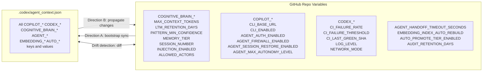

# Repo Var Sync Agent v1.1

> **Updated PR #3483**: Extended to sync all 13 new variables added in PR #3483.  
> Ensures `.codex/agent_context.json` and GitHub Actions repo variables
> (`COPILOT_*` / `CODEX_*` / `COGNITIVE_BRAIN_*` / `AGENT_*` / `EMBEDDING_*` / `AUTO_*`)
> are always in sync. Runs as part of `copilot-agent-vars-bootstrap.yml`
> and can be triggered manually for drift detection.

## Activation

```
@copilot Use the Repo Var Sync Agent to sync agent_context.json with repo variables
```

## Architecture



## Tracked Variable Prefixes (v1.1)

| Prefix | Variables | Count |
|---|---|---|
| `COGNITIVE_BRAIN_` | MAX_CONTEXT_TOKENS, LTM_RETENTION_DAYS, PATTERN_MIN_CONFIDENCE, MEMORY_TIER, SESSION_NUMBER, INJECTION_ENABLED, ALLOWED_ACTORS | 7 | <!-- pragma: allowlist secret -->
| `COPILOT_` | CLI_BASE_URL, CLI_ENABLED, AGENT_AUTH_ENABLED, AGENT_FIREWALL_ENABLED, AGENT_SESSION_RESTORE_ENABLED, AGENT_MAX_AUTONOMY_LEVEL | 6 |
| `CODEX_` | CI_FAILURE_RATE, CI_FAILURE_THRESHOLD, CI_LAST_GREEN_SHA, LOG_LEVEL, NETWORK_MODE, ORG_NAME, AGENT_NAME, API_VERSION, ISOLATED_PATH | 9 |
| `AGENT_` | HANDOFF_TIMEOUT_SECONDS | 1 |
| `EMBEDDING_` | INDEX_AUTO_REBUILD | 1 |
| `AUTO_` | PROMOTE_TIER_ENABLED | 1 |
| **Total tracked** | | **25** |

## Responsibilities

### Direction A — Variables → File (bootstrap sync)
Used by `copilot-agent-vars-bootstrap.yml` to inject context at session start:

```python
import os, json, requests

token  = os.environ["CODEX_MASTER_KEY"]  # pragma: allowlist secret
owner  = "Aries-Serpent"
repo   = "_codex_"
url    = f"https://api.github.com/repos/{owner}/{repo}/actions/variables"
headers = {"Authorization": f"Bearer {token}", "Accept": "application/vnd.github+json"}  # pragma: allowlist secret

resp = requests.get(url, headers=headers)
vars_data = {v["name"]: v["value"] for v in resp.json().get("variables", [])}

# Sync all tracked prefixes (updated PR #3483)
TRACKED_PREFIXES = ("COPILOT_", "CODEX_", "COGNITIVE_BRAIN_", "AGENT_", "EMBEDDING_", "AUTO_")
context = {k: v for k, v in vars_data.items() if k.startswith(TRACKED_PREFIXES)}

# Add mandatory CCA version-lock constants (CAD-Mandate Rule 2 / MSPV)
context["COPILOT_AGENT_CCA_VERSION_LOCK"] = "stable"
context["COPILOT_AGENT_DEDUPLICATION_ENABLED"] = "true"
context["COPILOT_AGENT_TURN_ISOLATION_ENABLED"] = "true"

os.makedirs(".codex", exist_ok=True)
with open(".codex/agent_context.json", "w") as f:
    json.dump(context, f, indent=2)
print(f"Wrote {len(context)} variables to .codex/agent_context.json")
```

### Direction B — File → Variables (propagate local changes)
When an agent updates `.codex/agent_context.json` and the change should persist:

```python
# For each key in agent_context.json (skip static constants):
# 1. Try PATCH (update existing)
# 2. Fall back to POST (create new)
STATIC_KEYS = {"COPILOT_AGENT_CCA_VERSION_LOCK", "COPILOT_AGENT_DEDUPLICATION_ENABLED", "COPILOT_AGENT_TURN_ISOLATION_ENABLED"}
for key, value in context.items():
    if key in STATIC_KEYS:
        continue
    r = requests.patch(f"{url}/{key}", json={"value": str(value)}, headers=headers)
    if r.status_code == 404:
        requests.post(url, json={"name": key, "value": str(value)}, headers=headers)
```

### Drift Detection
Compares file vs API and reports any key/value mismatches:

```
DRIFT REPORT:
  Missing in file:    CODEX_NEW_VAR
  Missing in API:     CODEX_OLD_LOCAL_ONLY
  Value mismatch:     CODEX_CI_FAILURE_RATE file=8.2:ok API=30.7:critical
```

## Integration Points
- `copilot-agent-vars-bootstrap.yml` — runs Direction A on every PR push
- `copilot-setup-steps.yml` — injects file into GITHUB_ENV (reads Direction A output)
- `agent-var-writer.yml` — autonomous variable writing (Direction B)
- `ci-health-monitor.yml` — updates `CODEX_CI_FAILURE_RATE` (Direction B single var)

## Tools Used
- `bash` — curl/python3 API calls
- `view` / `edit` — read/write `.codex/agent_context.json`
- `github-mcp-server-actions_get` — read existing variable values

## Constraints
- Never write secrets to `.codex/agent_context.json` (plain-text file)
- Sync prefixes: `COPILOT_*`, `CODEX_*`, `COGNITIVE_BRAIN_*`, `AGENT_*`, `EMBEDDING_*`, `AUTO_*`
- Always use `CODEX_MASTER_KEY` for write operations; fall back to `CODEX_BACKUP_KEY`
- Rate limit: max 10 API calls per sync operation
- **Never overwrite** human governance flags: `AUTONOMOUS_ACTIONS_ENABLED`, `COPILOT_AGENT_AUTH_ENABLED`, `COPILOT_AGENT_FIREWALL_ENABLED`, `COGNITIVE_BRAIN_INJECTION_ENABLED`
