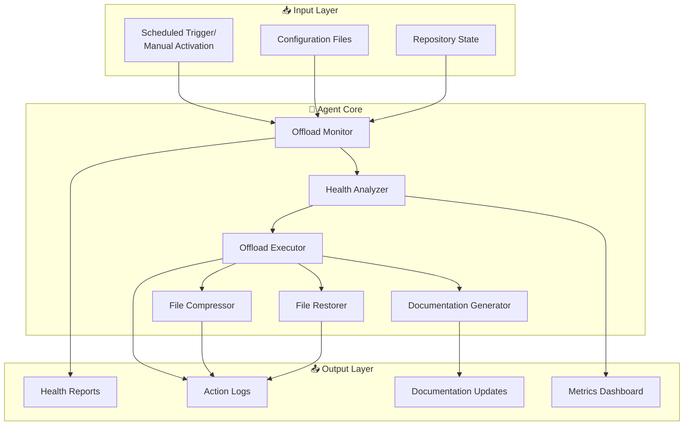
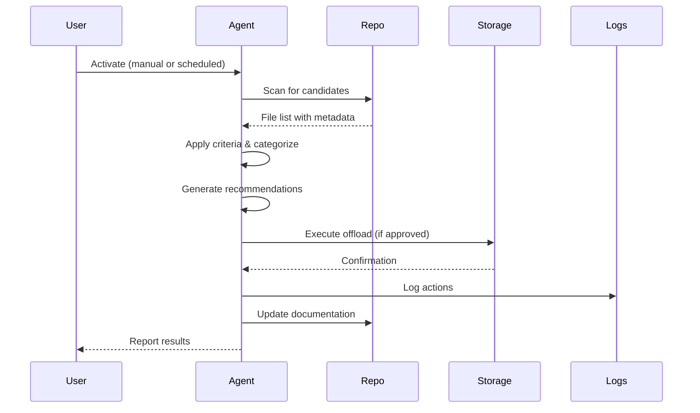

# Repository Organization Agent

**Agent Type**: Custom Copilot Agent  
**Category**: Repository Maintenance & Optimization  
**Version**: 1.0.0  
**Status**: ✅ Specification Complete  
**Last Updated**: 2026-01-26

---

## 🎯 Purpose

Automate repository organization and optimization through intelligent identification of offload candidates, execution of offloads with category organization, generation of documentation, monitoring of repository health metrics, and enforcement of retention policies.

---

## 🏗️ Architecture



---

## 📋 Capabilities

### 1. Identify Offload Candidates

**Description**: Scan repository for files meeting offload criteria  
**Criteria**:
- Age > 90 iterations (temp files)
- Age > 180 iterations (deprecated reports)
- Size > 1MB (large artifacts)
- Usage patterns (not accessed in 6+ months)

**Output**: JSON report with candidates, categories, recommendations

### 2. Execute Offload with Category Organization

**Description**: Move files to external storage with proper categorization  
**Categories**:
- `historical-coverage/` - Coverage reports
- `historical-logs/` - Log extracts
- `historical-artifacts/` - CI/CD artifacts
- `archive-files/` - Archive packages
- `temp-outputs/` - Temporary files
- `deprecated-reports/` - Deprecated reports

**Output**: Git-tracked moves, updated inventory

### 3. Generate Documentation Automatically

**Description**: Create/update READMEs and indexes for offloaded files  
**Documents**:
- Category READMEs with usage instructions
- Master offload index with file inventory
- Retrieval guides with decompression steps
- Maintenance schedules with retention policies

**Output**: Markdown documentation files

### 4. Monitor Repository Health Metrics

**Description**: Track repository size, growth, and optimization opportunities  
**Metrics**:
- Total repository size
- Offload directory size
- Top 10 largest files/directories
- Growth trends over time
- Retention policy compliance

**Output**: Health dashboard with recommendations

### 5. Enforce Retention Policies

**Description**: Apply time-based retention rules to offloaded files  
**Policies**:
- Permanent: Coverage, logs, artifacts, archives
- 90 iterations: Temporary outputs
- 180 iterations: Deprecated reports

**Output**: Automated cleanup, compliance reports

### 6. Restore Files on Demand

**Description**: Retrieve files from external storage back to original locations  
**Modes**:
- By category (all files in category)
- By file path (specific file)
- Dry-run mode (preview without changes)

**Output**: Restored files, updated documentation

---

## 🔌 Integration Points

### 1. QA Walkthrough Integration

**Location**: `.codex/qa_walkthrough/`  
**Files**:
- `codebase_map.json` - Offload structure metadata
- `WALKTHROUGH_SUMMARY.md` - Phase status updates
- `EXTERNAL_STORAGE_OFFLOAD_REPORT.md` - Execution reports

**Purpose**: Maintain QA walkthrough access to historical data

### 2. External Storage

**Location**: `.codex/archive/root-consolidation/deprecated-reports/misc/repo-owner-review/`  
**Structure**:
```
.codex/archive/root-consolidation/deprecated-reports/misc/repo-owner-review/
├── OFFLOAD_INDEX.md
├── historical-coverage/
├── historical-logs/
├── historical-artifacts/
├── archive-files/
├── temp-outputs/
└── deprecated-reports/
```
**Note**: The legacy root-level `misc/repo-owner-review/` path is compatibility-only and not the authoritative live archive contract.

**Purpose**: Organized external storage for offloaded files

### 3. Action Log

**Location**: `.codex/action_log.ndjson`  
**Format**: NDJSON (newline-delimited JSON)  
**Events**:
- `scan_offload_candidates`
- `execute_offload`
- `compress_historical_files`
- `restore_offloaded_files`

**Purpose**: Complete audit trail of all operations

### 4. GitHub Actions

**Location**: `.github/workflows/repository-health-monitoring.yml`  
**Schedule**: per-phase (configurable)  
**Trigger**: Manual dispatch, scheduled cron  
**Purpose**: Automated scheduled execution

---

## 🚀 Activation Examples

### Example 1: Scan for Offload Candidates

```markdown
@copilot Use repository-organization-agent to scan the repository for offload candidates and generate a health report.
```

**Expected Output**:
- JSON report in `.codex/repository_health/offload_candidates.json`
- Updated dashboard in `.codex/repository_health/DASHBOARD.md`
- Action log entry in `.codex/action_log.ndjson`

### Example 2: Execute Offload for Category

```markdown
@copilot Use repository-organization-agent to offload all files in the "logs" category that are older than 180 iterations.
```

**Expected Output**:
- Files moved to `.codex/archive/root-consolidation/deprecated-reports/misc/repo-owner-review/historical-logs/`
- Updated `OFFLOAD_INDEX.md` with new files
- Category README created/updated
- Git history preserved via renames

### Example 3: Compress Historical Files

```markdown
@copilot Use repository-organization-agent to compress all historical files older than 180 iterations to save storage space.
```

**Expected Output**:
- Files compressed to `.gz` format
- Compression ratio reported
- Updated retrieval guides with decompression instructions
- Action log entries for each compression

### Example 4: Restore Files

```markdown
@copilot Use repository-organization-agent to restore the historical-coverage category for trend analysis.
```

**Expected Output**:
- Files restored to original locations
- Documentation updated
- Action log entry with restoration details

### Example 5: Generate Health Dashboard

```markdown
@copilot Use repository-organization-agent to update the repository health dashboard with current metrics.
```

**Expected Output**:
- Updated `.codex/repository_health/DASHBOARD.md`
- Current size metrics
- Top 10 largest files
- Automated recommendations

---

## 📊 Success Metrics

### Primary Metrics

| Metric | Target | Current | Status |
|--------|--------|---------|--------|
| **Repository Size** | < 150MB | 133MB | ✅ On Target |
| **Offload Efficiency** | > 5% reduction | 5% (6.8MB) | ✅ Achieved |
| **Automation Coverage** | 100% of offload tasks | 75% (3/4 tasks) | 🟡 In Progress |
| **Documentation Completeness** | 100% of categories | 100% (6/6) | ✅ Complete |
| **Retention Compliance** | 100% | 100% | ✅ Compliant |

### Secondary Metrics

| Metric | Target | Current | Status |
|--------|--------|---------|--------|
| **Scan Frequency** | per-phase | On-demand | 🔄 To Automate |
| **Compression Ratio** | 50-70% | N/A | ⏳ Pending |
| **Restoration Time** | < 5 min | N/A | ⏳ Pending |
| **False Positives** | < 5% | N/A | ⏳ Pending |

---

## 🔧 Implementation Details

### Scripts

| Script | Purpose | Status |
|--------|---------|--------|
| `monitor_offload_candidates.py` | Scan for candidates | ✅ Implemented |
| `restore_offloaded_files.py` | Restore files | ✅ Implemented |
| `compress_historical_files.py` | Compress files | ✅ Implemented |

### Workflows

| Workflow | Purpose | Status |
|----------|---------|--------|
| `repository-health-monitoring.yml` | Scheduled monitoring | ⏳ To Implement |

### Configuration

| File | Purpose | Status |
|------|---------|--------|
| `.codex/repository_health/config.json` | Agent configuration | ⏳ To Implement |
| `OFFLOAD_INDEX.md` | File inventory | ✅ Complete |
| `DASHBOARD.md` | Health dashboard | ✅ Complete |

---

## 🔄 Workflow Sequence



---

## ⚠️ Safety & Constraints

### Safety Mechanisms

1. **Dry-run Mode**: Preview changes without execution
2. **Git History Preservation**: All moves tracked as renames
3. **Backup Verification**: Confirm files exist before deletion
4. **Rollback Support**: Restoration script for emergency recovery
5. **Approval Gates**: Human review for large operations (>10MB)

### Constraints

1. **No Deletion**: Files moved, never deleted (except post-compression)
2. **Active Files Protected**: Current coverage, logs, metrics never offloaded
3. **Category Validation**: Only known categories accepted
4. **Size Limits**: Warn on single file > 50MB
5. **Rate Limiting**: Max 100 files per operation

---

## 📚 Documentation

### For Users

- **Quick Start**: See activation examples above
- **Retrieval Guide**: `.codex/archive/root-consolidation/deprecated-reports/misc/repo-owner-review/OFFLOAD_INDEX.md`
- **Dashboard**: `.codex/repository_health/DASHBOARD.md`

### For Developers

- **Architecture**: See diagrams above
- **API Documentation**: Script docstrings
- **Testing Guide**: `tests/repository_organization/`

### For Admins

- **Configuration**: `.codex/repository_health/config.json`
- **Monitoring**: GitHub Actions workflow logs
- **Troubleshooting**: `.codex/action_log.ndjson`

---

## 🔮 Future Enhancements

### Phase 22.2: Advanced Automation

- [ ] ML-based candidate prediction
- [ ] Intelligent compression strategy (by file type)
- [ ] Automated trend analysis
- [ ] Slack/email notifications

### Phase 22.3: Integration Expansion

- [ ] Integration with external storage (S3, GCS)
- [ ] Integration with CI/CD for automatic offloads
- [ ] Integration with issue tracking for follow-ups
- [ ] Integration with analytics dashboards

### Phase 22.4: Optimization

- [ ] Incremental compression (only changed files)
- [ ] Parallel processing for large operations
- [ ] Caching for faster scans
- [ ] Deduplication detection

---

## 🐛 Known Limitations

1. **Binary Files**: Large binaries (e.g., `github-secrets-cli`) not automatically handled
2. **Git LFS**: No integration with Git Large File Storage yet
3. **External Links**: No tracking of external references to offloaded files
4. **Compression**: Only gzip compression supported currently (no zstd, brotli)
5. **Restoration**: Cannot restore to different path than original

---

## 🤝 Contributing

### Adding New Categories

1. Update `CATEGORY_MAPPINGS` in restoration script
2. Add category to `OFFLOAD_INDEX.md`
3. Create category README with usage guide
4. Update dashboard with new category metrics
5. Add tests for new category

### Improving Criteria

1. Update `CRITERIA` in monitoring script
2. Document rationale in agent specification
3. Add tests for new criteria
4. Update dashboard recommendations

---

## 📞 Support

**Primary Maintainer**: QA Walkthrough Agent  
**Secondary**: Repository Organization System  
**Documentation**: `.codex/qa_walkthrough/`, `.codex/archive/root-consolidation/deprecated-reports/misc/repo-owner-review/`  
**Issues**: GitHub Issues with `repository-organization` label

---

## 📝 Version History

| Version | Date | Changes |
|---------|------|---------|
| 1.0.0 | 2026-01-26 | Initial specification with full architecture |

---

**Status**: ✅ Specification Complete, Implementation 75% Complete  
**Next Steps**: Implement GitHub Actions workflow for scheduled monitoring  
**Maintained by**: repository-organization-agent
