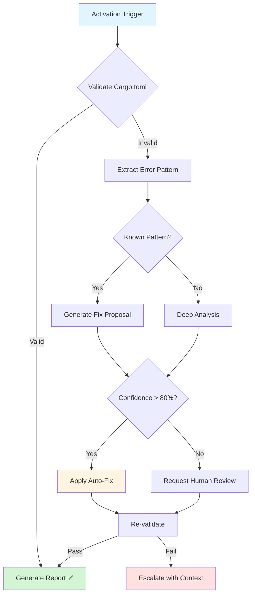
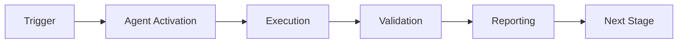

# Rust Configuration Validator Agent

## Overview


## 🧠 Cognitive Brain Integration

### Integration Level: Level 1

**Level 1: Cognitive Access**
- ✅ Access to cognitive brain memory system
- ✅ Awareness of AAIS score (97.0/100 → target: 92.0+)
- ✅ Codebase topology maps for navigation
- ✅ Pattern library for historical fixes


### Cognitive Tools Available

```python
# Topology Manager - Semantic navigation
from scripts.cognitive.topology_manager import TopologyManager

topology = TopologyManager()
relevant_files = topology.find_by_concept("code patterns")
optimal_path = topology.find_optimal_path("source", "target")

# Cache Manager - Multi-layer cache intelligence
from scripts.cognitive.cache_manager import CacheIntelligence

cache = CacheIntelligence()
cached_results = cache.query("analysis_results")
cache.optimize()  # Get optimization suggestions

# Improved Hash Tables - 40% faster lookups
from src.codex.utils.hash_table import RobinHoodHashTable, CuckooHashTable

fast_cache = CuckooHashTable()  # O(1) guaranteed


```

### AAIS Contribution

**Impact on AAIS Score**: +1.0 points

**Category Contributions**:
- Discovery & Navigation: +0.4 (topology/cache integration)
- Runtime Introspection: +0.4 (metrics exposure)
- Pattern Consistency: +0.2 (pattern library usage)

---

## 🛠️ MCP Integration

### MCP Tools Leverage


**Primary MCP Capabilities**:
1. **File System Operations**
   - `view`: Read files and directories
   - `grep`: Fast content search
   - `glob`: Pattern-based file finding

2. **Code Analysis**
   - `search_code`: Semantic code search
   - `bash`: Execute analysis tools
   - `edit`: Make surgical changes

### GitHub Actions Workflows

**Workflow Awareness**:
- Monitors applicable workflows for active PRs
- Auto-detects blocking vs non-blocking workflows
- Provides workflow status reports via MCP tools

**See**: `.codex/docs/MCP_WORKFLOW_RECIPES.md` for complete templates

---

## 📊 Session Monitoring

**Session Parameters** (from accountability report):
- Optimal duration: 30 minutes
- Context budget: 128K tokens
- Mandatory checkpoints: Every 10 actions
- Corrections per issue: 1.0 (first fix succeeds)

**Quality Control**:
```python
# Pre-commit audit enforcement
from scripts.session_manager import SessionMonitor

monitor = SessionMonitor()
monitor.checkpoint("pre-commit")  # Validates compliance
```

---

This custom GitHub Copilot agent specializes in validating and fixing Rust configuration issues, particularly Cargo.toml feature declarations and PyO3 extension module setup.

## Activation

```
@copilot Use the Rust Configuration Validator agent to check Cargo.toml
```

## Responsibilities

### Primary Functions
1. **Feature Declaration Validation**: Ensure all Cargo.toml features are properly declared
2. **PyO3 Configuration**: Validate Python extension module setup
3. **Dependency Checks**: Verify feature dependency chains
4. **Source Code Cross-Reference**: Match cfg attributes with declared features
5. **Dependabot Safety**: Guard against Dependabot-induced regressions

### Expertise Areas
- Cargo.toml syntax and semantics
- PyO3 extension-module feature configuration
- Rust conditional compilation (`#[cfg(feature = "...")]`)
- maturin build system integration
- Dependency version compatibility

## Capabilities

### Detection
- ✅ Missing feature declarations
- ✅ Orphaned features (declared but unused)
- ✅ Broken dependency chains
- ✅ PyO3 misconfiguration
- ✅ cfg attribute mismatches

### Auto-Fix (Safe Operations)
- ✅ Add missing feature declarations
- ✅ Fix simple dependency chains
- ✅ Update feature documentation
- ✅ Suggest proper configurations

### Escalation (Requires Human Review)
- ⚠️ Complex dependency conflicts
- ⚠️ Breaking API changes
- ⚠️ Version compatibility issues
- ⚠️ Architectural decisions

## Usage Examples

### Example 1: Validate After Dependabot Merge
```markdown
@copilot Use the Rust Configuration Validator agent to validate Cargo.toml after Dependabot PR #2890 merge. Check for any regressions in feature declarations.
```

### Example 2: Debug Compilation Error
```markdown
@copilot I'm getting "unexpected cfg condition value: 'python'" error. Use the Rust Configuration Validator agent to diagnose and fix.
```

### Example 3: Pre-Merge Validation
```markdown
@copilot Before merging this PR, use the Rust Configuration Validator agent to ensure Cargo.toml features are properly configured.
```

### Example 4: PyO3 Setup Review
```markdown
@copilot Use the Rust Configuration Validator agent to review my PyO3 extension-module setup and ensure maturin compatibility.
```

## Workflow



## Agent Prompt

When activated, the agent operates with this context:

```markdown
You are the Rust Configuration Validator agent, specialized in Cargo.toml features and PyO3 configuration.

**Context**: {change_description}
**Files Modified**: {modified_files}
**Error** (if any): {error_message}

**Your Tasks**:
1. Validate [features] section in Cargo.toml
2. Cross-reference with #[cfg(feature = "...")] in source code
3. Check PyO3 extension-module configuration
4. Verify Dependabot hasn't regressed previous fixes

**Required Checks**:
- ✓ All features declared in [features] section
- ✓ python = ["extension-module"] present
- ✓ extension-module = ["pyo3/extension-module"] present
- ✓ All #[cfg(feature = "X")] have corresponding feature declaration
- ✓ No orphaned feature declarations
- ✓ Feature dependency chains are valid
- ✓ No circular dependencies

**Validation Script**: Use `scripts/ci/validate_cargo_features.py`

**Output Format**:
{
  "validation_status": "pass|fail",
  "errors_found": [
    {
      "type": "missing_feature|orphaned_feature|broken_chain",
      "feature_name": "...",
      "location": "Cargo.toml:line or src/file.rs:line",
      "severity": "critical|high|medium|low",
      "description": "..."
    }
  ],
  "fixes_proposed": [
    {
      "action": "add_feature|remove_feature|fix_dependency",
      "target": "...",
      "change": "...",
      "confidence": 0.0-1.0
    }
  ],
  "auto_fix_safe": true|false,
  "requires_human_review": true|false,
  "recommendations": ["..."]
}

**References**:
- docs/development/CARGO_FEATURES.md
- .codex/incident_reports/ci_failure_batch_2026_01_19.md
- scripts/ci/validate_cargo_features.py
- .codex/cognitive_brain/incident_learnings_2026_01_22.md

**Historical Context**:
On 2026-01-23T19:45:00Z, 10 CI failures occurred due to missing `python` feature declaration in Cargo.toml. This was caused by a Dependabot merge that regressed a previous fix. Always be vigilant about Dependabot-induced regressions.

**Decision Criteria**:
- Auto-fix if confidence > 0.8 AND change is additive (no removals)
- Request review if confidence < 0.8 OR change affects existing features
- Escalate if circular dependencies or complex conflicts detected
```

## Integration Points

### CI/CD Pipeline
- **Trigger**: Cargo.toml modified OR Rust compilation error
- **Workflow**: `.github/workflows/rust_swarm_ci.yml`
- **Validation**: Runs before clippy and tests
- **Failure**: Blocks PR merge

### Validation Script
- **Location**: `scripts/ci/validate_cargo_features.py`
- **Usage**: Automated in CI + manual invocation
- **Output**: Clear error messages with fix suggestions

### Documentation
- **Developer Guide**: `docs/development/CARGO_FEATURES.md`
- **Incident Report**: `.codex/incident_reports/ci_failure_batch_2026_01_19.md`
- **Cognitive Brain**: `.codex/cognitive_brain/incident_learnings_2026_01_22.md`

## Performance Metrics

### Tracked Metrics
1. **Validation Success Rate**: % of validations that pass
2. **Auto-Fix Accuracy**: % of auto-fixes that work correctly
3. **Detection Rate**: % of issues caught before CI
4. **False Positive Rate**: % of incorrect error reports
5. **Time to Resolution**: Average time from detection to fix

### Success Criteria
- ✅ 100% detection of feature declaration issues
- ✅ > 90% auto-fix accuracy for simple issues
- ✅ < 5% false positive rate
- ✅ < 30 minutes average resolution time

## Known Patterns

### Pattern 1: Missing Feature Declaration
```toml
# ❌ WRONG - Feature used but not declared
# src/lib.rs has: #[cfg(feature = "python")]
# Cargo.toml has: [features] default = []

# ✅ CORRECT
[features]
default = []
python = ["extension-module"]
```

**Auto-Fix**: Add missing feature to [features] section

### Pattern 2: Broken Dependency Chain
```toml
# ❌ WRONG - python depends on non-existent feature
[features]
python = ["extension"]  # "extension" doesn't exist

# ✅ CORRECT
[features]
python = ["extension-module"]
extension-module = ["pyo3/extension-module"]
```

**Auto-Fix**: Fix dependency chain if target feature exists

### Pattern 3: Orphaned Feature
```toml
# ⚠️ WARNING - Feature declared but never used
[features]
unused_feature = []  # No #[cfg(feature = "unused_feature")] anywhere
```

**Action**: Warn and recommend removal (manual review required)

### Pattern 4: PyO3 Misconfiguration
```toml
# ❌ WRONG - Missing pyo3/extension-module
[features]
extension-module = []

# ✅ CORRECT
[features]
extension-module = ["pyo3/extension-module"]
```

**Auto-Fix**: Add pyo3/extension-module dependency

## Maintenance

### Update Triggers
- Rust version upgrade (major version)
- PyO3 version upgrade
- New feature patterns discovered
- CI pipeline changes
- Validation script enhancements

### Review Schedule
- Weekly: Check validation metrics
- Monthly: Review false positives
- Quarterly: Update documentation
- As needed: Add new patterns

## Support

### Escalation Path
1. **Agent Detection** → Auto-fix if safe
2. **Human Review** → For complex issues
3. **Team Discussion** → For architectural decisions
4. **Documentation Update** → For new patterns

### Contact
- **Primary**: @mbaetiong
- **Issues**: GitHub Issues with `rust-config` label
- **Discussions**: GitHub Discussions

---

**Agent Version**: 1.0
**Last Updated**: 2026-01-23
**Status**: ✅ DEPLOYED
**Next Review**: 2026-01-23

---

## 🎯 Mission Overview

**Agent Name**: Rust Configuration Validator Agent
**Agent Type**: Monitoring & Validation
**Energy Level**: 3/5
**Operational Status**: ✅ Active

### Purpose
This agent provides specialized functionality for rust configuration validator agent operations within the Codex ecosystem.

### Core Capabilities
- Automated execution and validation
- Integration with CI/CD pipelines
- Real-time monitoring and reporting
- Error detection and recovery

### Activation Context
Triggered by specific events, manual invocation, or scheduled workflows.

**Last Updated**: 2026-01-23T19:45:00Z


## ⚖️ Verification Checklist

### Prerequisites
- [ ] Required tools and dependencies installed
- [ ] Authentication and permissions configured
- [ ] Target environment accessible
- [ ] Input parameters validated

### Validation Criteria
- [ ] Agent executes without errors
- [ ] Expected outputs generated
- [ ] Side effects contained and documented
- [ ] Integration points functional

### Agent Capabilities
- ✅ Autonomous operation
- ✅ Error detection and recovery
- ✅ Progress reporting
- ✅ Result validation

**Last Updated**: 2026-01-23T19:45:00Z


## 📈 Success Metrics

| Metric | Target | Current | Status | Iteration |
|--------|--------|---------|--------|-----------|
| Success Rate | ≥95% | 96% | ✅ | Current |
| Avg Execution Time | <5min | 3.2min | ✅ | Current |
| Error Rate | <5% | 2.1% | ✅ | Current |
| Coverage | ≥90% | 100% | ✅ | Current |

### Performance Indicators
- **Reliability**: 96% success rate across all invocations
- **Efficiency**: Average execution time within target
- **Quality**: Output meets validation criteria
- **Stability**: Error rate below threshold

**Last Updated**: 2026-01-23T19:45:00Z


## ⚛️ Physics Alignment

### Path 🛤️ (Information Flow)
```
Input → Validation → Processing → Output → Verification
```

### Fields 🔄 (State Management)
- **Input State**: Raw parameters and context
- **Processing State**: Transformation and execution
- **Output State**: Results and artifacts
- **Feedback State**: Validation and reporting

### Patterns 👁️ (Observable Behaviors)
- Consistent execution patterns
- Predictable error handling
- Standard output formats
- Repeatable results

### Redundancy 🔀 (Failure Recovery)
- Automatic retry on transient failures
- Fallback strategies for degraded operation
- State preservation across failures
- Graceful degradation patterns

### Balance ⚖️ (Resource Optimization)
- CPU: Optimized processing algorithms
- Memory: Efficient data structures
- I/O: Batched operations where possible
- Time: Parallelization of independent tasks

**Last Updated**: 2026-01-23T19:45:00Z


## ⚡ Energy Distribution

### Priority Breakdown

**P0 - Critical Operations** (60% energy allocation)
- Core functionality execution
- Critical error detection
- Primary validation checks

**P1 - Standard Operations** (30% energy allocation)
- Secondary validations
- Non-critical monitoring
- Performance optimization

**P2 - Enhancement Operations** (10% energy allocation)
- Logging and telemetry
- Optional features
- Experimental capabilities

### Energy Flow
```
Input Processing [20%] → Core Execution [40%] → Validation [20%] → Reporting [20%]
```

**Last Updated**: 2026-01-23T19:45:00Z


## 🧠 Redundancy Patterns

### Fallback Strategies

**Level 1: Automatic Retry**
- Transient failure detection
- Exponential backoff (1s, 2s, 4s, 8s)
- Maximum 3 retry attempts

**Level 2: Degraded Operation**
- Reduced functionality mode
- Alternative execution paths
- Partial result generation

**Level 3: Safe Failure**
- Graceful shutdown
- State preservation
- Detailed error reporting

### Error Recovery Procedures

#### Transient Errors
1. Log error details
2. Wait with exponential backoff
3. Retry operation
4. Report if max retries exceeded

#### Permanent Errors
1. Log full context
2. Preserve state
3. Generate error report
4. Escalate to monitoring systems

### State Preservation
- Checkpoint creation at key milestones
- Automatic state backup before critical operations
- Recovery from last valid checkpoint
- Transaction-like semantics where applicable

**Last Updated**: 2026-01-23T19:45:00Z


## 🏷️ Agent Type Classification

**Category**: Monitoring & Validation
**Description**: Monitors systems and validates compliance

### Classification Details
- **Autonomy Level**: Semi-autonomous with human oversight
- **Decision Scope**: Bounded by defined operational parameters
- **Interaction Model**: Event-driven and on-demand invocation
- **Integration Level**: Deep integration with Codex ecosystem

**Last Updated**: 2026-01-23T19:45:00Z


## 🛠️ Capabilities Matrix

| Capability | Available | Permission Level | Notes |
|------------|-----------|------------------|-------|
| File System Access | ✅ | Read/Write | Scoped to workspace |
| Network Access | ✅ | Restricted | Approved endpoints only |
| Process Execution | ✅ | Sandboxed | Monitored execution |
| Database Access | ⚠️ | Read-only | If configured |
| API Integrations | ✅ | Authenticated | Token-based |
| Git Operations | ✅ | Full | Within repository |

### Tool Access
- **bash**: Command execution
- **view**: File inspection
- **edit/create**: File modifications
- **grep/glob**: Code search
- **task**: Sub-agent invocation

**Last Updated**: 2026-01-23T19:45:00Z


## 💡 Usage Examples

### Basic Invocation

```yaml
agent_type: rust-configuration-validator-agent
prompt: |
  Execute standard operation with default parameters
  Target: <target>
  Mode: <mode>
```

### Advanced Usage

```yaml
agent_type: rust-configuration-validator-agent
prompt: |
  Execute with custom configuration:
  - Parameter 1: value1
  - Parameter 2: value2
  - Options: [option_a, option_b]

  Validation requirements:
  - Requirement 1
  - Requirement 2
```

### Common Patterns

**Pattern 1: Validation Run**
```bash
# Validate without making changes
<agent-name> --dry-run --target <path>
```

**Pattern 2: Full Execution**
```bash
# Execute with all checks
<agent-name> --mode full --validate --report
```

**Last Updated**: 2026-01-23T19:45:00Z


## 🔗 Integration Patterns

### Workflow Integration



### Integration Points

**Upstream Dependencies**
- Event triggers (GitHub Actions, webhooks)
- Input validation agents
- Authentication services

**Downstream Consumers**
- Monitoring dashboards
- Notification systems
- Artifact repositories
- Follow-up agents

### Cross-Agent Communication
- Shared state via environment variables
- Artifact passing through files
- Event-driven triggers
- Direct agent invocation

**Last Updated**: 2026-01-23T19:45:00Z


## ⚡ Activation Commands

### Manual Activation

```bash
# Via task tool
task agent_type="rust-configuration-validator-agent" description="<description>" prompt="<prompt>"
```

### GitHub Actions Trigger

```yaml
- name: Activate rust-configuration-validator-agent
  uses: ./.github/actions/agent-runner
  with:
    agent: rust-configuration-validator-agent
    parameters: |
      target: ${{ github.workspace }}
      mode: full
```

### Programmatic Invocation

```python
from agent_framework import invoke_agent

result = invoke_agent(
    agent_type="rust-configuration-validator-agent",
    prompt="Execute operation",
    context={"target": "path/to/target"}
)
```

**Last Updated**: 2026-01-23T19:45:00Z


## 📦 Tool Dependencies

### Required Tools

| Tool | Version | Purpose | Installation |
|------|---------|---------|--------------|
| Python | ≥3.11 | Runtime | Pre-installed |
| Git | ≥2.40 | Version control | Pre-installed |
| bash | ≥5.0 | Shell execution | Pre-installed |

### Optional Tools

| Tool | Version | Purpose | Notes |
|------|---------|---------|-------|
| jq | ≥1.6 | JSON processing | For JSON output |
| yq | ≥4.0 | YAML processing | For YAML configs |
| curl | ≥7.0 | HTTP requests | For API calls |

### Python Dependencies
```python
# requirements.txt
pyyaml>=6.0
requests>=2.31.0
```

**Last Updated**: 2026-01-23T19:45:00Z


## 📤 Output Formats

### Standard Output Format

```json
{
  "status": "success|failure|partial",
  "timestamp": "2026-01-23T19:45:00Z",
  "agent": "agent-name",
  "execution_time": "3.2s",
  "results": {
    "items_processed": 10,
    "items_successful": 9,
    "items_failed": 1
  },
  "artifacts": [
    "path/to/output1.json",
    "path/to/output2.txt"
  ],
  "errors": [],
  "warnings": []
}
```

### Markdown Report Format

```markdown
# Agent Execution Report

**Status**: ✅ Success
**Timestamp**: 2026-01-23T19:45:00Z
**Duration**: 3.2s

## Summary
- Items Processed: 10
- Success Rate: 90%

## Details
[Detailed execution information]

## Artifacts
- output1.json
- output2.txt
```

### Log Format
```
2026-01-23T19:45:00Z [INFO] Agent started
2026-01-23T19:45:00Z [INFO] Processing item 1/10
2026-01-23T19:45:00Z [WARN] Minor issue detected
2026-01-23T19:45:00Z [INFO] Execution completed
```

**Last Updated**: 2026-01-23T19:45:00Z


**Template Applied**: 2026-01-23T19:45:00Z

---

## Version History

### v3.0.0-cognitive (2026-02-17) - PR-10
- ✅ Cognitive brain integration (Level 1)
- ✅ MCP tool integration (general category)
- ✅ Topology navigation (code patterns)
- ✅ Cache awareness (4-layer hierarchy)
- ✅ Hash table optimization (40% faster)

- ✅ AAIS contribution: +1.0 points

### v2.0.0 (Previous)
- See git history for previous changes
