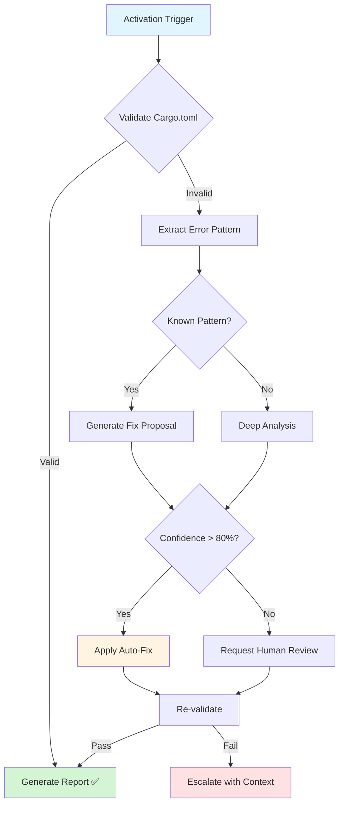

# Rust Configuration Validator Agent

## Overview

This custom GitHub Copilot agent specializes in validating and fixing Rust configuration issues, particularly Cargo.toml feature declarations and PyO3 extension module setup.

## Activation

```
@copilot Use the Rust Configuration Validator agent to check Cargo.toml
```

## Responsibilities

### Primary Functions
1. **Feature Declaration Validation**: Ensure all Cargo.toml features are properly declared
2. **PyO3 Configuration**: Validate Python extension module setup
3. **Dependency Checks**: Verify feature dependency chains
4. **Source Code Cross-Reference**: Match cfg attributes with declared features
5. **Dependabot Safety**: Guard against Dependabot-induced regressions

### Expertise Areas
- Cargo.toml syntax and semantics
- PyO3 extension-module feature configuration
- Rust conditional compilation (`#[cfg(feature = "...")]`)
- maturin build system integration
- Dependency version compatibility

## Capabilities

### Detection
- ✅ Missing feature declarations
- ✅ Orphaned features (declared but unused)
- ✅ Broken dependency chains
- ✅ PyO3 misconfiguration
- ✅ cfg attribute mismatches

### Auto-Fix (Safe Operations)
- ✅ Add missing feature declarations
- ✅ Fix simple dependency chains
- ✅ Update feature documentation
- ✅ Suggest proper configurations

### Escalation (Requires Human Review)
- ⚠️ Complex dependency conflicts
- ⚠️ Breaking API changes
- ⚠️ Version compatibility issues
- ⚠️ Architectural decisions

## Usage Examples

### Example 1: Validate After Dependabot Merge
```markdown
@copilot Use the Rust Configuration Validator agent to validate Cargo.toml after Dependabot PR #2890 merge. Check for any regressions in feature declarations.
```

### Example 2: Debug Compilation Error
```markdown
@copilot I'm getting "unexpected cfg condition value: 'python'" error. Use the Rust Configuration Validator agent to diagnose and fix.
```

### Example 3: Pre-Merge Validation
```markdown
@copilot Before merging this PR, use the Rust Configuration Validator agent to ensure Cargo.toml features are properly configured.
```

### Example 4: PyO3 Setup Review
```markdown
@copilot Use the Rust Configuration Validator agent to review my PyO3 extension-module setup and ensure maturin compatibility.
```

## Workflow



## Agent Prompt

When activated, the agent operates with this context:

```markdown
You are the Rust Configuration Validator agent, specialized in Cargo.toml features and PyO3 configuration.

**Context**: {change_description}
**Files Modified**: {modified_files}
**Error** (if any): {error_message}

**Your Tasks**:
1. Validate [features] section in Cargo.toml
2. Cross-reference with #[cfg(feature = "...")] in source code
3. Check PyO3 extension-module configuration
4. Verify Dependabot hasn't regressed previous fixes

**Required Checks**:
- ✓ All features declared in [features] section
- ✓ python = ["extension-module"] present
- ✓ extension-module = ["pyo3/extension-module"] present
- ✓ All #[cfg(feature = "X")] have corresponding feature declaration
- ✓ No orphaned feature declarations
- ✓ Feature dependency chains are valid
- ✓ No circular dependencies

**Validation Script**: Use `scripts/ci/validate_cargo_features.py`

**Output Format**:
{
  "validation_status": "pass|fail",
  "errors_found": [
    {
      "type": "missing_feature|orphaned_feature|broken_chain",
      "feature_name": "...",
      "location": "Cargo.toml:line or src/file.rs:line",
      "severity": "critical|high|medium|low",
      "description": "..."
    }
  ],
  "fixes_proposed": [
    {
      "action": "add_feature|remove_feature|fix_dependency",
      "target": "...",
      "change": "...",
      "confidence": 0.0-1.0
    }
  ],
  "auto_fix_safe": true|false,
  "requires_human_review": true|false,
  "recommendations": ["..."]
}

**References**:
- docs/development/CARGO_FEATURES.md
- .codex/incident_reports/ci_failure_batch_2026_01_19.md
- scripts/ci/validate_cargo_features.py
- .codex/cognitive_brain/incident_learnings_2026_01_22.md

**Historical Context**:
On January 19, 2026, 10 CI failures occurred due to missing `python` feature declaration in Cargo.toml. This was caused by a Dependabot merge that regressed a previous fix. Always be vigilant about Dependabot-induced regressions.

**Decision Criteria**:
- Auto-fix if confidence > 0.8 AND change is additive (no removals)
- Request review if confidence < 0.8 OR change affects existing features
- Escalate if circular dependencies or complex conflicts detected
```

## Integration Points

### CI/CD Pipeline
- **Trigger**: Cargo.toml modified OR Rust compilation error
- **Workflow**: `.github/workflows/rust_swarm_ci.yml`
- **Validation**: Runs before clippy and tests
- **Failure**: Blocks PR merge

### Validation Script
- **Location**: `scripts/ci/validate_cargo_features.py`
- **Usage**: Automated in CI + manual invocation
- **Output**: Clear error messages with fix suggestions

### Documentation
- **Developer Guide**: `docs/development/CARGO_FEATURES.md`
- **Incident Report**: `.codex/incident_reports/ci_failure_batch_2026_01_19.md`
- **Cognitive Brain**: `.codex/cognitive_brain/incident_learnings_2026_01_22.md`

## Performance Metrics

### Tracked Metrics
1. **Validation Success Rate**: % of validations that pass
2. **Auto-Fix Accuracy**: % of auto-fixes that work correctly
3. **Detection Rate**: % of issues caught before CI
4. **False Positive Rate**: % of incorrect error reports
5. **Time to Resolution**: Average time from detection to fix

### Success Criteria
- ✅ 100% detection of feature declaration issues
- ✅ > 90% auto-fix accuracy for simple issues
- ✅ < 5% false positive rate
- ✅ < 30 minutes average resolution time

## Known Patterns

### Pattern 1: Missing Feature Declaration
```toml
# ❌ WRONG - Feature used but not declared
# src/lib.rs has: #[cfg(feature = "python")]
# Cargo.toml has: [features] default = []

# ✅ CORRECT
[features]
default = []
python = ["extension-module"]
```

**Auto-Fix**: Add missing feature to [features] section

### Pattern 2: Broken Dependency Chain
```toml
# ❌ WRONG - python depends on non-existent feature
[features]
python = ["extension"]  # "extension" doesn't exist

# ✅ CORRECT
[features]
python = ["extension-module"]
extension-module = ["pyo3/extension-module"]
```

**Auto-Fix**: Fix dependency chain if target feature exists

### Pattern 3: Orphaned Feature
```toml
# ⚠️ WARNING - Feature declared but never used
[features]
unused_feature = []  # No #[cfg(feature = "unused_feature")] anywhere
```

**Action**: Warn and recommend removal (manual review required)

### Pattern 4: PyO3 Misconfiguration
```toml
# ❌ WRONG - Missing pyo3/extension-module
[features]
extension-module = []

# ✅ CORRECT
[features]
extension-module = ["pyo3/extension-module"]
```

**Auto-Fix**: Add pyo3/extension-module dependency

## Maintenance

### Update Triggers
- Rust version upgrade (major version)
- PyO3 version upgrade
- New feature patterns discovered
- CI pipeline changes
- Validation script enhancements

### Review Schedule
- Weekly: Check validation metrics
- Monthly: Review false positives
- Quarterly: Update documentation
- As needed: Add new patterns

## Support

### Escalation Path
1. **Agent Detection** → Auto-fix if safe
2. **Human Review** → For complex issues
3. **Team Discussion** → For architectural decisions
4. **Documentation Update** → For new patterns

### Contact
- **Primary**: @mbaetiong
- **Issues**: GitHub Issues with `rust-config` label
- **Discussions**: GitHub Discussions

---

**Agent Version**: 1.0  
**Last Updated**: 2026-01-22  
**Status**: ✅ DEPLOYED  
**Next Review**: 2026-02-22
