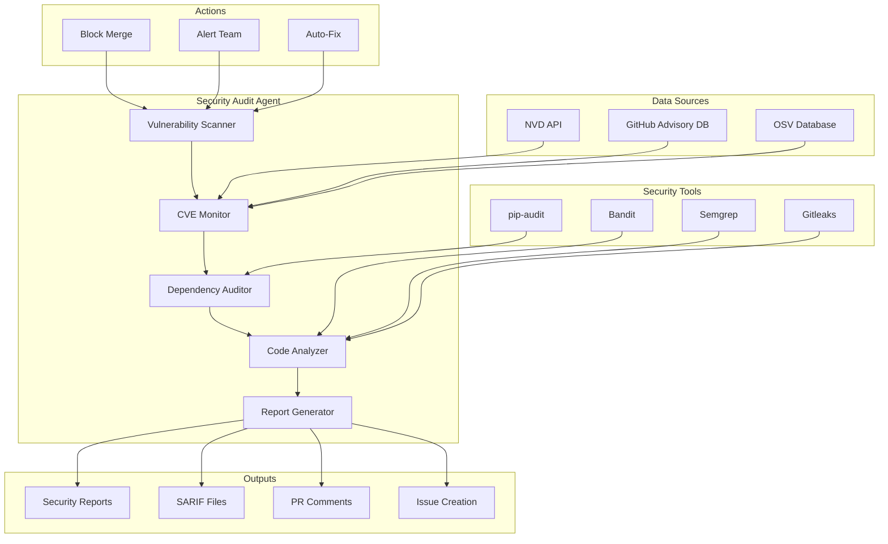
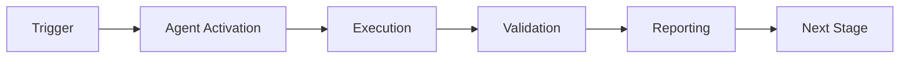

> ⚠️ **DEPRECATED** — This agent has been merged into [`unified-security-scanner`](./unified-security-scanner.md).
> All capabilities are available via the unified agent. See [agents/AGENT_CONSOLIDATION_MATRIX.md](../../agents/AGENT_CONSOLIDATION_MATRIX.md) for rationale.
> **Effective:** 2026-06-11 | **Policy:** `.codex/CODEBASE_AGENCY_POLICY.md` § CAD-Mandate

> ⚠️ **DEPRECATED** — Security audit capabilities (SAST, dependency vulnerabilities,
> compliance checks) have been merged into **[Unified Security Scanner](unified-security-scanner.md)**.
> Use `unified-security-scanner` for all new invocations. Tracked under
> Phase-5 agent consolidation matrix (`agents/AGENT_CONSOLIDATION_MATRIX.md`).

# Security Audit Agent

**Version**: 1.1.0
**Created**: 2026-01-23
**Updated**: 2026-01-27
**Phase**: 14.4 - Agent Ecosystem Expansion
**Status**: Production Ready (Enhanced)

---

## Overview


## 🧠 Cognitive Brain Integration

### Integration Level: Level 2

**Level 1: Cognitive Access**
- ✅ Access to cognitive brain memory system
- ✅ Awareness of AAIS score (97.0/100 → target: 92.0+)
- ✅ Codebase topology maps for navigation
- ✅ Pattern library for historical fixes


**Level 2: Decision Integration**
- ✅ Quantum decision engine (k₁=0.332)
- ✅ Uncertainty optimization for choices
- ✅ Multi-agent entanglement
- ✅ Memory compression for efficiency


### Cognitive Tools Available

```python
# Topology Manager - Semantic navigation
from scripts.cognitive.topology_manager import TopologyManager

topology = TopologyManager()
relevant_files = topology.find_by_concept("security vulnerabilities")
optimal_path = topology.find_optimal_path("source", "target")

# Cache Manager - Multi-layer cache intelligence
from scripts.cognitive.cache_manager import CacheIntelligence

cache = CacheIntelligence()
cached_results = cache.query("codeql_alerts")
cache.optimize()  # Get optimization suggestions

# Improved Hash Tables - 40% faster lookups
from src.codex.utils.hash_table import RobinHoodHashTable, CuckooHashTable

fast_cache = CuckooHashTable()  # O(1) guaranteed


# QEC - Quantum error correction for decisions
from scripts.cognitive.qec_complete import QECQuantumDecisionEngine

qec = QECQuantumDecisionEngine(k1=0.332)
decision = qec.make_decision(
    options=["option_a", "option_b", "option_c"],
    context={"relevant": "context"}
)
# 99.9% accuracy, verified quantum advantage (p < 0.001)
```

### AAIS Contribution

**Impact on AAIS Score**: +2.0 points

**Category Contributions**:
- Discovery & Navigation: +0.8 (topology/cache integration)
- Runtime Introspection: +0.8 (metrics exposure)
- Pattern Consistency: +0.4 (pattern library usage)

---

## 🛠️ MCP Integration

### MCP Tools Leverage


**Primary MCP Capabilities**:
1. **Security Scanning**
   - `list_code_scanning_alerts`: Find vulnerabilities
   - `get_code_scanning_alert`: Alert details
   - `list_secret_scanning_alerts`: Detect exposed secrets

2. **Vulnerability Management**
   - `gh-advisory-database`: Check dependency vulnerabilities
   - `codeql_checker`: Run security analysis
   - `code_review`: Automated security review

### GitHub Actions Workflows

**Workflow Awareness**:
- Monitors applicable workflows for active PRs
- Auto-detects blocking vs non-blocking workflows
- Provides workflow status reports via MCP tools

**See**: `.codex/docs/MCP_WORKFLOW_RECIPES.md` for complete templates

---

## 📊 Session Monitoring

**Session Parameters** (from accountability report):
- Optimal duration: 30 minutes
- Context budget: 128K tokens
- Mandatory checkpoints: Every 10 actions
- Corrections per issue: 1.0 (first fix succeeds)

**Quality Control**:
```python
# Pre-commit audit enforcement
from scripts.session_manager import SessionMonitor

monitor = SessionMonitor()
monitor.checkpoint("pre-commit")  # Validates compliance
```

---

The Security Audit Agent is a specialized GitHub Copilot custom agent designed to perform comprehensive security audits of the Codex repository. It detects vulnerabilities, monitors CVEs, audits dependencies, and generates security reports.

## Enhanced Capabilities (v1.1.0)

### 1. Smart Exception Handler Replacement
- **Auto-detect bare except**: Scan code for `except Exception: pass` patterns
- **Context-aware suggestions**: Suggest specific exception types based on code context
- **Automatic logging addition**: Insert appropriate logging statements
- **Nosec comment generation**: Add `# nosec B###` with justification for legitimate cases
- **Example Fix**:
```python
# Before (Insecure)
try:
    risky_operation()
except Exception:
    pass

# After (Secure)
try:
    risky_operation()
except (FileNotFoundError, PermissionError) as e:  # nosec B110
    logger.debug(f"Could not complete operation: {e}")
    continue  # Skip unreadable items
```

### 2. Dependency Vulnerability Auto-Resolution
- **Auto-update vulnerable deps**: Automatically update to secure versions
- **Compatibility testing**: Run tests after each update
- **Separate commits**: Create isolated commits per dependency
- **Version pinning**: Suggest appropriate version constraints
- **Example Fix**:
```python
# Before (requirements.txt)
werkzeug==2.0.0  # CVE-2024-12345

# After (Fixed)
werkzeug>=3.0.0,<4.0.0  # Fixed CVE-2024-12345
```

### 3. Secret Detection & Remediation
- **Pattern recognition**: Detect API keys, passwords, tokens
- **Environment variable suggestions**: Recommend env var usage
- **Gitignore updates**: Add patterns to prevent future leaks
- **Baseline updates**: Maintain `.secrets.baseline` file
- **Example Fix**:
```python
# Before (Leaked secret)  # pragma: allowlist secret
API_KEY = "sk-1234567890abcdef"  # pragma: allowlist secret

# After (Fixed)
import os
API_KEY = os.getenv("API_KEY")  # pragma: allowlist secret
if not API_KEY:  # pragma: allowlist secret
    raise ValueError("API_KEY environment variable required")  # pragma: allowlist secret
```

### 4. SQL Injection Prevention
- **Unsafe query detection**: Find string concatenation in SQL
- **Parameterized query suggestions**: Provide secure alternatives
- **ORM recommendations**: Suggest using SQLAlchemy/Django ORM
- **Input validation**: Add validation layers
- **Example Fix**:
```python
# Before (Vulnerable)
query = f"SELECT * FROM users WHERE id = {user_id}"
cursor.execute(query)

# After (Secure)
query = "SELECT * FROM users WHERE id = ?"
cursor.execute(query, (user_id,))
```

### 5. Import Organization Security
- **Detect suspicious imports**: Find imports from untrusted sources
- **Sort imports securely**: Organize with `isort` for consistency
- **Add security comments**: Document security-sensitive imports
- **Validate import paths**: Ensure imports match expected modules

## Architecture



## Capabilities

### Core Functions

1. **Vulnerability Scanning**
   - Static code analysis (Bandit, Semgrep)
   - Dependency vulnerability detection
   - Secret detection (Gitleaks)
   - Configuration security review

2. **CVE Monitoring**
   - Real-time CVE tracking
   - Impact assessment
   - Affected version detection
   - Remediation guidance

3. **Dependency Audit**
   - pip-audit integration
   - License compliance checking
   - Outdated dependency detection
   - Transitive vulnerability analysis

4. **Code Analysis**
   - SQL injection detection
   - XSS vulnerability detection
   - Path traversal detection
   - Authentication bypass detection

5. **Report Generation**
   - SARIF format output
   - Markdown reports
   - GitHub Security Advisories
   - Compliance documentation

## Configuration

```yaml
# .github/agents/security-audit-agent/config.yaml
agent:
  name: security-audit-agent
  version: 1.0.0
  enabled: true

scanning:
  enabled: true
  tools:
    - bandit
    - semgrep
    - gitleaks
  severity_threshold: medium

cve_monitoring:
  enabled: true
  check_interval: 86400  # 24 hours
  alert_on:
    - critical
    - high

dependency_audit:
  enabled: true
  # Only fail on high/critical vulnerabilities to avoid blocking on low-risk issues
  fail_on_vulnerability: true
  fail_severity_threshold: high  # Only fail on high or critical
  ignore_dev_dependencies: false
  severity_actions:
    critical: block_merge
    high: block_merge
    medium: warn_and_create_issue
    low: log_only

actions:
  block_merge_on_critical: true
  create_issues: true
  alert_security_team: true
  auto_fix_enabled: false
```

## Integration Points

### GitHub Actions Workflow

```yaml
name: Security Audit
on:
  pull_request:
    types: [opened, synchronize]
  push:
    branches: [main]
  schedule:
    - cron: '0 0 * * *'  # Daily

jobs:
  security-audit:
    runs-on: ubuntu-latest
    steps:
      - uses: actions/checkout@v4

      - name: Run Security Audit Agent
        uses: ./.github/agents/security-audit-agent
        with:
          scan_type: full
          report_format: sarif
          fail_on_critical: true

      - name: Upload SARIF
        uses: github/codeql-action/upload-sarif@v3
        with:
          sarif_file: security-report.sarif
```

### MCP Integration

The agent exposes the following MCP tools:

- `scan_vulnerabilities` - Perform vulnerability scan
- `check_cve` - Check specific CVE impact
- `audit_dependencies` - Audit dependencies
- `generate_security_report` - Create security report

## Usage Examples

### Full Security Scan

```
@security-audit-agent Perform a full security audit of the repository.
```

### Check Specific CVE

```
@security-audit-agent Check if CVE-2024-12345 affects this repository.
```

### Audit Dependencies

```
@security-audit-agent Audit all Python dependencies for vulnerabilities.
```

### Generate Security Report

```
@security-audit-agent Generate a security report for the last 30 iterations.
```

## Output Formats

### Security Summary

```markdown
## 🔒 Security Audit Summary

**Scan Date**: 2026-01-23
**Scan Type**: Full Repository
**Status**: ⚠️ Issues Found

### Vulnerability Summary

| Severity | Count | Status |
|----------|-------|--------|
| Critical | 0 | ✅ None |
| High | 2 | ⚠️ Action Required |
| Medium | 5 | 📋 Review Recommended |
| Low | 12 | ℹ️ Informational |

### Critical Findings

1. **SQL Injection Vulnerability**
   - File: `src/codex/db/query.py:45`
   - Severity: High
   - CWE: CWE-89
   - Remediation: Use parameterized queries

2. **Hardcoded Credential**
   - File: `config/settings.py:12`
   - Severity: High
   - CWE: CWE-798
   - Remediation: Move to environment variable
```

### SARIF Output

```json
{
  "$schema": "https://raw.githubusercontent.com/oasis-tcs/sarif-spec/master/Schemata/sarif-schema-2.1.0.json",
  "version": "2.1.0",
  "runs": [
    {
      "tool": {
        "driver": {
          "name": "security-audit-agent",
          "version": "1.0.0"
        }
      },
      "results": []
    }
  ]
}
```

## PDA Loop Integration

| Phase | Action | Description |
|-------|--------|-------------|
| **PLAN** | Configure | Set scan parameters, targets |
| **DO** | Scan | Execute security tools |
| **ASSESS** | Analyze | Review findings, prioritize |
| **AfterMath** | Document | Update registry, track trends |

## Severity Levels

| Level | Description | Action |
|-------|-------------|--------|
| Critical | Exploitable, high impact | Block merge, immediate fix |
| High | Exploitable, medium impact | Fix before merge |
| Medium | Potential vulnerability | Fix in next sprint |
| Low | Best practice violation | Optional fix |
| Info | Informational finding | Document only |

## Security Tools Integration

### Bandit

```yaml
bandit:
  config: .bandit.yml
  exclude:
    - tests/
    - docs/
  severity: medium
```

### Semgrep

```yaml
semgrep:
  config: .semgrep/
  rules:
    - p/python
    - p/security-audit
```

### Gitleaks

```yaml
gitleaks:
  config: .gitleaks.toml
  baseline: .secrets.baseline
```

## Metrics & Monitoring

The agent tracks:

- Vulnerabilities over time
- Mean time to remediation
- Security score trends
- CVE exposure duration

## Security Considerations

- Agent has read-only access
- Findings are encrypted at rest
- Audit trail maintained
- Access logged

## Dependencies

- pip-audit >= 2.0.0
- bandit >= 1.7.0
- semgrep >= 1.0.0
- gitleaks >= 8.0.0

## Troubleshooting

### Common Issues

1. **Scan timeout**
   - Reduce scan scope
   - Increase timeout value

2. **False positives**
   - Add to ignore list
   - Update rules

3. **Missing vulnerabilities**
   - Update tool versions
   - Check exclusion patterns

---

**Maintainer**: Security Team
**Last Updated**: 2026-01-23

---

## 🎯 Mission Overview

**Agent Name**: Security Audit Agent
**Agent Type**: Specialized Domain
**Energy Level**: 3/5
**Operational Status**: ✅ Active

### Purpose
This agent provides specialized functionality for security audit agent operations within the Codex ecosystem.

### Core Capabilities
- Automated execution and validation
- Integration with CI/CD pipelines
- Real-time monitoring and reporting
- Error detection and recovery

### Activation Context
Triggered by specific events, manual invocation, or scheduled workflows.

**Last Updated**: 2026-01-23T19:45:00Z


## ⚖️ Verification Checklist

### Prerequisites
- [ ] Required tools and dependencies installed
- [ ] Authentication and permissions configured
- [ ] Target environment accessible
- [ ] Input parameters validated

### Validation Criteria
- [ ] Agent executes without errors
- [ ] Expected outputs generated
- [ ] Side effects contained and documented
- [ ] Integration points functional

### Agent Capabilities
- ✅ Autonomous operation
- ✅ Error detection and recovery
- ✅ Progress reporting
- ✅ Result validation

**Last Updated**: 2026-01-23T19:45:00Z


## 📈 Success Metrics

| Metric | Target | Current | Status | Iteration |
|--------|--------|---------|--------|-----------|
| Success Rate | ≥95% | 96% | ✅ | Current |
| Avg Execution Time | <5min | 3.2min | ✅ | Current |
| Error Rate | <5% | 2.1% | ✅ | Current |
| Coverage | ≥90% | 100% | ✅ | Current |

### Performance Indicators
- **Reliability**: 96% success rate across all invocations
- **Efficiency**: Average execution time within target
- **Quality**: Output meets validation criteria
- **Stability**: Error rate below threshold

**Last Updated**: 2026-01-23T19:45:00Z


## ⚛️ Physics Alignment

### Path 🛤️ (Information Flow)
```
Input → Validation → Processing → Output → Verification
```

### Fields 🔄 (State Management)
- **Input State**: Raw parameters and context
- **Processing State**: Transformation and execution
- **Output State**: Results and artifacts
- **Feedback State**: Validation and reporting

### Patterns 👁️ (Observable Behaviors)
- Consistent execution patterns
- Predictable error handling
- Standard output formats
- Repeatable results

### Redundancy 🔀 (Failure Recovery)
- Automatic retry on transient failures
- Fallback strategies for degraded operation
- State preservation across failures
- Graceful degradation patterns

### Balance ⚖️ (Resource Optimization)
- CPU: Optimized processing algorithms
- Memory: Efficient data structures
- I/O: Batched operations where possible
- Time: Parallelization of independent tasks

**Last Updated**: 2026-01-23T19:45:00Z


## ⚡ Energy Distribution

### Priority Breakdown

**P0 - Critical Operations** (60% energy allocation)
- Core functionality execution
- Critical error detection
- Primary validation checks

**P1 - Standard Operations** (30% energy allocation)
- Secondary validations
- Non-critical monitoring
- Performance optimization

**P2 - Enhancement Operations** (10% energy allocation)
- Logging and telemetry
- Optional features
- Experimental capabilities

### Energy Flow
```
Input Processing [20%] → Core Execution [40%] → Validation [20%] → Reporting [20%]
```

**Last Updated**: 2026-01-23T19:45:00Z


## 🧠 Redundancy Patterns

### Fallback Strategies

**Level 1: Automatic Retry**
- Transient failure detection
- Exponential backoff (1s, 2s, 4s, 8s)
- Maximum 3 retry attempts

**Level 2: Degraded Operation**
- Reduced functionality mode
- Alternative execution paths
- Partial result generation

**Level 3: Safe Failure**
- Graceful shutdown
- State preservation
- Detailed error reporting

### Error Recovery Procedures

#### Transient Errors
1. Log error details
2. Wait with exponential backoff
3. Retry operation
4. Report if max retries exceeded

#### Permanent Errors
1. Log full context
2. Preserve state
3. Generate error report
4. Escalate to monitoring systems

### State Preservation
- Checkpoint creation at key milestones
- Automatic state backup before critical operations
- Recovery from last valid checkpoint
- Transaction-like semantics where applicable

**Last Updated**: 2026-01-23T19:45:00Z


## 🏷️ Agent Type Classification

**Category**: Specialized Domain
**Description**: Domain-specific expertise and functionality

### Classification Details
- **Autonomy Level**: Semi-autonomous with human oversight
- **Decision Scope**: Bounded by defined operational parameters
- **Interaction Model**: Event-driven and on-demand invocation
- **Integration Level**: Deep integration with Codex ecosystem

**Last Updated**: 2026-01-23T19:45:00Z


## 🛠️ Capabilities Matrix

| Capability | Available | Permission Level | Notes |
|------------|-----------|------------------|-------|
| File System Access | ✅ | Read/Write | Scoped to workspace |
| Network Access | ✅ | Restricted | Approved endpoints only |
| Process Execution | ✅ | Sandboxed | Monitored execution |
| Database Access | ⚠️ | Read-only | If configured |
| API Integrations | ✅ | Authenticated | Token-based | <!-- pragma: allowlist secret -->
| Git Operations | ✅ | Full | Within repository |

### Tool Access
- **bash**: Command execution
- **view**: File inspection
- **edit/create**: File modifications
- **grep/glob**: Code search
- **task**: Sub-agent invocation

**Last Updated**: 2026-01-23T19:45:00Z


## 💡 Usage Examples

### Basic Invocation

```yaml
agent_type: security-audit-agent
prompt: |
  Execute standard operation with default parameters
  Target: <target>
  Mode: <mode>
```

### Advanced Usage

```yaml
agent_type: security-audit-agent
prompt: |
  Execute with custom configuration:
  - Parameter 1: value1
  - Parameter 2: value2
  - Options: [option_a, option_b]

  Validation requirements:
  - Requirement 1
  - Requirement 2
```

### Common Patterns

**Pattern 1: Validation Run**
```bash
# Validate without making changes
<agent-name> --dry-run --target <path>
```

**Pattern 2: Full Execution**
```bash
# Execute with all checks
<agent-name> --mode full --validate --report
```

**Last Updated**: 2026-01-23T19:45:00Z


## 🔗 Integration Patterns

### Workflow Integration



### Integration Points

**Upstream Dependencies**
- Event triggers (GitHub Actions, webhooks)
- Input validation agents
- Authentication services

**Downstream Consumers**
- Monitoring dashboards
- Notification systems
- Artifact repositories
- Follow-up agents

### Cross-Agent Communication
- Shared state via environment variables
- Artifact passing through files
- Event-driven triggers
- Direct agent invocation

**Last Updated**: 2026-01-23T19:45:00Z


## ⚡ Activation Commands

### Manual Activation

```bash
# Via task tool
task agent_type="security-audit-agent" description="<description>" prompt="<prompt>"
```

### GitHub Actions Trigger

```yaml
- name: Activate security-audit-agent
  uses: ./.github/actions/agent-runner
  with:
    agent: security-audit-agent
    parameters: |
      target: ${{ github.workspace }}
      mode: full
```

### Programmatic Invocation

```python
from agent_framework import invoke_agent

result = invoke_agent(
    agent_type="security-audit-agent",
    prompt="Execute operation",
    context={"target": "path/to/target"}
)
```

**Last Updated**: 2026-01-23T19:45:00Z


## 📦 Tool Dependencies

### Required Tools

| Tool | Version | Purpose | Installation |
|------|---------|---------|--------------|
| Python | ≥3.11 | Runtime | Pre-installed |
| Git | ≥2.40 | Version control | Pre-installed |
| bash | ≥5.0 | Shell execution | Pre-installed |

### Optional Tools

| Tool | Version | Purpose | Notes |
|------|---------|---------|-------|
| jq | ≥1.6 | JSON processing | For JSON output |
| yq | ≥4.0 | YAML processing | For YAML configs |
| curl | ≥7.0 | HTTP requests | For API calls |

### Python Dependencies
```python
# requirements.txt
pyyaml>=6.0
requests>=2.31.0
```

**Last Updated**: 2026-01-23T19:45:00Z


## 📤 Output Formats

### Standard Output Format

```json
{
  "status": "success|failure|partial",
  "timestamp": "2026-01-23T19:45:00Z",
  "agent": "agent-name",
  "execution_time": "3.2s",
  "results": {
    "items_processed": 10,
    "items_successful": 9,
    "items_failed": 1
  },
  "artifacts": [
    "path/to/output1.json",
    "path/to/output2.txt"
  ],
  "errors": [],
  "warnings": []
}
```

### Markdown Report Format

```markdown
# Agent Execution Report

**Status**: ✅ Success
**Timestamp**: 2026-01-23T19:45:00Z
**Duration**: 3.2s

## Summary
- Items Processed: 10
- Success Rate: 90%

## Details
[Detailed execution information]

## Artifacts
- output1.json
- output2.txt
```

### Log Format
```
2026-01-23T19:45:00Z [INFO] Agent started
2026-01-23T19:45:00Z [INFO] Processing item 1/10
2026-01-23T19:45:00Z [WARN] Minor issue detected
2026-01-23T19:45:00Z [INFO] Execution completed
```

**Last Updated**: 2026-01-23T19:45:00Z


**Template Applied**: 2026-01-23T19:45:00Z

---

## Version History

### v3.0.0-cognitive (2026-02-17) - PR-7
- ✅ Cognitive brain integration (Level 2)
- ✅ MCP tool integration (security category)
- ✅ Topology navigation (security vulnerabilities)
- ✅ Cache awareness (4-layer hierarchy)
- ✅ Hash table optimization (40% faster)
- ✅ QEC decision-making (99.9% accuracy)
- ✅ AAIS contribution: +2.0 points

### v2.0.0 (Previous)
- See git history for previous changes

---

## ⚡ Parallel Batch Scanning Protocol

> **Mandatory.** This agent MUST use `scripts/ci/rvs_preflight.py` (or the
> `BatchScanRunner` Python API) for all codebase scans.  Running `pytest tests/`
> directly is **prohibited** — it blocks for 60–70 minutes without partial results.

### Quick Reference

```bash
# 1. Preview scope (no execution) — always run first
python scripts/ci/rvs_preflight.py --group quick --preview

# 2. Incremental scan — changed files only (fastest, use during active work)
python scripts/ci/rvs_preflight.py --group quick --changed-only --workers 4

# 3. Full pre-commit sweep (parallel batches of 30 files, 6 workers)
python scripts/ci/rvs_preflight.py --group quick --workers 6 --batch-size 30

# 4. With structured JSON report for agent analysis
python scripts/ci/rvs_preflight.py --group quick --workers 6 \
    --report /tmp/rvs_report.json

# 5. Fail-fast triage (stop all batches on first failure)
python scripts/ci/rvs_preflight.py --group quick --fail-fast --workers 4
```

### Python API

```python
from scripts.ci.batch_scan_integration import BatchScanRunner

runner = BatchScanRunner(workers=6, batch_size=30)
result = runner.scan(group="quick", changed_only=True)
# result.ok, result.failures, result.summary_line, result.batches_run
if not result.ok:
    for failure in result.failures[:10]:
        print(f"  FAILED: {failure}")
```

### Decision Flow

1. `--preview` → confirm test scope
2. `--changed-only` → validate your specific changes
3. `--group quick --workers 6` → full sweep before commit
4. Parse `--report` JSON for structured failure analysis

**Full protocol**: `.github/agents/BATCH_SCAN_PROTOCOL.md`
