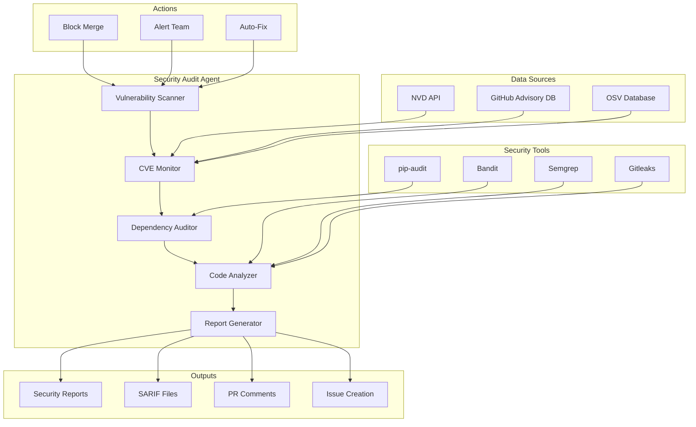

# Security Audit Agent

**Version**: 1.0.0  
**Created**: 2026-01-18  
**Phase**: 14.4 - Agent Ecosystem Expansion  
**Status**: Production Ready

---

## Overview

The Security Audit Agent is a specialized GitHub Copilot custom agent designed to perform comprehensive security audits of the Codex repository. It detects vulnerabilities, monitors CVEs, audits dependencies, and generates security reports.

## Architecture



## Capabilities

### Core Functions

1. **Vulnerability Scanning**
   - Static code analysis (Bandit, Semgrep)
   - Dependency vulnerability detection
   - Secret detection (Gitleaks)
   - Configuration security review

2. **CVE Monitoring**
   - Real-time CVE tracking
   - Impact assessment
   - Affected version detection
   - Remediation guidance

3. **Dependency Audit**
   - pip-audit integration
   - License compliance checking
   - Outdated dependency detection
   - Transitive vulnerability analysis

4. **Code Analysis**
   - SQL injection detection
   - XSS vulnerability detection
   - Path traversal detection
   - Authentication bypass detection

5. **Report Generation**
   - SARIF format output
   - Markdown reports
   - GitHub Security Advisories
   - Compliance documentation

## Configuration

```yaml
# .github/agents/security-audit-agent/config.yaml
agent:
  name: security-audit-agent
  version: 1.0.0
  enabled: true

scanning:
  enabled: true
  tools:
    - bandit
    - semgrep
    - gitleaks
  severity_threshold: medium

cve_monitoring:
  enabled: true
  check_interval: 86400  # 24 hours
  alert_on:
    - critical
    - high

dependency_audit:
  enabled: true
  fail_on_vulnerability: true
  ignore_dev_dependencies: false

actions:
  block_merge_on_critical: true
  create_issues: true
  alert_security_team: true
  auto_fix_enabled: false
```

## Integration Points

### GitHub Actions Workflow

```yaml
name: Security Audit
on:
  pull_request:
    types: [opened, synchronize]
  push:
    branches: [main]
  schedule:
    - cron: '0 0 * * *'  # Daily

jobs:
  security-audit:
    runs-on: ubuntu-latest
    steps:
      - uses: actions/checkout@v4
      
      - name: Run Security Audit Agent
        uses: ./.github/agents/security-audit-agent
        with:
          scan_type: full
          report_format: sarif
          fail_on_critical: true
          
      - name: Upload SARIF
        uses: github/codeql-action/upload-sarif@v3
        with:
          sarif_file: security-report.sarif
```

### MCP Integration

The agent exposes the following MCP tools:

- `scan_vulnerabilities` - Perform vulnerability scan
- `check_cve` - Check specific CVE impact
- `audit_dependencies` - Audit dependencies
- `generate_security_report` - Create security report

## Usage Examples

### Full Security Scan

```
@security-audit-agent Perform a full security audit of the repository.
```

### Check Specific CVE

```
@security-audit-agent Check if CVE-2024-12345 affects this repository.
```

### Audit Dependencies

```
@security-audit-agent Audit all Python dependencies for vulnerabilities.
```

### Generate Security Report

```
@security-audit-agent Generate a security report for the last 30 days.
```

## Output Formats

### Security Summary

```markdown
## 🔒 Security Audit Summary

**Scan Date**: 2026-01-18  
**Scan Type**: Full Repository  
**Status**: ⚠️ Issues Found

### Vulnerability Summary

| Severity | Count | Status |
|----------|-------|--------|
| Critical | 0 | ✅ None |
| High | 2 | ⚠️ Action Required |
| Medium | 5 | 📋 Review Recommended |
| Low | 12 | ℹ️ Informational |

### Critical Findings

1. **SQL Injection Vulnerability**
   - File: `src/codex/db/query.py:45`
   - Severity: High
   - CWE: CWE-89
   - Remediation: Use parameterized queries

2. **Hardcoded Credential**
   - File: `config/settings.py:12`
   - Severity: High
   - CWE: CWE-798
   - Remediation: Move to environment variable
```

### SARIF Output

```json
{
  "$schema": "https://raw.githubusercontent.com/oasis-tcs/sarif-spec/master/Schemata/sarif-schema-2.1.0.json",
  "version": "2.1.0",
  "runs": [
    {
      "tool": {
        "driver": {
          "name": "security-audit-agent",
          "version": "1.0.0"
        }
      },
      "results": []
    }
  ]
}
```

## PDA Loop Integration

| Phase | Action | Description |
|-------|--------|-------------|
| **PLAN** | Configure | Set scan parameters, targets |
| **DO** | Scan | Execute security tools |
| **ASSESS** | Analyze | Review findings, prioritize |
| **AfterMath** | Document | Update registry, track trends |

## Severity Levels

| Level | Description | Action |
|-------|-------------|--------|
| Critical | Exploitable, high impact | Block merge, immediate fix |
| High | Exploitable, medium impact | Fix before merge |
| Medium | Potential vulnerability | Fix in next sprint |
| Low | Best practice violation | Optional fix |
| Info | Informational finding | Document only |

## Security Tools Integration

### Bandit

```yaml
bandit:
  config: .bandit.yml
  exclude:
    - tests/
    - docs/
  severity: medium
```

### Semgrep

```yaml
semgrep:
  config: .semgrep/
  rules:
    - p/python
    - p/security-audit
```

### Gitleaks

```yaml
gitleaks:
  config: .gitleaks.toml
  baseline: .secrets.baseline
```

## Metrics & Monitoring

The agent tracks:

- Vulnerabilities over time
- Mean time to remediation
- Security score trends
- CVE exposure duration

## Security Considerations

- Agent has read-only access
- Findings are encrypted at rest
- Audit trail maintained
- Access logged

## Dependencies

- pip-audit >= 2.0.0
- bandit >= 1.7.0
- semgrep >= 1.0.0
- gitleaks >= 8.0.0

## Troubleshooting

### Common Issues

1. **Scan timeout**
   - Reduce scan scope
   - Increase timeout value

2. **False positives**
   - Add to ignore list
   - Update rules

3. **Missing vulnerabilities**
   - Update tool versions
   - Check exclusion patterns

---

**Maintainer**: Security Team  
**Last Updated**: 2026-01-18
