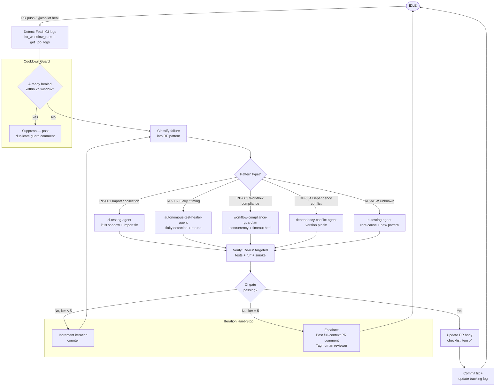

# Self-Healing Orchestrator Agent v1.0.0

## 🔐 Token Hierarchy Requirements

**Token Requirement Level**: Level 3 (CODEX_MASTER_KEY)

This agent performs operations requiring elevated repository or organization-level access. Specific capabilities include:

- Orchestrate multi-agent healing operations
- Dispatch multiple workflow types simultaneously
- Coordinate emergency responses across repos
- Override standard concurrency limits

**Rationale**: Multi-agent orchestration requires organization-level workflow dispatch and coordination

**Token Scopes Required**:
```
repo, workflow, actions:write
```

**Token Fallback Pattern**: **NO FALLBACK** - This agent must fail safely if required token unavailable

```python
from scripts.ci._token_resolver import get_token

# Requires Level 3 - no fallback acceptable
token = get_token(required_elevated=True, require_level=3)
if not token:
    logger.critical("CODEX_MASTER_KEY unavailable")
    raise RuntimeError("Agent requires Level 3 token")
```

---
## 🛠️ Implementation Pattern

Standard implementation pattern for token management in this agent:

```python
from scripts.ci._token_resolver import get_token, validate_scope
import requests
import logging

class SelfHealingOrchestratorAgent:
    def __init__(self):
        """Initialize with token validation."""
        # Get elevated token
        self.token = get_token(required_elevated=True)
        if not self.token:
            raise RuntimeError("Agent requires elevated token")
        
        # Validate required scopes
        required_scopes = ['repo', 'workflow', 'actions:write']
        validate_scope(self.token, required_scopes)
        
        self.logger = logging.getLogger(__name__)
    
    def orchestrate_healing_cascade(self, repo, **kwargs):
        """
        Core operation requiring elevated token access.
        
        Args:
            repo: Repository in 'owner/repo' format
            **kwargs: Operation-specific parameters
        
        Returns:
            Result dict with status and details
        """
        url = f"https://api.github.com/repos/{repo}/..."
        
        headers = {
            "Authorization": f"token {self.token}",
            "Accept": "application/vnd.github.v3+json"
        }
        
        try:
            response = requests.post(url, headers=headers, timeout=30)
            response.raise_for_status()
            
            # Log operation metadata (NOT token)
            self.logger.info(
                "orchestrate_healing_cascade",
                extra={"repo": repo, "status": "success"}
            )
            
            return {"status": "success", "message": "Operation completed"}
        
        except requests.HTTPError as e:
            if e.response.status_code == 403:
                self.logger.error("Insufficient scope or permission denied")
                raise RuntimeError("Token insufficient scope")
            raise
```

---
## 🔒 Security Constraints

**Critical Constraints** for elevated-privilege agents:

1. **Scope Validation Mandatory**: All operations require explicit scope validation
   ```python
   validate_scope(token, required_scopes)
   ```

2. **Safe Logging Practices** (Never expose token values)
   ```python
   # ✓ CORRECT: Log operation metadata
   logger.info("operation", extra={"repo": repo, "status": "success"})
   
   # ✗ WRONG: Never log token values
   # logger.info(f"Using token: {token[:10]}...")
   ```

3. **Error Handling for Scope Violations**
   - **403 Forbidden** → Insufficient scope: Escalate immediately
   - **401 Unauthorized** → Token invalid: Escalate to operator
   - **429 Too Many Requests** → Rate limit: Implement backoff

4. **Security Audit Trail Requirements**
   - Emit telemetry event for each elevated operation
   - Include: repo, operation, timestamp, result
   - Store in audit log (never token values)
   - Record in `.codex/audit/operations.jsonl`

5. **Token Rotation Awareness**
   - Do NOT cache token values across operations
   - Re-retrieve token for each session
   - Validate token expiration if applicable

---
## 🔗 Integration with Hidden Scripts

This agent can leverage hidden scripts for storing security-sensitive operational patterns:

**Use Case**: Store complex remediation or detection patterns as hidden scripts to prevent exposure in logs or CI artifacts.

```python
from scripts.ci._hidden_scripts import execute_hidden_script, retrieve_hidden_script

def execute_stored_pattern(repo, pattern_type):
    """Execute stored operational pattern."""
    
    # Retrieve pattern (stored securely, checksum validated)
    pattern = retrieve_hidden_script(
        script_id=f"pattern_{pattern_type}",
        version="latest"
    )
    
    # Execute in sandbox with audit logging
    result = execute_hidden_script(
        script_id=pattern.id,
        environment={"GITHUB_TOKEN": self.token, "REPO": repo},
        timeout_ms=60000,
        audit_log=True
    )
    
    return result
```

**Architecture Reference**: See `HIDDEN_SCRIPTS_SECURITY.md` for:
- Storage and encryption of patterns
- Checksum validation for integrity
- Sandbox execution environment
- Audit trail requirements
- Recovery procedures

**Common Patterns Stored as Hidden Scripts**:
- Complex detection algorithms
- Multi-step remediation workflows
- Emergency procedure scripts
- Security configuration templates

---

> **Policy**: `.codex/CODEBASE_AGENCY_POLICY.md §0` — leave the codebase better than found.
> This agent MUST NOT commit code that reduces test coverage or introduces new lint violations.

## Purpose

Provide a single orchestration layer that coordinates all CI self-healing
activity in the repository. Rather than each agent independently attempting
repairs, this agent:

1. **Detects** CI failures via `iterative-self-healing-ci.yml` trigger or PR comment
2. **Classifies** failures into the RP pattern catalog
3. **Dispatches** fix work to the appropriate specialist agent
4. **Verifies** the fix passes CI gate checks
5. **Escalates** to a human reviewer when max iterations are exhausted

---

## Self-Healing State Machine



---

## RP Pattern Catalog

| Pattern | ID | Trigger Signature | Specialist Agent |
|---------|----|-------------------|-----------------|
| Import / Collection failure | RP-001 | `ImportError`, `ModuleNotFound`, `collection error` | `ci-testing-agent` |
| Flaky / timing failure | RP-002 | `FAILED` on retry, `@pytest.mark.flaky`, timeout | `autonomous-test-healer-agent` |
| Workflow compliance regression | RP-003 | Missing `concurrency`, missing `timeout-minutes` | `workflow-compliance-guardian` |
| Dependency version conflict | RP-004 | `ResolutionImpossible`, `VersionConflict` | `dependency-conflict-agent` |
| Unknown / novel failure | RP-NEW | Does not match RP-001..004 | `ci-testing-agent` (root cause) |

---

## Integration Points

### `iterative-self-healing-ci.yml`

The workflow triggers this agent on:
- `workflow_run` completion with `conclusion: failure`
- PR comment matching `@copilot heal` or `@copilot fix ci`

```yaml
# Excerpt from iterative-self-healing-ci.yml
on:
  workflow_run:
    workflows: ["*"]
    types: [completed]
  issue_comment:
    types: [created]

jobs:
  orchestrate:
    if: |
      github.event.workflow_run.conclusion == 'failure' ||
      contains(github.event.comment.body, '@copilot heal')
    steps:
      - name: Dispatch to self-healing-orchestrator-agent
        run: |
          python scripts/ci/check_pr_comments.py --trigger heal
```

### `check_pr_comments.py`

```python
# Trigger orchestration from PR comment
def handle_heal_trigger(pr_number: int, comment_body: str) -> None:
    if any(cmd in comment_body for cmd in ["@copilot heal", "@copilot fix ci", "@copilot self-heal"]):
        if not dedup_check(pr_number, window_hours=2):
            orchestrate(pr_number)
        else:
            post_comment(pr_number, "⏳ Heal already triggered within 2h window — skipping duplicate.")
```

### `workflow-execution-gate.yml`

After a successful heal cycle, this agent posts an update to the PR body
`## 🔄 Workflow Execution Checklist`:

```markdown
- [x] CI self-healing completed (RP-001: import fix applied, 2/5 iterations)
- [x] Targeted tests passing
- [x] ruff clean (0 violations)
```

---

## Cooldown and Dedup Guards

### Cooldown

A minimum **15-minute cooldown** is enforced between consecutive self-heal
triggers on the same PR. This prevents run-away loops when the underlying
failure is not fixable by the agent.

```python
COOLDOWN_MINUTES = 15

def cooldown_ok(pr_number: int) -> bool:
    last_run = get_last_heal_timestamp(pr_number)
    if last_run is None:
        return True
    elapsed = (datetime.utcnow() - last_run).total_seconds() / 60
    return elapsed >= COOLDOWN_MINUTES
```

### Dedup Window

Identical failure signatures within a **2-hour window** are suppressed:

```python
DEDUP_WINDOW_HOURS = 2

def dedup_check(pr_number: int, failure_sig: str) -> bool:
    """Returns True if this failure was already healed recently."""
    cache_key = f"heal:{pr_number}:{hash(failure_sig)}"
    return cache.exists(cache_key, ttl_hours=DEDUP_WINDOW_HOURS)
```

---

## Escalation Protocol

When `iteration_count == 5` and CI is still failing:

1. Collect all iteration logs (attempts 1–5, root causes tried, fixes applied)
2. Post PR comment:

```markdown
## 🚨 Self-Healing Escalation (5/5 iterations exhausted)

**Pattern**: RP-001 (Import / Collection)
**Attempts**: 5
**Last error**: `ImportError: cannot import name 'X' from 'pkg'`

### Iterations tried
| # | Fix Applied | Result |
|---|-------------|--------|
| 1 | pip install --force-reinstall -e . | ❌ Still failing |
| 2 | Prepend src/ to PYTHONPATH | ❌ Still failing |
| 3 | Remove stale .egg-link | ❌ Still failing |
| 4 | Rebuild venv from scratch | ❌ Still failing |
| 5 | Isolate test module import | ❌ Still failing |

**Recommended**: Manual inspection of `src/<pkg>/__init__.py` import chain.
```

3. Tag `@workflow-compliance-guardian` if pattern is RP-003
4. Set checklist item to `⚠️ requires manual review`

---

## Self-Review Protocol (5-Pass)

Before posting any fix commit or PR comment, run in order:

- [ ] **Pass 1 — Iteration guard**: confirm `iteration_count ≤ 5` and cooldown has elapsed
- [ ] **Pass 2 — Dedup check**: failure signature not already resolved in last 2h window
- [ ] **Pass 3 — Fix validity**: specialist agent's self-review passed (ruff + import smoke)
- [ ] **Pass 4 — No regressions**: diff reviewed; no new lint violations or test removals
- [ ] **Pass 5 — Policy compliance**: all changes align with `.codex/CODEBASE_AGENCY_POLICY.md §0`

---

## Activation Examples

```bash
# Via PR comment:
@copilot heal
@copilot fix ci
@copilot self-heal

# Via task tool:
agent_type: self-healing-orchestrator-agent
prompt: |
  CI is failing on PR #1234 with ImportError.
  Run the self-healing orchestration loop, classify the pattern,
  dispatch to the appropriate specialist, and update the PR checklist.
```

---

## Version History

| Version | Date | Changes |
|---------|------|---------|
| 1.0.0 | 2026-05-09 | Initial production release: RP-001..004 catalog, state machine, cooldown/dedup guards, escalation protocol, workflow integration |
