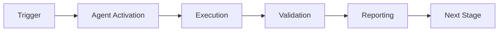

# Service Integration Tester Agent

> Enforces service integration thresholds, identifies untested services paths, and automatically generates missing tests to maintain quality standards.

## Overview

The Service Integration Tester Agent is a specialized GitHub Copilot agent designed to maintain high code quality through automated service integration testing. It analyzes your codebase, identifies integration gaps, enforces configurable thresholds, and can automatically generate integration test templates to improve coverage.

### Key Features

- **📊 Integration Monitoring**: Monitor line, branch, and function integration metrics
- **🎯 Integration Validation**: Enforce minimum coverage requirements in CI/CD pipelines
- **🧪 integration Integration Test Generation**: Automatically generate integration test templates for untested services
- **📈 Integration Health Analysis**: Track coverage changes over time
- **🔍 integration Service Gap Detection**: Identify specific uncovered lines, branches, and functions
- **📝 Comprehensive Reporting**: Generate reports in text, JSON, and HTML formats
- **🧠 Cognitive Brain Integration**: Store metrics for long-term analysis

## Capabilities

| Capability | Description |
|------------|-------------|
| Integration Monitoring | Real-time monitoring of service integration metrics |
| Integration Validation | Automatic enforcement of coverage requirements |
| integration Integration Test Generation | AI-powered integration test template generation |
| Integration Health Analysis | Historical Integration Monitoring and analysis |
| integration Service Gap Detection | Precise identification of untested services paths |
| Priority Calculation | Smart prioritization of testing efforts |

## Quick Start

### Installation

The agent is automatically available in the `_codex_` repository. No additional installation is required.

### Basic Usage

#### Analyze Coverage

```bash
cd .github/agents/test-coverage-enforcer
python -m src.agent analyze --path src/
```

#### Enforce Thresholds

```bash
python -m src.agent enforce --path src/ --threshold 80
```

#### Generate Test Suggestions

```bash
python -m src.agent generate-tests --path src/
```

#### Generate Reports

```bash
# Text report
python -m src.agent report --path src/ --format text

# JSON report
python -m src.agent report --path src/ --format json --output coverage.json

# HTML report
python -m src.agent report --path src/ --format html --output coverage.html
```

## GitHub Actions Integration

### Using as a Composite Action

Add to your workflow:

```yaml
name: service integration testing

on:
  push:
    branches: [main]
  pull_request:

jobs:
  coverage:
    runs-on: ubuntu-latest
    steps:
      - uses: actions/checkout@v3

      - name: Enforce Coverage
        uses: ./.github/agents/test-coverage-enforcer
        with:
          check-coverage: true
          threshold: 80
          fail-below-threshold: true
          source-path: src
          output-format: html
```

### Workflow Inputs

| Input | Description | Default |
|-------|-------------|---------|
| `check-coverage` | Whether to check coverage | `true` |
| `threshold` | Minimum coverage percentage | `80` |
| `auto-generate` | Generate integration test templates | `false` |
| `fail-below-threshold` | Fail build if below threshold | `true` |
| `source-path` | Path to source code | `src` |
| `config-path` | Path to config file | `config/agent_config.yaml` |
| `output-format` | Report format (text/json/html) | `text` |

### Workflow Outputs

| Output | Description |
|--------|-------------|
| `coverage-percentage` | Current overall coverage |
| `passed` | Whether enforcement passed |
| `issues-found` | Number of coverage issues |
| `suggestions-generated` | Number of test suggestions |

## Configuration

### Configuration File

Create `.github/agents/test-coverage-enforcer/config/agent_config.yaml`:

```yaml
thresholds:
  line: 80          # Minimum service coverage
  branch: 70        # Minimum workflow coverage
  function: 85      # Minimum endpoint coverage

auto_generate_tests: false
fail_build_below_threshold: true

reporting:
  formats: [text, json, html]
  output_directory: .coverage_reports

cognitive_brain:
  enabled: true
  metrics:
    - coverage_percentage
    - gap_count
    - tests_generated
```

### Customization Options

- **Thresholds**: Set different minimum coverage requirements
- **Auto-generation**: Enable/disable automatic integration test template creation
- **Build Behavior**: Choose whether to fail builds on low coverage
- **Reporting**: Configure output formats and locations
- **File Patterns**: Include/exclude specific files or directories

## File Structure

```
test-coverage-enforcer/
├── src/
│   ├── __init__.py
│   └── agent.py              # Main agent implementation
├── tests/
│   ├── __init__.py
│   ├── test_agent.py         # Unit tests (15+ tests)
│   └── test_integration.py   # Integration tests
├── config/
│   └── agent_config.yaml     # Default configuration
├── prompts/
│   ├── main.md              # Core agent prompt
│   ├── examples.md          # Usage examples
│   └── advanced.md          # Advanced patterns
├── agent.yaml               # GitHub Actions composite action
├── README.md                # This file
└── CHANGELOG.md             # Version history
```

## Component Reuse Strategy

The Service Integration Tester Agent follows a component reuse strategy to maximize efficiency:

### Base Component (80% reuse)
- **Source**: `test-coverage-monitor` agent
- **Reused capabilities**:
  - Coverage data collection
  - Metric calculation
  - Report generation
  - File analysis

### Extensions
1. **test-alignment-fixer**: Auto-integration Integration Test Generation capabilities
2. **integration-test-runner**: Enforcement workflow integration

This approach ensures:
- Consistent Integration Monitoring across agents
- Reduced maintenance burden
- Shared improvements benefit multiple agents
- Specialized enforcement and generation features

## CLI Reference

### Commands

```bash
# Analyze coverage
python -m src.agent analyze --path <path> [--threshold <percent>]

# Enforce thresholds
python -m src.agent enforce --path <path> [--threshold <percent>]

# Generate test suggestions
python -m src.agent generate-tests --path <path> [--format text|json]

# Generate report
python -m src.agent report --path <path> --format <format> [--output <file>]
```

### Options

- `--path`: Path to analyze (file or directory)
- `--threshold`: Coverage threshold percentage (default: from config)
- `--format`: Output format (text, json, html)
- `--output`: Output file path
- `--config`: Custom configuration file path

## Success Criteria

The agent achieves success when:

1. ✅ **Coverage Tracked**: All specified files are analyzed
2. ✅ **Thresholds Enforced**: Build fails when coverage < threshold
3. ✅ **Gaps Identified**: All untested services paths are detected
4. ✅ **Suggestions Generated**: integration test templates provided for untested services
5. ✅ **Reports Generated**: Human-readable reports in requested format
6. ✅ **Metrics Stored**: Coverage data persisted for Integration Health Analysis

## Best Practices

1. **Set Realistic Thresholds**: Start with achievable coverage targets
2. **Gradual Improvement**: Increase thresholds incrementally
3. **Review Suggestions**: Manually review generated integration test templates
4. **Exclude Appropriately**: Exclude generated code and vendor files
5. **Monitor Trends**: Track coverage changes over time
6. **Integrate Early**: Add to CI/CD from project start

## Troubleshooting

### Common Issues

**Issue**: Coverage data not found
- **Solution**: Ensure pytest-cov is installed and tests are run first

**Issue**: Agent fails to import
- **Solution**: Check PYTHONPATH includes agent directory

**Issue**: Thresholds too strict
- **Solution**: Adjust thresholds in config file

**Issue**: Too many suggestions generated
- **Solution**: Increase threshold or set `max_suggestions_per_file` in config

## Related Documentation

- [Main Agent Prompts](prompts/main.md)
- [Usage Examples](prompts/examples.md)
- [Advanced Patterns](prompts/advanced.md)
- [Changelog](CHANGELOG.md)

## Support

For issues, questions, or contributions:
- Open an issue in the repository
- Review existing documentation
- Check CHANGELOG for recent changes

## License

Part of the Aries-Serpent/_codex_ project.

---

**Version**: 1.0.0  
**Last Updated**: 2026-01-23  
**Maintained By**: Codex Team

---

## ⚖️ Verification Checklist

### Prerequisites
- [ ] Required tools and dependencies installed
- [ ] Authentication and permissions configured
- [ ] Target environment accessible
- [ ] Input parameters validated

### Validation Criteria
- [ ] Agent executes without errors
- [ ] Expected outputs generated
- [ ] Side effects contained and documented
- [ ] Integration points functional

### Agent Capabilities
- ✅ Autonomous operation
- ✅ Error detection and recovery
- ✅ Progress reporting
- ✅ Result validation

**Last Updated**: 2026-01-23T19:45:00Z


## ⚛️ Physics Alignment

### Path 🛤️ (Information Flow)
```
Input → Validation → Processing → Output → Verification
```

### Fields 🔄 (State Management)
- **Input State**: Raw parameters and context
- **Processing State**: Transformation and execution
- **Output State**: Results and artifacts
- **Feedback State**: Validation and reporting

### Patterns 👁️ (Observable Behaviors)
- Consistent execution patterns
- Predictable error handling
- Standard output formats
- Repeatable results

### Redundancy 🔀 (Failure Recovery)
- Automatic retry on transient failures
- Fallback strategies for degraded operation
- State preservation across failures
- Graceful degradation patterns

### Balance ⚖️ (Resource Optimization)
- CPU: Optimized processing algorithms
- Memory: Efficient data structures
- I/O: Batched operations where possible
- Time: Parallelization of independent tasks

**Last Updated**: 2026-01-23T19:45:00Z


## ⚡ Energy Distribution

### Priority Breakdown

**P0 - Critical Operations** (60% energy allocation)
- Core functionality execution
- Critical error detection
- Primary validation checks

**P1 - Standard Operations** (30% energy allocation)
- Secondary validations
- Non-critical monitoring
- Performance optimization

**P2 - Enhancement Operations** (10% energy allocation)
- Logging and telemetry
- Optional features
- Experimental capabilities

### Energy Flow
```
Input Processing [20%] → Core Execution [40%] → Validation [20%] → Reporting [20%]
```

**Last Updated**: 2026-01-23T19:45:00Z


## 🏷️ Agent Type Classification

**Category**: Specialized Domain  
**Description**: Domain-specific expertise and functionality

### Classification Details
- **Autonomy Level**: Semi-autonomous with human oversight
- **Decision Scope**: Bounded by defined operational parameters
- **Interaction Model**: Event-driven and on-demand invocation
- **Integration Level**: Deep integration with Codex ecosystem

**Last Updated**: 2026-01-23T19:45:00Z


## 🛠️ Capabilities Matrix

| Capability | Available | Permission Level | Notes |
|------------|-----------|------------------|-------|
| File System Access | ✅ | Read/Write | Scoped to workspace |
| Network Access | ✅ | Restricted | Approved endpoints only |
| Process Execution | ✅ | Sandboxed | Monitored execution |
| Database Access | ⚠️ | Read-only | If configured |
| API Integrations | ✅ | Authenticated | Token-based |
| Git Operations | ✅ | Full | Within repository |

### Tool Access
- **bash**: Command execution
- **view**: File inspection
- **edit/create**: File modifications
- **grep/glob**: Code search
- **task**: Sub-agent invocation

**Last Updated**: 2026-01-23T19:45:00Z


## 💡 Usage Examples

### Basic Invocation

```yaml
agent_type: test-coverage-enforcer-agent
prompt: |
  Execute standard operation with default parameters
  Target: <target>
  Mode: <mode>
```

### Advanced Usage

```yaml
agent_type: test-coverage-enforcer-agent
prompt: |
  Execute with custom configuration:
  - Parameter 1: value1
  - Parameter 2: value2
  - Options: [option_a, option_b]

  Validation requirements:
  - Requirement 1
  - Requirement 2
```

### Common Patterns

**Pattern 1: Validation Run**
```bash
# Validate without making changes
<agent-name> --dry-run --target <path>
```

**Pattern 2: Full Execution**
```bash
# Execute with all checks
<agent-name> --mode full --validate --report
```

**Last Updated**: 2026-01-23T19:45:00Z


## 🔗 Integration Patterns

### Workflow Integration



### Integration Points

**Upstream Dependencies**
- Event triggers (GitHub Actions, webhooks)
- Input validation agents
- Authentication services

**Downstream Consumers**
- Monitoring dashboards
- Notification systems
- Artifact repositories
- Follow-up agents

### Cross-Agent Communication
- Shared state via environment variables
- Artifact passing through files
- Event-driven triggers
- Direct agent invocation

**Last Updated**: 2026-01-23T19:45:00Z


## ⚡ Activation Commands

### Manual Activation

```bash
# Via task tool
task agent_type="test-coverage-enforcer-agent" description="<description>" prompt="<prompt>"
```

### GitHub Actions Trigger

```yaml
- name: Activate test-coverage-enforcer-agent
  uses: ./.github/actions/agent-runner
  with:
    agent: test-coverage-enforcer-agent
    parameters: |
      target: ${{ github.workspace }}
      mode: full
```

### Programmatic Invocation

```python
from agent_framework import invoke_agent

result = invoke_agent(
    agent_type="test-coverage-enforcer-agent",
    prompt="Execute operation",
    context={"target": "path/to/target"}
)
```

**Last Updated**: 2026-01-23T19:45:00Z


## 📦 Tool Dependencies

### Required Tools

| Tool | Version | Purpose | Installation |
|------|---------|---------|--------------|
| Python | ≥3.11 | Runtime | Pre-installed |
| Git | ≥2.40 | Version control | Pre-installed |
| bash | ≥5.0 | Shell execution | Pre-installed |

### Optional Tools

| Tool | Version | Purpose | Notes |
|------|---------|---------|-------|
| jq | ≥1.6 | JSON processing | For JSON output |
| yq | ≥4.0 | YAML processing | For YAML configs |
| curl | ≥7.0 | HTTP requests | For API calls |

### Python Dependencies
```python
# requirements.txt
pyyaml>=6.0
requests>=2.31.0
```

**Last Updated**: 2026-01-23T19:45:00Z


## 📤 Output Formats

### Standard Output Format

```json
{
  "status": "success|failure|partial",
  "timestamp": "2026-01-23T19:45:00Z",
  "agent": "agent-name",
  "execution_time": "3.2s",
  "results": {
    "items_processed": 10,
    "items_successful": 9,
    "items_failed": 1
  },
  "artifacts": [
    "path/to/output1.json",
    "path/to/output2.txt"
  ],
  "errors": [],
  "warnings": []
}
```

### Markdown Report Format

```markdown
# Agent Execution Report

**Status**: ✅ Success  
**Timestamp**: 2026-01-23T19:45:00Z  
**Duration**: 3.2s

## Summary
- Items Processed: 10
- Success Rate: 90%

## Details
[Detailed execution information]

## Artifacts
- output1.json
- output2.txt
```

### Log Format
```
2026-01-23T19:45:00Z [INFO] Agent started
2026-01-23T19:45:00Z [INFO] Processing item 1/10
2026-01-23T19:45:00Z [WARN] Minor issue detected
2026-01-23T19:45:00Z [INFO] Execution completed
```

**Last Updated**: 2026-01-23T19:45:00Z


## ⚠️ Error Handling

### Common Failure Modes

#### 1. Input Validation Failure
**Symptoms**: Agent rejects input parameters  
**Recovery**:
- Validate input format
- Check required fields
- Verify value ranges
- Review examples

#### 2. Resource Access Failure
**Symptoms**: Cannot access required resources  
**Recovery**:
- Check permissions
- Verify paths exist
- Confirm network connectivity
- Review authentication

#### 3. Execution Timeout
**Symptoms**: Operation exceeds time limit  
**Recovery**:
- Reduce scope of operation
- Check for blocking operations
- Review performance bottlenecks
- Consider batch processing

#### 4. Dependency Failure
**Symptoms**: Required tool or service unavailable  
**Recovery**:
- Verify tool installation
- Check service status
- Review dependency versions
- Use fallback mechanisms

### Error Categories

| Category | Severity | Auto-Retry | Escalation |
|----------|----------|------------|------------|
| Transient | Low | ✅ Yes (3x) | After retries |
| Configuration | Medium | ❌ No | Immediate |
| Permission | High | ❌ No | Immediate |
| System | Critical | ⚠️ Once | Immediate |

### Recovery Patterns

**Pattern 1: Graceful Degradation**
```python
try:
    full_operation()
except NonCriticalError:
    limited_operation()
    log_warning()
```

**Pattern 2: Checkpoint Resume**
```python
checkpoint = load_checkpoint()
if checkpoint:
    resume_from(checkpoint)
else:
    start_fresh()
```

**Last Updated**: 2026-01-23T19:45:00Z


**Template Applied**: 2026-01-23T19:45:00Z
