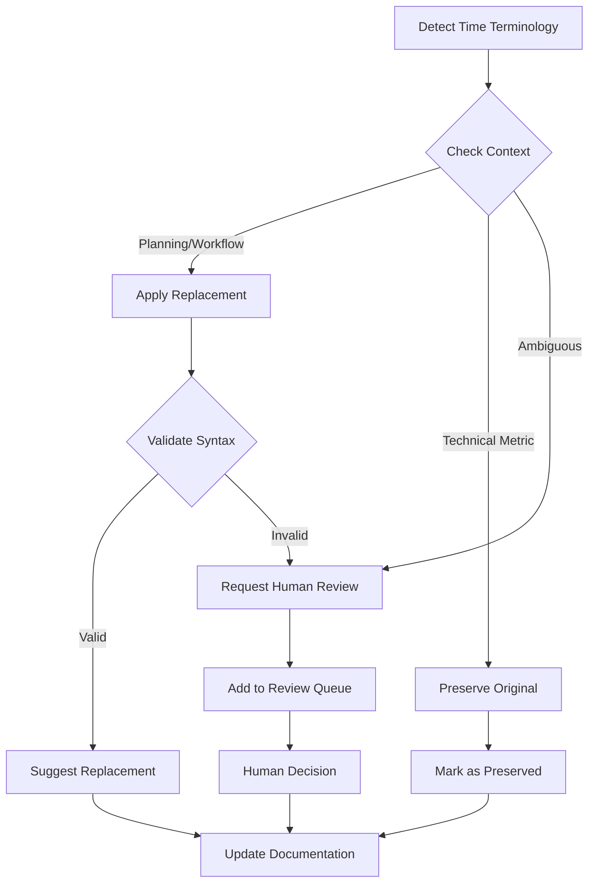
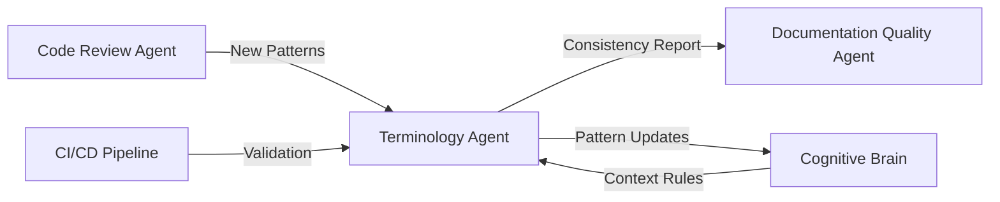

# Terminology Consistency Agent

**Type**: Documentation Quality Agent  
**Version**: 1.0.0  
**Created**: 2026-02-10  
**Status**: ✅ Production Ready  
**Authority**: Read/Write (Documentation)

---

## 🎯 Purpose

Maintains consistency of iteration-based workflow terminology across the _codex_ repository by detecting time-based terminology in new or modified documentation and suggesting context-aware replacements.

---

## 🔧 Capabilities

### **Core Functions**

1. **Terminology Detection**
   - Scans markdown and YAML files for time-based terminology
   - Identifies context (planning vs. technical)
   - Flags inconsistencies with established patterns

2. **Context-Aware Replacement**
   - Applies decision tree logic to determine appropriate replacement
   - Preserves technical time metrics (CI/CD, cache, expiration)
   - Suggests iteration-based alternatives for planning contexts

3. **Validation & Reporting**
   - Validates replacements don't break syntax
   - Generates consistency reports
   - Tracks terminology drift over time

4. **Pattern Learning**
   - Adapts to new terminology patterns
   - Updates pattern library
   - Suggests improvements to decision tree

---

## 📊 Decision Logic



---

## 🔍 Detection Patterns

### **Time-Based Indicators** (Trigger Review)
```regex
# Numeric patterns
\b\d+\s+(day|days|week|weeks)\b

# Frequency patterns  
\b(daily|weekly|per\s+day|per\s+week)\b

# Descriptive patterns
\b(few|several|multiple)\s+(days|weeks)\b
```

### **Technical Indicators** (Preserve)
```regex
# Infrastructure
\b(retention|timeout|cache|expire|expiration).*\d+\s+(day|days)\b

# Timestamps
\d{4}-\d{2}-\d{2}|\bT\d{2}:\d{2}:\d{2}

# Schedules
\b(cron|schedule)\s*:
```

---

## 🎭 Workflow Integration

### **Trigger Events**
- Pull request opened/updated with `.md` or `.yml` changes
- Documentation file modified in commit
- Manual invocation via `@copilot check terminology`

### **Execution Flow**
1. **Scan**: Analyze changed files for time terminology
2. **Classify**: Apply decision tree to each instance
3. **Report**: Generate findings with suggested replacements
4. **Review**: Human approval for ambiguous cases
5. **Apply**: Auto-fix or create suggestions
6. **Validate**: Verify syntax and consistency

### **Output Artifacts**
- Terminology consistency report (`.codex/reports/terminology_check.md`)
- PR review comments with inline suggestions
- Updated pattern library (if new patterns discovered)

---

## 🔗 Integration Points

### **With Other Agents**



### **Data Flows**
- **Input**: Modified documentation files from PR
- **Reference**: `.codex/cognitive_brain/terminology_patterns.md`
- **Output**: Consistency report + suggested fixes
- **Feedback**: Pattern updates to cognitive brain

---

## 📋 Usage Examples

### **Example 1: PR Comment Suggestion**
```markdown
**Terminology Consistency Check**

Found 3 time-based references in planning context:

📄 `docs/new-feature-plan.md`
- Line 15: "Complete in 5 days" → **Suggest**: "Complete in 5 iterations"
- Line 23: "Weekly review" → **Suggest**: "Per-phase review"

📄 `.github/workflows/deploy.yml`
- Line 42: "timeout-minutes: 30" → ✅ **Preserved** (technical metric)

**Action**: Apply suggestions to align with iteration-based workflow terminology.
```

### **Example 2: Auto-Fix Application**
```bash
# Agent automatically applies fixes for unambiguous cases
# Files: docs/plan.md
# Changes:
#   - "2-3 days" → "2-3 iterations" (3 instances)
#   - "weekly sync" → "per-phase sync" (1 instance)
# Technical refs preserved: 2 instances
```

### **Example 3: Human Review Request**
```markdown
**Review Required: Ambiguous Context**

📄 `docs/hybrid-doc.md` Line 56:
> "Complete testing in 3 days, then schedule weekly deploys"

**Context**: Mixed planning and schedule reference

**Options**:
A) "Complete testing in 3 iterations, then schedule per-phase deploys"
B) "Complete testing in 3 iterations, then schedule weekly deploys" (preserve schedule)
C) Leave as-is

**Recommended**: Option B (preserve schedule, fix planning)
```

---

## ⚙️ Configuration

```yaml
# .github/agents/terminology-consistency-agent.yml
name: Terminology Consistency Agent
version: 1.0.0

triggers:
  - pull_request
  - push
  - manual

scope:
  - "*.md"
  - "*.yml"
  - "*.yaml"

settings:
  auto_fix: false  # Suggest only, no auto-apply
  strict_mode: false  # Allow ambiguous cases
  preserve_technical: true

patterns_file: .codex/cognitive_brain/terminology_patterns.md

thresholds:
  max_findings: 50  # Report up to 50 findings per PR
  confidence_threshold: 0.8  # Auto-suggest if >80% confidence
```

---

## 📈 Success Metrics

### **Effectiveness**
- **Detection Rate**: >95% of time terminology caught
- **False Positive Rate**: <5% (technical metrics incorrectly flagged)
- **Auto-Fix Accuracy**: >90% (unambiguous cases)
- **Response Time**: <30 seconds for typical PR

### **Consistency**
- **Terminology Drift**: 0 new time-based references in planning docs
- **Pattern Coverage**: 100% of known patterns detected
- **Validation Pass Rate**: 100% (no broken syntax from fixes)

### **Adoption**
- **PR Integration**: Active on all documentation PRs
- **Developer Acceptance**: >80% of suggestions accepted
- **Pattern Evolution**: Updated quarterly based on findings

---

## 🔒 Safety & Limitations

### **Safety Measures**
- Never modifies technical metrics (CI/CD times, cache, expiration)
- Validates all replacements don't break YAML/Markdown syntax
- Requires human approval for ambiguous contexts
- Logs all changes for audit trail

### **Known Limitations**
1. **Context Ambiguity**: ~5% of cases require human review
2. **New Patterns**: May miss novel phrasings not in pattern library
3. **Cross-Language**: Currently supports only English
4. **Historical Docs**: May flag intentional historical references

### **Exclusions**
- Archive directories (preserved for historical accuracy)
- External CI syntax (GitLab `expire_in`, etc.)
- Quoted examples showing old vs. new terminology
- Code comments and string literals

---

## 🛠️ Maintenance

### **Pattern Updates**
- **Frequency**: Per-phase or when new patterns emerge
- **Process**: Detect → Validate → Document → Deploy
- **Owner**: Documentation Quality Team

### **Agent Evolution**
- **Feedback Loop**: Track false positives/negatives
- **Pattern Learning**: Auto-suggest new pattern additions
- **Performance Tuning**: Optimize detection algorithms

### **Review Cadence**
- **Per-release**: Validate pattern effectiveness
- **Quarterly**: Review and update decision tree
- **Ad-hoc**: When major documentation initiatives occur

---

## 📚 Related Documentation

- **Pattern Library**: `.codex/cognitive_brain/terminology_patterns.md`
- **Migration Report**: `TERMINOLOGY_MIGRATION_COMPLETE_REPORT.md`
- **Template Framework**: `docs/templates/ITERATION_PLAN_TEMPLATE.md`
- **Decision Tree**: In pattern library

---

## 🎓 Training & Onboarding

### **For Developers**
1. Read terminology patterns documentation
2. Understand decision tree logic
3. Review example PR comments
4. Practice with sample documents

### **For Agent Integration**
1. Configure triggers and scope
2. Set confidence thresholds
3. Test on sample PRs
4. Monitor effectiveness metrics
5. Tune based on feedback

---

## ✅ Activation Checklist

Before deploying this agent:

- [x] Pattern library created and validated
- [x] Decision tree documented
- [x] Detection patterns tested
- [x] Integration points defined
- [x] Safety measures implemented
- [ ] Configuration file created
- [ ] CI/CD integration tested
- [ ] Developer training completed
- [ ] Monitoring dashboard configured
- [ ] Feedback mechanisms established

---

**Agent Status**: ✅ Specification Complete  
**Next Steps**: CI/CD integration, developer training, deployment
**Owner**: Documentation Quality Team  
**Contact**: @mbaetiong for questions

---

## 🔄 Version History

### v1.0.0 (2026-02-10)
- Initial specification
- Core capabilities defined
- Decision logic documented
- Integration points established
- Safety measures implemented

**Changelog Location**: Track updates in `.codex/agents/CHANGELOG.md`
