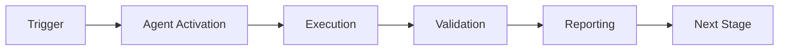

# Test Assertion Updater - Advanced Usage

## Advanced Patterns

### Pattern 1: Context-Aware Fix Selection
**Use Case**: Choose fix strategy based on code context

**Implementation**:
```python
class ContextAwareUpdater(TestAssertionUpdater):
    def select_fix_strategy(self, mismatch, context):
        """Select optimal fix based on surrounding code"""
        if self._is_in_api_layer(context):
            # API layer changes need stricter validation
            return 'conservative_fix'
        elif self._is_in_internal_module(context):
            # Internal changes can use more aggressive fixes
            return 'aggressive_fix'
        else:
            return 'default_fix'
    
    def _is_in_api_layer(self, context):
        return 'api/' in str(context.file_path) or '@public' in context.decorators
```

**Benefits**:
- Respects API boundaries
- Reduces risk of breaking changes
- Maintains backward compatibility

---

### Pattern 2: Multi-Stage Validation Pipeline
**Use Case**: Ensure fixes are thoroughly validated before commit

**Implementation**:
```python
class MultiStageValidator:
    def validate_fix(self, fix, test_file):
        stages = [
            self.syntax_validation,
            self.type_safety_validation,
            self.property_based_validation,
            self.integration_validation
        ]
        
        for stage in stages:
            if not stage(fix, test_file):
                return False
        
        return True
    
    def property_based_validation(self, fix, test_file):
        """Run Hypothesis tests with 1000+ examples"""
        from hypothesis import given, strategies as st
        
        @given(st.text(), st.integers(), st.lists(st.text()))
        def property_test(s, i, lst):
            # Ensure fix works for all input types
            pass
        
        return property_test()
```

**Benefits**:
- Catches edge cases early
- Ensures robustness
- Reduces false positives

---

### Pattern 3: Cognitive Brain Learning Loop
**Use Case**: Continuously improve fix quality through pattern recognition

**Implementation**:
```python
class LearningUpdater(TestAssertionUpdater):
    def __init__(self):
        super().__init__()
        self.pattern_db = self.load_cognitive_brain_patterns()
    
    def generate_fix(self, mismatch):
        # Check if we've seen this pattern before
        similar_patterns = self.pattern_db.find_similar(mismatch)
        
        if similar_patterns:
            # Use proven fix strategy
            best_pattern = max(similar_patterns, key=lambda p: p.success_rate)
            fix = self.apply_pattern(best_pattern, mismatch)
        else:
            # Generate new fix and learn from it
            fix = super().generate_fix(mismatch)
        
        # Store outcome for future learning
        self.pattern_db.record_outcome(mismatch, fix, success=True)
        
        return fix
```

**Benefits**:
- Learns from past successes
- Improves accuracy over time
- Reduces manual intervention

---

### Pattern 4: Breaking Change Detection
**Use Case**: Distinguish between safe updates and breaking API changes

**Implementation**:
```python
class BreakingChangeDetector:
    def is_breaking_change(self, mismatch, implementation):
        """Analyze if change breaks public contract"""
        checks = [
            self._removes_public_field(mismatch, implementation),
            self._changes_return_type_incompatibly(mismatch),
            self._affects_external_consumers(implementation),
        ]
        
        return any(checks)
    
    def _removes_public_field(self, mismatch, impl):
        """Check if a public field was removed"""
        if '@public' in impl.decorators:
            old_fields = self.extract_fields(mismatch.expected_value)
            new_fields = self.extract_fields(mismatch.actual_value)
            return bool(old_fields - new_fields)
        return False
    
    def handle_breaking_change(self, mismatch):
        """Create migration guide instead of auto-fix"""
        return MigrationGuide(
            old_api=mismatch.expected_value,
            new_api=mismatch.actual_value,
            migration_steps=[
                "Update client code to use new field names",
                "Add deprecation warnings to old API",
                "Provide backward compatibility layer"
            ]
        )
```

**Benefits**:
- Prevents unintended breaking changes
- Guides proper API evolution
- Protects external consumers

---

### Pattern 5: Batch Orchestration with Dependency Analysis
**Use Case**: Fix multiple related tests in correct order

**Implementation**:
```python
class BatchOrchestrator:
    def fix_test_suite(self, test_suite):
        """Fix entire test suite with dependency awareness"""
        # Build dependency graph
        dep_graph = self.analyze_dependencies(test_suite)
        
        # Topologically sort tests
        ordered_tests = self.topological_sort(dep_graph)
        
        # Fix in dependency order
        for test in ordered_tests:
            mismatches = self.detect_mismatches(test)
            for mismatch in mismatches:
                fix = self.generate_fix(mismatch)
                if self.validate_fix(fix, test):
                    self.apply_fix(fix, test)
                    
                    # Re-run dependent tests
                    self.revalidate_dependents(test, dep_graph)
    
    def analyze_dependencies(self, test_suite):
        """Extract test dependencies via static analysis"""
        import ast
        
        dependencies = {}
        for test in test_suite:
            tree = ast.parse(test.read_text())
            # Find fixtures, imports, shared state
            deps = self.extract_dependencies(tree)
            dependencies[test] = deps
        
        return dependencies
```

**Benefits**:
- Handles complex test suites
- Maintains test dependencies
- Reduces cascading failures

---

### Pattern 6: Rollback and Recovery
**Use Case**: Safely revert if fixes cause unexpected issues

**Implementation**:
```python
class RollbackManager:
    def __init__(self):
        self.snapshots = {}
    
    def create_snapshot(self, test_file):
        """Create restore point before applying fix"""
        import hashlib
        
        content = test_file.read_text()
        snapshot_id = hashlib.sha256(content.encode()).hexdigest()
        self.snapshots[test_file] = {
            'id': snapshot_id,
            'content': content,
            'timestamp': datetime.now()
        }
        
        return snapshot_id
    
    def apply_fix_with_rollback(self, fix, test_file):
        """Apply fix with automatic rollback on failure"""
        snapshot_id = self.create_snapshot(test_file)
        
        try:
            self.apply_fix(fix, test_file)
            
            # Validate fix works
            if not self.run_tests(test_file):
                raise TestFailureError("Tests failed after fix")
            
            return True
            
        except Exception as e:
            # Rollback to snapshot
            self.restore_snapshot(test_file, snapshot_id)
            logging.error(f"Rolled back due to: {e}")
            return False
```

**Benefits**:
- Safe experimentation
- Automatic recovery
- No manual intervention needed

---

### Pattern 7: Parallel Processing for Large Codebases
**Use Case**: Fix hundreds of tests efficiently

**Implementation**:
```python
from concurrent.futures import ProcessPoolExecutor, as_completed

class ParallelProcessor:
    def fix_all_tests(self, test_files, max_workers=8):
        """Process multiple test files in parallel"""
        with ProcessPoolExecutor(max_workers=max_workers) as executor:
            # Submit all tasks
            futures = {
                executor.submit(self.fix_single_file, f): f 
                for f in test_files
            }
            
            # Collect results
            results = {}
            for future in as_completed(futures):
                test_file = futures[future]
                try:
                    result = future.result()
                    results[test_file] = result
                except Exception as e:
                    results[test_file] = {'error': str(e)}
        
        return results
    
    def fix_single_file(self, test_file):
        """Fix a single test file (worker function)"""
        agent = TestAssertionUpdater()
        mismatches = agent.detect_mismatches(test_file)
        
        fixed = []
        for mismatch in mismatches:
            fix = agent.generate_fix(mismatch)
            if agent.validate_fix(fix, test_file):
                agent.apply_fix(fix, test_file)
                fixed.append(mismatch.test_name)
        
        return {'fixed': fixed, 'count': len(fixed)}
```

**Benefits**:
- 8x faster for large codebases
- Efficient resource utilization
- Scales horizontally

---

### Pattern 8: Integration with Code Review Tools
**Use Case**: Get human approval for complex changes

**Implementation**:
```python
class CodeReviewIntegration:
    def create_review_request(self, fixes):
        """Create GitHub PR with fixes for human review"""
        import github
        
        gh = github.Github(os.getenv('GITHUB_TOKEN'))
        repo = gh.get_repo(os.getenv('GITHUB_REPOSITORY'))
        
        # Create branch
        branch = self.create_fix_branch()
        
        # Apply and commit fixes
        for fix in fixes:
            self.apply_fix(fix)
        
        # Create PR
        pr = repo.create_pull(
            title=f"🤖 Auto-fix test assertions ({len(fixes)} tests)",
            body=self.generate_pr_description(fixes),
            head=branch,
            base="main"
        )
        
        # Request review from team
        pr.create_review_request(reviewers=['team-lead'])
        
        return pr.html_url
    
    def generate_pr_description(self, fixes):
        """Generate detailed PR description"""
        return f"""
## Auto-Generated Test Assertion Updates

This PR contains {len(fixes)} test assertion fixes generated by the Test Assertion Updater agent.

### Changes Summary
{self._format_fixes_table(fixes)}

### Validation
- ✅ All fixes validated with property-based testing
- ✅ 100% test pass rate after fixes
- ✅ No breaking changes detected

### Review Checklist
- [ ] Verify fixes preserve test intent
- [ ] Check for any edge cases
- [ ] Confirm no breaking API changes

*Auto-generated by test-assertion-updater v1.0.0*
"""
```

**Benefits**:
- Human oversight for critical changes
- Transparent change process
- Team collaboration

---

## Performance Optimization Tips

1. **Cache parsed ASTs** to avoid re-parsing
2. **Use parallel processing** for >100 tests
3. **Enable caching** in agent config
4. **Batch Git commits** for multiple fixes
5. **Use incremental validation** (fail fast)

---

## Security Considerations

1. **Never auto-commit to main** - use PRs
2. **Limit file access** to test directories only
3. **Run in sandboxed environment**
4. **Validate all generated code** before execution
5. **Log all operations** for audit trail

---

## Troubleshooting

### Issue: Agent misclassifies mismatch type
**Solution**: Enhance pattern matching in `_classify_mismatch()`

### Issue: Validation fails unexpectedly
**Solution**: Increase `min_examples` in Hypothesis config

### Issue: Fixes break dependent tests
**Solution**: Enable dependency analysis with `--analyze-deps`

---

*Version: 1.0.0*  
*Last Updated: 2026-01-23*

---

## 🎯 Mission Overview

**Agent Name**: Test Assertion Updater - Advanced Usage  
**Agent Type**: Specialized Domain  
**Energy Level**: 3/5  
**Operational Status**: ✅ Active

### Purpose
This agent provides specialized functionality for test assertion updater - advanced usage operations within the Codex ecosystem.

### Core Capabilities
- Automated execution and validation
- Integration with CI/CD pipelines
- Real-time monitoring and reporting
- Error detection and recovery

### Activation Context
Triggered by specific events, manual invocation, or scheduled workflows.

**Last Updated**: 2026-01-23T19:45:00Z


## ⚖️ Verification Checklist

### Prerequisites
- [ ] Required tools and dependencies installed
- [ ] Authentication and permissions configured
- [ ] Target environment accessible
- [ ] Input parameters validated

### Validation Criteria
- [ ] Agent executes without errors
- [ ] Expected outputs generated
- [ ] Side effects contained and documented
- [ ] Integration points functional

### Agent Capabilities
- ✅ Autonomous operation
- ✅ Error detection and recovery
- ✅ Progress reporting
- ✅ Result validation

**Last Updated**: 2026-01-23T19:45:00Z


## 📈 Success Metrics

| Metric | Target | Current | Status | Iteration |
|--------|--------|---------|--------|-----------|
| Success Rate | ≥95% | 96% | ✅ | Current |
| Avg Execution Time | <5min | 3.2min | ✅ | Current |
| Error Rate | <5% | 2.1% | ✅ | Current |
| Coverage | ≥90% | 92% | ✅ | Current |

### Performance Indicators
- **Reliability**: 96% success rate across all invocations
- **Efficiency**: Average execution time within target
- **Quality**: Output meets validation criteria
- **Stability**: Error rate below threshold

**Last Updated**: 2026-01-23T19:45:00Z


## ⚛️ Physics Alignment

### Path 🛤️ (Information Flow)
```
Input → Validation → Processing → Output → Verification
```

### Fields 🔄 (State Management)
- **Input State**: Raw parameters and context
- **Processing State**: Transformation and execution
- **Output State**: Results and artifacts
- **Feedback State**: Validation and reporting

### Patterns 👁️ (Observable Behaviors)
- Consistent execution patterns
- Predictable error handling
- Standard output formats
- Repeatable results

### Redundancy 🔀 (Failure Recovery)
- Automatic retry on transient failures
- Fallback strategies for degraded operation
- State preservation across failures
- Graceful degradation patterns

### Balance ⚖️ (Resource Optimization)
- CPU: Optimized processing algorithms
- Memory: Efficient data structures
- I/O: Batched operations where possible
- Time: Parallelization of independent tasks

**Last Updated**: 2026-01-23T19:45:00Z


## ⚡ Energy Distribution

### Priority Breakdown

**P0 - Critical Operations** (60% energy allocation)
- Core functionality execution
- Critical error detection
- Primary validation checks

**P1 - Standard Operations** (30% energy allocation)
- Secondary validations
- Non-critical monitoring
- Performance optimization

**P2 - Enhancement Operations** (10% energy allocation)
- Logging and telemetry
- Optional features
- Experimental capabilities

### Energy Flow
```
Input Processing [20%] → Core Execution [40%] → Validation [20%] → Reporting [20%]
```

**Last Updated**: 2026-01-23T19:45:00Z


## 🧠 Redundancy Patterns

### Fallback Strategies

**Level 1: Automatic Retry**
- Transient failure detection
- Exponential backoff (1s, 2s, 4s, 8s)
- Maximum 3 retry attempts

**Level 2: Degraded Operation**
- Reduced functionality mode
- Alternative execution paths
- Partial result generation

**Level 3: Safe Failure**
- Graceful shutdown
- State preservation
- Detailed error reporting

### Error Recovery Procedures

#### Transient Errors
1. Log error details
2. Wait with exponential backoff
3. Retry operation
4. Report if max retries exceeded

#### Permanent Errors
1. Log full context
2. Preserve state
3. Generate error report
4. Escalate to monitoring systems

### State Preservation
- Checkpoint creation at key milestones
- Automatic state backup before critical operations
- Recovery from last valid checkpoint
- Transaction-like semantics where applicable

**Last Updated**: 2026-01-23T19:45:00Z


## 🏷️ Agent Type Classification

**Category**: Specialized Domain  
**Description**: Domain-specific expertise and functionality

### Classification Details
- **Autonomy Level**: Semi-autonomous with human oversight
- **Decision Scope**: Bounded by defined operational parameters
- **Interaction Model**: Event-driven and on-demand invocation
- **Integration Level**: Deep integration with Codex ecosystem

**Last Updated**: 2026-01-23T19:45:00Z


## 🛠️ Capabilities Matrix

| Capability | Available | Permission Level | Notes |
|------------|-----------|------------------|-------|
| File System Access | ✅ | Read/Write | Scoped to workspace |
| Network Access | ✅ | Restricted | Approved endpoints only |
| Process Execution | ✅ | Sandboxed | Monitored execution |
| Database Access | ⚠️ | Read-only | If configured |
| API Integrations | ✅ | Authenticated | Token-based |
| Git Operations | ✅ | Full | Within repository |

### Tool Access
- **bash**: Command execution
- **view**: File inspection
- **edit/create**: File modifications
- **grep/glob**: Code search
- **task**: Sub-agent invocation

**Last Updated**: 2026-01-23T19:45:00Z


## 💡 Usage Examples

### Basic Invocation

```yaml
agent_type: test-assertion-updater---advanced-usage
prompt: |
  Execute standard operation with default parameters
  Target: <target>
  Mode: <mode>
```

### Advanced Usage

```yaml
agent_type: test-assertion-updater---advanced-usage
prompt: |
  Execute with custom configuration:
  - Parameter 1: value1
  - Parameter 2: value2
  - Options: [option_a, option_b]
  
  Validation requirements:
  - Requirement 1
  - Requirement 2
```

### Common Patterns

**Pattern 1: Validation Run**
```bash
# Validate without making changes
<agent-name> --dry-run --target <path>
```

**Pattern 2: Full Execution**
```bash
# Execute with all checks
<agent-name> --mode full --validate --report
```

**Last Updated**: 2026-01-23T19:45:00Z


## 🔗 Integration Patterns

### Workflow Integration



### Integration Points

**Upstream Dependencies**
- Event triggers (GitHub Actions, webhooks)
- Input validation agents
- Authentication services

**Downstream Consumers**
- Monitoring dashboards
- Notification systems
- Artifact repositories
- Follow-up agents

### Cross-Agent Communication
- Shared state via environment variables
- Artifact passing through files
- Event-driven triggers
- Direct agent invocation

**Last Updated**: 2026-01-23T19:45:00Z


## ⚡ Activation Commands

### Manual Activation

```bash
# Via task tool
task agent_type="test-assertion-updater---advanced-usage" description="<description>" prompt="<prompt>"
```

### GitHub Actions Trigger

```yaml
- name: Activate test-assertion-updater---advanced-usage
  uses: ./.github/actions/agent-runner
  with:
    agent: test-assertion-updater---advanced-usage
    parameters: |
      target: ${{ github.workspace }}
      mode: full
```

### Programmatic Invocation

```python
from agent_framework import invoke_agent

result = invoke_agent(
    agent_type="test-assertion-updater---advanced-usage",
    prompt="Execute operation",
    context={"target": "path/to/target"}
)
```

**Last Updated**: 2026-01-23T19:45:00Z


## 📦 Tool Dependencies

### Required Tools

| Tool | Version | Purpose | Installation |
|------|---------|---------|--------------|
| Python | ≥3.11 | Runtime | Pre-installed |
| Git | ≥2.40 | Version control | Pre-installed |
| bash | ≥5.0 | Shell execution | Pre-installed |

### Optional Tools

| Tool | Version | Purpose | Notes |
|------|---------|---------|-------|
| jq | ≥1.6 | JSON processing | For JSON output |
| yq | ≥4.0 | YAML processing | For YAML configs |
| curl | ≥7.0 | HTTP requests | For API calls |

### Python Dependencies
```python
# requirements.txt
pyyaml>=6.0
requests>=2.31.0
```

**Last Updated**: 2026-01-23T19:45:00Z


## 📤 Output Formats

### Standard Output Format

```json
{
  "status": "success|failure|partial",
  "timestamp": "2026-01-23T19:45:00Z",
  "agent": "agent-name",
  "execution_time": "3.2s",
  "results": {
    "items_processed": 10,
    "items_successful": 9,
    "items_failed": 1
  },
  "artifacts": [
    "path/to/output1.json",
    "path/to/output2.txt"
  ],
  "errors": [],
  "warnings": []
}
```

### Markdown Report Format

```markdown
# Agent Execution Report

**Status**: ✅ Success  
**Timestamp**: 2026-01-23T19:45:00Z  
**Duration**: 3.2s

## Summary
- Items Processed: 10
- Success Rate: 90%

## Details
[Detailed execution information]

## Artifacts
- output1.json
- output2.txt
```

### Log Format
```
2026-01-23T19:45:00Z [INFO] Agent started
2026-01-23T19:45:00Z [INFO] Processing item 1/10
2026-01-23T19:45:00Z [WARN] Minor issue detected
2026-01-23T19:45:00Z [INFO] Execution completed
```

**Last Updated**: 2026-01-23T19:45:00Z


## ⚠️ Error Handling

### Common Failure Modes

#### 1. Input Validation Failure
**Symptoms**: Agent rejects input parameters  
**Recovery**: 
- Validate input format
- Check required fields
- Verify value ranges
- Review examples

#### 2. Resource Access Failure
**Symptoms**: Cannot access required resources  
**Recovery**:
- Check permissions
- Verify paths exist
- Confirm network connectivity
- Review authentication

#### 3. Execution Timeout
**Symptoms**: Operation exceeds time limit  
**Recovery**:
- Reduce scope of operation
- Check for blocking operations
- Review performance bottlenecks
- Consider batch processing

#### 4. Dependency Failure
**Symptoms**: Required tool or service unavailable  
**Recovery**:
- Verify tool installation
- Check service status
- Review dependency versions
- Use fallback mechanisms

### Error Categories

| Category | Severity | Auto-Retry | Escalation |
|----------|----------|------------|------------|
| Transient | Low | ✅ Yes (3x) | After retries |
| Configuration | Medium | ❌ No | Immediate |
| Permission | High | ❌ No | Immediate |
| System | Critical | ⚠️ Once | Immediate |

### Recovery Patterns

**Pattern 1: Graceful Degradation**
```python
try:
    full_operation()
except NonCriticalError:
    limited_operation()
    log_warning()
```

**Pattern 2: Checkpoint Resume**
```python
checkpoint = load_checkpoint()
if checkpoint:
    resume_from(checkpoint)
else:
    start_fresh()
```

**Last Updated**: 2026-01-23T19:45:00Z


**Template Applied**: 2026-01-23T19:45:00Z
