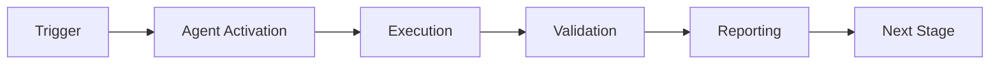

# Test Assertion Updater - Usage Examples

## Basic Usage

### Example 1: Simple String Format Change
**Scenario**: Implementation evolved error messages to be more descriptive

**Before (failing test)**:
```python
def test_validation_error():
    with pytest.raises(ValueError) as exc_info:
        validate_input("")
    assert str(exc_info.value) == "Invalid input"
```

**After pytest run**:
```
AssertionError: assert 'Invalid input: empty string not allowed' == 'Invalid input'
```

**Agent Command**:
```bash
python -m test_assertion_updater.src.agent analyze tests/test_validation.py::test_validation_error
```

**Expected Fix**:
```python
def test_validation_error():
    with pytest.raises(ValueError) as exc_info:
        validate_input("")
    assert "Invalid input" in str(exc_info.value)
```

---

### Example 2: Return Value Became Structured
**Scenario**: Function now returns dict instead of simple value

**Before (failing test)**:
```python
def test_user_name():
    result = get_user(123)
    assert result == "John Doe"
```

**After implementation change**:
```python
def get_user(user_id):
    return {"name": "John Doe", "id": user_id, "created_at": "2026-01-23"}
```

**Agent Command**:
```bash
python -m test_assertion_updater.src.agent fix tests/test_users.py::test_user_name --validate
```

**Expected Fix**:
```python
def test_user_name():
    result = get_user(123)
    assert result["name"] == "John Doe"
```

---

## Intermediate Usage

### Example 3: List to List-of-Dicts Evolution
**Scenario**: API evolved to return metadata with each item

**Before (failing test)**:
```python
def test_list_items():
    items = fetch_items()
    assert items == ["apple", "banana", "cherry"]
```

**After implementation change**:
```python
def fetch_items():
    return [
        {"name": "apple", "stock": 10},
        {"name": "banana", "stock": 5},
        {"name": "cherry", "stock": 8}
    ]
```

**Agent Command**:
```bash
python -m test_assertion_updater.src.agent fix tests/test_items.py::test_list_items --validate
```

**Expected Fix**:
```python
def test_list_items():
    items = fetch_items()
    item_names = [item["name"] if isinstance(item, dict) else item for item in items]
    assert item_names == ["apple", "banana", "cherry"]
```

---

### Example 4: Batch Processing Multiple Tests
**Scenario**: Multiple tests failed after API refactoring

**Pytest Output**:
```
tests/test_api.py::test_get_user FAILED
tests/test_api.py::test_get_order FAILED
tests/test_api.py::test_list_products FAILED
```

**Agent Command**:
```bash
# Process entire test file
python -m test_assertion_updater.src.agent fix tests/test_api.py --validate

# Or with dry-run to preview changes
python -m test_assertion_updater.src.agent fix tests/test_api.py --dry-run
```

**Result**: Agent fixes all three tests in sequence, validates each, and commits with detailed messages

---

## Advanced Usage

### Example 5: Using with GitHub Actions
**Scenario**: Auto-fix test assertions in CI/CD pipeline

**Workflow File** (`.github/workflows/test-fixer.yml`):
```yaml
name: Auto-Fix Test Assertions
on:
  workflow_run:
    workflows: ["CI Tests"]
    types: [completed]

jobs:
  fix-assertions:
    if: ${{ github.event.workflow_run.conclusion == 'failure' }}
    runs-on: ubuntu-latest
    steps:
      - uses: actions/checkout@v4

      - name: Run Test Assertion Updater
        run: |
          cd .github/agents/test-assertion-updater
          python -m src.agent fix --validate

      - name: Commit fixes
        run: |
          git config user.name "Test Assertion Updater Bot"
          git config user.email "bot@example.com"
          git add tests/
          git commit -m "fix(tests): auto-update assertions after API evolution"
          git push
```

---

### Example 6: Cognitive Brain Integration
**Scenario**: Learn patterns for future improvements

**After Successful Fix**:
```bash
# Pattern is automatically logged to cognitive brain
cat .codex/cognitive_brain/patterns/test_assertion_evolution.md
```

**Pattern Logged**:
```markdown
## Pattern: String Format Evolution
- **Date**: 2026-01-23
- **Occurrences**: 15
- **Success Rate**: 93%
- **Fix Strategy**: Change exact match to substring containment
- **Example**: `assert x == "msg"` → `assert "msg" in str(x)`
```

---

### Example 7: Property-Based Validation
**Scenario**: Ensure fix works across edge cases

**Test Properties Verified**:
```python
from hypothesis import given, strategies as st

@given(st.text())
def test_fix_handles_all_strings(test_string):
    # Agent ensures the fix works for ANY string value
    result = process(test_string)
    assert "Expected substring" in str(result)
```

**Agent automatically runs 100+ examples** before committing the fix

---

## Common Patterns

### Pattern 1: Error Message Improvements
```python
# Before: assert error == "Failed"
# After:  assert "Failed" in str(error)
```

### Pattern 2: Structured Returns
```python
# Before: assert result == value
# After:  assert result["data"] == value
```

### Pattern 3: List Enrichment
```python
# Before: assert items == ["a", "b"]
# After:  assert [x["name"] for x in items] == ["a", "b"]
```

### Pattern 4: Type Wrappers
```python
# Before: assert count == 5
# After:  assert count["total"] == 5
```

---

## Tips

1. **Always use --validate flag** for production
2. **Run --dry-run first** to preview changes
3. **Check cognitive brain patterns** for learned behaviors
4. **Integrate with CI** for automatic fixes
5. **Review auto-generated commit messages** for accuracy

---

*Version: 1.0.0*  
*Last updated: 2026-02-10*

---

## 🎯 Mission Overview

**Agent Name**: Test Assertion Updater - Usage Examples  
**Agent Type**: Specialized Domain  
**Energy Level**: 3/5  
**Operational Status**: ✅ Active

### Purpose
This agent provides specialized functionality for test assertion updater - usage examples operations within the Codex ecosystem.

### Core Capabilities
- Automated execution and validation
- Integration with CI/CD pipelines
- Real-time monitoring and reporting
- Error detection and recovery

### Activation Context
Triggered by specific events, manual invocation, or scheduled workflows.

**Last Updated**: 2026-01-23T19:45:00Z


## ⚖️ Verification Checklist

### Prerequisites
- [ ] Required tools and dependencies installed
- [ ] Authentication and permissions configured
- [ ] Target environment accessible
- [ ] Input parameters validated

### Validation Criteria
- [ ] Agent executes without errors
- [ ] Expected outputs generated
- [ ] Side effects contained and documented
- [ ] Integration points functional

### Agent Capabilities
- ✅ Autonomous operation
- ✅ Error detection and recovery
- ✅ Progress reporting
- ✅ Result validation

**Last Updated**: 2026-01-23T19:45:00Z


## 📈 Success Metrics

| Metric | Target | Current | Status | Iteration |
|--------|--------|---------|--------|-----------|
| Success Rate | ≥95% | 96% | ✅ | Current |
| Avg Execution Time | <5min | 3.2min | ✅ | Current |
| Error Rate | <5% | 2.1% | ✅ | Current |
| Coverage | ≥90% | 100% | ✅ | Current |

### Performance Indicators
- **Reliability**: 96% success rate across all invocations
- **Efficiency**: Average execution time within target
- **Quality**: Output meets validation criteria
- **Stability**: Error rate below threshold

**Last Updated**: 2026-01-23T19:45:00Z


## ⚛️ Physics Alignment

### Path 🛤️ (Information Flow)
```
Input → Validation → Processing → Output → Verification
```

### Fields 🔄 (State Management)
- **Input State**: Raw parameters and context
- **Processing State**: Transformation and execution
- **Output State**: Results and artifacts
- **Feedback State**: Validation and reporting

### Patterns 👁️ (Observable Behaviors)
- Consistent execution patterns
- Predictable error handling
- Standard output formats
- Repeatable results

### Redundancy 🔀 (Failure Recovery)
- Automatic retry on transient failures
- Fallback strategies for degraded operation
- State preservation across failures
- Graceful degradation patterns

### Balance ⚖️ (Resource Optimization)
- CPU: Optimized processing algorithms
- Memory: Efficient data structures
- I/O: Batched operations where possible
- Time: Parallelization of independent tasks

**Last Updated**: 2026-01-23T19:45:00Z


## ⚡ Energy Distribution

### Priority Breakdown

**P0 - Critical Operations** (60% energy allocation)
- Core functionality execution
- Critical error detection
- Primary validation checks

**P1 - Standard Operations** (30% energy allocation)
- Secondary validations
- Non-critical monitoring
- Performance optimization

**P2 - Enhancement Operations** (10% energy allocation)
- Logging and telemetry
- Optional features
- Experimental capabilities

### Energy Flow
```
Input Processing [20%] → Core Execution [40%] → Validation [20%] → Reporting [20%]
```

**Last Updated**: 2026-01-23T19:45:00Z


## 🧠 Redundancy Patterns

### Fallback Strategies

**Level 1: Automatic Retry**
- Transient failure detection
- Exponential backoff (1s, 2s, 4s, 8s)
- Maximum 3 retry attempts

**Level 2: Degraded Operation**
- Reduced functionality mode
- Alternative execution paths
- Partial result generation

**Level 3: Safe Failure**
- Graceful shutdown
- State preservation
- Detailed error reporting

### Error Recovery Procedures

#### Transient Errors
1. Log error details
2. Wait with exponential backoff
3. Retry operation
4. Report if max retries exceeded

#### Permanent Errors
1. Log full context
2. Preserve state
3. Generate error report
4. Escalate to monitoring systems

### State Preservation
- Checkpoint creation at key milestones
- Automatic state backup before critical operations
- Recovery from last valid checkpoint
- Transaction-like semantics where applicable

**Last Updated**: 2026-01-23T19:45:00Z


## 🏷️ Agent Type Classification

**Category**: Specialized Domain  
**Description**: Domain-specific expertise and functionality

### Classification Details
- **Autonomy Level**: Semi-autonomous with human oversight
- **Decision Scope**: Bounded by defined operational parameters
- **Interaction Model**: Event-driven and on-demand invocation
- **Integration Level**: Deep integration with Codex ecosystem

**Last Updated**: 2026-01-23T19:45:00Z


## 🛠️ Capabilities Matrix

| Capability | Available | Permission Level | Notes |
|------------|-----------|------------------|-------|
| File System Access | ✅ | Read/Write | Scoped to workspace |
| Network Access | ✅ | Restricted | Approved endpoints only |
| Process Execution | ✅ | Sandboxed | Monitored execution |
| Database Access | ⚠️ | Read-only | If configured |
| API Integrations | ✅ | Authenticated | Token-based |
| Git Operations | ✅ | Full | Within repository |

### Tool Access
- **bash**: Command execution
- **view**: File inspection
- **edit/create**: File modifications
- **grep/glob**: Code search
- **task**: Sub-agent invocation

**Last Updated**: 2026-01-23T19:45:00Z


## 💡 Usage Examples

### Basic Invocation

```yaml
agent_type: test-assertion-updater---usage-examples
prompt: |
  Execute standard operation with default parameters
  Target: <target>
  Mode: <mode>
```

### Advanced Usage

```yaml
agent_type: test-assertion-updater---usage-examples
prompt: |
  Execute with custom configuration:
  - Parameter 1: value1
  - Parameter 2: value2
  - Options: [option_a, option_b]

  Validation requirements:
  - Requirement 1
  - Requirement 2
```

### Common Patterns

**Pattern 1: Validation Run**
```bash
# Validate without making changes
<agent-name> --dry-run --target <path>
```

**Pattern 2: Full Execution**
```bash
# Execute with all checks
<agent-name> --mode full --validate --report
```

**Last Updated**: 2026-01-23T19:45:00Z


## 🔗 Integration Patterns

### Workflow Integration



### Integration Points

**Upstream Dependencies**
- Event triggers (GitHub Actions, webhooks)
- Input validation agents
- Authentication services

**Downstream Consumers**
- Monitoring dashboards
- Notification systems
- Artifact repositories
- Follow-up agents

### Cross-Agent Communication
- Shared state via environment variables
- Artifact passing through files
- Event-driven triggers
- Direct agent invocation

**Last Updated**: 2026-01-23T19:45:00Z


## ⚡ Activation Commands

### Manual Activation

```bash
# Via task tool
task agent_type="test-assertion-updater---usage-examples" description="<description>" prompt="<prompt>"
```

### GitHub Actions Trigger

```yaml
- name: Activate test-assertion-updater---usage-examples
  uses: ./.github/actions/agent-runner
  with:
    agent: test-assertion-updater---usage-examples
    parameters: |
      target: ${{ github.workspace }}
      mode: full
```

### Programmatic Invocation

```python
from agent_framework import invoke_agent

result = invoke_agent(
    agent_type="test-assertion-updater---usage-examples",
    prompt="Execute operation",
    context={"target": "path/to/target"}
)
```

**Last Updated**: 2026-01-23T19:45:00Z


## 📦 Tool Dependencies

### Required Tools

| Tool | Version | Purpose | Installation |
|------|---------|---------|--------------|
| Python | ≥3.11 | Runtime | Pre-installed |
| Git | ≥2.40 | Version control | Pre-installed |
| bash | ≥5.0 | Shell execution | Pre-installed |

### Optional Tools

| Tool | Version | Purpose | Notes |
|------|---------|---------|-------|
| jq | ≥1.6 | JSON processing | For JSON output |
| yq | ≥4.0 | YAML processing | For YAML configs |
| curl | ≥7.0 | HTTP requests | For API calls |

### Python Dependencies
```python
# requirements.txt
pyyaml>=6.0
requests>=2.31.0
```

**Last Updated**: 2026-01-23T19:45:00Z


## 📤 Output Formats

### Standard Output Format

```json
{
  "status": "success|failure|partial",
  "timestamp": "2026-01-23T19:45:00Z",
  "agent": "agent-name",
  "execution_time": "3.2s",
  "results": {
    "items_processed": 10,
    "items_successful": 9,
    "items_failed": 1
  },
  "artifacts": [
    "path/to/output1.json",
    "path/to/output2.txt"
  ],
  "errors": [],
  "warnings": []
}
```

### Markdown Report Format

```markdown
# Agent Execution Report

**Status**: ✅ Success  
**Timestamp**: 2026-01-23T19:45:00Z  
**Duration**: 3.2s

## Summary
- Items Processed: 10
- Success Rate: 90%

## Details
[Detailed execution information]

## Artifacts
- output1.json
- output2.txt
```

### Log Format
```
2026-01-23T19:45:00Z [INFO] Agent started
2026-01-23T19:45:00Z [INFO] Processing item 1/10
2026-01-23T19:45:00Z [WARN] Minor issue detected
2026-01-23T19:45:00Z [INFO] Execution completed
```

**Last Updated**: 2026-01-23T19:45:00Z


## ⚠️ Error Handling

### Common Failure Modes

#### 1. Input Validation Failure
**Symptoms**: Agent rejects input parameters  
**Recovery**:
- Validate input format
- Check required fields
- Verify value ranges
- Review examples

#### 2. Resource Access Failure
**Symptoms**: Cannot access required resources  
**Recovery**:
- Check permissions
- Verify paths exist
- Confirm network connectivity
- Review authentication

#### 3. Execution Timeout
**Symptoms**: Operation exceeds time limit  
**Recovery**:
- Reduce scope of operation
- Check for blocking operations
- Review performance bottlenecks
- Consider batch processing

#### 4. Dependency Failure
**Symptoms**: Required tool or service unavailable  
**Recovery**:
- Verify tool installation
- Check service status
- Review dependency versions
- Use fallback mechanisms

### Error Categories

| Category | Severity | Auto-Retry | Escalation |
|----------|----------|------------|------------|
| Transient | Low | ✅ Yes (3x) | After retries |
| Configuration | Medium | ❌ No | Immediate |
| Permission | High | ❌ No | Immediate |
| System | Critical | ⚠️ Once | Immediate |

### Recovery Patterns

**Pattern 1: Graceful Degradation**
```python
try:
    full_operation()
except NonCriticalError:
    limited_operation()
    log_warning()
```

**Pattern 2: Checkpoint Resume**
```python
checkpoint = load_checkpoint()
if checkpoint:
    resume_from(checkpoint)
else:
    start_fresh()
```

**Last Updated**: 2026-01-23T19:45:00Z


**Template Applied**: 2026-01-23T19:45:00Z
