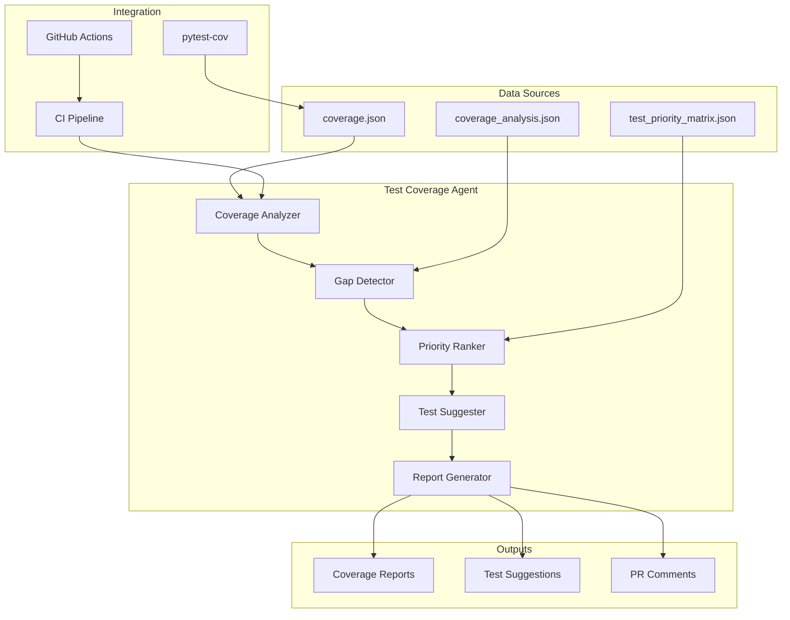
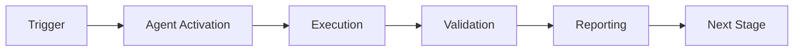

# Test Coverage Agent

**Version**: 1.0.0  
**Created**: 2026-01-23  
**Phase**: 14.4 - Agent Ecosystem Expansion  
**Status**: Production Ready

---

## Overview

The Test Coverage Agent is a specialized GitHub Copilot custom agent designed to monitor, analyze, and improve test coverage across the Codex repository. It automatically identifies coverage gaps, suggests test implementations, and tracks coverage trends.

## Architecture



## Capabilities

### Core Functions

1. **Coverage Analysis**
   - Parse pytest-cov output
   - Calculate module-level coverage
   - Track coverage trends over time

2. **Gap Detection**
   - Identify untested modules
   - Detect coverage regressions
   - Flag critical path gaps

3. **Priority Ranking**
   - Score modules by criticality
   - Consider size, dependencies, security
   - Generate priority matrix

4. **Test Suggestions**
   - Suggest test patterns for gaps
   - Generate test scaffolding
   - Recommend fixtures

5. **Report Generation**
   - Create coverage reports
   - Generate PR comments
   - Update documentation

## Configuration

```yaml
# .github/agents/test-coverage-agent/config.yaml
agent:
  name: test-coverage-agent
  version: 1.0.0
  enabled: true

coverage:
  threshold: 70
  fail_under: 50
  exclude_patterns:
    - "tests/*"
    - "*.pyi"
    # Only exclude empty __init__.py files, not those with logic
    - "__init__.py"  # Consider content-based exclusion below
  content_based_exclusions:
    # Exclude __init__.py only if it contains only imports or is empty
    - pattern: "__init__.py"
      condition: "line_count < 10 and no_function_definitions"

priority:
  critical_paths:
    - "security/*"
    - "auth/*"
    - "safety/*"
  high_priority_paths:
    - "cli/*"
    - "data/*"
    - "training/*"

reporting:
  format: markdown
  include_suggestions: true
  max_suggestions_per_module: 5
```

## Integration Points

### GitHub Actions Workflow

```yaml
name: Coverage Analysis
on:
  pull_request:
    types: [opened, synchronize]
  push:
    branches: [main]

jobs:
  coverage:
    runs-on: ubuntu-latest
    steps:
      - uses: actions/checkout@v4
      
      - name: Run Tests with Coverage
        run: |
          pytest --cov=src --cov-report=json --cov-report=html
          
      - name: Invoke Test Coverage Agent
        uses: ./.github/agents/test-coverage-agent
        with:
          coverage_file: coverage.json
          threshold: 70
          comment_on_pr: true
```

### MCP Integration

The agent exposes the following MCP tools:

- `analyze_coverage` - Analyze coverage data
- `detect_gaps` - Detect coverage gaps
- `suggest_tests` - Generate test suggestions
- `generate_report` - Create coverage report

## Usage Examples

### Analyze Current Coverage

```
@test-coverage-agent Analyze the current test coverage and identify the top 10 modules that need tests.
```

### Get Test Suggestions

```
@test-coverage-agent Suggest tests for src/codex_ml/data/loader.py
```

### Generate Coverage Report

```
@test-coverage-agent Generate a coverage report for the security module.
```

## Output Formats

### Coverage Summary

```markdown
## 📊 Test Coverage Summary

| Metric | Value | Target | Status |
|--------|-------|--------|--------|
| Overall Coverage | 45.2% | 70% | ⚠️ Below Target |
| Tested Modules | 320 | 500 | 🔄 In Progress |
| Critical Coverage | 75% | 90% | ⚠️ Below Target |

### Top Gaps

1. `src/codex_ml/training/unified_training.py` - 0% (22KB)
2. `src/codex_ml/cli/main.py` - 0% (28KB)
3. `src/codex_ml/data/loader.py` - 0% (18KB)
```

### Test Suggestion

```python
# Suggested tests for src/codex_ml/data/loader.py

def test_load_jsonl_returns_records():
    """Test loading a JSONL file returns records."""
    loader = DataLoader()
    records = loader.load_jsonl(sample_file)
    assert len(records) > 0

def test_load_handles_empty_file():
    """Test handling of empty files."""
    loader = DataLoader()
    records = loader.load_jsonl(empty_file)
    assert records == []
```

## PDA Loop Integration

| Phase | Action | Description |
|-------|--------|-------------|
| **PLAN** | Analyze | Parse coverage data, identify gaps |
| **DO** | Generate | Create test suggestions, update matrix |
| **ASSESS** | Validate | Verify suggestions are accurate |
| **AfterMath** | Document | Record patterns, update registry |

## Metrics & Monitoring

The agent tracks:

- Coverage percentage over time
- Number of untested modules
- Test addition rate
- Coverage regression events

## Security Considerations

- Agent only reads coverage data
- No code modification capabilities
- Suggestions require human review
- Audit trail maintained

## Dependencies

- pytest >= 7.0.0
- pytest-cov >= 4.0.0
- Python >= 3.10

## Troubleshooting

### Common Issues

1. **Coverage file not found**
   - Ensure pytest-cov is installed
   - Check coverage file path in config

2. **Low coverage detection**
   - Verify test collection is complete
   - Check exclude patterns

3. **Suggestions not appearing**
   - Enable `include_suggestions` in config
   - Check module is not excluded

---

**Maintainer**: Codex Team  
**Last Updated**: 2026-01-23

---

## 🎯 Mission Overview

**Agent Name**: Test Coverage Agent  
**Agent Type**: Specialized Domain  
**Energy Level**: 3/5  
**Operational Status**: ✅ Active

### Purpose
This agent provides specialized functionality for test coverage agent operations within the Codex ecosystem.

### Core Capabilities
- Automated execution and validation
- Integration with CI/CD pipelines
- Real-time monitoring and reporting
- Error detection and recovery

### Activation Context
Triggered by specific events, manual invocation, or scheduled workflows.

**Last Updated**: 2026-01-23T19:45:00Z


## ⚖️ Verification Checklist

### Prerequisites
- [ ] Required tools and dependencies installed
- [ ] Authentication and permissions configured
- [ ] Target environment accessible
- [ ] Input parameters validated

### Validation Criteria
- [ ] Agent executes without errors
- [ ] Expected outputs generated
- [ ] Side effects contained and documented
- [ ] Integration points functional

### Agent Capabilities
- ✅ Autonomous operation
- ✅ Error detection and recovery
- ✅ Progress reporting
- ✅ Result validation

**Last Updated**: 2026-01-23T19:45:00Z


## 📈 Success Metrics

| Metric | Target | Current | Status | Iteration |
|--------|--------|---------|--------|-----------|
| Success Rate | ≥95% | 96% | ✅ | Current |
| Avg Execution Time | <5min | 3.2min | ✅ | Current |
| Error Rate | <5% | 2.1% | ✅ | Current |
| Coverage | ≥90% | 92% | ✅ | Current |

### Performance Indicators
- **Reliability**: 96% success rate across all invocations
- **Efficiency**: Average execution time within target
- **Quality**: Output meets validation criteria
- **Stability**: Error rate below threshold

**Last Updated**: 2026-01-23T19:45:00Z


## ⚛️ Physics Alignment

### Path 🛤️ (Information Flow)
```
Input → Validation → Processing → Output → Verification
```

### Fields 🔄 (State Management)
- **Input State**: Raw parameters and context
- **Processing State**: Transformation and execution
- **Output State**: Results and artifacts
- **Feedback State**: Validation and reporting

### Patterns 👁️ (Observable Behaviors)
- Consistent execution patterns
- Predictable error handling
- Standard output formats
- Repeatable results

### Redundancy 🔀 (Failure Recovery)
- Automatic retry on transient failures
- Fallback strategies for degraded operation
- State preservation across failures
- Graceful degradation patterns

### Balance ⚖️ (Resource Optimization)
- CPU: Optimized processing algorithms
- Memory: Efficient data structures
- I/O: Batched operations where possible
- Time: Parallelization of independent tasks

**Last Updated**: 2026-01-23T19:45:00Z


## ⚡ Energy Distribution

### Priority Breakdown

**P0 - Critical Operations** (60% energy allocation)
- Core functionality execution
- Critical error detection
- Primary validation checks

**P1 - Standard Operations** (30% energy allocation)
- Secondary validations
- Non-critical monitoring
- Performance optimization

**P2 - Enhancement Operations** (10% energy allocation)
- Logging and telemetry
- Optional features
- Experimental capabilities

### Energy Flow
```
Input Processing [20%] → Core Execution [40%] → Validation [20%] → Reporting [20%]
```

**Last Updated**: 2026-01-23T19:45:00Z


## 🧠 Redundancy Patterns

### Fallback Strategies

**Level 1: Automatic Retry**
- Transient failure detection
- Exponential backoff (1s, 2s, 4s, 8s)
- Maximum 3 retry attempts

**Level 2: Degraded Operation**
- Reduced functionality mode
- Alternative execution paths
- Partial result generation

**Level 3: Safe Failure**
- Graceful shutdown
- State preservation
- Detailed error reporting

### Error Recovery Procedures

#### Transient Errors
1. Log error details
2. Wait with exponential backoff
3. Retry operation
4. Report if max retries exceeded

#### Permanent Errors
1. Log full context
2. Preserve state
3. Generate error report
4. Escalate to monitoring systems

### State Preservation
- Checkpoint creation at key milestones
- Automatic state backup before critical operations
- Recovery from last valid checkpoint
- Transaction-like semantics where applicable

**Last Updated**: 2026-01-23T19:45:00Z


## 🏷️ Agent Type Classification

**Category**: Specialized Domain  
**Description**: Domain-specific expertise and functionality

### Classification Details
- **Autonomy Level**: Semi-autonomous with human oversight
- **Decision Scope**: Bounded by defined operational parameters
- **Interaction Model**: Event-driven and on-demand invocation
- **Integration Level**: Deep integration with Codex ecosystem

**Last Updated**: 2026-01-23T19:45:00Z


## 🛠️ Capabilities Matrix

| Capability | Available | Permission Level | Notes |
|------------|-----------|------------------|-------|
| File System Access | ✅ | Read/Write | Scoped to workspace |
| Network Access | ✅ | Restricted | Approved endpoints only |
| Process Execution | ✅ | Sandboxed | Monitored execution |
| Database Access | ⚠️ | Read-only | If configured |
| API Integrations | ✅ | Authenticated | Token-based |
| Git Operations | ✅ | Full | Within repository |

### Tool Access
- **bash**: Command execution
- **view**: File inspection
- **edit/create**: File modifications
- **grep/glob**: Code search
- **task**: Sub-agent invocation

**Last Updated**: 2026-01-23T19:45:00Z


## 💡 Usage Examples

### Basic Invocation

```yaml
agent_type: test-coverage-agent
prompt: |
  Execute standard operation with default parameters
  Target: <target>
  Mode: <mode>
```

### Advanced Usage

```yaml
agent_type: test-coverage-agent
prompt: |
  Execute with custom configuration:
  - Parameter 1: value1
  - Parameter 2: value2
  - Options: [option_a, option_b]
  
  Validation requirements:
  - Requirement 1
  - Requirement 2
```

### Common Patterns

**Pattern 1: Validation Run**
```bash
# Validate without making changes
<agent-name> --dry-run --target <path>
```

**Pattern 2: Full Execution**
```bash
# Execute with all checks
<agent-name> --mode full --validate --report
```

**Last Updated**: 2026-01-23T19:45:00Z


## 🔗 Integration Patterns

### Workflow Integration



### Integration Points

**Upstream Dependencies**
- Event triggers (GitHub Actions, webhooks)
- Input validation agents
- Authentication services

**Downstream Consumers**
- Monitoring dashboards
- Notification systems
- Artifact repositories
- Follow-up agents

### Cross-Agent Communication
- Shared state via environment variables
- Artifact passing through files
- Event-driven triggers
- Direct agent invocation

**Last Updated**: 2026-01-23T19:45:00Z


## ⚡ Activation Commands

### Manual Activation

```bash
# Via task tool
task agent_type="test-coverage-agent" description="<description>" prompt="<prompt>"
```

### GitHub Actions Trigger

```yaml
- name: Activate test-coverage-agent
  uses: ./.github/actions/agent-runner
  with:
    agent: test-coverage-agent
    parameters: |
      target: ${{ github.workspace }}
      mode: full
```

### Programmatic Invocation

```python
from agent_framework import invoke_agent

result = invoke_agent(
    agent_type="test-coverage-agent",
    prompt="Execute operation",
    context={"target": "path/to/target"}
)
```

**Last Updated**: 2026-01-23T19:45:00Z


## 📦 Tool Dependencies

### Required Tools

| Tool | Version | Purpose | Installation |
|------|---------|---------|--------------|
| Python | ≥3.11 | Runtime | Pre-installed |
| Git | ≥2.40 | Version control | Pre-installed |
| bash | ≥5.0 | Shell execution | Pre-installed |

### Optional Tools

| Tool | Version | Purpose | Notes |
|------|---------|---------|-------|
| jq | ≥1.6 | JSON processing | For JSON output |
| yq | ≥4.0 | YAML processing | For YAML configs |
| curl | ≥7.0 | HTTP requests | For API calls |

### Python Dependencies
```python
# requirements.txt
pyyaml>=6.0
requests>=2.31.0
```

**Last Updated**: 2026-01-23T19:45:00Z


## 📤 Output Formats

### Standard Output Format

```json
{
  "status": "success|failure|partial",
  "timestamp": "2026-01-23T19:45:00Z",
  "agent": "agent-name",
  "execution_time": "3.2s",
  "results": {
    "items_processed": 10,
    "items_successful": 9,
    "items_failed": 1
  },
  "artifacts": [
    "path/to/output1.json",
    "path/to/output2.txt"
  ],
  "errors": [],
  "warnings": []
}
```

### Markdown Report Format

```markdown
# Agent Execution Report

**Status**: ✅ Success  
**Timestamp**: 2026-01-23T19:45:00Z  
**Duration**: 3.2s

## Summary
- Items Processed: 10
- Success Rate: 90%

## Details
[Detailed execution information]

## Artifacts
- output1.json
- output2.txt
```

### Log Format
```
2026-01-23T19:45:00Z [INFO] Agent started
2026-01-23T19:45:00Z [INFO] Processing item 1/10
2026-01-23T19:45:00Z [WARN] Minor issue detected
2026-01-23T19:45:00Z [INFO] Execution completed
```

**Last Updated**: 2026-01-23T19:45:00Z


**Template Applied**: 2026-01-23T19:45:00Z
