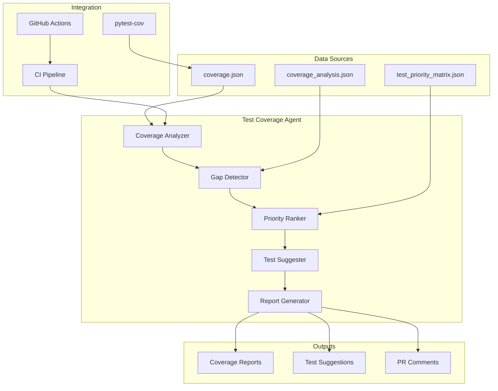

# Test Coverage Agent

**Version**: 1.0.0  
**Created**: 2026-01-18  
**Phase**: 14.4 - Agent Ecosystem Expansion  
**Status**: Production Ready

---

## Overview

The Test Coverage Agent is a specialized GitHub Copilot custom agent designed to monitor, analyze, and improve test coverage across the Codex repository. It automatically identifies coverage gaps, suggests test implementations, and tracks coverage trends.

## Architecture



## Capabilities

### Core Functions

1. **Coverage Analysis**
   - Parse pytest-cov output
   - Calculate module-level coverage
   - Track coverage trends over time

2. **Gap Detection**
   - Identify untested modules
   - Detect coverage regressions
   - Flag critical path gaps

3. **Priority Ranking**
   - Score modules by criticality
   - Consider size, dependencies, security
   - Generate priority matrix

4. **Test Suggestions**
   - Suggest test patterns for gaps
   - Generate test scaffolding
   - Recommend fixtures

5. **Report Generation**
   - Create coverage reports
   - Generate PR comments
   - Update documentation

## Configuration

```yaml
# .github/agents/test-coverage-agent/config.yaml
agent:
  name: test-coverage-agent
  version: 1.0.0
  enabled: true

coverage:
  threshold: 70
  fail_under: 50
  exclude_patterns:
    - "tests/*"
    - "*.pyi"
    - "__init__.py"

priority:
  critical_paths:
    - "security/*"
    - "auth/*"
    - "safety/*"
  high_priority_paths:
    - "cli/*"
    - "data/*"
    - "training/*"

reporting:
  format: markdown
  include_suggestions: true
  max_suggestions_per_module: 5
```

## Integration Points

### GitHub Actions Workflow

```yaml
name: Coverage Analysis
on:
  pull_request:
    types: [opened, synchronize]
  push:
    branches: [main]

jobs:
  coverage:
    runs-on: ubuntu-latest
    steps:
      - uses: actions/checkout@v4
      
      - name: Run Tests with Coverage
        run: |
          pytest --cov=src --cov-report=json --cov-report=html
          
      - name: Invoke Test Coverage Agent
        uses: ./.github/agents/test-coverage-agent
        with:
          coverage_file: coverage.json
          threshold: 70
          comment_on_pr: true
```

### MCP Integration

The agent exposes the following MCP tools:

- `analyze_coverage` - Analyze coverage data
- `detect_gaps` - Detect coverage gaps
- `suggest_tests` - Generate test suggestions
- `generate_report` - Create coverage report

## Usage Examples

### Analyze Current Coverage

```
@test-coverage-agent Analyze the current test coverage and identify the top 10 modules that need tests.
```

### Get Test Suggestions

```
@test-coverage-agent Suggest tests for src/codex_ml/data/loader.py
```

### Generate Coverage Report

```
@test-coverage-agent Generate a coverage report for the security module.
```

## Output Formats

### Coverage Summary

```markdown
## 📊 Test Coverage Summary

| Metric | Value | Target | Status |
|--------|-------|--------|--------|
| Overall Coverage | 45.2% | 70% | ⚠️ Below Target |
| Tested Modules | 320 | 500 | 🔄 In Progress |
| Critical Coverage | 75% | 90% | ⚠️ Below Target |

### Top Gaps

1. `src/codex_ml/training/unified_training.py` - 0% (22KB)
2. `src/codex_ml/cli/main.py` - 0% (28KB)
3. `src/codex_ml/data/loader.py` - 0% (18KB)
```

### Test Suggestion

```python
# Suggested tests for src/codex_ml/data/loader.py

def test_load_jsonl_returns_records():
    """Test loading a JSONL file returns records."""
    loader = DataLoader()
    records = loader.load_jsonl(sample_file)
    assert len(records) > 0

def test_load_handles_empty_file():
    """Test handling of empty files."""
    loader = DataLoader()
    records = loader.load_jsonl(empty_file)
    assert records == []
```

## PDA Loop Integration

| Phase | Action | Description |
|-------|--------|-------------|
| **PLAN** | Analyze | Parse coverage data, identify gaps |
| **DO** | Generate | Create test suggestions, update matrix |
| **ASSESS** | Validate | Verify suggestions are accurate |
| **AfterMath** | Document | Record patterns, update registry |

## Metrics & Monitoring

The agent tracks:

- Coverage percentage over time
- Number of untested modules
- Test addition rate
- Coverage regression events

## Security Considerations

- Agent only reads coverage data
- No code modification capabilities
- Suggestions require human review
- Audit trail maintained

## Dependencies

- pytest >= 7.0.0
- pytest-cov >= 4.0.0
- Python >= 3.10

## Troubleshooting

### Common Issues

1. **Coverage file not found**
   - Ensure pytest-cov is installed
   - Check coverage file path in config

2. **Low coverage detection**
   - Verify test collection is complete
   - Check exclude patterns

3. **Suggestions not appearing**
   - Enable `include_suggestions` in config
   - Check module is not excluded

---

**Maintainer**: Codex Team  
**Last Updated**: 2026-01-18
